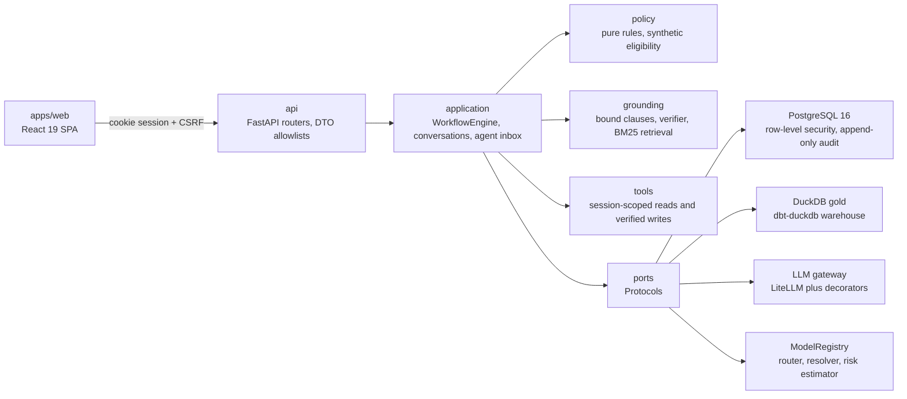
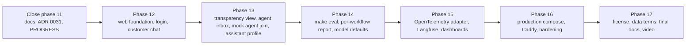

# AGENT.md

Operating guide for Claude Code sessions in this repository: what the product is, what the MVP contains, where the build stands, what comes next, and how to work here.

| Field | Value |
|---|---|
| Last updated | 2026-09-28, at commit `d4e1336` (branch `agent.md`, level with `origin/main`) |
| Submission deadline | 2026-10-05 (submissions close; see `docs/organizer/BRIEF.md`) |
| MVP demo target | 2026-09-29 per ADR 0025 (at risk, see section 4) |
| Current phase | 11, API layer and HTTP security: code merged, closure pending |

## 0. How this file relates to the others

- [CLAUDE.md](CLAUDE.md) is the normative working agreement. This file never overrides it. When the two disagree, CLAUDE.md wins and this file must be fixed.
- Precedence for any instruction: the human in chat, then CLAUDE.md, then the active phase prompt (`kit/prompts/NN-*.md`) for that phase's scope, then this file, then older plans.
- This file is a snapshot and a map. The authoritative history is [docs/PROGRESS.md](docs/PROGRESS.md) (phase log and pending human actions) and [docs/BACKLOG.md](docs/BACKLOG.md) (deferred work with owning phase). Link to them; do not copy them here.
- Section 6 says when and how to update this file.

## 1. Project context and purpose

### 1.1 Executive summary

An AI-first banking customer-service system for the Factored AI and Data Hackathon 2026. Customers of a synthetic Latin American bank (Mexico, Colombia, Argentina) chat in Spanish or Portuguese. Four workflows are built in depth on one shared engine:

| Workflow id | What the system may do |
|---|---|
| `account_inquiry` | Read only: balances, payment and transfer status, statement summaries, always with the data as-of date (snapshot 2026-06-17) |
| `card_support` | Card status and a protective card block (confirmation, step-up, verified read-back); unblock and replacement go to a human |
| `dispute` | Open a dispute case (confirmation, step-up, verified read-back), optional protective block, case status |
| `credit` | Synthetic catalog answers, an indicative result from the synthetic eligibility service with reasons, uncertainty, and a review path, and an application intake for human review; never a lending decision |

Everything else gets a clarifying question, a clause-backed abstention, or a structured handoff to a human.

Design thesis: the language model understands, deterministic code decides, and evidence proves it. Concretely:

- Policy is data (`policies/`) evaluated by pure rule functions; every decision names its rule ids and clause versions.
- Identity comes from a trusted test session (mock identity service with one-time codes). The model never receives or chooses customer identifiers.
- Writes are idempotent and are reported only after a read-back verifies them.
- Every turn leaves an execution record (state, rules, clauses, tools, verification, model and prompt versions, latency, cost). No chain-of-thought is stored or shown.
- Handoffs carry the request, verified facts, actions taken, evidence, and open questions, never a raw transcript.

### 1.2 Runtime architecture

Backend layers import inward only: `domain` <- `ports` <- `policy` <- `application` <- `adapters` <- `api` and `bootstrap`. `bootstrap/container.py` is the only module that knows concrete adapters. Details: [docs/architecture/overview.md](docs/architecture/overview.md), [docs/architecture/ports-and-adapters.md](docs/architecture/ports-and-adapters.md).

### 1.3 Key technologies

| Area | Technology |
|---|---|
| Backend | Python 3.12, uv workspace, FastAPI, Pydantic v2, pydantic-settings, SQLAlchemy 2 async, Alembic, PostgreSQL 16 with RLS |
| Data | DuckDB, dbt-duckdb, Pandera; organizer delivery of 13 tables and about 23.5 million rows (gitignored), plus a committed 2,595-row pseudonymized sample |
| ML | scikit-learn, LightGBM, MLflow tracking, filesystem `ModelRegistry`; sentence-transformers only in the optional `ml` extra, never in the API image |
| LLM | LiteLLM behind the `LLMClient` port with retry, timeout, circuit breaker, budget guard, redaction, and tracing decorators; cassettes for tests |
| Frontend | Vite, React 19, TypeScript strict, Tailwind CSS v4, Vitest, React Testing Library, MSW; pnpm; the rest of the stack arrives in phase 12 |
| Quality | ruff, mypy strict, import-linter, bandit, pip-audit, ESLint with boundary rules, Prettier, markdownlint, Mermaid validation, gitleaks, emoji and attribution guards |
| Operations | Docker compose (profiles `api`, `web`, `obs`, `ml`), OpenTelemetry collector, Jaeger, Prometheus, Grafana; Caddy in phase 16 |

## 2. MVP definition

### 2.1 Scope reconciliation (confirm with the team)

Two records disagree about the MVP:

- [ADR 0025](docs/adr/0025-tuesday-account-inquiry-mvp-and-observability.md) (accepted 2026-09-27) automates only `account_inquiry` and sends card support, disputes, and credit to a labeled mock human service agent, plus an assistant profile and Langfuse traces.
- `docs/PROGRESS.md`, pending action 32 (2026-09-27), records the human decision that the build does not follow ADR 0025's scope: all four workflows stay automated as built.

This file adopts the reading that satisfies both: the four workflows stay automated, and the ADR 0025 deliverables that do not conflict with that (demo login, persisted chats, labeled mock agent join on escalation, assistant profile, chat creation cap, correlation and model traces) are part of the MVP. If the team decides otherwise, update this section first. An ADR that supersedes or amends ADR 0025 would remove the ambiguity.

### 2.2 In scope

| Capability | Status | Source |
|---|---|---|
| Four workflows with normal, ambiguous or unsupported, and escalation paths in es and pt | Built (engine, 29 scenarios on memory and PostgreSQL) | Phases 09a, 09b; ADR 0020, 0024 |
| Policy pack, kernel, synthetic eligibility service, credit separation | Built | Phase 06; ADR 0011, 0021 |
| Grounding: bound clauses per state, verifier, informational retrieval | Built | Phase 07; ADR 0012 |
| Trusted demo session: identification, one-time code (shown only when `DEMO_MODE=true`), server-side session cookie, step-up for writes, CSRF | Backend built | Phases 05, 11; ADR 0008 |
| HTTP API: auth, conversations, turns, customer trace, agent inbox, evaluation summaries, OpenAPI contract and generated web types | Code merged, phase closure pending | Phase 11 |
| Web login page and customer chat with multiple persisted chats, history, structured answers, handoff status, `aria-live` updates, es and pt copy | Not started (web is a shell) | Phase 12 |
| Per-turn transparency view of the execution record (rules, clauses, tools, verification) | API built, UI not started | Phases 11, 13 |
| Escalation in the same chat: persisted handoff plus a mock human service agent that joins and sends a bounded, clearly labeled simulated reply | Handoff built; mock join not started | ADR 0025, 0026 |
| Agent inbox UI over the existing claim and resolve API | Not started | Phase 13 |
| Assistant profile: validated name and a PNG avatar chosen from predefined assets, persisted per demo customer | Not started | ADR 0025 |
| At most five new chats per customer in any rolling 60 minutes | Not started (current limits are per minute) | ADR 0025, 0026 |
| Correlation id across request, engine, tools, model calls, and execution records; structured redacted logs | Request id middleware and execution records built; OpenTelemetry adapter not started (only `noop`) | Phase 15; ADR 0025 |
| Langfuse showing real model generations | Blocked: no model provider chosen, so no generation exists to trace | ADR 0025; PROGRESS action 5 |
| Evaluation: proposed system against baselines B0 and B1 on the same held-out workload, per workflow and aggregate, using the brief's outcome definitions | B0 built in the engine; B1, graders, and `make eval` not built | Phase 14 |
| Reproducible deployment and the video pitch | Not started | Phases 16, 17 |

### 2.3 Explicitly out of scope

- Lending decisions of any kind, and any movement of money.
- Self-service card unblock or replacement (always a handoff).
- A real human service agent chatting live in the customer conversation (ADR 0026, after the MVP).
- Opt-in financial memory, tips, and planning (ADR 0027).
- Multi-bank connectors, crypto and xStocks surfaces (ADR 0028).
- Image generation for the assistant avatar (predefined PNG assets only).
- Real one-time-code delivery (SMS or email) and real bank identity.
- WhatsApp or any channel other than the web app.
- Streaming ingestion (the delivery is static; update correctness is shown with a labeled fixture).
- Browser end-to-end tests (CLAUDE.md section 8).
- Switching defaults to the learned router, resolver, or risk estimator before phase 14 measures them end to end.
- Optional items already parked in the BACKLOG: MLflow registry adapter, lingua language detector, injection classifier, language-model zero-shot router reference.

### 2.4 MVP acceptance script

The MVP is done when one person can run this on a clean checkout with `make up`, `make seed`, and the web app, with no step faked:

1. Sign in as a demo persona with a one-time code; the chat header shows the assistant's name and avatar.
2. Spanish: ask for a balance; the answer states the as-of date.
3. Portuguese: open a dispute on a named transaction; confirm, step up, and see the verified case id.
4. Block a card after confirmation and step-up; the reply reports the block only after the read-back.
5. Ask for credit eligibility; the answer shows the synthetic label, reasons, uncertainty, and the review path, and never approval wording.
6. Ask for something out of scope; get a clause-backed abstention.
7. Trigger an escalation; the handoff is stored and a mock agent joins the same chat, labeled as simulated.
8. Open the transparency view for a turn and the stored execution record; follow the correlation id to the logs.
9. With a provider configured, see the model generation for that turn in Langfuse.
10. Rename the assistant and request another avatar; both survive a page refresh.
11. Open a sixth chat within an hour; the request is refused with a clear message.

## 3. Current state

### 3.1 Delivered phases

| Phase | Delivered |
|---|---|
| 00, 01 | Guardrails (emoji, attribution, gitleaks hooks), uv workspace, web shell, `make check`, CI, coverage gates |
| 02, 02b | Domain model, ports, JSON Schema contracts (now 1.2.0) for handoffs, execution records, scenarios, and policy clauses |
| 03 | Manifest-driven S3 download, bronze, silver, and gold in dbt-duckdb, Pandera contracts, quality report, lineage, committed sample |
| 04 | Pre-registered workflow prioritization: `account_inquiry` 70.4, `card_support` 64.4, `dispute` 63.5, `credit` 55.8 |
| 05 | PostgreSQL schema with forced RLS and append-only audit, mock identity and sessions, session-scoped tools, write verifier, seed (16 customer and 2 staff personas) |
| 06 | Synthetic policy pack: 50 clauses in es, pt, and en, 47 rules, synthetic eligibility service, 9-product credit catalog |
| 07 | Bound clause lookup, BM25, dense, and hybrid retrieval (BM25 serves the API), grounding verifier |
| 08 | LLM gateway, decorator stack, versioned prompt registry, cassettes, budget guard |
| 09a, 09b | Workflow engine, registry, router dispatch, all four workflows, baseline B0, scenarios 1 to 29 |
| 10a, 10b | Learned router (TF-IDF, embeddings), LightGBM resolver, logistic-regression risk estimator; all promoted, none the default |
| EDA | Local DuckDB profiling and a sanitized Streamlit viewer (ADR 0032, 0033) |
| 11 (partial) | Routes under `/v1/auth`, `/v1/conversations`, `/v1/agent`, `/v1/eval`, `/health`; signed double-submit CSRF; rate limits; body limit; security headers; RBAC; cross-customer 404; `contracts/openapi.json` and `apps/web/src/shared/api/generated/schema.d.ts` |

Last recorded full gate: `make check` exit 0 at `73c3a35` (phase 10b), with 2,392 unit and 1,183 integration tests and all 11 coverage gates passing. Phase 11 commits and the EDA merge came after that record; re-run `make check` before claiming a green tree.

### 3.2 What runs by default

| Setting | Default | Meaning |
|---|---|---|
| `LLM_PROVIDER` | `fake` | Every model call is refused; workflows use deterministic fallbacks |
| `WORKFLOW_ENABLED` | all four | The router dispatches to all four workflows |
| `WORKFLOW_ROUTER` | `keyword@1` | Rule baseline (learned `tfidf@champion`, `embeddings@champion` available) |
| `WORKFLOW_RESOLVER` | `rules@1` | Rule baseline (learned `lgbm@champion` available) |
| `WORKFLOW_RISK_ESTIMATOR` | `score_band@1` | Baseline (learned `logreg@champion` available) |
| `WORKFLOW_LANGUAGE_DETECTOR` | `lexical@1` | In-house lexical detector |
| `WORKFLOW_LLM_PHRASING`, `WORKFLOW_LLM_HANDOFF_SUMMARY` | `false` | Templates only; model text would pass the verifier first |
| `DEMO_MODE` | `true` in `.env.example` | Shows one-time codes on screen; refused in production |

### 3.3 Technical debt and open critical points

Phase 11 closure (owned now):

- Missing documents named by `docs/plans/phase-11.md`: `docs/api/README.md`, `docs/security/threat-model.md`, ADR 0031, and the updates to `docs/security/identity-and-sessions.md`, `docs/security/data-isolation.md`, `docs/architecture/llm-gateway.md`, the package READMEs, and `contracts/README.md`.
- The local model path from the plan is only partly present: `LLM_API_BASE` exists in settings, but `scripts/llm_smoke.py`, `make llm-smoke`, `make api-local-llm`, and the zero-cost local price entry do not.
- BACKLOG rows owned by phase 11 are still open: HTTP auth routes (now built), resuming a paused turn after step-up (resolved by the lineage rule in the plan), stripping `internal_fields` from customer DTOs (tests exist; confirm and close), and `list_my_credit_applications` (the plan moves it to phase 13).
- `docs/PROGRESS.md` "Current state" still says phase 11 has not started, and there is no phase 11 entry.

Documentation drift:

- `docs/README.md` lists the EDA records as "adr/0030" and "adr/0031" while linking to ADR 0032 and 0033.
- ADR 0000 is "Proposed" and absent from the ADR index (PROGRESS action 14).

Product and model decisions waiting on humans (PROGRESS "Pending human actions"):

- Model provider (action 5). Blocks live model calls, real cassettes, price verification (action 7), paraphrase generation (action 29), and Langfuse.
- Walkthroughs of 09a and 09b (actions 21, 25); reviews of clauses (16), eligibility thresholds (17), retrieval judgments (19), router labels (27), and the pt-BR seeds (28).
- License (action 1) and the organizer data-use terms (action 2) before the repository goes public.

Known limitations to state, not hide:

- There are no Brazilian customers in the data; Portuguese paths use Mexican, Colombian, and Argentine personas and currencies.
- Transcripts are two balance templates; the credit risk label is cross-sectional (one snapshot), and credit score shows no association with it.
- The router and unsupported-request lexicons are closed; router test error at the dev threshold is about 10%.
- Rate limits and the LLM budget ledger are per process. Development uses a superuser owner role, which bypasses RLS (hardening in phase 16).

Environment:

- `make`, `uv`, `pnpm`, and `docker` are required. On Windows, use WSL2 or install GNU make, uv, pnpm (through corepack), and Docker Desktop. Without them `make check` cannot run, and a session must say so rather than report a pass.
- The phase prompts live in `kit/prompts/`, which is gitignored. A machine without `kit/` must get the prompt from the team before starting a phase.

## 4. Next phase and immediate roadmap

### 4.1 Timeline

Proposed calendar (not agreed by the team; update this table when it changes):

| Date | Target |
|---|---|
| 2026-09-28 | Close phase 11; start phase 12 |
| 2026-09-29 | Phase 12 login and chat usable against the local API (ADR 0025 demo target) |
| 2026-09-30 to 2026-10-01 | Phase 13 MVP surfaces |
| 2026-10-02 | Phase 14 evaluation run and report |
| 2026-10-03 | Phases 15 and 16 (observability, deployable stack) |
| 2026-10-04 | Phase 17 and the video pitch |
| 2026-10-05 | Buffer; submission |

The ADR 0025 Tuesday target is at risk: the web app is a shell and the chat UI does not exist yet. The priority is a working, honest demo by the deadline, not the Tuesday date.

### 4.2 Decisions to request from the human before or during phase 12

1. Confirm the MVP reading in section 2.1.
2. Choose the model provider, or approve the local Ollama path from the phase 11 plan for development.
3. Choose how Langfuse is reached: Langfuse Cloud (keys through environment variables) or a self-hosted instance (several extra containers). Prefer exporting GenAI spans through the `Telemetry` port and the OpenTelemetry collector to Langfuse's OTLP endpoint over adding the Langfuse SDK; any new dependency follows CLAUDE.md rule 10.
4. Decide the accessible-testing library (vitest-axe stable is 0.1.0; BACKLOG, phase 12).
5. Confirm whether the customer chat is built in phase 12 (MVP critical path) or phase 13 as `apps/web/README.md` currently says.

### 4.3 Immediate step A: close phase 11

1. Sync: on a clean tree, `git pull --ff-only`; stop if it fails.
2. Run `make check` and fix any failure caused by the phase 11 and EDA merges.
3. Write ADR 0031 (the API and HTTP security decisions in `docs/plans/phase-11.md`), and add it to `docs/adr/README.md`.
4. Write `docs/api/README.md` (endpoint catalog with roles, CSRF, rate class, problem types, a sequence diagram for sign-in, turn, and step-up) and `docs/security/threat-model.md`.
5. Update the security docs, `docs/architecture/llm-gateway.md`, the `api` README, and `contracts/README.md`.
6. Either build the local model path (`scripts/llm_smoke.py`, `make llm-smoke`, `make api-local-llm`, the local price entry) or move it to the BACKLOG with its reason.
7. Close or re-home the phase 11 BACKLOG rows; fix the two mislabeled rows in `docs/README.md`.
8. Add the phase 11 entry and the new current state to `docs/PROGRESS.md`; update sections 3 and 4 of this file.
9. Run `make check` and `make docs-check`; commit each step with a Conventional Commit.

### 4.4 Immediate step B: phase 12, web foundation and customer chat

Goal: a customer can sign in and hold a real conversation with all four workflows from the browser, in es and pt, against the local API, with accessible, tested UI and no mocked backend behavior.

1. Read `kit/prompts/12-*.md`, CLAUDE.md sections 6 to 9, `apps/web/README.md` and its layer READMEs, `contracts/openapi.json`. Write `docs/plans/phase-12.md`.
2. Add the deferred dependencies through `pnpm add` with licenses checked: React Router, TanStack Query, Radix UI, i18next, react-hook-form, zod, openapi-fetch, one outline icon set, and the chosen accessibility test library.
3. Design tokens as CSS variables in `src/index.css` under Tailwind's `@theme`; record the decisions in `docs/design/DESIGN.md` using the `design-taste-frontend` and `minimalist-ui` skills.
4. `shared/api`: an openapi-fetch client over the generated types with `credentials: 'include'`, the `X-CSRF-Token` header read from the CSRF cookie, and RFC 9457 problem parsing; MSW handlers typed from the generated schema.
5. `shared/i18n`: i18next with `es`, `pt`, and `en` locale files; `Intl` formatters for `es-MX`, `es-CO`, `es-AR`, and `pt-BR`.
6. `app`: providers (QueryClient, i18n, theme), router, and a route guard driven by `GET /v1/auth/me`.
7. `features/auth`: identification, code entry (show the demo code only when the API returns it), step-up dialog, logout; problem states for wrong code, expiry, lockout, and rate limits.
8. `features/conversation`: compound components (`Conversation.Root`, `Conversation.Messages`, `Conversation.Composer`); create a chat, send turns with a `client_turn_id`, render structured parts (balances, payment status, statements, eligibility) as plain text, show handoff status, announce updates through `aria-live`.
9. Step-up resume: when a reply asks for step-up, run the step-up route, then send the next turn.
10. Chat list and history across refreshes.
11. Tests: unit tests for formatters, hooks, and the client; MSW integration tests per feature; accessibility checks on the login and chat screens; web features coverage at 70% or more.
12. `make check`, docs, a PROGRESS entry, and an update of this file.

### 4.5 Next: phase 13 MVP surfaces

Backend work follows the layering in section 5 for each item: domain model, port, memory and PostgreSQL adapters with a shared contract suite, an Alembic revision, an application service, a router with allowlisted DTOs and a roles entry, then `make openapi`.

- Transparency view over `GET /v1/conversations/{id}/trace` (customer view never shows risk values).
- Agent inbox UI over the claim and resolve routes; the agent credit review methods (BACKLOG).
- Mock human service agent: on a stored handoff, a simulated agent joins the same conversation and sends one reply from a bounded, localized set. The message is typed as simulated in the domain, labeled in the UI, recorded in the execution record, and never counted as a completed human connection (ADR 0026).
- Assistant profile: `change_assistant_name` (validated length and characters) and `mock_assistant_image` (random choice among predefined PNG assets) as validated tools whose customer comes from the session; persisted per customer; shown in the chat header.
- Chat creation cap of five per rolling 60 minutes per customer, enforced server-side with a clear problem type.
- A plain yes or a button to accept the offer of a person after an abstention (BACKLOG).

### 4.6 Later phases

| Phase | Goal | Key BACKLOG items |
|---|---|---|
| 14 | `make eval`: scenario sets, systems B0, B1, and proposed, graders, per-workflow and aggregate report, red-team slice | Model choice and real cassettes; switch learned defaults only if measured end to end; injection scenarios; verifier misses |
| 15 | OpenTelemetry adapter with GenAI conventions, Langfuse generations, dashboards, alerts, retention | Shared budget ledger; freshness alerts; session and challenge purge |
| 16 | Production compose, Caddy TLS, non-superuser owner, stored retrieval index in the image, hardened containers | RLS under a non-superuser owner; price table in the image |
| 17 | Final architecture views, license, data-use terms, public readiness, video pitch | License; data-use terms for `data_platform/sample/` |

## 5. Scalability and architecture guidelines

CLAUDE.md sections 5 to 9 are the rules. This section is the practical map for applying them as the code grows.

### 5.1 Where a change belongs

| I need to add | Where | Also required |
|---|---|---|
| An entity, value object, enum, or domain error | `bank_agent/domain/` (pure, no I/O) | Unit tests; `Money` uses `Decimal` with a currency, never floats |
| A dependency on anything external (store, model, service) | A Protocol in `ports/`, adapters in `adapters/<concern>/` | Memory and real adapters, one shared contract suite in `tests/contracts/`, wiring only in `bootstrap/` |
| Cross-cutting behavior (retry, timeout, cache, tracing, redaction, budgets) | A decorator implementing the same port | Stacked in the composition root; never inside business code |
| A policy rule | A pure function in `policy/rules/`, registered by rule id | Clause files in es, pt, and en under `policies/clauses/`, a version bump, `make policy-lock`, `make policy-catalog`, tests |
| A workflow state | The workflow definition in `application/workflows/<id>/` | `policies/bindings.yaml`, `policies/matrix.yaml` for writes, the workflow page in `docs/workflows/`, scenario tests in es and pt |
| A tool the engine may call | `application/tools/` | A `ToolName` value (contract minor bump), the per-state allowlist, argument validation, audit, read-back for writes |
| A prompt | `bank_agent/prompts/<prompt_id>/<version>.md` with front matter | Referenced by id and version; output model; cassette cases; never receives identifiers or credit data |
| A learned or rule model | An adapter behind its port, loaded through `ModelRegistry` | Model card in `docs/models/`, generated evaluation in `docs/evaluation/`, selection by `name@version` in settings |
| An HTTP endpoint | `api/routers/` with DTOs in `api/schemas/` | Roles in the route table, CSRF on POST, rate class, problem types, `make openapi`, integration test through the ASGI transport |
| A setting | A per-concern class in `bootstrap/settings.py` | `.env.example` entry, production validation, `make env-check` |
| A web feature | `apps/web/src/features/<name>/` exposed through `index.ts` | Locale strings in es, pt, and en; MSW integration test; accessibility check on key screens |
| A choice between real alternatives | `docs/adr/NNNN-title.md` (MADR) | Row in `docs/adr/README.md` in the same commit |

### 5.2 Naming conventions

- Python: modules and functions `snake_case`, classes `PascalCase`, Protocols named after the capability (`RiskEstimator`, `HandoffRepository`), in-memory adapters prefixed `InMemory`.
- Components selected by settings: `kind:variant@version` (for example `router:keyword@1`, `risk_estimator:logreg@champion`).
- Policy: rule ids `FAMILY.snake_case` (for example `DSP.case_within_sla`); clause ids `FAMILY-JURISDICTION-N` (for example `DSP-MX-2`); families SCOPE, AUTH, PRV, ACC, CRD, DSP, ESC, INF, CRE, ELG.
- Prompts: `verb_object` ids (for example `extract_dispute_slots`), integer versions.
- Environment variables: a prefix per concern (`WORKFLOW_`, `LLM_`, `RETRIEVAL_`, `POLICY_`, `RATE_LIMIT_`).
- API: `/v1/<resource>` paths, stable snake_case operation ids (`conversations_send_turn`).
- Tests: behavior names (`test_rejects_dispute_after_window_closes`).
- Web: components `PascalCase`, hooks `useCamelCase`, one folder per feature; confirm file naming in `docs/design/DESIGN.md` during phase 12.
- Commits: `type(scope): summary` from the lists in CLAUDE.md section 12.

### 5.3 Patterns to keep

- Ports and adapters with a composition root; swap implementations through settings, never by editing workflows.
- Repository plus unit of work; repositories return domain objects; RLS context set inside each transaction.
- Policy as data plus pure rules; workflows as data on one engine; the registry refuses to start on any mismatch.
- Explicit state machines with bound clauses per state; the model proposes slots and phrasing, code decides transitions.
- Idempotency keys and read-back verification for every write; success wording only after verification.
- Allowlist DTOs: a field added to the domain never reaches a client by default; customer and staff views are separate classes.
- Contracts are versioned JSON Schemas; changes are additive with a minor bump, and `make contracts` and `make openapi` regenerate the artifacts.
- Baselines stay runnable (B0 in the container today; B1, the naive agent, in `evals/` from phase 14) so every improvement is measured on the same workload.
- `Clock` and `IdGenerator` ports for determinism; seeded randomness in ML and in any mock behavior (the mock agent reply and avatar choice included).

### 5.4 Practices for clean growth

- Vertical slices: one behavior end to end (domain, port, adapter, service, route, UI, tests, docs) per increment, one logical change per commit.
- Contracts first: change the schema or OpenAPI, regenerate, then implement against it.
- Every workflow meets the same depth bar; if one cannot, cut it back to clarify, abstain, or hand off, and document the cut.
- Per-workflow evaluation always sits next to any aggregate number; offline, simulated, and projected figures are labeled separately.
- Keep the API image lean: no ML extras, no training libraries, artifacts evaluated in pure Python.
- Migrations only move forward (a new Alembic revision per change); audit and execution records stay append-only.
- New dependencies: maintained, permissively licensed, pinned in the lockfile, reason noted in the phase log; ask before anything above about 50 MB or security-sensitive.

### 5.5 Invariants that must never break

- The model never receives document numbers, names, emails, phones, addresses, the credit profile, or the risk estimate, and never selects a customer or a tool outside the state's allowlist.
- No approval wording and no lending decision in any credit text; eligibility comes only from the synthetic service, labeled synthetic.
- Cross-customer access returns 404; writes require confirmation and step-up.
- Model output is rendered as plain text and never executed; no `dangerouslySetInnerHTML`; no tokens in browser storage.
- No emojis, no AI attribution, no secrets, no `.env` reads, no organizer data outside `data/` and the governed sample.

## 6. Operating instructions for Claude Code

### 6.1 Start of every session

1. `git status` and the current branch. On a clean tree with a remote, `git pull --ff-only`; if it fails or the tree is dirty, stop and tell the human.
2. Read CLAUDE.md, this file, the "Current state" and "Pending human actions" of `docs/PROGRESS.md`, `docs/BACKLOG.md`, the phase prompt, and the README of every package the task touches.
3. Check the toolchain (`make`, `uv`, `pnpm`, `docker`). If one is missing, say which checks cannot run.
4. Confirm that the task fits the MVP in section 2; if it does not, say so before building it.

### 6.2 While working

- Reply in the human's language (the team writes in Spanish); keep code, identifiers, comments, and docs in English, and customer copy in es and pt.
- Be concise: state the plan, do the work, then report what changed, how to verify it, and what needs human review.
- Follow the phase protocol (CLAUDE.md section 11): plan file, small increments, relevant tests after each, a Conventional Commit per increment.
- Stop and ask on anything that blocks correctness: product decisions, credentials, a provider, a dependency above the size rule. Record it under "Blocked" in `docs/PROGRESS.md`; do not guess.
- Put out-of-scope findings in `docs/BACKLOG.md` with the reason and the owning phase.
- Never weaken a test, linter, type check, coverage gate, or security check; fix the cause.

### 6.3 Before closing any task

- Run the targeted tests, then `make check` (and `make docs-check` for documentation). A task is not done until they pass; if they could not run, report that plainly with the reason.
- Report failures with their output. Never claim a verification that did not run.
- Update the documents the change affects in the same commit.

### 6.4 Git and safety

- Never push unless the human asks; never `--no-verify`; never force-push or rewrite published history; never change `git config user.*`.
- CLAUDE.md section 12 says phases commit to `main`; the team also merges through pull requests (for example PRs #5 and #7). Follow the human's instruction for the session, and branch off `main` when asked to work on a branch.
- Never read or print `.env`; use `make env-check`. Never paste the organizer data dictionary PDF.

### 6.5 Keeping this file current

- Update this file at the end of every phase, in the same commit as the PROGRESS entry: the header table, section 3 (state and debt), and section 4 (next phase and steps).
- Update section 2 whenever an ADR or a human decision changes the MVP.
- Update section 5 when a new pattern, layer, or convention is adopted (with its ADR).
- Keep it a map: link to PROGRESS, BACKLOG, plans, and ADRs instead of copying them. Keep it short enough to read at the start of every session.

### 6.6 Command reference

| Command | Use |
|---|---|
| `make setup` | Install Python and web dependencies and the git hooks |
| `make check` | Every quality gate; needs Docker, never reads `.env` |
| `make test-unit`, `make test-integration`, `make test-web` | One suite at a time |
| `make docs-check` | Markdown lint and Mermaid validation |
| `make up`, `make up PROFILES="api web obs"`, `make down` | Development stack |
| `make db-upgrade`, `make seed` | Migrations and demo personas in the compose PostgreSQL |
| `make openapi`, `make contracts` | Regenerate the OpenAPI contract, web types, and JSON Schemas |
| `make policy-lock`, `make policy-catalog` | After a clause change |
| `make train`, `make promote APPROVED_BY="Name"` | Learned components |
| `make pipeline`, `make pipeline DATA_SOURCE=s3` | Data platform from the sample or the full delivery |
| `make env-check` | Which documented variables are set, never their values |
