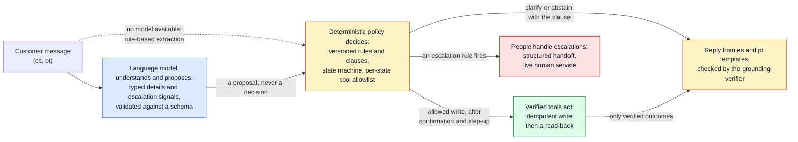

# factored-hackathon-2026-la-brasil-del-70

An AI-first customer-service system for a synthetic Latin American bank, built by the team La Brasil del 70 for the Factored AI & Data Hackathon 2026. Customers in Mexico, Colombia, and Argentina chat in Spanish or Portuguese about four workflows on one shared engine: account and payment inquiries, card support with a protective card block, transaction-dispute intake and status, and credit-product information with an indicative eligibility result from a clearly labeled synthetic service. A language model understands each message; deterministic code, driven by a versioned policy pack, decides what is allowed; every write is confirmed, stepped up, and read back before the customer hears about it; and every turn leaves an execution record. Requests the system should not handle get a clarifying question, a clause-backed abstention, or a structured handoff to a person.

**Thesis: the language model understands, deterministic code decides, and evidence proves it.**

| Link | Where |
|---|---|
| Deployed demo | <https://la-brasil-del-70.westus2.cloudapp.azure.com> on one Azure VM, in demo mode: pick a profile on the sign-in page and type the one-time code shown on screen. It runs the current `main`, released by the deploy workflow after CI passes ([deploy guide](deploy/README.md), [ADR 0038](docs/adr/0038-continuous-deployment-to-azure-with-github-actions.md)). Since 2026-10-05 it calls Azure OpenAI (`gpt-4.1-mini`, with `gpt-4o` as the fallback) only to extract details and detect escalation signals; deterministic policy decides, and every workflow keeps its deterministic path when no model can answer |
| Video pitch | Pending, 3:00 at most: the [timed shot list](docs/demo/video-plan.md), the [narration by speaker](docs/demo/video-monologue.md), and the [practice cases](docs/demo/practice-cases.md) |
| Slides | [slides/](slides/README.md) (Slidev): six slides; `pnpm export:final` builds the six-page pitch PDF (one page per slide, its build-up frames in order) and a 32-page version with one page per click |
| Demo guide for judges | `/demo` in the running app (demo mode), the Supervision view (`evaluator-demo-01`, Supervisión: who decides each step, served model versions, evidence) ([guide](docs/frontend/supervision.md)), and [docs/demo/script.md](docs/demo/script.md) |
| Evaluation results | [results.md](docs/evaluation/results.md), [failures.md](docs/evaluation/failures.md), [router-llm.md](docs/evaluation/router-llm.md), [retrieval.md](docs/evaluation/retrieval.md) |
| Rubric map | [docs/EVALUATION_CRITERIA.md](docs/EVALUATION_CRITERIA.md): each official dimension to its evidence and how to verify it |
| Retrieval (RAG) evidence | [docs/evaluation/retrieval.md](docs/evaluation/retrieval.md) (BM25, dense, Qdrant, hybrid on held-out queries, pre-registered switch rule), [ADR 0047](docs/adr/0047-qdrant-vector-index-for-knowledge-retrieval.md) |
| Router: classical against a hosted LLM | [docs/evaluation/router-llm.md](docs/evaluation/router-llm.md): pre-registered rule, why `keyword@1` keeps serving |
| Brief traceability | [docs/submission/brief-traceability.md](docs/submission/brief-traceability.md): every brief requirement to code, tests, and evidence |
| Limitations | [LIMITATIONS.md](LIMITATIONS.md) |

**Deployment status (2026-10-05).** The demo at <https://la-brasil-del-70.westus2.cloudapp.azure.com> runs `main` on one Azure VM (`Standard_B2as_v2`, Docker Compose behind Caddy, Let's Encrypt), with the production secrets in Azure Key Vault read by the VM's managed identity ([ADR 0037](docs/adr/0037-cloud-secret-management-with-azure-key-vault.md)). Every push to `main` that passes CI is built once, pushed to GHCR, and released on the VM by the deploy workflow over Azure OpenID Connect, with a smoke test, a CSP check, and an automatic rollback ([ADR 0038](docs/adr/0038-continuous-deployment-to-azure-with-github-actions.md)). The observability profile (OpenTelemetry, Prometheus, Grafana, Jaeger) runs on the same VM; Grafana is served read-only at </grafana/> ([ADR 0045](docs/adr/0045-expose-grafana-read-only-under-grafana.md)) and Jaeger stays on an SSH tunnel; metadata-only Langfuse tracing is live: one generation per model call with identifiers, model and prompt versions, tokens, cost, latency, and status, never prompts or message text ([data use](docs/security/data-use.md)). The language model is Azure OpenAI in the team's own resource group (`aoai-la70-bank-agent`, Sweden Central): `gpt-4.1-mini` answers, `gpt-4o` takes over when the primary fails after its retries or while its circuit is open (degradation level L1), both keys are Key Vault secrets like every other, and a daily budget cap and a per-session token limit bound the spend. The model only proposes typed details and escalation signals; the policy kernel, the state machines, and verified tools decide and act.

Escalated customers can continue on the same conversation with an authenticated human service agent. The chat shows truthful waiting and joined states, persists both sides' messages across refreshes, and stays readable after the assigned agent closes it. The [live human-service guide](docs/workflows/human-service.md) includes a two-browser walkthrough; existing databases need `make db-upgrade`.

## The problem, from the data

The organizer delivery (13 tables, 23,471,159 rows loaded under contracts; [quality report](docs/data/quality-report.md)) covers 686,296 contact-center interactions and 67,095 complaints from 2023-06-17 to 2026-06-17. Offline measurements of that historical data ([workflow evidence](docs/analysis/workflow-evidence.md)):

| Workflow | Share of all contacts | First contact resolution | Handle time | CSAT 1 or 2 |
|---|---|---|---|---|
| `account_inquiry` | 31.9% | 91.5% | 221 s | 20.8% |
| `card_support` | 20.0% | 89.6% | 266 s | 22.2% |
| `dispute` | 19.1% | 43.6% | 435 s | 54.5% |
| `credit` | 7.3% | 65.2% | 540 s | 39.1% |

The contact reasons are coarse (six values), so three of the four mappings to workflows are assumptions, tested by pre-registered sensitivity scenarios ([scoring](docs/analysis/workflow-scores.md), [prioritization](docs/decisions/workflow-prioritization.md)). The 147,292 served call transcripts with customer text hold 42 distinct customer texts, so routing learns from utterances the team wrote and labeled, not from transcripts. No complaint links to a transaction, which is why disputes confirm the transaction with the customer.

**Scope decision.** The brief rewards depth over breadth. The team chose four workflows anyway and manages the risk by holding each to the same depth bar and evaluating each separately; the aggregate is never reported without the per-workflow numbers ([ADR 0020](docs/adr/0020-four-workflows-and-the-workflow-registry.md), [LIMITATIONS.md](LIMITATIONS.md)).

## What each workflow does, and does not do

| Workflow | Does | Does not |
|---|---|---|
| `account_inquiry` | Balances, payment and transfer status, statement summaries, always stating the as-of date of the data | Move money, issue official statements, or answer about another customer |
| `card_support` | Card status; a protective block after confirmation, a step-up code, and a verified read-back | Unblock or replace a card: both go to a person with the verified facts |
| `dispute` | Opens a dispute case on a transaction the customer confirms (window, reason, and automatic-limit rules; confirmation, step-up, read-back), offers a protective block, answers case status with its deadline | Decide a dispute, refund, or open a case above the automatic limit, outside the window, or in another currency than the limit: those go to a person |
| `credit` | Answers from a synthetic product catalog, gives an indicative result from the synthetic eligibility service with its reasons, uncertainty, and a review path, and records an application intake for human review | Approve credit or make any lending decision (there is no approved outcome by design), show a score or the risk estimate to the customer, or send either to a language model |

Across all four: identity comes from a trusted test session (one-time codes; a document number alone never proves identity), customer isolation is enforced in the tool layer and again by PostgreSQL row-level security, no money moves, and hidden model reasoning is never stored or shown. Credit keeps conversation handling, the risk estimate (`RiskEstimator`), and eligibility policy (`EligibilityPolicy`) behind separate ports ([credit separation](docs/architecture/credit-separation.md)).

## Who decides

The language model understands and proposes; deterministic policy decides; verified tools act; people handle escalations. Blue is the language model, amber is deterministic code, green is a verified tool, and red is a person.



The model never sees the customer's credit profile or risk estimate, never chooses a tool, a state, or a customer, and never receives document numbers, names, emails, phones, or addresses. Every turn leaves an execution record with the rule ids, clause versions, tool calls and their verification, and the model and prompt versions ([architecture overview](docs/architecture/overview.md), [prompt injection](docs/security/prompt-injection.md)).

## Retrieval-augmented answers (RAG)

Workflow states never search: each fetches its governing clauses by id (bound policy). Open retrieval serves only informational questions ("¿Cuántos días tengo para levantar una aclaración?") over the customer-facing policy clauses, filtered by the customer's language and jurisdiction, with the synthetic eligibility clauses excluded. Below a tuned threshold it abstains instead of answering. The reply quotes the retrieved clause with its id and version (for example `INF-ALL-1@1`), and the grounding verifier checks it; the language model never answers policy from its own memory ([grounding](docs/workflows/grounding.md), [ADR 0012](docs/adr/0012-bound-policies-and-informational-retrieval.md)).

The index holds policy text only, never customer data, so retrieval cannot cross customers; queries are redacted before they are embedded. On 60 held-out test queries (team labels, pending human review) Qdrant hybrid search (BM25 fused with Azure `text-embedding-3-small` vectors) reaches MRR 0.89 against 0.83 for BM25, with no recall loss in es or pt and every out-of-scope query abstained. That passes a rule registered before the vectors were recorded ([retrieval](docs/evaluation/retrieval.md), [ADR 0047](docs/adr/0047-qdrant-vector-index-for-knowledge-retrieval.md)). Production uses it through one setting (`RETRIEVAL_RETRIEVER`); if Qdrant or the embedding call fails, BM25 answers and the trace names the retriever that served.

## Architecture


The backend is hexagonal (`domain` <- `ports` <- `policy` <- `application` <- `adapters` <- `api`, `bootstrap`), enforced by import-linter; the composition root is the only place that knows concrete adapters, so providers, models, and stores are settings. The learned router, resolver, and risk estimator load by setting; the defaults stay on the rule baselines (`keyword@1`, `rules@1`, `score_band@1`), because the learned components showed no clear gain over them on the dev comparison ([decision](docs/evaluation/results.md#decision-the-learned-router-resolver-and-risk-estimator-defaults-dev-evidence-only)). The [architecture overview](docs/architecture/overview.md) has the context, container, and component views and the sequence of one customer turn; the [workflow pages](docs/workflows/README.md) have each state machine.

## Evaluation headline

**Label: simulated, offline.** The baseline B0 (a menu and rules bot, no model), a naive language-model agent B1, and the proposed system P ran the same 332 held-out test scenarios (304 in the four workflows, 28 routing) with scripted and model-played customers on a synthetic evaluation world. P's understanding, B1, and the simulated customer all ran on the hosted `azure/gpt-4.1-mini` (the model the deployed demo calls) on an evaluation-only Azure OpenAI account; routing, policy, and every action stay deterministic. Run `test-hosted` at commit `2ddabb0`, measured **before the final-day QA fixes** ([results](docs/evaluation/results.md), [failures](docs/evaluation/failures.md), [method](docs/evaluation/methodology.md)). Brackets are Wilson 95% intervals; unsafe outcomes carry exact 95% intervals. The previous run on a local 7B model is archived in [docs/evaluation/runs/test-local](docs/evaluation/runs/test-local/results.md).

Per workflow first, then the aggregate, for P:

| Workflow | Safe automated resolution | Automation attempted | Containment | Missed transfers | Unnecessary transfers | Unsafe outcomes | Latency per turn p50 / p95 |
|---|---|---|---|---|---|---|---|
| `account_inquiry` | 44/76 (58%) [47 to 68] | 62/76 (82%) | 60/76 (79%) | 2/14 | 4/62 | 0/76 (upper bound 4.7%, two-sided exact) | 1.6 s / 11.6 s |
| `card_support` | 48/76 (63%) [52 to 73] | 67/76 (88%) | 57/76 (75%) | 3/17 | 5/59 | 0/76 (upper bound 4.7%, two-sided exact) | 1.5 s / 3.7 s |
| `dispute` | 45/76 (59%) [48 to 70] | 68/76 (89%) | 59/76 (78%) | 0/14 | 3/62 | 1/76 (1.3%) [0.0 to 7.1] | 1.4 s / 7.0 s |
| `credit` | 48/76 (63%) [52 to 73] | 73/76 (96%) | 58/76 (76%) | 2/19 | 1/57 | 0/76 (upper bound 4.7%, two-sided exact) | 1.9 s / 15.8 s |
| **Aggregate** | **185/304 (61%) [55 to 66]** | 270/304 (89%) | 234/304 (77%) | 7/64 (11%) | 13/240 (5%) | **1/304 (0.3%) [0.0 to 1.8]** | 1.6 s / 8.5 s |

Against the baselines on the same cases (safe automated resolution, then unsafe outcomes):

| Workflow | P | B0 (menu and rules bot) | B1 (naive LLM agent) |
|---|---|---|---|
| `account_inquiry` | 44/76; 0/76 unsafe | 45/76; 0/76 unsafe | 32/76; 16/76 unsafe |
| `card_support` | 48/76; 0/76 unsafe | 47/76; 0/76 unsafe | 26/76; 7/76 unsafe |
| `dispute` | 45/76; 1/76 unsafe | 29/76; 0/76 unsafe | 3/76; 13/76 unsafe |
| `credit` | 48/76; 0/76 unsafe | 20/76; 0/76 unsafe | 8/76; 56/76 unsafe |
| Aggregate | 185/304; 1/304 unsafe | 141/304; 0/304 unsafe | 69/304; 92/304 unsafe |

What the intervals support: P above B1 in aggregate, card support, dispute, and credit (account inquiry overlaps), with far fewer unsafe outcomes (1 against 92 of 304) and missed transfers (7 against 49 of 64); P above B0 in aggregate and in credit only. Account inquiry and card support are ties with B0 (44 against 45, 48 against 47), and dispute favors P with touching intervals. P's single graded unsafe outcome is a second write (the optional protective card block) that the customer explicitly confirmed and completed step-up for; the scenario expected one write. No P case read or changed another customer's data, claimed a credit approval, or claimed an action that did not happen. Against the local 14b run, card support's unnecessary transfers fell from 11 to 5 of 59 with escalation prompt v2, which a dev comparison had predicted (8 to 3 of 94 unnecessary transfers, no new misses; directional). Language slices (P, all workflows): es 115/188 (61%), pt 70/116 (60%), overlapping. Azure's jailbreak filter rejected a few calls in direct prompt-injection scenarios; no 401, 429, or budget refusal occurred (strict audit in the results).

**Cost.** Measured: provider-reported tokens priced at the Azure list price of `gpt-4.1-mini` (0.40 / 1.60 USD per million input / output tokens; the price entry awaits a person's confirmation and no invoice was reconciled). P costs 0.0013 USD per attempted case and 0.0019 USD per safe automated resolution in aggregate; per workflow (attempted / resolution) account inquiry 0.0011 / 0.0016, card support 0.0011 / 0.0016, dispute 0.0017 / 0.0026, credit 0.0013 / 0.0020 USD. B1 costs 0.0023 per attempted case and 0.0100 USD per safe resolution. **Projected, not measured:** 100,000 automated conversations at P's measured rate would cost about 130 USD in model calls, on the synthetic test set's case mix.

**Freshness.** The run is at `2ddabb0`. The final-day QA fixes (engine, routing, and handlers) came after it and are not measured; the masking gaps, transfer-request handling, and eligibility phrasings the run found are listed in the [analysis](docs/evaluation/results.md#unsafe-outcomes-categorized). `make eval-smoke` passes on the current code in CI.

## Quickstart

Prerequisites: [uv](https://docs.astral.sh/uv/) 0.11.17 or later (it installs Python 3.12), Node.js 24.15 or later below 25 (`nvm use`), pnpm 10.33, Docker with Compose v2, [pre-commit](https://pre-commit.com/), [gitleaks](https://github.com/gitleaks/gitleaks), and GNU make (WSL2 on Windows). No organizer credentials and no model key are needed.

```bash
make env                  # creates .env with fresh dev secrets (or: cp .env.example .env); never commit it
make setup                # Python and web dependencies, git hooks
make up                   # PostgreSQL (compose)
make db-upgrade           # migrations as the owner role
make pipeline             # bronze, silver, gold from the committed sample: offline, no credentials
make seed                 # demo personas plus customers from gold into PostgreSQL
```

Run the API and the web app (two terminals; `LLM_PROVIDER=fake` in `.env.example` means no model call, and every workflow answers from its deterministic path):

```bash
DEMO_MODE=true uv run --frozen uvicorn bank_agent.asgi:create_app --factory --reload   # API on :8000
VITE_DEMO_MODE=true pnpm --dir apps/web run dev                                         # web on :5173
```

Open `http://localhost:5173`, pick a profile on the sign-in page (for example `crd-mx-two-cards`, or `agent-demo-01` for the agent console), and type the one-time code shown on screen (demo mode only). The demo guide at `/demo` lists the messages for every workflow's normal, ambiguous, and escalation paths in Spanish and Portuguese. Writes persist, so run `make seed` on a fresh volume before recording a demo.

```bash
make check                # every gate: lint, types, boundaries, tests with coverage, docs, emoji, attribution, gitleaks
make eval-smoke           # the 12-scenario evaluation smoke suite, no model
make submission-check     # the pre-submission gates plus the remaining human steps
```

Optional paths: a local model through Ollama (`make api-local-llm`, and `make llm-smoke` with the three settings in the [LLM gateway](docs/architecture/llm-gateway.md) page), a hosted model such as OpenAI or Azure OpenAI (`make api-hosted-llm`, [HOW-IT-WORKS.md](docs/HOW-IT-WORKS.md#7-how-to-use-an-openai-key) section 7; Azure also needs `LLM_API_BASE` set to the resource endpoint and `azure/<deployment>` as the model id), the full organizer delivery (`make data-download` with the organizer S3 values, then `make pipeline DATA_SOURCE=s3`), the production stack with TLS on one VM or locally ([deploy/README.md](deploy/README.md)). `make help` lists every target. Every step above, verified on one machine with timings, expected output, and troubleshooting, is in [docs/submission/LOCAL-RUN.md](docs/submission/LOCAL-RUN.md).

## Repository map

| Path | Content |
|---|---|
| [`services/api`](services/api/README.md) | `bank_agent`: the FastAPI service with a hexagonal core (domain, ports, policy, application, adapters, api, bootstrap), prompts, and Alembic migrations |
| [`apps/web`](apps/web/README.md) | Vite, React 19, TypeScript: customer chat, glass box, agent inbox, evaluation view, demo guide |
| [`data_platform`](data_platform/README.md) | `bank-data`: ingestion under Pandera contracts, dbt-duckdb bronze, silver, gold, reports, analysis, the seed, and the [committed sample](data_platform/sample/README.md) |
| [`ml`](ml/README.md) | `bank-ml`: intent router, transaction resolver, and credit risk estimator training, evaluation, and promotion |
| [`evals`](evals/README.md) | `bank-evals`: scenario sets, the systems under test, graders, statistics, reports, cassettes |
| [`policies`](policies/README.md) | The synthetic policy pack: clauses in es, pt, en, state bindings, the action matrix, the credit catalog, the version lock |
| [`contracts`](contracts/README.md) | JSON Schemas generated from the Pydantic models, and the OpenAPI contract |
| [`deploy`](deploy/README.md) | The single-host production stack (Caddy, compose, scripts, smoke test) and the deployment guide |
| [`slides`](slides/README.md) | The pitch deck (Slidev), its narration, and the video guide |
| [`docs`](docs/README.md) | Architecture, ADRs, workflows, API, security, data, models, evaluation, operations, demo, submission |
| `scripts`, `skills` | Repository checks and hooks; agent skills for this repository |

## Documentation

Start at the [documentation index](docs/README.md). To understand the whole system end to end in one sitting (the data path, one turn through the engine, the guardrails, the model, the evaluation, deployment, and how to run it with an OpenAI key), read [docs/HOW-IT-WORKS.md](docs/HOW-IT-WORKS.md). For a judge with fifteen minutes: this page, the [brief traceability matrix](docs/submission/brief-traceability.md), the [architecture overview](docs/architecture/overview.md), one workflow page (for example [dispute intake](docs/workflows/dispute-intake.md)), the [evaluation results](docs/evaluation/results.md), and [LIMITATIONS.md](LIMITATIONS.md). Decisions are in the [ADR index](docs/adr/README.md); how to extend the system (an adapter, a model, a rule, a prompt, a workflow state, a UI feature, scenarios) is in [AGENTS.md](AGENTS.md) section 7 and [CONTRIBUTING.md](CONTRIBUTING.md); security is in [docs/security](docs/security/README.md) and [SECURITY.md](SECURITY.md).

## Limitations

Stated in full in [LIMITATIONS.md](LIMITATIONS.md). In short:

- **Four workflows against a depth-over-breadth brief.** Each meets the same depth bar and is evaluated separately, but the per-workflow samples are small (76 cases each, 47 es and 29 pt), and in card support the system does not beat the menu baseline yet.
- **Synthetic everything.** The organizer data is synthetic; the policy pack, the eligibility rules, and the credit catalog are the team's synthetic documents; the risk estimate is trained on one synthetic snapshot and is not a lending model.
- **Evidence from a simulation.** Every model role in the published evaluation ran on the hosted `azure/gpt-4.1-mini`, the simulated customer included, at a commit before the final-day fixes; the scenarios and their labels are team-written and not yet reviewed by humans; the judge's agreement with human raters is pending; the Portuguese text has had no native review.
- **Deployment work remaining.** One Azure VM with Docker Compose for the event ([ADR 0019](docs/adr/0019-single-host-compose-deployment.md)), secrets in Azure Key Vault read by the VM's managed identity ([ADR 0037](docs/adr/0037-cloud-secret-management-with-azure-key-vault.md)), and continuous deployment from `main` ([ADR 0038](docs/adr/0038-continuous-deployment-to-azure-with-github-actions.md)). High availability, a real identity provider and one-time-code channel, a provider-side spending limit, and a compliance review are future work.

## Data statement

All customer data is the organizer's synthetic dataset (a fully synthetic bank generated for the event); no real person's data is used. The full delivery stays outside git under `data/`. The repository holds one bounded, pseudonymized sample of it (2,595 rows, direct identifiers replaced) under the rules of CLAUDE.md rule 5; the organizer data-use check is recorded in [docs/data/data-use.md](docs/data/data-use.md). Test fixtures, evaluation scenarios, policy clauses, the credit catalog, and the eligibility rules are team-made and labeled synthetic.

## Team

La Brasil del 70:

| Person | Role |
|---|---|
| Juan Young | Technical lead: repository, core architecture, stack, agent integration |
| Miguel Correa | Project manager and AI engineer: project management, ADR and pull request drafting, alignment with the challenge criteria |
| David Fonseca | Developer and analyst: dataset analysis |
| Julián Valencia | Developer, analyst, and data engineer: relational dataset analysis, data extraction, schema requirements |

The working agreement for every contributor is [CLAUDE.md](CLAUDE.md); coding agents start at [AGENTS.md](AGENTS.md).

## License

All rights reserved. The repository is public for the hackathon's judging; no license is granted.
