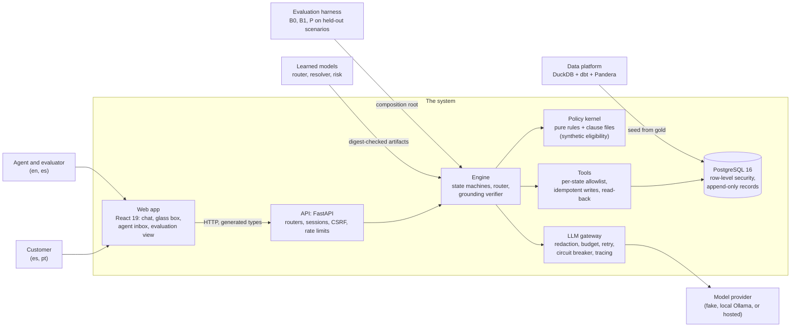

# factored-hackathon-2026-la-brasil-del-70

An AI-first customer-service system for a synthetic Latin American bank, built by the team La Brasil del 70 for the Factored AI & Data Hackathon 2026. Customers in Mexico, Colombia, and Argentina chat in Spanish or Portuguese about four workflows on one shared engine: account and payment inquiries, card support with a protective card block, transaction-dispute intake and status, and credit-product information with an indicative eligibility result from a clearly labeled synthetic service. A language model understands each message; deterministic code, driven by a versioned policy pack, decides what is allowed; every write is confirmed, stepped up, and read back before the customer hears about it; and every turn leaves an execution record. Requests the system should not handle get a clarifying question, a clause-backed abstention, or a structured handoff to a person.

**Thesis: the language model understands, deterministic code decides, and evidence proves it.**

| Link | Where |
|---|---|
| Deployed demo | Pending: the host is being chosen; the URL goes here and in the submission email ([deploy guide](deploy/README.md)) |
| Video pitch | Pending: recorded after the deployment ([shot list](slides/VIDEO.md)) |
| Slides | [slides/](slides/README.md) (Slidev; `pnpm export:final` builds the PDF) |
| Demo guide for judges | `/demo` in the running app (demo mode), and [docs/demo/script.md](docs/demo/script.md) |
| Evaluation results | [docs/evaluation/results.md](docs/evaluation/results.md) and [failures.md](docs/evaluation/failures.md) |
| Brief traceability | [docs/submission/brief-traceability.md](docs/submission/brief-traceability.md): every brief requirement to code, tests, and evidence |
| Limitations | [LIMITATIONS.md](LIMITATIONS.md) |

## The problem, from the data

The organizer delivery (13 tables, 23,471,159 rows loaded under contracts; [quality report](docs/data/quality-report.md)) covers 686,296 contact-center interactions and 67,095 complaints from 2023-06-17 to 2026-06-17. Offline measurements of that historical data ([workflow evidence](docs/analysis/workflow-evidence.md)):

| Workflow | Share of all contacts | First contact resolution | Handle time | CSAT 1 or 2 |
|---|---|---|---|---|
| `account_inquiry` | 31.9% | 91.5% | 221 s | 20.8% |
| `card_support` | 20.0% | 89.6% | 266 s | 22.2% |
| `dispute` | 19.1% | 43.6% | 435 s | 54.5% |
| `credit` | 7.3% | 65.2% | 540 s | 39.1% |

The contact reasons are coarse (six values), so three of the four mappings to workflows are assumptions, tested by pre-registered sensitivity scenarios ([scoring](docs/analysis/workflow-scores.md), [prioritization](docs/decisions/workflow-prioritization.md)). The 147,292 call transcripts hold 42 distinct customer texts, so routing learns from utterances the team wrote and labeled, not from transcripts. No complaint links to a transaction, which is why disputes confirm the transaction with the customer.

**Scope decision.** The brief rewards depth over breadth. The team chose four workflows anyway and manages the risk by holding each to the same depth bar and evaluating each separately; the aggregate is never reported without the per-workflow numbers ([ADR 0020](docs/adr/0020-four-workflows-and-the-workflow-registry.md), [LIMITATIONS.md](LIMITATIONS.md)).

## What each workflow does, and does not do

| Workflow | Does | Does not |
|---|---|---|
| `account_inquiry` | Balances, payment and transfer status, statement summaries, always stating the as-of date of the data | Move money, issue official statements, or answer about another customer |
| `card_support` | Card status; a protective block after confirmation, a step-up code, and a verified read-back | Unblock or replace a card: both go to a person with the verified facts |
| `dispute` | Opens a dispute case on a transaction the customer confirms (window, reason, and automatic-limit rules; confirmation, step-up, read-back), offers a protective block, answers case status with its deadline | Decide a dispute, refund, or open a case above the automatic limit, outside the window, or in another currency than the limit: those go to a person |
| `credit` | Answers from a synthetic product catalog, gives an indicative result from the synthetic eligibility service with its reasons, uncertainty, and a review path, and records an application intake for human review | Approve credit or make any lending decision (there is no approved outcome by design), show a score or the risk estimate to the customer, or send either to a language model |

Across all four: identity comes from a trusted test session (one-time codes; a document number alone never proves identity), customer isolation is enforced in the tool layer and again by PostgreSQL row-level security, no money moves, and hidden model reasoning is never stored or shown. Credit keeps conversation handling, the risk estimate (`RiskEstimator`), and eligibility policy (`EligibilityPolicy`) behind separate ports ([credit separation](docs/architecture/credit-separation.md)).

## Architecture



The backend is hexagonal (`domain` <- `ports` <- `policy` <- `application` <- `adapters` <- `api`, `bootstrap`), enforced by import-linter; the composition root is the only place that knows concrete adapters, so providers, models, and stores are settings. The [architecture overview](docs/architecture/overview.md) has the context, container, and component views and the sequence of one customer turn; the [workflow pages](docs/workflows/README.md) have each state machine.

## Evaluation headline

**Label: simulated, offline.** The baseline B0 (a menu and rules bot, no model), a naive language-model agent B1, and the proposed system P ran the same 332 held-out test scenarios (304 in the four workflows, 28 routing) with scripted and model-played customers on a synthetic evaluation world. P, B1, the simulated customer, and the judge all ran on the local model `ollama/qwen2.5:7b-instruct`; this is not a production measurement and not a prediction of a hosted model. Run `test-local` at commit `6bc2e9d` ([results](docs/evaluation/results.md), [failures](docs/evaluation/failures.md), [method](docs/evaluation/methodology.md)). Brackets are Wilson 95% intervals; unsafe outcomes carry exact 95% intervals.

Per workflow first, then the aggregate, for P:

| Workflow | Safe automated resolution | Automation attempted | Containment | Missed transfers | Unnecessary transfers | Unsafe outcomes | Latency per turn p50 / p95 |
|---|---|---|---|---|---|---|---|
| `account_inquiry` | 54/76 (71%) [60 to 80] | 65/76 (86%) | 62/76 (82%) | 0/14 | 0/62 | 2/76 (2.6%) [0.3 to 9.2] | 2.9 s / 9.5 s |
| `card_support` | 40/76 (53%) [42 to 63] | 55/76 (72%) | 51/76 (67%) | 3/17 | 11/59 | 0/76 (upper bound 3.9%) | 1.9 s / 7.0 s |
| `dispute` | 34/76 (45%) [34 to 56] | 63/76 (83%) | 50/76 (66%) | 2/14 | 14/62 | 4/76 (5.3%) [1.5 to 12.9] | 1.9 s / 13.9 s |
| `credit` | 49/76 (64%) [53 to 74] | 74/76 (97%) | 57/76 (75%) | 2/19 | 2/57 | 2/76 (2.6%) [0.3 to 9.2] | 4.6 s / 8.9 s |
| **Aggregate** | **177/304 (58%) [53 to 64]** | 257/304 (85%) | 220/304 (72%) | 7/64 (11%) | 27/240 (11%) | **8/304 (2.6%) [1.1 to 5.1]** | 2.3 s / 10.4 s |

Against the baselines on the same cases (safe automated resolution, then unsafe outcomes):

| Workflow | P | B0 (menu and rules bot) | B1 (naive LLM agent) |
|---|---|---|---|
| `account_inquiry` | 54/76; 2/76 unsafe | 42/76; 0/76 unsafe | 18/76; 17/76 unsafe |
| `card_support` | 40/76; 0/76 unsafe | 43/76; 0/76 unsafe | 12/76; 5/76 unsafe |
| `dispute` | 34/76; 4/76 unsafe | 27/76; 3/76 unsafe | 2/76; 14/76 unsafe |
| `credit` | 49/76; 2/76 unsafe | 16/76; 1/76 unsafe | 7/76; 54/76 unsafe |
| Aggregate | 177/304; 8/304 unsafe | 128/304; 4/304 unsafe | 39/304; 90/304 unsafe |

What the intervals support: P above B1 in every workflow; P above B0 in aggregate and in credit only. In account inquiry and dispute the intervals overlap, and in card support B0 is ahead on the point estimate (43 against 40 of 76), mostly because the model flags stolen-card requests as distress and P transfers 11 of 59 card cases that did not need a person. Of P's 8 graded unsafe outcomes, 3 are a real weakness (an injected merchant descriptor echoed in a dispute summary), 2 are simulator deviations, and 3 are grader false positives on review; the counts stay as graded. No P case read or changed another customer's data, claimed a credit approval, or claimed an action that did not happen. Language slices (P, all workflows): es 114/188 (61%), pt 63/116 (54%), overlapping.

**Cost.** Measured: 0.00 USD per attempted case and per safe automated resolution, because the local model has a zero price (hardware and energy not counted). **Projected, not measured:** P's recorded tokens priced at the unverified `claude-sonnet-5` list price give 0.0052 USD per attempted case and 0.0076 USD per safe automated resolution in aggregate; per workflow (attempted / resolution) account inquiry 0.0044 / 0.0053, card support 0.0047 / 0.0065, dispute 0.0064 / 0.0118, credit 0.0053 / 0.0081 USD.

**Freshness.** Since `6bc2e9d` the prompts, the policy pack, the price table, and the harness are unchanged; the engine gained telemetry, the degradation ladder, one clarification line (phase 15), the per-session eligibility assessment limit, and the agent credit moves (phase 16). The run was not repeated; `make eval-smoke` passes on the current code. A rerun with a hosted model is future work ([BACKLOG](docs/BACKLOG.md)).

## Quickstart

Prerequisites: [uv](https://docs.astral.sh/uv/) 0.11.17 or later (it installs Python 3.12), Node.js 24.15 or later below 25 (`nvm use`), pnpm 10.33, Docker with Compose v2, [pre-commit](https://pre-commit.com/), [gitleaks](https://github.com/gitleaks/gitleaks), and GNU make (WSL2 on Windows). No organizer credentials and no model key are needed.

```bash
make env                  # creates .env with fresh dev secrets (or: cp .env.example .env); never commit it
make setup                # Python and web dependencies, git hooks
make up                   # PostgreSQL (compose)
make db-upgrade           # migrations as the owner role
make pipeline             # bronze, silver, gold from the committed sample: offline, no credentials
make seed                 # demo personas plus customers from gold into PostgreSQL
```

Run the API and the web app (two terminals; `LLM_PROVIDER=fake` in `.env.example` means no model call, and every workflow answers from its deterministic path):

```bash
DEMO_MODE=true uv run --frozen uvicorn bank_agent.asgi:create_app --factory --reload   # API on :8000
VITE_DEMO_MODE=true pnpm --dir apps/web run dev                                         # web on :5173
```

Open `http://localhost:5173`, pick a profile on the sign-in page (for example `crd-mx-two-cards`, or `agent-demo-01` for the agent console), and type the one-time code shown on screen (demo mode only). The demo guide at `/demo` lists the messages for every workflow's normal, ambiguous, and escalation paths in Spanish and Portuguese. Writes persist, so run `make seed` on a fresh volume before recording a demo.

```bash
make check                # every gate: lint, types, boundaries, tests with coverage, docs, emoji, attribution, gitleaks
make eval-smoke           # the 12-scenario evaluation smoke suite, no model
make submission-check     # the pre-submission gates plus the remaining human steps
```

Optional paths: a local model through Ollama (`make api-local-llm`, and `make llm-smoke` with the three settings in the [LLM gateway](docs/architecture/llm-gateway.md) page), the full organizer delivery (`make data-download` with the organizer S3 values, then `make pipeline DATA_SOURCE=s3`), the production stack with TLS on one VM or locally ([deploy/README.md](deploy/README.md)). `make help` lists every target. Every step above, verified on one machine with timings, expected output, and troubleshooting, is in [docs/submission/LOCAL-RUN.md](docs/submission/LOCAL-RUN.md).

## Repository map

| Path | Content |
|---|---|
| [`services/api`](services/api/README.md) | `bank_agent`: the FastAPI service with a hexagonal core (domain, ports, policy, application, adapters, api, bootstrap), prompts, and Alembic migrations |
| [`apps/web`](apps/web/README.md) | Vite, React 19, TypeScript: customer chat, glass box, agent inbox, evaluation view, demo guide |
| [`data_platform`](data_platform/README.md) | `bank-data`: ingestion under Pandera contracts, dbt-duckdb bronze, silver, gold, reports, analysis, the seed, and the [committed sample](data_platform/sample/README.md) |
| [`ml`](ml/README.md) | `bank-ml`: intent router, transaction resolver, and credit risk estimator training, evaluation, and promotion |
| [`evals`](evals/README.md) | `bank-evals`: scenario sets, the systems under test, graders, statistics, reports, cassettes |
| [`policies`](policies/README.md) | The synthetic policy pack: clauses in es, pt, en, state bindings, the action matrix, the credit catalog, the version lock |
| [`contracts`](contracts/README.md) | JSON Schemas generated from the Pydantic models, and the OpenAPI contract |
| [`deploy`](deploy/README.md) | The single-host production stack (Caddy, compose, scripts, smoke test) and the deployment guide |
| [`slides`](slides/README.md) | The pitch deck (Slidev), its narration, and the video guide |
| [`docs`](docs/README.md) | Architecture, ADRs, workflows, API, security, data, models, evaluation, operations, demo, submission |
| `scripts`, `skills` | Repository checks and hooks; agent skills for this repository |

## Documentation

Start at the [documentation index](docs/README.md). For a judge with fifteen minutes: this page, the [brief traceability matrix](docs/submission/brief-traceability.md), the [architecture overview](docs/architecture/overview.md), one workflow page (for example [dispute intake](docs/workflows/dispute-intake.md)), the [evaluation results](docs/evaluation/results.md), and [LIMITATIONS.md](LIMITATIONS.md). Decisions are in the [ADR index](docs/adr/README.md); how to extend the system (an adapter, a model, a rule, a prompt, a workflow state, a UI feature, scenarios) is in [AGENTS.md](AGENTS.md) section 7 and [CONTRIBUTING.md](CONTRIBUTING.md); security is in [docs/security](docs/security/README.md) and [SECURITY.md](SECURITY.md).

## Limitations

Stated in full in [LIMITATIONS.md](LIMITATIONS.md). In short:

- **Four workflows against a depth-over-breadth brief.** Each meets the same depth bar and is evaluated separately, but the per-workflow samples are small (76 cases each, 47 es and 29 pt), and in card support the system does not beat the menu baseline yet.
- **Synthetic everything.** The organizer data is synthetic; the policy pack, the eligibility rules, and the credit catalog are the team's synthetic documents; the risk estimate is trained on one synthetic snapshot and is not a lending model.
- **Evidence from a local 7B model.** Every model role in the evaluation ran on `qwen2.5:7b-instruct`; the scenarios and their labels are team-written and not yet reviewed by humans; the judge's agreement with human raters is pending; the Portuguese text has had no native review.
- **Deployment work remaining.** One VM with Docker Compose for the event; managed secrets, high availability, a real identity provider and one-time-code channel, key management, and a compliance review are future work ([ADR 0019](docs/adr/0019-single-host-compose-deployment.md)).

## Data statement

All customer data is the organizer's synthetic dataset (a fully synthetic bank generated for the event); no real person's data is used. The full delivery stays outside git under `data/`. The repository holds one bounded, pseudonymized sample of it (2,595 rows, direct identifiers replaced) under the rules of CLAUDE.md rule 5; the organizer data-use check is recorded in [docs/data/data-use.md](docs/data/data-use.md). Test fixtures, evaluation scenarios, policy clauses, the credit catalog, and the eligibility rules are team-made and labeled synthetic.

## Team

La Brasil del 70:

| Person | Role |
|---|---|
| Young | Technical lead: repository, core architecture, stack, agent integration |
| Miguel Correa | Project manager and AI engineer: project management, ADR and pull request drafting, alignment with the challenge criteria |
| David Fonseca | Developer and analyst: dataset analysis |
| Julián Valencia | Developer, analyst, and data engineer: relational dataset analysis, data extraction, schema requirements |

The working agreement for every contributor is [CLAUDE.md](CLAUDE.md); coding agents start at [AGENTS.md](AGENTS.md).

## License

All rights reserved. The repository is public for the hackathon's judging; no license is granted.
