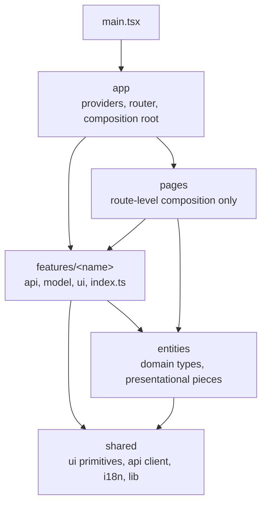

# bank-agent-web: web application

## Responsibility

The browser client for the banking agent: the customer chat, the transparency panel that shows rules, cited policies, tool calls, and verification per turn, the human agent inbox for structured handoffs, and a read-only evaluation view. Phase 01 provides the foundation (build, types, lint, boundaries, tests); phase 12 adds the design system and phase 13 the features.

Stack: Vite, React 19, TypeScript in strict mode (with `noUncheckedIndexedAccess` and `exactOptionalPropertyTypes`), Tailwind CSS v4 through the Vite plugin, Vitest with jsdom, React Testing Library, and MSW. Package manager: pnpm (version pinned by `packageManager`), Node 24.15 or later (`engines`, root `.nvmrc`).

## Layers

Imports flow downward only. `eslint.boundaries.js` enforces this and `tooling/boundaries.test.ts` proves the rules fire.



- A feature is imported only through its `index.ts`, by pages, by the app, or by another feature.
- `shared` imports nothing from the other layers; `entities` imports only `shared`.
- `src/test/` holds test infrastructure (setup, MSW server) and may import any layer.

Each layer folder has a README with its rules: [app](src/app/README.md), [pages](src/pages/README.md), [features](src/features/README.md), [entities](src/entities/README.md), [shared](src/shared/README.md).

## Commands

Run from `apps/web` (or use the root Make targets):

| Command                                     | Purpose                                                                                                               |
| ------------------------------------------- | --------------------------------------------------------------------------------------------------------------------- |
| `pnpm install --frozen-lockfile`            | Install exactly what `pnpm-lock.yaml` pins                                                                            |
| `pnpm run dev`                              | Vite dev server on port 5173; `/api` and `/health` proxy to `VITE_API_PROXY_TARGET` (default `http://localhost:8000`) |
| `pnpm run build`                            | Type-check and build to `dist/`                                                                                       |
| `pnpm run lint`                             | ESLint with zero warnings allowed                                                                                     |
| `pnpm run format:check` / `pnpm run format` | Prettier check or write                                                                                               |
| `pnpm run typecheck`                        | `tsc -b` over the app and the tooling configs                                                                         |
| `pnpm run test` / `pnpm run test:coverage`  | Vitest, optionally with v8 coverage                                                                                   |

## Rules

- Server state lives in TanStack Query, local UI state in components, feature-scoped shared state in context with `useReducer`; Zustand only with a written justification in `docs/frontend/state.md`.
- No `any`, no `dangerouslySetInnerHTML`, no web storage for session data (lint rules enforce all three). Model output renders as plain text. No inline scripts, so the build works under a strict CSP.
- Every user-facing string lives in locale files (`es`, `pt`, `en`) from phase 12 on. The phase 01 shell shows only the product name, a proper noun.
- No emojis anywhere and one outline icon set.

## How to extend

- **Feature:** create `src/features/<name>/` with `api/`, `model/`, `ui/`, and an `index.ts` that exports only the public surface. Add its MSW handlers next to its API code and an integration test per feature.
- **Page:** add a route-level component under `src/pages/` that composes features; it holds no business logic.
- **Shared primitive:** add it under `src/shared/ui/` with a test; it must not import anything outside `shared`.
- **Dependency:** `pnpm add <package>` (or `-D`), with the reason in the phase log; ask before adding anything over about 50 MB installed.

## How to test

```bash
pnpm run test:coverage     # or: make test-web
```

- `src/test/setup.ts` registers jest-dom matchers and starts the MSW server with `onUnhandledRequest: 'error'`, so no test can reach a real network. Override handlers per test with `server.use(...)`.
- Coverage gate: 70% line coverage for `src/features/**`.
