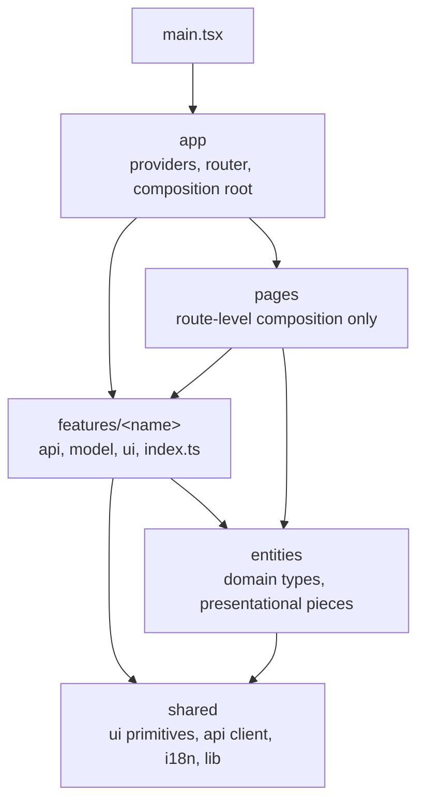

# bank-agent-web: web application

## Responsibility

The browser client for the banking agent: the customer chat, the transparency panel that shows rules, cited policies, tool calls, and verification per turn, the human agent inbox for structured handoffs, the administrative analytics dashboard, and the detailed evaluation view. Phase 01 provided the build, types, lint, boundaries, and tests; phase 12 added the design system, the app shell, the typed API layer, i18n, and sign-in; phase 13 added the conversation, glass box, agent inbox, evaluation view, demo guide, and About page ([`docs/frontend/features.md`](../../docs/frontend/features.md)).

Stack: Vite, React 19, TypeScript in strict mode (with `noUncheckedIndexedAccess` and `exactOptionalPropertyTypes`), React Router 8, TanStack Query 5, Radix primitives (`radix-ui`), Tailwind CSS v4 with design tokens, Phosphor icons, i18next, react-hook-form with zod/mini, openapi-fetch over types from openapi-typescript, Vitest with jsdom, React Testing Library, MSW, and vitest-axe. Design rules: [`docs/design/DESIGN.md`](../../docs/design/DESIGN.md); components: [`docs/frontend/components.md`](../../docs/frontend/components.md); state: [`docs/frontend/state.md`](../../docs/frontend/state.md). Package manager: pnpm (version pinned by `packageManager`), Node 24.15 or later (`engines`, root `.nvmrc`).

## Layers

Imports flow downward only. `eslint.boundaries.js` enforces this and `tooling/boundaries.test.ts` proves the rules fire.



- A feature is imported only through its `index.ts`, by pages, by the app, or by another feature.
- `shared` imports nothing from the other layers; `entities` imports only `shared`.
- `src/test/` holds test infrastructure (setup, MSW server) and may import any layer.

Each layer folder has a README with its rules: [app](src/app/README.md), [pages](src/pages/README.md), [features](src/features/README.md), [entities](src/entities/README.md), [shared](src/shared/README.md).

## Commands

Run from `apps/web` (or use the root Make targets):

| Command                                     | Purpose                                                                                                                       |
| ------------------------------------------- | ----------------------------------------------------------------------------------------------------------------------------- |
| `pnpm install --frozen-lockfile`            | Install exactly what `pnpm-lock.yaml` pins                                                                                    |
| `pnpm run dev`                              | Vite dev server on port 5173; `/v1`, `/api`, and `/health` proxy to `VITE_API_PROXY_TARGET` (default `http://localhost:8000`) |
| `pnpm run build`                            | Type-check and build to `dist/`                                                                                               |
| `pnpm run lint`                             | ESLint with zero warnings allowed                                                                                             |
| `pnpm run format:check` / `pnpm run format` | Prettier check or write                                                                                                       |
| `pnpm run typecheck`                        | `tsc -b` over the app and the tooling configs                                                                                 |
| `pnpm run test` / `pnpm run test:coverage`  | Vitest, optionally with v8 coverage                                                                                           |

## Public interfaces

| Import                       | What it gives                                                                                                                                                |
| ---------------------------- | ------------------------------------------------------------------------------------------------------------------------------------------------------------ |
| `@/shared/ui`                | The primitives (see the components doc), `ThemeProvider`, `useTheme`, `useToast`, the icons                                                                  |
| `@/shared/i18n`              | `LocaleProvider`, `useLocale`, `useFormat` (money, dates, relative time, countdowns per locale), `LocaleSwitcher`                                            |
| `@/shared/api`               | `createApiClient`, `useApi`, `unwrap`, `ApiError` and `NetworkError`, `hasProblem`, `errorMessageKey`, `createQueryClient`, `queryKeys`, `Schema<'Name'>`    |
| `@/shared/config`            | `isDemoMode()` (`VITE_DEMO_MODE`)                                                                                                                            |
| `@/features/auth`            | `LoginFlow`, `RequireSession`, `AuthProvider`, `useSession`, `useStepUp`, `SessionStatus`, `LogoutButton`, `SessionNotice`, the `StepUp` compound, `homeFor` |
| `@/features/conversation`    | The `Conversation` compound (`Root`, `Header`, `Starters`, `Messages`, `HumanButton`, `Composer`) and `useConversation`                                      |
| `@/features/glass-box`       | `GlassBox.Panel`, `GlassBox.SheetTrigger`, `GlassBox.Standalone`, `StaffTrace`                                                                               |
| `@/features/agent-inbox`     | `HandoffFilters`, `HandoffList`, `HandoffDetail`, `CreditApplicationList`, `CreditApplicationDetail`                                                         |
| `@/features/eval-report`     | `EvaluationReport`, the published summary hook and types, run grouping, and interval helpers                                                                 |
| `@/features/admin-dashboard` | The evaluator-only administrative analytics dashboard over versioned published runs                                                                          |
| `@/features/demo-guide`      | `DemoGuide` and the verified `SCENARIOS`                                                                                                                     |
| `@/entities/turn-selection`  | `TurnSelectionProvider`, `useTurnSelection` (linked selection between the chat and the glass box)                                                            |

The composition root is `src/app/`: `services.ts` creates the API client, the query client, and the session-loss channel once; `AppProviders.tsx` provides theme, locale, icons, tooltips, toasts, the query client, and the API client; `routes.tsx` is the route tree (`/login`; the public `/about`, and `/demo` in demo mode; the customer chat at `/` and `/glass-box/:id`; the console at `/console` with `inbox`, `credit-applications`, `evaluation`, and `traces`; a not-found page; and a route error boundary), where every page except sign-in is a lazy route; `layouts/` holds `CustomerLayout` (chat-first, mobile-first) and `ConsoleLayout` (desktop-first, with navigation). Features consume everything through hooks, never props.

## Rules

- **State.** Server state lives in TanStack Query, local UI state in components, feature-scoped shared state in context with `useReducer`; Zustand only with a written justification in `docs/frontend/state.md` (none today).
- **Security.** No `any`, no `dangerouslySetInnerHTML`, no web storage except display preferences in `shared/lib/preferences.ts` (lint rules enforce all three). The session is an `HttpOnly` cookie; the CSRF token lives in memory. Model output renders as plain text. No inline scripts (the pre-paint theme script is `public/theme-init.js`), so the build works under a strict CSP. Fonts are self-hosted, and Vite never inlines an asset as a `data:` URI (`assetsInlineLimit: 0`). The production CSP (Caddy, `deploy/caddy/Caddyfile`) allows styles from `'self'` plus a per-response nonce, which `shared/lib/csp-nonce.ts` reads from `index.html` and hands to the style element Radix dialogs inject.
- **Production image.** `apps/web/Dockerfile` builds the SPA and serves it with Caddy (the edge of `deploy/compose.prod.yml`); `VITE_DEMO_MODE=true` builds the persona picker for the public demo. `node tooling/csp-check.mjs <url>` drives every surface of a deployed stack in Chromium and fails on any CSP violation or console error.
- **Copy.** Every user-facing string lives in `src/shared/i18n/locales/{es,pt,en}.json`; `tooling/no-hardcoded-strings.test.ts` fails on JSX text and literal labels in components, and `locales.test.ts` keeps the three files in step.
- **Design.** Tokens only (Tailwind's default palette is removed), one icon set, no emojis, no em dashes, WCAG 2.2 AA.

## API types and the client

- `make openapi` exports `contracts/openapi.json` and regenerates `src/shared/api/generated/schema.d.ts`; `tooling/api-types.test.ts` fails when the committed types are stale. Never edit the generated file.
- `createApiClient` wraps openapi-fetch: `credentials: 'include'`, an `X-Request-ID` on every call, `X-CSRF-Token` on POST (fetched once from `GET /v1/auth/csrf`, replaced from login, step-up, and logout responses, refreshed with one retry on `csrf-token-invalid`), problem details parsed into `ApiError` (with the slug, the request id, and `Retry-After`), failed fetches as `NetworkError`, and a lost session (`authentication-required`, `session-expired`) reported to `AuthProvider`, which returns to sign-in and then back to the same page.
- Queries retry only network errors and 5xx (at most twice); the default stale time is 30 s and the session is never fresh (0 s). Mutations never retry automatically.

## How to extend

- **Feature:** create `src/features/<name>/` with `api/` (query and mutation hooks over `useApi()` and `queryKeys`), `model/`, `ui/`, and an `index.ts` that exports only the public surface. Put MSW fakes in `src/test/msw/` built from the typed fixtures in `src/test/msw/api.ts`, and add an integration test per feature with `renderApp` from `src/test/app.tsx`.
- **Page:** add a route-level component under `src/pages/` that composes features; register it in `src/app/routes.tsx`. It holds no business logic.
- **Shared primitive:** add it under `src/shared/ui/` with a colocated test, export it from `src/shared/ui/index.ts`, and document it in `docs/frontend/components.md`. It must not import anything outside `shared`. A new color pair goes into `contrast.ts` first.
- **Copy:** add the key to `es.json`, `pt.json`, and `en.json` together.
- **Dependency:** `pnpm add --save-exact <package>` (or `-D`), with the reason in the phase log; ask before adding anything over about 50 MB installed.

## Running against the API

```bash
make up && make seed                                         # PostgreSQL with the demo personas
DEMO_MODE=true uv run uvicorn bank_agent.asgi:create_app --factory   # the API on :8000; codes shown on screen
VITE_DEMO_MODE=true pnpm --dir apps/web run dev              # http://localhost:5173 with the persona picker
pnpm --dir apps/web exec node tooling/screenshots.mjs        # optional: one conversation per workflow in es and pt, then every surface in both themes at desktop and mobile widths, into apps/web/.shots/
```

The screenshot script signs in several times a minute; raise `RATE_LIMIT_AUTH_PER_MINUTE` and `RATE_LIMIT_SESSION_AUTH_PER_MINUTE` for that local API run. It needs a Chromium for `playwright-chromium` (`pnpm --dir apps/web exec playwright install chromium`, once).

## How to test

```bash
pnpm run test:coverage     # or: make test-web
```

- `src/test/setup.ts` registers jest-dom and axe matchers and starts the MSW server with `onUnhandledRequest: 'error'`, so no test can reach a real network. Override handlers per test with `server.use(...)`.
- `src/test/render.ts` renders a component with the shared providers; `src/test/app.tsx` renders the whole app at a path (providers, routes, guards); `src/test/msw/auth.ts` is a stateful fake of `/v1/auth` typed from the generated schema.
- Unit tests sit beside the code (`*.test.ts(x)`); integration tests per feature drive the app through MSW fakes typed from the schema (`src/test/msw/{auth,conversation,trace,agent}.ts`); `src/app/a11y.test.tsx` and `src/app/a11y-surfaces.test.tsx` run vitest-axe on every page in both themes. `tooling/eligibility-copy.test.ts` keeps the eligibility sentences identical to the policy pack. jsdom cannot judge color contrast, so `src/shared/ui/tokens.test.ts` checks it from the tokens.
- Vitest runs on worker processes (`pool: 'forks'`), capped at half the cores (two in CI), with 20 s test and 30 s hook and teardown timeouts, so a busy machine during `make check` does not fail worker start-up.
- Coverage gate: 70% line coverage for `src/features/**`.

## Live human service

Escalated chats show queued, joined, and closed states and send follow-ups through the human channel. Assigned agents reply in the handoff detail. Refresh and reconnect restore persisted cursor pages; transport errors are shown separately from assignment. See [the guide](../../docs/workflows/human-service.md) for the two-browser walkthrough.
