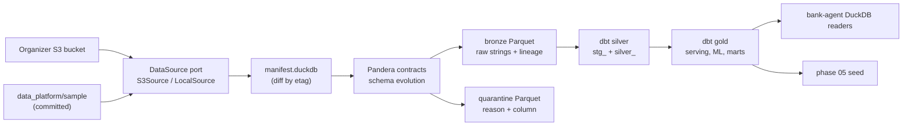

# bank-data: data platform

## Responsibility

`bank-data` turns the organizer dataset into trustworthy, versioned tables for the rest of the system:

- manifest-driven ingestion from the organizer S3 bucket or a local directory, with Pandera contracts, quarantine, and schema-evolution detection;
- the dbt-duckdb project that builds silver (typed, deduplicated, flagged) and gold (serving Parquet for the API, ML inputs, and analytics marts), incrementally;
- the data-quality report and the lineage page;
- the phase 04 demand evidence and workflow prioritization analysis (`bank-data analysis`), with its inputs in `analysis/` and `mappings/`;
- the phase 05 demo seed (`bank-data seed`, `make seed`): persona selection over gold and an idempotent load into PostgreSQL, with the persona file in `seed/personas.yaml` ([docs/demo/personas.md](../docs/demo/personas.md));
- the committed, bounded, pseudonymized sample in `sample/` (CLAUDE.md rule 5) and the synthetic update-correctness fixture in `fixtures/`.

Raw and derived data live under the repository `data/` directory, which is gitignored. The full dataset never enters git.

## Architecture



The full flow, the incremental run, and the late-arrival sequence are in [docs/workflows/data-pipeline.md](../docs/workflows/data-pipeline.md); the reasons for DuckDB, dbt, and Pandera are in [ADR 0007](../docs/adr/0007-dbt-duckdb-and-pandera-for-the-data-platform.md), and the committed sample in [ADR 0022](../docs/adr/0022-committed-bounded-data-sample.md).

## Choosing the data source

The source is explicit and never mixed. Each source builds in its own warehouse directory, the manifest refuses a second source, and the source is printed by every command and recorded in the quality report and the lineage page.

| Source | How to select it | Needs | Warehouse |
|---|---|---|---|
| `sample` (default) | nothing, `BANK_DATA_SOURCE=sample`, or `make pipeline DATA_SOURCE=sample` | nothing: no network, no credentials | `data/warehouse-sample/` |
| `s3` | `BANK_DATA_SOURCE=s3` in `.env`, or `DATA_SOURCE=s3` on each make call | the organizer S3 values in `.env` | `data/warehouse/` |
| `local` | `bank-data ... --source local --local-dir <dir>` | a directory laid out like the bucket | `data/warehouse-local/` |

```bash
# Without credentials: bronze, silver, and gold from the committed sample, offline (about 30 seconds).
make pipeline

# With the organizer credentials in .env: the full 5.3 GB delivery replaces the sample in your builds.
make data-download                 # manifest-driven, incremental; about 8 minutes the first time
make pipeline DATA_SOURCE=s3       # or set BANK_DATA_SOURCE=s3 in .env and run `make pipeline`
```

## Layout

| Path | Content |
|---|---|
| `src/bank_data/contracts/` | Table specs from the data dictionary (`tables.py`), strict parsing, Pandera schemas, row validation with reason codes, schema-evolution detection, canonical codes |
| `src/bank_data/ingest/` | The `DataSource` port and its S3 and local adapters, key-layout parsing, the manifest, bronze and quarantine writers, the ingestion runner |
| `src/bank_data/transform/` | The dbt subprocess runner and the code generator for dbt sources, silver contracts, and the canonical seed |
| `src/bank_data/reports/` | Quality report and lineage page |
| `src/bank_data/sample/` | Committed-sample selection, pseudonyms, and the provenance README |
| `src/bank_data/seed/` | The demo seed: persona file model, named SQL criteria, deterministic selection, gold-to-domain bundle, and the runner that migrates and loads through bank-agent's `PostgresSeeder` |
| `seed/personas.yaml`, `seed/personas.sample.yaml` | Persona criteria and coverage (no customer data): full warehouse and bounded offline sample, respectively |
| `src/bank_data/analysis/` | The phase 04 analysis: reason mapping, metrics, bootstrap statistics, pre-registered scoring, labeling export, figures, and reports |
| `analysis/` | Analysis inputs: the pre-registered `scoring.yaml` and `cost_assumptions.yaml` (every value an assumption); see [`analysis/README.md`](analysis/README.md) |
| `mappings/workflow_mapping.csv` | Every observed contact reason and complaint category mapped to a workflow or `other`, with scenarios and rationale |
| `config/sources.yml` | Dataset version, snapshot date, type-change threshold, lookback window, freshness thresholds |
| `dbt/` | The dbt project: macros, generated `models/sources.yml` and `models/silver/_silver.yml`, silver and gold models, generic tests, the `canonical_values` seed |
| `fixtures/late_arrival/` | Synthetic update-correctness fixture (labeled in `FIXTURE.md`) |
| `sample/` | The committed organizer sample and its generated README |
| `tests/unit/`, `tests/integration/` | Unit tests (no network, no database files outside temporary directories) and integration tests (real DuckDB files, dbt builds) |

## Public interfaces

The `bank-data` command. Every data command takes `--source sample|s3|local` (default `BANK_DATA_SOURCE`, which defaults to `sample`).

| Command | Make target | What it does |
|---|---|---|
| `bank-data ingest [--download-only]` | `make data-download` (S3, download only) | List, diff against the manifest, download new or changed objects, validate, write bronze or quarantine. Exit 3 while a batch with a breaking schema change is quarantined |
| `bank-data build [--sample-customers N] [--full-refresh]` | part of `make pipeline`, `make pipeline-sample` | `dbt build` (models and tests); incremental unless a re-delivery requested a full refresh |
| `bank-data test` | part of `make pipeline` | `dbt test` and `dbt source freshness` |
| `bank-data report` | `make data-report` | The quality report (`docs/data/quality-report.md` for the S3 source) |
| `bank-data lineage` | `make lineage` | `dbt docs generate` and the Mermaid lineage (`docs/data/lineage.md` for the S3 source) |
| `bank-data seed [--customers N]` | `make seed` (`SEED_CUSTOMERS`, default 200) | Migrate the compose PostgreSQL, then load the personas and a deterministic subset from gold; idempotent. The bounded `sample` source uses `seed/personas.sample.yaml`; the full warehouse uses `seed/personas.yaml`. Needs `POSTGRES_ADMIN_PASSWORD` and `SESSION_SECRET` |
| `bank-data analysis [--output-dir D] [--labeling-dir D]` | `make analysis` | Demand evidence, pre-registered scores, figures, and the labeling files (`docs/analysis/` and `data/labeling/` for the S3 source; next to the warehouse otherwise) |
| `bank-data sample` | `make data-sample` | Regenerate `sample/` from the S3 warehouse, then run the guard |
| `bank-data codegen [--check]` | `make data-codegen` | Regenerate (or check) the dbt files derived from the table specs |

Exit codes: 0 success, 1 a failed object or step, 2 configuration, 3 breaking schema change, 4 source access, 5 dbt, 6 sample bounds. No output contains credentials or the bucket name; a log filter masks them as a second line of defense, and dbt runs in a subprocess whose environment has no AWS variables.

The gold serving Parquet (`customers_serving`, `products_serving`, `transactions_serving`, `complaints_serving`, `credit_profiles_serving`) is the contract read by `bank_agent.adapters.persistence.duckdb`; its columns are `GOLD_SCHEMAS` in `services/api/src/bank_agent/adapters/persistence/duckdb/gold.py`, and an integration test checks that dbt writes exactly those.

## Local exploratory analysis

The local EDA is implemented independently of the future S3 ingestion and dbt pipeline.
See [the EDA guide](../docs/analysis/EDA.md) for reproducibility, quality policies, commands,
and the read-only Streamlit viewer. The viewer includes a sanitized table explorer, a relationship
map and workflow traffic lights. Install its optional dependencies with `make eda-setup`, run
`make eda`, then launch `make eda-ui`.

The `bank-data eda` group exposes `inventory`, `profile`, `curate`, `analyze`, `report`, and `run`.
The other ingestion and seeding commands remain future work.

## How to extend

- **Add a table.** Add a `TableSpec` to `contracts/tables.py` (columns, types, nullability, accepted values, ranges, primary key, order column, customer column), add translations to `contracts/canonical.py` if its values need them, run `make data-codegen`, and add `dbt/models/silver/stg_<table>.sql` (two lines: the config and `{{ stg_body('<table>') }}`) and `silver_<table>.sql` (orphan flags with the `orphan_flag` macro). Bump `CONTRACT_VERSION`. The contract, bronze layout, deduplication, and incremental logic follow from the spec.
- **Add a data source adapter.** Implement the `DataSource` Protocol in `ingest/source.py` (`label`, `prefix`, `list_objects`, `download`), raising `SourceAccessError` with non-secret messages, and wire it in `workspace.py`. The manifest, contracts, and dbt layers do not change.
- **Add a gold model.** Add SQL under `dbt/models/gold/<serving|ml|marts>/` and its tests in `_gold.yml`. A new serving table also needs a `GOLD_SCHEMAS` entry and a reader in bank-agent.
- **Extend the analysis.** See [`analysis/README.md`](analysis/README.md): a new criterion or weight is a new pre-registration version; a new reason needs a mapping row with a rationale.
- **Add a demo persona.** Add a named predicate to `seed/criteria.py` if none fits, add the persona to `seed/personas.yaml`, extend `tests/unit/test_seed_command.py` if it changes coverage, and document it in `docs/demo/personas.md`.
- **Change a contract.** Edit the spec, run `make data-codegen`, bump `CONTRACT_VERSION`, and add a unit test for the new rule.

## How to test

```bash
uv run pytest data_platform/tests -m unit          # fast; no network
uv run pytest data_platform/tests -m integration   # dbt builds on the fixture; about a minute
make pipeline                                      # end to end from the committed sample
make check                                         # everything, including the sample guard and codegen check
```

Coverage for `data_platform/src` is gated at 80% line coverage by `make check`.

## Observed runtimes (MacBook, 8 DuckDB threads)

| Step | Sample source | S3 source (full delivery) |
|---|---|---|
| First ingest | 5 seconds (783 objects) | about 8 minutes download plus 12 minutes validation and bronze (7,671 objects, 23.5 million rows) |
| Ingest with nothing new | under a second | 4 seconds (listing only) |
| First build (`dbt build`: 41 models, a seed, 273 tests) | about 15 seconds | 2 minutes 8 seconds |
| Incremental build with nothing new | about 10 seconds | 1 minute 7 seconds |
| `bank-data test` | a few seconds | 11 seconds |
| `make pipeline-sample DATA_SOURCE=s3` (2,000 customers, ingest already done) | not applicable | 17 seconds |
| `bank-data sample` | not applicable | 37 seconds |
| `make analysis` | a few seconds | about 30 seconds (matplotlib's first run builds a font cache) |
