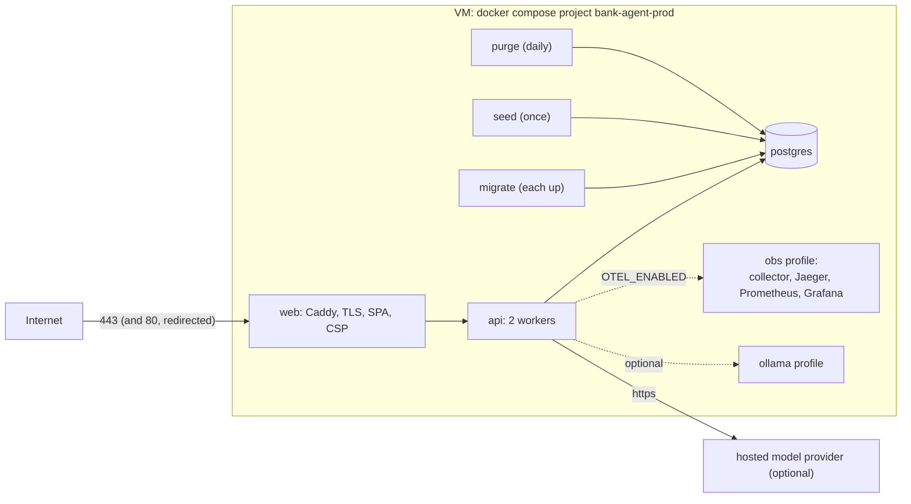
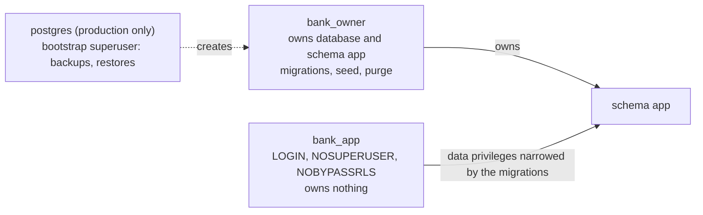

# deploy

Everything needed to run the system outside the Python and web packages: the development stack's configuration (for the root `docker-compose.yml`) and the production stack for one VM, with the steps to deploy it on AWS Lightsail (recommended), EC2, or an Azure VM, keep it running until the award ceremony on 2026-10-16, and take it down afterwards. The decision record is [ADR 0019](../docs/adr/0019-single-host-compose-deployment.md); the security view is the [threat model](../docs/security/threat-model.md).

## Contents

| Path | Purpose |
|---|---|
| `compose.prod.yml` | The production stack: Caddy (web), the API, PostgreSQL, the migrate, seed, and purge jobs, and the `obs` and `ollama` profiles |
| `prod.sh` | The operations script: `init-env`, `check`, `build`, `up`, `seed`, `update`, `backup`, `restore`, `rollback`, `purge`, `smoke`, `status`, `logs`, `down`, `destroy` |
| `.env.production.example` | Every server variable, with no values; copied to `deploy/.env.production` on the server only |
| `smoke_test.sh`, `smoke_test.py` | The smoke test against a deployed URL (standard library Python) |
| `caddy/Caddyfile` | TLS, the SPA headers and strict CSP, the reverse proxy |
| `caddy/module/` | The Caddy build (standard distribution, pinned Go modules) compiled into the web image |
| `postgres/init-production/10-roles.sh` | Production roles: a non-superuser owner, the application role, the evaluator role |
| `postgres/init/10-roles.sh` | Development and test roles (the image superuser is the owner there) |
| `observability/` | Collector, Prometheus, alert rules, Grafana provisioning, and the production Jaeger configuration (`jaeger.yaml`, Badger storage) |

The images are defined next to their code: `services/api/Dockerfile` (targets `api` and `job`) and `apps/web/Dockerfile` (Caddy with the static build).

## The production stack



| Service | Image | Hardening | Limits |
|---|---|---|---|
| web | `bank-agent-web` (Caddy 2.11.4 built with Go 1.26.8) | user 10002, read-only root, no capabilities, binds 80 and 443 through a namespaced sysctl | 0.5 CPU, 256 MB |
| api | `bank-agent-api` | user 10001, read-only root, no capabilities, no access log, proxy headers from web only | 1.5 CPU, 1.5 GB |
| postgres | `postgres:16.15-alpine3.24` by digest | user 70, read-only root, no capabilities, internal network, never published | 1 CPU, 1 GB |
| migrate, seed, purge | `bank-agent-job` | user 10001, read-only root, no capabilities, internal network | 1 CPU, 768 MB (purge 256 MB) |
| obs profile | collector, Jaeger (Badger, 7 days), Prometheus (15 days), Grafana (login) by digest | read-only root, no capabilities; Grafana and the Jaeger UI on 127.0.0.1 only | 0.5 CPU each |
| ollama profile | `ollama/ollama:0.35.0` by digest | no capabilities, private network plus egress for the model download | 3 CPU, 10 GB |

Every service has `no-new-privileges`, rotated logs (5 files of 10 MB), and a health check or a completion condition. `services/api/tests/unit/test_deploy_config.py` fails when an edit drops any of this.

## Choosing a host

Any 64-bit Linux VM with Docker works (x86_64 or arm64). Use Ubuntu 24.04 LTS so the commands below apply as written.

| Model option | Memory | vCPU | Disk | AWS Lightsail | EC2 | Azure |
|---|---|---|---|---|---|---|
| No model (`fake`) or a hosted provider | 4 GB | 2 | 40 GB SSD | the 4 GB plan (recommended) | `t3.medium` | `Standard_B2s` |
| Same, with the `obs` profile | 8 GB | 2 | 60 GB SSD | the 8 GB plan | `t3.large` | `Standard_B2ms` |
| Self-hosted model (`ollama` profile, `qwen2.5:7b-instruct`, CPU inference) | 16 GB or more | 4 or more | 80 GB SSD | the 16 GB plan | `m7i.xlarge` or `t3.xlarge` | `Standard_B4ms` |

The CPU-only 7B model answers in several seconds per call even on 4 vCPU (the local measurement was 3 to 6 seconds on an Apple M3); a hosted provider is faster and, for a demo, cheap under the budget caps.

**AWS Lightsail (recommended: the fewest moving parts).** Create an instance: Linux/Unix, "OS Only", Ubuntu 24.04 LTS, the plan from the table, your SSH key pair. Attach a static IP (Networking, "Create static IP"). In the instance's Networking tab, IPv4 firewall: keep SSH (TCP 22) but restrict it to your own IP address, add HTTP (TCP 80) and HTTPS (TCP 443), and optionally a custom rule for UDP 443 (HTTP/3). Repeat the rules for IPv6 if you enable it.

**EC2.** Launch Ubuntu Server 24.04 LTS with the instance type from the table, a gp3 root volume of the size above, an SSH key pair, and IMDSv2 required. Security group inbound: TCP 22 from your IP only; TCP 80 and 443 (and UDP 443) from `0.0.0.0/0` and `::/0`. Allocate an Elastic IP and associate it with the instance.

**Azure VM.** Create a VM with the Ubuntu Server 24.04 LTS image and the size from the table, SSH public key authentication (password authentication off), a Standard static public IP. Network security group inbound rules: SSH (TCP 22) from your IP only, HTTP (80) and HTTPS (443) from Any; deny everything else (the default). A Standard SSD disk of the size above.

Nothing else is exposed: PostgreSQL, the API, Grafana, and Jaeger are never reachable from outside the VM.

## DNS

Choose a host name you control, for example `demo.your-domain.org`. At your DNS provider create an `A` record for it pointing at the VM's static IP (and an `AAAA` record for its IPv6 address if the VM has one), TTL 300. Wait until `dig +short demo.your-domain.org` answers with that address from your laptop: Caddy asks Let's Encrypt for the certificate on the first start, and the HTTP challenge on port 80 needs the record in place. Optionally add a `CAA` record allowing `letsencrypt.org` only.

## Prepare the VM

```bash
ssh ubuntu@<static-ip>                      # Lightsail and EC2 use "ubuntu"; Azure uses the admin user you chose
sudo apt-get update && sudo apt-get -y upgrade
sudo apt-get install -y ca-certificates curl git make python3 unattended-upgrades
sudo dpkg-reconfigure -f noninteractive unattended-upgrades   # security updates install themselves

# Docker Engine and the Compose plugin from Docker's own repository (docs.docker.com/engine/install/ubuntu)
sudo install -m 0755 -d /etc/apt/keyrings
sudo curl -fsSL https://download.docker.com/linux/ubuntu/gpg -o /etc/apt/keyrings/docker.asc
echo "deb [arch=$(dpkg --print-architecture) signed-by=/etc/apt/keyrings/docker.asc] https://download.docker.com/linux/ubuntu $(. /etc/os-release && echo "$VERSION_CODENAME") stable" \
  | sudo tee /etc/apt/sources.list.d/docker.list > /dev/null
sudo apt-get update && sudo apt-get install -y docker-ce docker-ce-cli containerd.io docker-buildx-plugin docker-compose-plugin
sudo usermod -aG docker "$USER" && exit     # log in again so the group applies

ssh ubuntu@<static-ip>
git clone https://github.com/<org>/factored-hackathon-2026-la-brasil-del-70.git bank-agent
cd bank-agent
git checkout <the commit or tag to deploy>
```

Keep the cloud firewall as the only firewall: Docker publishes ports through its own iptables rules, which `ufw` does not govern. SSH stays key-only (the images above disable password logins by default; check `PasswordAuthentication no` in `/etc/ssh/sshd_config`).

## The server env file

```bash
deploy/prod.sh init-env        # writes deploy/.env.production (mode 600) with fresh random secrets, never printed
nano deploy/.env.production    # or vi; set the values below, then save
deploy/prod.sh check           # names any missing value (never prints one) and validates the compose file
```

Set at least:

| Variable | Value |
|---|---|
| `SITE_ADDRESS` | `demo.your-domain.org` |
| `PUBLIC_ORIGIN` | `https://demo.your-domain.org` |
| `ACME_EMAIL` | an address that receives certificate expiry notices |
| `DEMO_MODE`, `ALLOW_PUBLIC_DEMO_MODE`, `VITE_DEMO_MODE` | `true` for the public judging demo ([demo mode](../docs/security/demo-mode.md)) |
| The model settings | see "Choosing the model" |

`init-env` already filled `POSTGRES_SUPERUSER_PASSWORD`, `POSTGRES_ADMIN_PASSWORD`, `POSTGRES_APP_PASSWORD`, `SESSION_SECRET`, `CSRF_SECRET`, and `GRAFANA_ADMIN_PASSWORD`. Never copy the file off the server, paste its values into chats or issues, or commit it (`.gitignore` covers it). If you prefer to write the file on your laptop, copy it with `scp` straight into `deploy/.env.production` and `chmod 600` it on the server.

## Choosing the model

Switching the model is a settings-only change in `deploy/.env.production`, followed by `deploy/prod.sh up`. The budget guard stays on in every option (`LLM_DAILY_BUDGET_USD`, default 5; `LLM_CONVERSATION_BUDGET_USD`, default 0.50; `LLM_SESSION_TOKEN_LIMIT`, default 20000). Prices come from `services/api/config/llm_prices.yaml`, shipped in the image; unverified entries are charged at 1.5 times until someone verifies them (pending human action 7).

**No model** (the default, `LLM_PROVIDER=fake`): every workflow runs on its deterministic path. Nothing leaves the VM.

**A hosted provider through LiteLLM** (https only; production refuses a plain http base for it):

```bash
LLM_PROVIDER=litellm
LLM_PRIMARY_MODEL=openai/gpt-5-mini                     # or anthropic/claude-haiku-4-5-20251001, anthropic/claude-sonnet-5
LLM_API_KEY_PRIMARY=<the provider key, at least 32 characters>
LLM_API_BASE=                                           # empty: the provider's default https endpoint
# Optional second provider for degradation level L1:
LLM_FALLBACK_MODEL=anthropic/claude-haiku-4-5-20251001
LLM_API_KEY_FALLBACK=<its key>
```

Before you do: read [data use](../docs/security/data-use.md), "Providers" (training opt-out, retention, region, a scoped key with a spending limit at the provider).

**A self-hosted model on the VM** (the `ollama` profile, not the default; needs the 16 GB row of the host table):

```bash
LLM_PROVIDER=litellm
LLM_PRIMARY_MODEL=ollama/qwen2.5:7b-instruct
LLM_API_BASE=http://ollama:11434
LLM_ALLOW_PRIVATE_HTTP_BASE=true        # the one plain-http exception: a private host on the VM's Docker network
LLM_TIMEOUT_SECONDS=60
```

Then start with `OLLAMA=1 deploy/prod.sh up` and pull the model once: `docker compose -f deploy/compose.prod.yml --env-file deploy/.env.production -p bank-agent-prod --profile ollama exec ollama ollama pull qwen2.5:7b-instruct` (about 4.7 GB). The model costs nothing per token (verified entry in the price table).

## Deploy

```bash
deploy/prod.sh build           # builds bank-agent-{web,api,job}:<commit>; about 5 minutes the first time
deploy/prod.sh up              # validates, migrates (the migrate job), starts web, api, postgres, purge; waits for health
deploy/prod.sh seed            # once: the demo personas and 200 customers from the committed sample
deploy/prod.sh smoke           # the smoke test against PUBLIC_ORIGIN
```

`up` refuses to start without the images of the current commit, without every required value, or with a group- or world-readable env file. The first request makes Caddy fetch the certificate; if it fails, `deploy/prod.sh logs web` says why (usually DNS or the firewall on port 80).

## Verify

From your laptop, against the public URL:

```bash
deploy/smoke_test.sh https://demo.your-domain.org        # needs python3 3.10 or later; exits non-zero on the first failure
make csp-check SMOKE_URL=https://demo.your-domain.org    # Chromium through every surface; fails on any CSP violation
curl -sI https://demo.your-domain.org | grep -iE 'strict-transport|content-security|x-content-type|referrer|permissions'
```

The smoke test checks the certificate (valid for the host, at least 7 days left), `/health/live` and `/health/ready`, the SPA and API security headers, the demo sign-in with `__Host-session` (`Secure`, `HttpOnly`, `SameSite=Strict`, no `Domain`), one read-only conversation per workflow in both languages (account inquiry in es, card support in pt, a dispute intake in es and in pt, the credit catalog in pt), an out-of-scope request answered with an abstention, and a cross-customer read answered with 404. It never prints a code, a cookie, or a token, and it changes no demo data, so it can run every day.

## Operate

| Task | Command |
|---|---|
| State of every service | `deploy/prod.sh status` |
| Logs | `deploy/prod.sh logs api` (or `web`, `postgres`, `purge`, `migrate`) |
| Health, degradation level, budget use | `curl -s https://demo.your-domain.org/health/details` |
| Run the retention purge now | `deploy/prod.sh purge` |
| Telemetry | set `OTEL_ENABLED=true`, then `OBS=1 deploy/prod.sh up` |
| Grafana and the Jaeger UI | from your laptop: `ssh -L 3000:127.0.0.1:3000 -L 16686:127.0.0.1:16686 ubuntu@<static-ip>`, then `http://localhost:3000` (user `admin`, `GRAFANA_ADMIN_PASSWORD`) and `http://localhost:16686` |
| Stop without losing data | `deploy/prod.sh down` |

The alerts and what to do for each are in the [runbook](../docs/operations/runbook.md), which also covers the deployment operations below.

## Update and roll back

```bash
deploy/prod.sh update          # git pull --ff-only, backup, build the new commit, migrate, start
deploy/prod.sh rollback        # start the previously deployed image tag again (kept in deploy/.state/)
```

Migrations only move forward. When the update ran a new migration and the old code cannot work with it, restore the backup that `update` took first (next section), then roll back.

## Backup and restore

```bash
deploy/prod.sh backup                                        # deploy/backups/bank_agent-<UTC time>.dump, mode 600
deploy/prod.sh restore deploy/backups/bank_agent-<time>.dump # stops api, purge, web; restores in one transaction; restarts
```

The dump is taken by the bootstrap superuser over the container's local socket (peer authentication, no password), because the owner cannot dump tables with forced row-level security; ownership and grants are kept, so the owner still owns every table after a restore (verified on the local production stack: the migrate job passes afterwards). A daily backup at 03:00 UTC, keeping 7 days:

```bash
crontab -e
0 3 * * * cd /home/ubuntu/bank-agent && deploy/prod.sh backup && find deploy/backups -name '*.dump' -mtime +7 -delete
```

Copy important dumps off the VM (`scp ubuntu@<static-ip>:bank-agent/deploy/backups/<file> .`) and treat them like the database: they hold the synthetic customers and the demo conversations.

## Rotate secrets

Edit the value in `deploy/.env.production`, then:

| Secret | After the edit |
|---|---|
| `CSRF_SECRET` | `deploy/prod.sh up`; browsers fetch a new token on their next request |
| `SESSION_SECRET` | `deploy/prod.sh up`, then `deploy/prod.sh seed`: identity lookups and code keys derive from it, and every session ends |
| `POSTGRES_APP_PASSWORD` or `POSTGRES_ADMIN_PASSWORD` | change it in the database first: `docker compose -f deploy/compose.prod.yml --env-file deploy/.env.production -p bank-agent-prod exec postgres psql -U postgres -d bank_agent -c '\password bank_app'` (or `bank_owner`), type the new value, then `deploy/prod.sh up` |
| `POSTGRES_SUPERUSER_PASSWORD` | `\password postgres` the same way; nothing else uses it |
| `GRAFANA_ADMIN_PASSWORD` | change it in Grafana (profile, "Change password"); the variable only sets the first password |
| `LLM_API_KEY_*` | revoke the old key at the provider, then `deploy/prod.sh up` |

## Keep it running until 2026-10-16

- **External uptime check:** a free monitor (for example UptimeRobot, Better Stack, AWS CloudWatch Synthetics, or an Azure Application Insights availability test) requests `https://demo.your-domain.org/health/live` every 5 minutes from outside and alerts the team by email; turn on its certificate-expiry alert too.
- **Daily smoke test** from the VM (or a laptop): `0 6 * * * cd /home/ubuntu/bank-agent && deploy/smoke_test.sh "$(sed -n 's/^PUBLIC_ORIGIN=//p' deploy/.env.production)" >> deploy/backups/smoke.log 2>&1`. A failure means: `deploy/prod.sh status`, the logs, then the [runbook](../docs/operations/runbook.md).
- **Before the video or a judging session:** reset the demo data with a fresh seed (`deploy/prod.sh seed` restores blocked cards; opened cases and intakes stay until a restore of an early backup).

## Take the demo down after 2026-10-16

```bash
deploy/prod.sh backup                 # optional: a last copy, then move it off the VM or delete it
deploy/prod.sh destroy --yes          # containers, volumes (database, certificates, traces), and images
rm -rf deploy/backups deploy/.env.production
```

Then, in the cloud console: delete the DNS records, release the static IP (Lightsail static IP, EC2 Elastic IP, Azure public IP: they keep costing money unattached), delete the instance or VM and its disks and snapshots, revoke any model provider key used by the demo, and remove the uptime monitor.

## Run the production stack locally (local TLS mode)

The whole stack runs on a laptop with Docker, TLS included, before any VM exists; phase 16 verified it this way with the local Ollama model.

```bash
ENV_FILE=/tmp/p16.env deploy/prod.sh init-env           # any path outside the repository
# In /tmp/p16.env set:
#   SITE_ADDRESS=localhost  PUBLIC_ORIGIN=https://localhost:8443  CADDY_TLS=internal  HTTP_PORT=8080  HTTPS_PORT=8443
#   DEMO_MODE=true  ALLOW_PUBLIC_DEMO_MODE=true  VITE_DEMO_MODE=true
#   LLM_PROVIDER=litellm  LLM_PRIMARY_MODEL=ollama/qwen2.5:7b-instruct  LLM_API_BASE=http://host.docker.internal:11434
#   LLM_ALLOW_PRIVATE_HTTP_BASE=true  LLM_TIMEOUT_SECONDS=60     (or LLM_PROVIDER=fake for no model)
export ENV_FILE=/tmp/p16.env PROJECT=bank-agent-local
deploy/prod.sh build && deploy/prod.sh up && deploy/prod.sh seed
docker cp bank-agent-local-web-1:/data/caddy/pki/authorities/local/root.crt /tmp/caddy-root.crt
deploy/smoke_test.sh https://localhost:8443 --ca-file /tmp/caddy-root.crt --min-cert-days 0   # local certificates live 12 hours
pnpm --dir apps/web exec node tooling/csp-check.mjs https://localhost:8443 --ignore-https-errors
docker compose -f deploy/compose.prod.yml --env-file /tmp/p16.env -p bank-agent-local --profile '*' down --volumes
rm /tmp/p16.env
```

The project name keeps it apart from the development stack; it publishes 8080 and 8443 only (no database port), so it runs next to `make up`.

## Supply chain

- `make security`: pip-audit over every extra, `pnpm audit --prod --audit-level high`, bandit, gitleaks over the history, hadolint on every Dockerfile, shellcheck on the scripts here, and the production compose validation. Container tools run from images pinned by digest. No accepted findings exist today; an accepted one would be listed here with its reason and an expiry date.
- `make images` then `make scan-images IMAGE_TAG=<tag>`: trivy fails on any fixable HIGH or CRITICAL finding in the three images and writes CycloneDX SBOMs to `reports/sbom/` (CI publishes them as the `sbom` artifact).
- Caddy is compiled from `caddy/module/` because the official 2.11.4 binary carries fixed-upstream vulnerabilities (Go 1.26.3 standard library, `golang.org/x/crypto`, `net`, `text`, and `grpc`: 17 HIGH findings). To update it, run `go get` for the new versions and `go mod tidy` in a `golang` container over that folder, rebuild the web image, and rescan.

## Troubleshooting

| Symptom | Cause and fix |
|---|---|
| `up` says `no image bank-agent-api:<commit>` | Run `deploy/prod.sh build` after every checkout, or `IMAGE_TAG=<tag> deploy/prod.sh up` for an existing tag |
| The API restarts with `unsafe settings: ...` | The message names each variable (never its value); fix them in the env file |
| The certificate is not issued | DNS does not point at the VM yet, or port 80 is closed in the cloud firewall; `deploy/prod.sh logs web` |
| `429` answers during a demo | The shared rate limits (per address and per session); a room behind one NAT shares one address: raise `RATE_LIMIT_*` in the env file for the session and `deploy/prod.sh up` |
| Every reply starts with the limited-service notice | Degradation level L2: the provider is down or the daily budget is spent (`/health/details`, runbook `DegradedTemplateOnly`) |
| `503 dependency-unavailable` | PostgreSQL is down or read-only; `deploy/prod.sh status`, runbook `DatabaseUnavailable` |

## Development stack

The root `docker-compose.yml` (PostgreSQL always, `api`, `web`, `obs`, `ml` profiles) is unchanged by the production stack:

```bash
make up                         # PostgreSQL only
make up PROFILES="api web"      # plus the API with hot reload and the web dev server
make up PROFILES=obs            # plus collector, Jaeger (16686), Prometheus (9090), Grafana (3000)
make api-obs                    # the API on the host, exporting traces and metrics to the collector
make up PROFILES=ml             # plus MLflow (5000)
make down                       # stop every profile
```

Values come from `.env` (copy `.env.example`); only the two PostgreSQL passwords are required; every port binds to 127.0.0.1. Grafana there runs with local-only anonymous read access and Jaeger keeps traces in memory; the production `obs` profile adds a login and persistent storage. Every service rotates its container log (5 files of 10 MB). File watching inside containers on macOS can miss events: set `WATCHFILES_FORCE_POLLING=true` for the API or `CHOKIDAR_USEPOLLING=true` for the web service.

## Roles



- Production (`postgres/init-production`): the image's bootstrap superuser is `postgres`; `bank_owner` has no SUPERUSER, CREATEROLE, CREATEDB, or BYPASSRLS, so forced row-level security binds it outside its `seed` and `retention` policies (`services/api/tests/integration/test_production_roles.py`).
- Development and tests (`postgres/init`): the owner is the image's bootstrap role (`POSTGRES_ADMIN_USER`), a superuser inside that throwaway container.
- The API always connects as `bank_app`, so row-level security always applies to it; it never receives the owner password in production (the settings refuse it).
- The init scripts run once, on an empty data volume. After changing one, recreate the volume (development: `docker compose down -v` then `make up`, which erases the local database).
