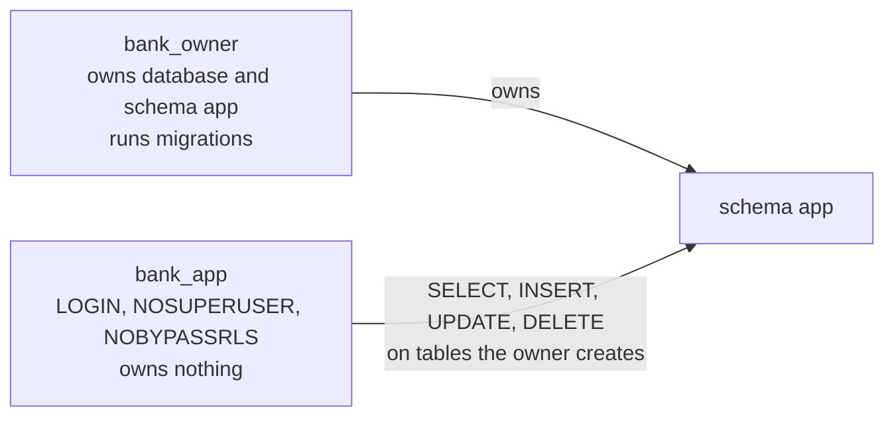

# deploy

Configuration for running the system outside the Python and web packages. Today it serves the development stack in the root `docker-compose.yml`; phase 16 adds the production compose file, the Caddyfile, and deployment scripts.

## Contents

| Path | Used by | Purpose |
|---|---|---|
| `postgres/init/10-roles.sh` | The compose `postgres` service and the integration tests (testcontainers) | Creates the `app` schema owned by the owner role and the application role (`LOGIN`, `NOSUPERUSER`, `NOBYPASSRLS`, owns nothing), with data privileges on tables the owner creates |
| `observability/otel-collector.yaml` | Compose `obs` profile | OTLP receiver on 4317 and 4318 (the API uses HTTP, 4318); traces to Jaeger, metrics on a Prometheus endpoint with the resource attributes on every series |
| `observability/prometheus.yml` | Compose `obs` profile | Scrapes the collector and loads `alerts.yml`; retention of 7 days is set on the command line |
| `observability/alerts.yml` | Compose `obs` profile | Alert rules, one runbook section each ([runbook](../docs/operations/runbook.md)) |
| `observability/grafana/provisioning/` | Compose `obs` profile | Prometheus and Jaeger datasources and the read-only dashboard `dashboards/bank-agent.json` |

## Roles



- In development and tests the owner is the image's bootstrap role (`POSTGRES_ADMIN_USER`), which is a superuser inside that throwaway container. Production uses a non-superuser owner (phase 16).
- The API always connects as the application role, so row-level security policies (phase 05) always apply to it.
- The init script runs once, on an empty data volume. After changing it, recreate the volume: `docker compose down -v` then `make up`.

## Development stack

```bash
make up                         # PostgreSQL only
make up PROFILES="api web"      # plus the API with hot reload and the web dev server
make up PROFILES=obs            # plus collector, Jaeger (16686), Prometheus (9090), Grafana (3000)
make api-obs                    # the API on the host, exporting traces and metrics to the collector
make up PROFILES=ml             # plus MLflow (5000)
make down                       # stop every profile
```

Values come from `.env` (copy `.env.example`). Only `POSTGRES_ADMIN_PASSWORD` and `POSTGRES_APP_PASSWORD` are required. Every port binds to 127.0.0.1.

Grafana runs with local-only anonymous read access and no login form, so it needs no admin password. That setting is for a developer machine only; any non-local deployment of the `obs` profile needs real authentication (phase 16).

Every service rotates its container log (5 files of 10 MB). The observability signals, the dashboard, and how to read a trace are in [docs/operations/observability.md](../docs/operations/observability.md).

File watching inside containers on macOS can miss events. If hot reload stops reacting, set `WATCHFILES_FORCE_POLLING=true` for the API or `CHOKIDAR_USEPOLLING=true` for the web service.
