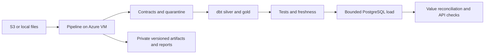

# Azure VM data pipeline

Run the existing Pandera, DuckDB, and dbt pipeline on an Ubuntu 24.04 VM, load a bounded customer slice
into private PostgreSQL, and publish versioned evidence to a private Blob container.

## Architecture



All resources belong to `rg-la70-test` in `eastus2`, subscription
`32847dfa-5fd4-4276-8bdf-243d72b35119`, tenant `4a5e7334-7901-444c-964b-3e6100209fd1`.
The scripts refuse a different tenant, operator account, or resource-group location.
They never modify another resource group.

## Deploy and execute

Prerequisites: authenticated Azure CLI, Git, Bash, Python 3, and `ssh-keygen` on the operator machine.
The operator needs deployment and role-assignment permissions. Use a committed revision: the release command
archives Git HEAD, so unrelated uncommitted changes and local credentials never enter the upload.

```bash
bash deploy/azure-data/deploy.sh validate
bash deploy/azure-data/deploy.sh provision
bash deploy/azure-data/deploy.sh release
bash deploy/azure-data/deploy.sh start sample
bash deploy/azure-data/deploy.sh status
bash deploy/azure-data/deploy.sh publish
```

While VM quota is pending, `provision-storage` deploys only the artifact account, private container, and
operator data role. It creates no VM or network resources. A later `provision` completes the same template.

The initial VM size is `Standard_B2ms` (2 vCPU, 8 GiB RAM), with a 128 GiB Standard SSD. Availability and
subscription quota must pass Azure preflight; this is not a claim of capacity reservation. The sample run
uses no hosted model. VM, disk, public IP, storage, and transactions have separate Azure charges.

The Standard public IP supplies explicit outbound connectivity. The network security group denies all
inbound traffic, including SSH, API, and PostgreSQL. Administration uses VM Run Command. The required SSH
public key is generated locally; its unused private key is immediately discarded. No public website is
published by this data deployment.

## Runtime and data sources

Run Command downloads a SHA-256-verified release through the VM managed identity, bootstraps dependencies,
and starts the inspectable `la70-data-pipeline` systemd unit. `status` reports its state and aggregate evidence;
it never prints authentication material or customer replies.

| Source | Preparation | Runtime command |
|---|---|---|
| `sample` | Included in the committed release, explicitly labeled as a bounded pseudonymized sample | `start sample` |
| `local` | `bash deploy/azure-data/deploy.sh source data` publishes contracted local inputs privately and verifies the downloaded archive | `start local` |
| `s3` | Provision a protected `/opt/la70-data/s3.env` on the VM with organizer settings | `start s3` |

Never supply credentials through Run Command arguments, deployment parameters, shell output, or Git.
The operator must arrange protected provisioning of S3 settings separately. Local inputs are packaged
only from contracted table snapshots and dated CSV/Parquet partitions: ancillary directories, PDFs,
environment files, and generated warehouses are excluded. A source manifest records each path, byte
count, and SHA-256 plus the dataset version, business snapshot date, and code revision. The archive
is uploaded immutably under `sources/<sha256>.tar.gz` and downloaded for hash verification before its
reference is saved. This transfer works while VM provisioning is blocked.

`start local` downloads the selected archive with the VM managed identity. The locked pipeline verifies
the archive and every member before installing its input directory, then executes ingestion, build,
tests, and the normal PostgreSQL path. Extraction rejects unexpected members, links, duplicate paths,
traversal, missing files, and byte/hash mismatches. An existing input directory must match the complete
manifest and all file hashes; a different source is refused rather than silently replaced. This keeps
source refresh ownership explicit alongside the existing no-reseed rule.

No inputs are packaged from the operator's `.env`. Full PostgreSQL loading remains the separate batch-loader project
in [the loading guide](../../docs/data/local-postgres-mvp.md); this deployment selects up to 200 customers.
The committed sample contains fewer eligible customers than the full delivery.

Warehouses live under `/opt/la70-data/data/warehouse-<source>` and survive code releases. A nonblocking
file lock prevents concurrent writers. uv installs the frozen workspace with no learned-model extra.
DuckDB uses a 3 GB memory limit and two threads. Bootstrap generates mode-600 owner, API, and PostgreSQL
configuration files on the VM; the API receives no owner password. Tokens exist only in transfer-process
memory. Storage Shared Key authentication and anonymous blob access are disabled.

## Quality gates and safe reruns

The run stops on any failed stage: ingest, build, tests/freshness, quality/lineage reports, PostgreSQL startup,
migrations, seed, value reconciliation, application checks, and backup. The policy retrieval index is built
and verified against the policy pack before production services load it. Failed validation never starts
PostgreSQL or performs a seed.

The seed runs only when `app.customers` is empty. A subsequent execution retains all existing application
state and verifies it instead of automatically refreshing it. If gold changed, or a customer blocked a card,
strict verification can fail; it never restores a card status. Decide refresh ownership separately before
introducing continuous ingestion into an active database.

`bank-data verify-seed --check-values` compares every mapped reference value for customers, products,
transactions, historical complaints, and credit profiles, in addition to the existing ID, identity, staff,
schema-head, and demo-record checks. Money and dates are compared directly, without rounding or aggregation
across currencies. Errors report table and mismatch count, never row IDs or values. This stricter mode is
optional for existing callers and required by the Azure runner.

The API smoke uses the actual production composition root and the VM database through ASGI, with secure
cookie semantics. It exercises all four workflows in Spanish and Portuguese and requires cross-customer
access to return 404. It creates conversations and execution records, but performs no card blocks, dispute
writes, or credit intake. This does not validate public TLS, a browser, or a hosted language model.

## Artifacts and operation

Each run has its own directory under `/opt/la70-data/runs`, containing stage logs, quality and lineage,
gold serving files, the application-check summary, and a PostgreSQL custom-format backup. `result.json`
records the full Git revision, dataset version, business snapshot date, source, completion status, and
SHA-256 hashes. Publication writes a content-addressed archive and a run-specific result to private storage.
Logs, gold, and backups remain private; no raw transcript or environment file is added to these artifacts.
The quality and lineage reports also carry the release revision when generated outside a Git checkout.

Data is a static organizer snapshot. A recent execution timestamp does not imply current bank balances.
The sample lacks four full-delivery personas; the selected sample persona file still covers all workflows.
PostgreSQL uses the existing non-superuser owner, unprivileged application role, and forced RLS.
Backups require restore rehearsal before this environment is considered a durable production service.

To stop VM compute charges while preserving disks, use `az vm deallocate` for `vm-la70-data` in this group.
Disks and the public IP continue to incur charges. Resource deletion is a separate explicit operator action.

## Verification

```bash
uv run --frozen pytest scripts/tests/unit/test_azure_data.py -q
uv run --frozen pytest data_platform/tests/integration/test_seed.py data_platform/tests/unit/test_seed_verify.py -q
bash -n deploy/azure-data/deploy.sh deploy/azure-data/bootstrap.sh deploy/azure-data/run.sh
make check
```

The managed-identity transfer uses fixed Azure hosts and checks downloaded content before replacing a
previous release. Tests prove hash mismatch preservation, address rejection, infrastructure isolation,
execution metadata, and that failed dbt stages cannot reach PostgreSQL.

See [ADR 0038](../../docs/adr/0038-azure-vm-data-pipeline.md) and
[execution status](../../docs/data/azure-execution.md).
