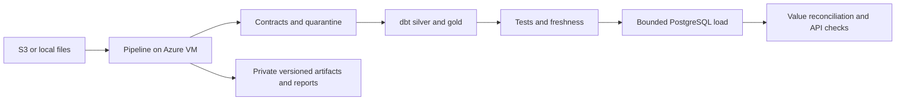

# Data engineering deployment on Azure

Run the existing Pandera, DuckDB, and dbt pipeline on an Ubuntu 24.04 VM, load a bounded customer slice
into private PostgreSQL, and publish versioned evidence to a private Blob container.

## Architecture



Compute belongs to `rg-data-engineering-test` in `westus2`: `vm-data-engineering-database`, its engineering-named network,
and private storage `stdataeng213c0ee90850`. The naming migration prepares protected copies of the existing
`vm-bank-database` and eastus2 storage before a separately approved VM replacement.
Both use subscription `32847dfa-5fd4-4276-8bdf-243d72b35119` and tenant
`4a5e7334-7901-444c-964b-3e6100209fd1`. The scripts refuse a different tenant, operator, or group
location. The existing `vm-bank-agent` application VM and Nequi resources are excluded from the template.

## Prepare a naming migration

```bash
uv run --frozen python deploy/data-engineering/migration.py prepare
```

Preparation creates private storage and closed networking, a private database backup, a checkpointed
snapshot, an engineering-named disk clone, and SHA-256-verified copies of all source artifacts. The source
VM remains available. The ignored migration manifest identifies exact source/destination resources.
Westus2 currently uses all four vCPU, including the source VM: replacement requires an explicitly approved
cutover. The original OS disk is retained with `deleteOption=Detach`. Do not delete it or snapshots until
recovery and reference values have been verified. See the ADR for the cutover sequence and boundaries.

## Rehearse recovery and approve replacement

Download the backup named by the private migration manifest into ignored operational storage, then
verify it before approving replacement:

```bash
uv run --frozen python deploy/data-engineering/restore_check.py \
  data/data-engineering/migration-database.dump data/data-engineering/migration.json \
  --output data/data-engineering/restore-verification.json
```

This checks the backup SHA-256, restores into an isolated disposable PostgreSQL container with no network
or published ports, and verifies schema, all five reference-table hashes/counts, application isolation,
and inspection grants. The proof is bound to the exact migration manifest.

Only after the operator explicitly approves the interruption and source VM deletion:

```bash
uv run --frozen python deploy/data-engineering/migration.py cutover --confirm-replace-source
```

The cutover verifies unchanged source references and disk retention, stops only the source data VM,
creates a final stopped-disk snapshot and clone, then replaces the VM resource. Original disk, snapshots,
source storage, and networking remain available for recovery. After boot, verify PostgreSQL and configure
DataGrip TLS for the new IP before retiring any source resources. The existing application VM is excluded.

## Deploy and execute

Prerequisites: authenticated Azure CLI, Git, Bash, Python 3, and `ssh-keygen` on the operator machine.
The operator needs deployment and role-assignment permissions. Use a committed revision: the release command
archives Git HEAD, so unrelated uncommitted changes and local credentials never enter the upload.

```bash
bash deploy/data-engineering/deploy.sh validate
bash deploy/data-engineering/deploy.sh provision
bash deploy/data-engineering/deploy.sh release
bash deploy/data-engineering/deploy.sh start sample
bash deploy/data-engineering/deploy.sh status
bash deploy/data-engineering/deploy.sh publish
```

`provision` uses `database.json` to create only the dedicated compute resources and grants its
managed identity contributor access to the engineering private `artifacts` container. If
`data/data-engineering/os-disk-id` exists, provision attaches that protected specialized disk instead of
creating an empty database disk. `provision-storage`
uses `storage.json` in the engineering resource group. That template contains only storage, its private
container, and the operator's storage role; it cannot create VM or network resources.

Repository naming uses `data-engineering`: this directory, local operational files in
`data/data-engineering`, deployment records, and the local branch. Azure resource names follow the engineering convention. The
VM root `/opt/la70-data`, systemd unit `la70-data-pipeline`, and Docker project/volume remain stable to
preserve the deployed database. Immutable older releases remain readable through an explicit Compose
path fallback. See [ADR 0041](../../docs/adr/0041-data-engineering-deployment-and-datagrip.md) for the
complete deployment, validation, and connection process.

The dedicated VM size is `Standard_B2as_v2` (2 vCPU, 8 GiB RAM), with a 128 GiB Standard SSD. Availability and
subscription quota must pass Azure preflight; this is not a claim of capacity reservation. The sample run
uses no hosted model. The B-series CPU is burstable; long batches can slow when credits are exhausted.
VM, disk, public IP, storage, and transactions have separate Azure charges. Artifact migration temporarily duplicates storage and transfers bytes between regions. The replacement
account and VM share westus2; original backups are retained until recovery is verified.

The Standard public IP supplies explicit outbound connectivity. By default, the network security group denies all
inbound traffic, including SSH, API, and PostgreSQL. Administration uses VM Run Command. The required SSH
public key is generated locally; its unused private key is immediately discarded. No public website is
published by this data deployment.

## DataGrip inspection

After a successful pipeline run, use the committed deployment helper to install inspection code,
configure TLS and read permissions, then allow the authorized source only after configuration succeeds:

```bash
bash deploy/data-engineering/deploy.sh datagrip 181.140.234.12
uv run --frozen python deploy/data-engineering/datagrip.py check
```

`datagrip` reads helper files from Git HEAD, so commit them before running it. The `check` command downloads
the public certificate and verifies the external PostgreSQL TLS handshake, certificate chain, and server
IP without asking for or changing a password. An existing inspection password survives reconfiguration.

The operator authorized direct TLS inspection of the data engineering database. During preparation,
the source endpoint remains on `vm-bank-database`; after replacement, obtain the new IP and certificate
with `datagrip.py check`. PostgreSQL is available at
`13.66.169.189:5432` only from `181.140.234.12/32`. The dedicated NSG allows this source at priority 110
and denies other inbound traffic at priority 200. Reapplying `provision` restores the closed template;
reapply the explicit inspection rule only after verifying TLS and the authorized source.

The operational `datagrip.py configure` helper installs a 90-day certificate with the server IP as its
subject alternative name, a persistent Compose override, and TLS-only SCRAM authentication for `bank_datagrip`.
The VM must be idle: configuration acquires the pipeline lock and briefly restarts PostgreSQL. Future
runner releases honor `/opt/la70-data/datagrip.compose.yml`. Older runner releases can restore the default
private binding. Renew the certificate before it expires and obtain the replacement public certificate
through Azure Run Command again.

From the repository root, choose your password locally:

```bash
uv run --frozen python deploy/data-engineering/datagrip.py password
```

This requires an interactive terminal, the authorized Azure account, and OpenSSL. Enter the same password
twice: 16 to 128 printable ASCII characters without spaces. Validation explains a mismatch or unsupported
format without displaying input. Input is hidden and is never written to a file
or sent to Azure. The helper derives a SCRAM verifier locally, encrypts it using the server certificate,
and sends only the ciphertext through Run Command. The server suppresses SQL statement logging before
installing the verifier. The role stays unable to log in until this command succeeds.

Create a PostgreSQL data source in DataGrip:

| Setting | Value |
|---|---|
| Host after cutover | `4.154.75.23` |
| Port | `5432` |
| Database | `bank_agent` |
| User | `bank_datagrip` |
| Password | The password chosen in your terminal |
| SSL mode | Full Verification (`verify-full`) |
| CA file | `data/data-engineering/datagrip/server.crt`, downloaded by the helper |

Enable SSL in the SSH/SSL tab, select the CA file, then run **Test Connection**. SSH is unnecessary.
See [DataGrip's SSL configuration](https://www.jetbrains.com/help/datagrip/configuring-ssh-and-ssl.html).
Select the `app` schema for introspection. The inspection role can read `customers`, `products`,
`transactions`, `historical_complaints`, `credit_profiles`, and `alembic_version`. Explicit SELECT policies
allow this role to inspect all loaded customer reference rows; application policies remain unchanged.
It has no write, schema-creation, ownership, superuser, or RLS-bypass privileges. Other application,
session, identity, and audit tables are excluded. Statements time out after 30 seconds.

```sql
SELECT count(*) FROM app.customers;
SELECT count(*) FROM app.products;
SELECT count(*) FROM app.transactions;
SELECT version_num FROM app.alembic_version;
```

The verified full-source pipeline loads a bounded application slice: 200 customers, 559 products,
6,119 transactions, and schema revision `0014`. This database is separate from the application VM.
A changed client public IP requires a deliberate update of both the NSG rule and the managed HBA block.

## Runtime and data sources

Run Command downloads a SHA-256-verified release through the VM managed identity, bootstraps dependencies,
and starts the inspectable `la70-data-pipeline` systemd unit. `status` reports its state and aggregate evidence;
it never prints authentication material or customer replies.

| Source | Preparation | Runtime command |
|---|---|---|
| `sample` | Included in the committed release, explicitly labeled as a bounded pseudonymized sample | `start sample` |
| `local` | `bash deploy/data-engineering/deploy.sh source data` publishes contracted local inputs privately and verifies the downloaded archive | `start local` |
| `s3` | Provision a protected `/opt/la70-data/s3.env` on the VM with organizer settings | `start s3` |

Never supply credentials through Run Command arguments, deployment parameters, shell output, or Git.
The operator must arrange protected provisioning of S3 settings separately. Local inputs are packaged
only from contracted table snapshots and dated CSV/Parquet partitions: ancillary directories, PDFs,
environment files, and generated warehouses are excluded. A source manifest records each path, byte
count, and SHA-256 plus the dataset version, business snapshot date, and code revision. The archive
is uploaded immutably under `sources/<sha256>.tar.gz` and downloaded for hash verification before its
reference is saved. This transfer works while VM provisioning is blocked.

`start local` downloads the selected archive with the VM managed identity. The locked pipeline verifies
the archive and every member before installing its input directory, then executes ingestion, build,
tests, and the normal PostgreSQL path. Extraction rejects unexpected members, links, duplicate paths,
traversal, missing files, and byte/hash mismatches. An existing input directory must match the complete
manifest and all file hashes; a different source is refused rather than silently replaced. This keeps
source refresh ownership explicit alongside the existing no-reseed rule.

No inputs are packaged from the operator's `.env`. Full PostgreSQL loading remains the separate batch-loader project
in [the loading guide](../../docs/data/local-postgres-mvp.md); this deployment selects up to 200 customers.
The committed sample contains fewer eligible customers than the full delivery.

Warehouses live under `/opt/la70-data/data/warehouse-<source>` and survive code releases. A nonblocking
file lock prevents concurrent writers. uv installs the frozen workspace with no learned-model extra.
DuckDB uses a 3 GB memory limit and two threads. Bootstrap generates mode-600 owner, API, and PostgreSQL
configuration files on the VM; the API receives no owner password. Tokens exist only in transfer-process
memory. Storage Shared Key authentication and anonymous blob access are disabled.

## Quality gates and safe reruns

The run stops on any failed stage: ingest, build, tests/freshness, quality/lineage reports, PostgreSQL startup,
migrations, seed, value reconciliation, application checks, and backup. The policy retrieval index is built
and verified against the policy pack before production services load it. Failed validation never starts
PostgreSQL or performs a seed.

The seed runs only when `app.customers` is empty. A subsequent execution retains all existing application
state and verifies it instead of automatically refreshing it. If gold changed, or a customer blocked a card,
strict verification can fail; it never restores a card status. Decide refresh ownership separately before
introducing continuous ingestion into an active database.

`bank-data verify-seed --check-values` compares every mapped reference value for customers, products,
transactions, historical complaints, and credit profiles, in addition to the existing ID, identity, staff,
schema-head, and demo-record checks. Money and dates are compared directly, without rounding or aggregation
across currencies. Errors report table and mismatch count, never row IDs or values. This stricter mode is
optional for existing callers and required by the Azure runner.

The API smoke uses the actual production composition root and the VM database through ASGI, with secure
cookie semantics. It exercises all four workflows in Spanish and Portuguese and requires cross-customer
access to return 404. It creates conversations and execution records, but performs no card blocks, dispute
writes, or credit intake. This does not validate public TLS, a browser, or a hosted language model.

## Artifacts and operation

Each run has its own directory under `/opt/la70-data/runs`, containing stage logs, quality and lineage,
gold serving files, the application-check summary, and a PostgreSQL custom-format backup. `result.json`
records the full Git revision, dataset version, business snapshot date, source, completion status, and
SHA-256 hashes. Publication writes a content-addressed archive and a run-specific result to private storage.
Logs, gold, and backups remain private; no raw transcript or environment file is added to these artifacts.
The quality and lineage reports also carry the release revision when generated outside a Git checkout.

Data is a static organizer snapshot. A recent execution timestamp does not imply current bank balances.
The sample lacks four full-delivery personas; the selected sample persona file still covers all workflows.
PostgreSQL uses the existing non-superuser owner, unprivileged application role, and forced RLS.
Backups require restore rehearsal before this environment is considered a durable production service.

To stop VM compute charges while preserving disks, use `az vm deallocate` for `vm-data-engineering-database` in `rg-data-engineering-test`.
Disks and the public IP continue to incur charges. Resource deletion is a separate explicit operator action.

## Verification

```bash
uv run --frozen pytest scripts/tests/unit/test_data_engineering*.py -q
uv run --frozen pytest data_platform/tests/integration/test_seed.py data_platform/tests/unit/test_seed_verify.py -q
bash -n deploy/data-engineering/deploy.sh deploy/data-engineering/bootstrap.sh deploy/data-engineering/run.sh
make check
```

The managed-identity transfer uses fixed Azure hosts and checks downloaded content before replacing a
previous release. Tests prove hash mismatch preservation, address rejection, infrastructure isolation,
execution metadata, and that failed dbt stages cannot reach PostgreSQL.

See [ADR 0039](../../docs/adr/0039-azure-vm-data-pipeline.md) and
[ADR 0040](../../docs/adr/0040-isolated-bank-database-vm.md), and
[execution status](../../docs/data/data-engineering-execution.md).
