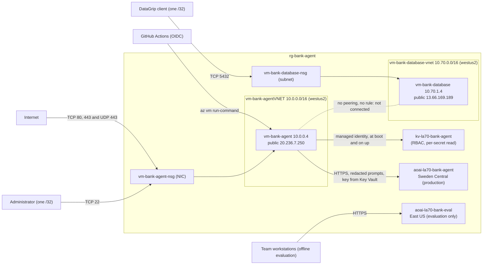

# Azure infrastructure: verified live topology

First verified 2026-10-05 03:17 UTC (2026-10-04 22:17 Colombia time) against commit `2ddabb0`, by read-only inspection: the Azure CLI (resource, network, and Key Vault metadata), the public health endpoints, the GitHub Actions run history, and one read-only `az vm run-command` script on `vm-bank-agent` (git revision, running containers, non-secret settings, and the byte size of each staged secret file, never its content).

Updated 2026-10-05 about 16:30 UTC for the model switch: the two Azure OpenAI accounts, their deployments and quotas, the Key Vault secrets, and the production model settings as recorded by the operator who applied them at about 15:30 UTC, plus the public `/health/details` endpoint read after the switch.

Updated 2026-10-05 at 20:28 UTC for the manual release of `e8f0d0c`. Verified then by read-only checks: `az vm list` and `az resource list` on `rg-bank-agent` (two VMs, `vm-bank-agent` and `vm-bank-database`; no development VM exists), `/health/details` (level L0, both models `ok`), `/grafana/api/health` (HTTP 200), and one read-only `az vm run-command` script (git revision and running containers). The release steps themselves (backup, env switches, Qdrant collection with 123 points, boot stager refresh) are as recorded by the operator who applied them at about 20:05 UTC.

**Label: observed state at one instant.** This page records what was running, not what the repository intends. The intended design is in [deploy/README.md](../deploy/README.md), [ADR 0019](adr/0019-single-host-compose-deployment.md), [ADR 0037](adr/0037-cloud-secret-management-with-azure-key-vault.md), [ADR 0038](adr/0038-continuous-deployment-to-azure-with-github-actions.md), [ADR 0040](adr/0040-isolated-bank-database-vm.md), and [ADR 0044](adr/0044-azure-openai-as-the-hosted-model-provider.md). Personal source addresses in firewall rules are masked.

## Summary

| Item | Observed |
|---|---|
| Public URL | `https://la-brasil-del-70.westus2.cloudapp.azure.com` (Azure DNS label on a static Standard public IP) |
| Resource group | `rg-bank-agent`, westus2 (the model accounts in it are in Sweden Central and East US) |
| Serving VM | `vm-bank-agent`, `Standard_B2as_v2` (2 vCPU, 8 GB), Ubuntu 24.04 LTS, system-assigned identity |
| Running commit | `e8f0d0c` (release PR 37), equal to `origin/main` at the 20:28 UTC check |
| Last release | Manual, 2026-10-05 about 20:05 UTC, through `az vm run-command` (images built on the VM, database backup first, smoke test passed), because a GitHub Actions incident cancelled the CI and CD runs for `e8f0d0c`. The previous automated release was the `deploy` run for `2ddabb0`, 2026-10-04 23:52 UTC |
| Health | `/health/live` live, `/health/ready` ready (database ok), `/health/details` level L0 |
| Language model | **Azure OpenAI since 2026-10-05, about 15:30 UTC** (env file change, no new release): `LLM_PROVIDER=litellm`, primary `azure/gpt-4.1-mini`, fallback `azure/gpt-4o`, `LLM_API_BASE` the `aoai-la70-bank-agent` endpoint. `/health/details` after the switch: `llm_primary`, `llm_fallback`, and `llm_budget` `ok`, `budget_used_ratio` 0.11 of the daily cap (0.16 at the 20:28 UTC check). The smoke test passed in es and pt |
| Model use | `WORKFLOW_LLM_UNDERSTANDING=true` (escalation signals and slot extraction), `WORKFLOW_LLM_PHRASING=false`, `WORKFLOW_LLM_HANDOFF_SUMMARY=false` (replies and handoff summaries stay template-based); `LLM_SESSION_TOKEN_LIMIT=200000`, `LLM_DAILY_BUDGET_USD=10` |
| Demo mode | On (`DEMO_MODE`, `ALLOW_PUBLIC_DEMO_MODE`, `VITE_DEMO_MODE` all `true`) |
| Telemetry | `OTEL_ENABLED=true`; the `obs` profile (collector, Jaeger, Prometheus, Grafana) runs on the VM. Grafana is served read-only at `/grafana/` through Caddy with anonymous Viewer access (`GRAFANA_ROUTE=on`, [ADR 0045](adr/0045-expose-grafana-read-only-under-grafana.md)); Jaeger stays on 127.0.0.1 (SSH tunnel). Langfuse export is on (`LANGFUSE_ENABLED=true`), metadata only |
| Router, resolver, risk estimator, retrieval | Baselines `keyword@1`, `rules@1`, `score_band@1`; retrieval `qdrant_hybrid` (`RETRIEVAL_RETRIEVER=qdrant_hybrid`, BM25 fallback), served by the `qdrant` service under the `rag` profile with a collection of 123 policy-clause points ([ADR 0047](adr/0047-qdrant-vector-index-for-knowledge-retrieval.md)) |
| Application database | The `postgres` service inside the compose project on `vm-bank-agent`, not `vm-bank-database` |

## Topology



Inside `vm-bank-agent`, the compose project `bank-agent-prod` runs the stack described in [deploy/README.md](../deploy/README.md): Caddy (`web`) is the only published service and proxies `/v1/*` and `/health/*` to `api` and `/grafana/` to the read-only Grafana; `api` reaches `postgres` and `qdrant` on the internal `backend` network and the model account over HTTPS through the `edge` network (the NSG has inbound rules only, so outbound HTTPS is open).

## Resources in `rg-bank-agent`

| Resource | Type | Notes |
|---|---|---|
| `vm-bank-agent` | Virtual machine | `Standard_B2as_v2`, running |
| `vm-bank-agentVMNic`, `vm-bank-agentPublicIP` | NIC, public IP | Static Standard IP `20.236.7.250`, DNS label `la-brasil-del-70` |
| `vm-bank-agentVNET` | Virtual network | `10.0.0.0/16`, one subnet `10.0.0.0/24`, no peering |
| `vm-bank-agent-nsg` | NSG | Attached to the NIC |
| `kv-la70-bank-agent` | Key Vault | Standard, RBAC authorization, soft delete on, purge protection off, public network access enabled |
| `aoai-la70-bank-agent` | Azure OpenAI account | Sweden Central; production model calls ([below](#model-accounts)) |
| `aoai-la70-bank-eval` | Azure OpenAI account | East US; offline evaluation and development only, never configured on the VM |
| `vm-bank-database` | Virtual machine | `Standard_B2as_v2`, running; the data platform host ([ADR 0040](adr/0040-isolated-bank-database-vm.md), [ADR 0041](adr/0041-data-engineering-deployment-and-datagrip.md)) |
| `vm-bank-database-nic`, `vm-bank-database-ip` | NIC, public IP | Static IP `13.66.169.189`, no DNS label |
| `vm-bank-database-vnet` | Virtual network | `10.70.0.0/16`, subnet `pipeline` `10.70.1.0/24`, no peering |
| `vm-bank-database-nsg` | NSG | Attached to the `pipeline` subnet |

## Model accounts

One Azure OpenAI account per environment ([ADR 0044](adr/0044-azure-openai-as-the-hosted-model-provider.md)), so evaluation runs never consume production quota or hold the production key.

| Account | Region | Deployment | Model version | Type | Tokens per minute | Used by |
|---|---|---|---|---|---|---|
| `aoai-la70-bank-agent` | Sweden Central | `gpt-4.1-mini` | 2025-04-14 | GlobalStandard | 60K | Production primary (`azure/gpt-4.1-mini`) |
| `aoai-la70-bank-agent` | Sweden Central | `gpt-4o` | 2024-11-20 | Standard (regional) | 50K | Production fallback, degradation level L1 (`azure/gpt-4o`) |
| `aoai-la70-bank-agent` | Sweden Central | `text-embedding-3-small` | | GlobalStandard | | Production retrieval embeddings for `qdrant_hybrid` (redacted informational questions only) |
| `aoai-la70-bank-eval` | East US | `gpt-4.1-mini` | 2025-04-14 | GlobalStandard | 140K | Offline evaluation and development |
| `aoai-la70-bank-eval` | East US | `text-embedding-3-small` | | GlobalStandard | | Offline retrieval experiments |

The subscription's `gpt-4.1-mini` GlobalStandard quota is 200K tokens per minute in total, split 60K for production and 140K for evaluation. The production `gpt-4o` deployment's 50K tokens per minute also serve as the live demo's fallback, so offline work does not use it. Prices (Azure Retail Prices API, read 2026-10-05, per million tokens): `gpt-4.1-mini` GlobalStandard 0.40 input and 1.60 output, `gpt-4o` 2024-11-20 regional Standard in Sweden Central 3.025 and 12.10, `text-embedding-3-small` GlobalStandard 0.02 input (`services/api/config/llm_prices.yaml`, unverified until a person confirms them).

## Network rules

`vm-bank-agent-nsg` (inbound; Azure defaults below priority 65000 are not listed):

| Priority | Name | Protocol | Source | Port | Access |
|---|---|---|---|---|---|
| 100 | `allow-ssh-admin` | TCP | one administrator /32 | 22 | Allow |
| 110 | `allow-http` | TCP | any | 80 | Allow |
| 120 | `allow-https` | TCP | any | 443 | Allow |
| 130 | `allow-http3` | UDP | any | 443 | Allow |

`vm-bank-database-nsg` (inbound):

| Priority | Name | Protocol | Source | Port | Access |
|---|---|---|---|---|---|
| 110 | `allow-datagrip-ip` | TCP | one client /32 | 5432 | Allow |
| 200 | `deny-all-inbound` | any | any | any | Deny |

The two virtual networks are not peered, and the database NSG denies everything except one client address on 5432. `vm-bank-agent` therefore cannot reach `vm-bank-database`, which matches the production compose file: the API uses its own `postgres` service. Switching the application to the database VM needs the private routing, TLS, and compose changes listed in [production-database-connection.md](data/production-database-connection.md). The database VM has no SSH rule; administration goes through `az vm run-command`.

## Serving VM state

At the first verification (03:17 UTC; not re-measured at 20:28 UTC):

| Measure | Value |
|---|---|
| Memory | 7,942 MB total, 5,878 MB available |
| Root disk | 38 GB, 25 GB used (65%) |
| Load average | 0.02 |

Running containers at the 20:28 UTC check (`docker ps` through a read-only `az vm run-command`; app images tagged `e8f0d0c4aa8f`, built on the VM for the manual release; memory limits as in `deploy/compose.prod.yml`, not re-measured):

| Container | Image | Status |
|---|---|---|
| `web` | `bank-agent-web:e8f0d0c4aa8f` | up 25 min, healthy |
| `api` | `bank-agent-api:e8f0d0c4aa8f` | up 25 min, healthy |
| `purge` | `bank-agent-job:e8f0d0c4aa8f` | up 25 min |
| `qdrant` (`rag` profile) | `qdrant/qdrant:v1.19.2-unprivileged` | up 26 min, healthy |
| `postgres` | `postgres:16.15-alpine3.24` (digest pinned) | up 27 h, healthy |
| `otel-collector` | `otel/opentelemetry-collector:0.161.0` | up 22 min |
| `jaeger` | `jaegertracing/jaeger:2.21.0` | up 27 h |
| `prometheus` | `prom/prometheus:v3.15.0` | up 26 min |
| `grafana` | `grafana/grafana:13.2.2` | up 26 min |

The web edge returns the documented SPA headers (strict CSP with a per-response style nonce, HSTS, `X-Content-Type-Options`, `Referrer-Policy: no-referrer`, `Permissions-Policy`, `X-Frame-Options: DENY`) and advertises HTTP/3.

## Release path

Continuous deployment is enabled (`DEPLOY_ENABLED=true`). A push to `main` that passes `ci` builds the images once on GitHub, pushes them to GHCR under the commit SHA, and releases them through `az vm run-command` after an OIDC sign-in ([ADR 0038](adr/0038-continuous-deployment-to-azure-with-github-actions.md)). Repository variables: `AZURE_RESOURCE_GROUP=rg-bank-agent`, `AZURE_VM_NAME=vm-bank-agent`, `VM_CHECKOUT=/home/azureuser/bank-agent`, `PUBLIC_URL` as above, `VITE_DEMO_MODE=true`.

Recent `deploy` runs on 2026-10-04 (UTC): `2ddabb0` success (23:52), `bef6956` success (21:13 and 20:51, manual), `69d805c` failure (19:50), `c3f7d8f` failure (19:15) after a manual success (18:53), `447879e` success (18:35). On 2026-10-05 a GitHub Actions incident cancelled the CI and CD runs for `e8f0d0c`; that release was applied by hand through `az vm run-command` (Summary above), and the CI rerun on `main` follows. A failed release restores the previous commit and tag. A release swaps images, not the server env file: the model settings survive releases and rollbacks, and an env change is reverted by hand ([ADR 0044](adr/0044-azure-openai-as-the-hosted-model-provider.md), "Changing the model").

## Secrets

- `SECRETS_SOURCE=keyvault`: `bank-agent-secrets.service` reads each secret at boot with the VM's managed identity, and `deploy/prod.sh up` reads them again, staging each as a mode 0400 file under the tmpfs `/run/bank-agent/secrets` ([ADR 0037](adr/0037-cloud-secret-management-with-azure-key-vault.md)).
- Key Vault secrets the application uses: `postgres-superuser-password`, `postgres-admin-password`, `postgres-app-password`, `session-secret`, `csrf-secret`, `grafana-admin-password`, `llm-api-key-primary` and `llm-api-key-fallback` (both keys of `aoai-la70-bank-agent`, set on 2026-10-05), and `langfuse-public-key` and `langfuse-secret-key` (a Langfuse Cloud US project, set on 2026-10-05). Each has a per-secret `Key Vault Secrets User` grant for the VM identity, so the grants do not appear in a role listing at the vault scope.
- Staged at the first verification: every generated secret non-empty, both model key files empty. Since the model switch the two model key files hold the keys (the API refuses to start in production with an empty key for a hosted model, and it reports both models `ok`). The release of `e8f0d0c` stages the Langfuse keys on its `up`, and the boot unit's copy of the stager was refreshed with it (`deploy/azure/install-vm.sh`).
- The evaluation account's key is not in Key Vault and never reaches the VM; it stays with the team member who runs offline evaluations.

## Other resource groups in the subscription

`rg-la70-test` holds the private artifact storage of the data pipeline, and `rg-data-engineering-test` holds unused preparatory resources of the engineering VM ([ADR 0042](adr/0042-preserve-azure-resource-names.md)). Every other resource group in the subscription is unrelated to this project.

## Findings

1. **The public demo serves a hosted model for understanding and retrieval embeddings only.** Escalation signals and slot extraction come from `azure/gpt-4.1-mini` (fallback `azure/gpt-4o`), and `text-embedding-3-small` embeds informational questions for retrieval; routing, decisions, actions, and every customer-facing sentence still come from the deterministic engine and its templates. Any text that says the demo runs without a model, or on a Gemini model, is out of date.
2. **One account serves the primary and the fallback.** The fallback covers one deployment's throttling or errors, not an outage of `aoai-la70-bank-agent` or of Sweden Central; the deterministic paths cover that case.
3. **Langfuse export is on, metadata only.** Since the release of `e8f0d0c`, `LANGFUSE_ENABLED=true`: one generation per model call with identifiers, model and prompt versions, tokens, cost, latency, and status, never prompts or message text ([deploy/README.md](../deploy/README.md), "Langfuse export").
4. **`vm-bank-database` is off the serving path.** It hosts the data platform and is reachable only from one client address on 5432.
5. **The Key Vault accepts public network traffic** and has purge protection off. Both are acceptable for a demo that ends on 2026-10-16; neither is a production posture.
6. **Headroom.** The root disk was at 65% and Grafana at 72% of its memory limit; image pulls on each release add to the disk.
7. **Leftovers.** `rg-data-engineering-test` keeps a disk, a snapshot, and a static IP with no VM, which bill until removed.

## Re-verify

```bash
az network public-ip list --query "[?dnsSettings.domainNameLabel=='la-brasil-del-70'].{ip:ipAddress, fqdn:dnsSettings.fqdn, rg:resourceGroup}" -o table
az vm list -d -g rg-bank-agent --query "[].{name:name, size:hardwareProfile.vmSize, power:powerState}" -o table
az network nsg rule list -g rg-bank-agent --nsg-name vm-bank-agent-nsg -o table
az cognitiveservices account deployment list -g rg-bank-agent -n aoai-la70-bank-agent --query "[].{name:name, model:properties.model.version, sku:sku.name, capacity:sku.capacity}" -o table
az cognitiveservices account deployment list -g rg-bank-agent -n aoai-la70-bank-eval --query "[].{name:name, model:properties.model.version, sku:sku.name, capacity:sku.capacity}" -o table
curl -s https://la-brasil-del-70.westus2.cloudapp.azure.com/health/details
gh run list --workflow deploy.yml -L 5
```

The running revision is checked on the VM with `git rev-parse HEAD` in `/home/azureuser/bank-agent` and `docker inspect -f '{{index .Config.Labels "org.opencontainers.image.revision"}}'` on each app container, through `az vm run-command invoke` (read-only commands only). A model check that touches no running container: `deploy/prod.sh llm-probe` on the VM.
