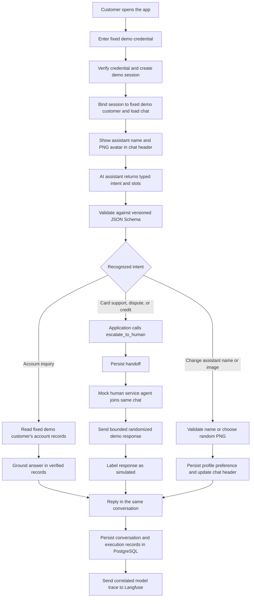
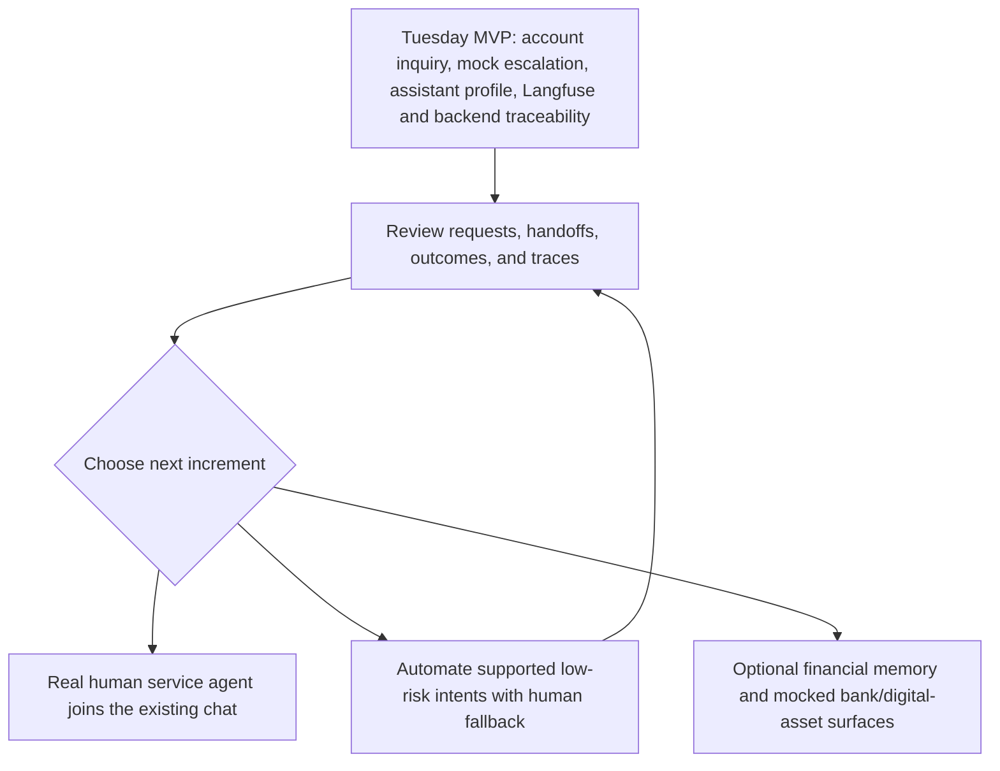

# 0025: Tuesday MVP includes account inquiry, mock escalation, and assistant profile

> **Status: Superseded.** The human chose to keep all four workflows in scope. The Tuesday, September 29 target was missed while work continued. The current internal MVP completion window ends Sunday, October 4, 2026; the official challenge-window end remains October 5. This record is preserved as the historical proposal and is not a completion claim. The assistant profile and an opt-in, metadata-only Langfuse exporter later landed independently in PRs 18 and 20; neither reinstates this release plan, and its mock human agent was not built.

- Status: superseded
- Date: 2026-09-27
- Target: Tuesday, 2026-09-29

## Context

The app needs a working customer interface, account-inquiry answers, a demonstrable escalation flow, and end-to-end model and backend observability. The hackathon dataset is synthetic and reflects the 2026-06-17 snapshot.

### Tuesday interaction flow

## Considered options

1. Keep the current shell and demonstrate workflows through scripts; this is not a customer-facing working product.
2. Build all four workflows or live human service chat by Tuesday; this risks leaving account inquiry and observability incomplete.
3. Automate account inquiry and use a tool-triggered mock human escalation for card support, disputes, and credit; this delivers a testable MVP while deferring the live agent connection.

## Decision: Tuesday MVP

- **Demo access:** Show a login page. Verify the fixed demo credential and create a session bound to one fixed demo customer and dataset. Users cannot select a customer or switch data by entering an ID.
- **Assistant profile:** Show the assistant's name and image in the chat header. The `change_assistant_name` tool validates and saves a requested name. The mock image service returns a random PNG from predefined assets; a user can request another, and the selected asset is saved to the demo profile. Changes persist across refreshes. No image-generation service is used.
- **Account inquiry:** Automate read-only balance, payment/transfer status, and supported statement-summary questions in Spanish and Portuguese. Clarify, abstain, or escalate when the data is ambiguous or insufficient. State the dataset's as-of date.
- **Card support, disputes, and credit:** Always call `escalate_to_human`; do not run self-service actions for these intents. Persist the handoff, have a mock human service agent join the same chat, and send a bounded randomized response. Clearly label the mock; do not imply a real person joined or investigated the issue.
- **Customer-service chats:** Give every chat a persisted conversation ID. Keep messages, tool calls, handoffs, mock joins, and replies in that chat. Permit multiple chats and limit the fixed demo customer to five new chats per rolling 60 minutes.
- **Other escalation conditions:** A direct request for a person, required policy review, unresolved ambiguity, missing evidence, or a tool/verification failure also hands off safely.

## Service contracts and traceability

- The model returns a typed intent and slots; application code validates them and calls services. The model cannot choose a customer, access credentials, or call infrastructure directly.
- Define versioned Pydantic request/response models and JSON Schemas for model boundaries and `escalate_to_human`, `change_assistant_name`, and `mock_assistant_image`. The server resolves customer and conversation IDs from the verified demo session. Validate every output; invalid results use bounded repair, then clarify, abstain, or hand off.
- Propagate one correlation/trace ID across the API request, backend services, workflow steps, service/tool calls, model attempts, and PostgreSQL execution records. Include conversation ID and call/tool IDs as linked identifiers so a customer turn can be followed across services.
- Store append-only model-call and execution records in PostgreSQL. Include provider and returned model ID, prompt ID/version, schema ID/version/hash, outcome, latency, token usage, known cost, and correlation IDs. Redact customer content; never store credentials or unnecessary raw personal data.
- Correlate name/image requests, service calls, and profile updates with the customer conversation, tool call, and backend trace IDs.

## Tuesday observability acceptance

- Emit structured, redacted backend logs and distributed traces; verify correlation IDs survive service and tool boundaries and link to the conversation and persisted records.
- Langfuse must be receiving and displaying actual model-generation traces by Tuesday. Verify this end to end in Langfuse; emitting a span alone is insufficient. Include model/provider, prompt and schema references, latency, usage, status, and the application correlation/call IDs.
- Keep PostgreSQL as the durable audit record and Langfuse as the model-observability view. Send only redacted, minimum diagnostic data to Langfuse. Telemetry failure must be surfaced and must not be reported as a successful export.
- Demonstrate login/session creation, name and PNG changes persisting in the chat header, all four intent paths, same-chat mock join, persisted execution records, backend correlation, and a visible Langfuse generation.

## After MVP

- Add an authenticated human-service inbox so a real human service agent can join and reply in the existing chat ([ADR 0026](0026-live-agent-joins-escalated-conversation.md)).
- Use observed requests and traces to automate selected low-risk intents incrementally; keep human escalation for ambiguity, risk, and failures.
- Add optional financial memory, tips, and planning ([ADR 0027](0027-opt-in-financial-memory-and-guidance.md)).
- Add mocked LATAM bank connectors and coming-soon crypto/xStocks surfaces ([ADR 0028](0028-mocked-multibank-and-digital-asset-surfaces.md)).
- Replace the fixed demo credential/profile with full customer identity and user-specific data access.

## Consequences

- Tuesday delivers account inquiry, a working customizable assistant profile, and clearly labeled mock human escalation for the other three workflows. A real human connection and further workflow automation remain later work.
- Backend correlation, PostgreSQL records, and Langfuse traces make model and service behavior reviewable across each customer turn.

## References

- [ADR 0020: Four workflows and the workflow registry](0020-four-workflows-and-the-workflow-registry.md)
- [ADR 0006: Handoff and execution record contracts](0006-handoff-and-execution-record-contracts.md)
- [ADR 0013: LiteLLM behind a port with composable decorators](0013-litellm-behind-a-port-and-composable-decorators.md)
- [Langfuse OpenTelemetry support and compatibility](https://langfuse.com/docs/compatibility)
- [Langfuse model usage and cost tracking](https://langfuse.com/docs/observability/features/token-and-cost-tracking)
- [Langfuse prompt-to-trace linking](https://langfuse.com/docs/prompt-management/features/link-to-traces)

## Product path after Tuesday

