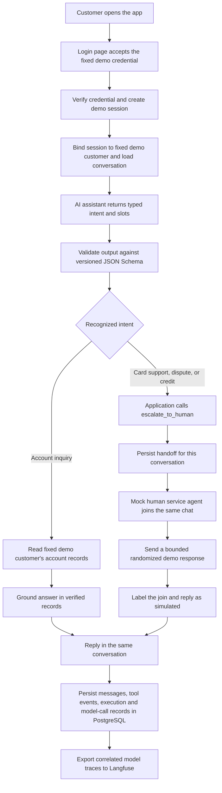
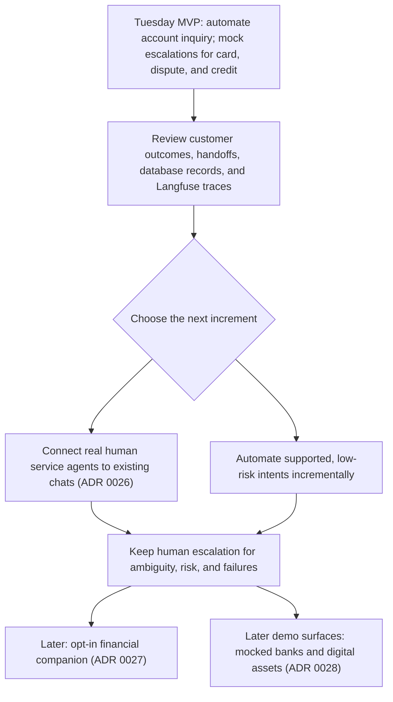

# 0025: Tuesday MVP is account inquiry plus tool-triggered mock human escalation

- Status: accepted
- Date: 2026-09-27
- Target: Tuesday, 2026-09-29

## Context

Terminology in this and the follow-up decisions: **AI assistant** is the model-driven chat experience; **human service agent** is a person who handles an escalated customer-service request; **mock human service agent** is a software simulation that appears in the chat and sends a randomized demo response, not a real person. Avoid using the bare word “agent” when either meaning could apply.

ADR 0020 defines the product scope: account inquiry, card support, dispute, and credit. Tuesday's release automates only verified account questions: balances, payment and transfer status, and supported statement summaries. When card-support, dispute, or credit is recognized, the AI assistant must call the escalation tool. The tool records the handoff and asks a mock human service agent to join that same conversation and send a randomized response from the bounded demo set. This mock join is part of Tuesday's working flow; connecting a real human service agent is a later increment. The team will use the working product and observed conversations to automate selected intents incrementally, keeping escalation available when policy, ambiguity, or risk requires it.

The current web app renders only the product name and the API exposes a health route. A working release needs a customer interface with a login page that verifies a fixed demo credential, a session bound to one fixed demo customer and dataset, a mocked human escalation, and end-to-end visibility into what the language model did. The domain has a persisted handoff lifecycle, but a handoff record alone is not a live customer-to-agent conversation. The project also has versioned prompts, Pydantic models that produce JSON Schema, LLM-call metadata, append-only PostgreSQL execution records, and a telemetry port. Tuesday's release must connect these pieces into a traceable product and export model traces to Langfuse.

This is a hackathon project using the organizer's synthetic data. Customer and product records represent the 2026-06-17 snapshot; customer-facing answers must say when the underlying data is as of.

### Tuesday interaction flow

The app presents a login page and accepts the fixed demo credential. A successful verification creates a demo session bound to the one fixed demo customer; the app does not support choosing a customer or entering an account/customer ID. The model supplies a validated intent; application code calls services and the escalation tool using the verified session's fixed customer and conversation context. The mock service agent and its randomized reply are visible in the existing conversation and clearly labeled as simulation.

## Considered options

1. **Keep the existing shell and demonstrate workflows through scripts.** Fastest, but it is not a working customer-facing product and cannot demonstrate escalation.
2. **Automate all four workflows or build live human service chat before Tuesday.** Matches the long-term scope, but risks leaving account inquiry and model observability incomplete.
3. **Automate account inquiry and route card, dispute, and credit requests through a mocked human escalation.** Delivers a usable, bounded release: the escalation tool records the handoff, a mock human service agent joins the same conversation, and the mock sends a randomized demo response. A real human service-agent connection remains a later increment.

## Decision

Choose option 3. Tuesday's release includes verified, read-only account inquiry and mocked human escalations for card-support, dispute, and credit requests. The four-workflow scope in [ADR 0020](0020-four-workflows-and-the-workflow-registry.md) remains in force; automation depth is staged. Account inquiry supports balance, payment/transfer status, and supported statement questions in Spanish and Portuguese, including clarification for ambiguity and escalation when records cannot support an answer. For recognized card-support, dispute, or credit intents, the AI assistant invokes the escalation tool instead of attempting self-service workflow actions. The tool records the handoff, adds a clearly identified mock human service agent to the same conversation, and emits a randomized response from the bounded demo set. The UI and records must identify this as a simulation and must not imply that a real person has joined.

### Mock human escalation acceptance bar

- The customer can request a human service agent or ask for card support, dispute, or credit help. For each of the three workflow categories, the AI assistant invokes the escalation tool; the tool records the handoff and causes a mock human service agent to join that chat and send a randomized response from a bounded demo set.
- The mock human service agent's join and message appear in the customer's AI-assistant conversation, with a clear simulation label. The response does not claim that a case was investigated, an action completed, or a real human service agent joined.
- The demo verifies end to end that each of the three routed workflow categories invokes the escalation tool, records a traceable handoff, shows the mock human service agent joining the same conversation, and produces a traceable randomized response. A handoff record without the mock join and visible response does not meet this Tuesday acceptance bar.
- Every chat has a unique, persisted conversation ID. Customer messages, tool calls, handoff events, mock-agent join events and replies, and execution records refer to that ID. Escalation stays in the same chat; it does not create a second chat or lose the existing history.
- The demo supports multiple chats over time. Apply a server-side rate limit of at most five new chats for the fixed demo customer in any rolling 60-minute window. Existing chats and messages do not consume the new-chat allowance. When limited, explain when the user can try again; do not discard existing chats.

### Next step: human service agent joins the chat

- Add an authenticated human service-agent inbox where a service agent can see pending handoffs and the permitted request summary and verified facts, then join the customer's existing AI-assistant conversation.
- Each customer chat retains its unique conversation ID when a handoff is created and when a human service agent joins. The handoff is attached to that chat, and both parties continue in the same thread.
- Customers may have multiple chat threads, each with its own ID, subject to the same server-side limit of five new chats per authenticated customer per rolling 60-minute window. Do not impose a one-active-chat-per-customer rule. The customer can start another chat when needed within the limit.
- Once joined, the human service agent and customer exchange messages in that same conversation. Persist messages and connection/lifecycle changes; support refresh/reconnect without silently losing the thread; show truthful queued, connected, and disconnected states.
- Once the request is resolved, close the human service-agent connection and mark that chat finalized. The customer may continue to read the finalized thread and start another chat, subject to the rate limit.
- Verify the real two-way path end to end for account-inquiry escalations and card-support, dispute, and credit handoffs. Do not present the simulated reply as proof that a human service agent joined.
- If no human service agent is available or the connection fails, preserve the handoff, show the truthful state, and give the customer a clear next step.

### Iteration after Tuesday

- Use observed account questions and human-handled conversations to select further automation candidates. Add workflow automation in increments, each with its own safe read/action boundary, clarification and failure behavior, and human fallback.
- Replace the single fixed demo credential and customer with production-grade identity verification before exposing user-specific data or supporting multiple customer profiles.
- Escalation remains available whenever the customer asks for a person, the intent is uncertain, required evidence is missing, policy requires review, or a tool or verification step fails. Automation may reduce unnecessary escalation only after its conditions are defined and checked; it must not conceal a required handoff.
- Explore opt-in financial memory and guidance, AI-assistant name customization, and pet-style AI-assistant images as later product increments under [ADR 0027](0027-opt-in-financial-companion-and-agent-personalization.md). These features are not part of Tuesday's release.
- Explore mock multi-bank import/export connectors and future crypto/xStocks navigation surfaces under [ADR 0028](0028-mocked-multibank-and-digital-asset-surfaces.md). These are roadmap/demo features, not Tuesday functionality.

### LLM-to-service contract

- The model does not call services, choose a customer record, or receive service credentials. It returns a typed intent and the minimum slots needed for the account-inquiry workflow.
- Define versioned request and response models for each LLM-to-application boundary. Generate their JSON Schemas from the Pydantic models and validate every model output before application code uses it. Schemas reject undeclared fields; invalid output follows a bounded repair attempt and then deterministic clarify, abstain, or handoff behavior.
- Successful demo-session verification binds the session server-side to the fixed demo customer. Backend code applies the allowlisted intent and validated slots to that customer's read tools, then grounds the answer in returned records. The model and user input cannot select a different customer or assert an action or fact absent from the records.

### Escalation tool contract

- For recognized `card_support`, `dispute`, or `credit` requests, application code invokes the `escalate_to_human` tool. The model cannot call infrastructure directly, choose the customer identity, or bypass the validated intent and server-side conversation context.
- Define the tool request and response with versioned Pydantic models and publish their JSON Schemas. The request contains the application-selected conversation ID, one of the three workflow enums, and a bounded handoff reason. The customer ID is resolved from the verified demo session to the fixed demo profile, not from model or user input.
- The tool creates and persists a handoff, then emits a mock-human-joined event and a message from the `mock_human_service_agent` sender role in the same conversation. The response contains the handoff ID, mock join/message IDs, and a bounded randomized reply. It is marked as simulated in the payload and customer UI.
- Persist and trace the validated tool request, schema/version, tool outcome, handoff, mock join event, and reply against the conversation ID. Tool errors follow the documented safe failure path; they must not be shown as a successful human connection.

### Model and call records

- Pin one explicit provider and model identifier for the Tuesday build, using an immutable model version/snapshot when the provider exposes one. Do not rely on a moving `latest` alias. Record both the configured request model and the model identifier returned by the provider.
- Prompts remain version controlled in the repository and every call records the exact `prompt_id@version`. Every structured call also records a schema identifier, schema version, and schema hash, so a stored result can be tied to the precise contract that validated it.
- Persist an append-only call record in PostgreSQL for every model attempt, including failed, repaired, retried, and fallback calls. Record provider, requested and returned model IDs, prompt reference, schema reference/hash, outcome/error code, input/output token counts, latency, known cost, and trace/correlation IDs. Link the records to the customer turn's execution record. Do not store provider credentials or unredacted raw customer text in these records.

### Logs, tracing, and Langfuse

- Emit structured, redacted application logs and a distributed trace for each customer turn. Correlate API request, workflow stages, service/tool reads, model attempts, validation, and the persisted execution/call records.
- Export LLM generation traces to Langfuse using its supported OpenTelemetry ingestion path. Include the model/provider, exact prompt and schema references, latency, usage, known cost, status/error, and the application trace/call IDs. Keep the append-only PostgreSQL execution record as the system's audit record; Langfuse is the model-observability view, not the only store.
- Langfuse may receive only the already-redacted, minimum information needed for debugging. Do not send names, document numbers, contact details, full account/product numbers, or raw customer records. Capture a sanitized structured input/output only when it is needed to inspect model behavior and has passed the redaction boundary; otherwise store metadata and references without content.
- Keep prompt text as the version-controlled source for Tuesday. Attach its exact repository prompt reference and version to Langfuse observations. If prompt-version comparisons are needed inside Langfuse, explicitly link/import those prompt versions; a metadata string alone identifies the version but does not create Langfuse-managed prompt linkage.
- Telemetry failures must not prevent account service. The app may continue with a safe deterministic response, but it must surface that observability export failed and must not claim that a call is visible in Langfuse until confirmed.

### Customer-facing acceptance bar

- The app shows a login page. A fixed demo credential must be verified before creating a demo session, and that session is always bound to the same fixed demo customer and synthetic records. Users cannot choose another customer or switch records by entering an ID. Production-grade identity verification and access to multiple customer profiles remain future work.
- Balance answers include currency and the data as-of date: 2026-06-17 (end of business day; serving instant 2026-06-18T05:59:59Z). Status answers identify the relevant transaction and its recorded date/status.
- Transfers and adjustments remain unclassified in statement totals when the data does not encode direction. Missing or ambiguous data leads to a question, abstention, or handoff instead of a guessed answer.
- The interface explains that the data is synthetic and part of the hackathon demonstration.
- A demo can show the resulting call record in PostgreSQL and its correlated model trace in Langfuse, including exact model and prompt versions and the JSON Schema version/hash.

“Working by Tuesday” means a customer can complete account questions with the AI assistant and, for card-support, dispute, or credit, see `escalate_to_human` record a handoff and a clearly labeled mock human service agent join the same chat and send a randomized demo response. The later human-service-chat increment means an authenticated real human service agent can join and exchange messages in the customer's same conversation. Both customer-service interactions and model calls can be inspected through persisted records and correlated traces below.

## Consequences

- Tuesday delivers account inquiry through the AI assistant and tool-triggered, same-chat mock human escalation for the other three. The broader ADR 0020 scope is retained for later automation increments; connecting a real human service agent is a separate next step.
- The model identifier, prompt version, and output schema become reproducibility data, not informal deployment details. A change to any of them can be traced to the calls and answers it produced.
- PostgreSQL provides durable, append-only audit records; Langfuse provides searchable LLM traces and usage/latency analysis. This avoids making an external observability service the only source of evidence.
- Langfuse's OpenTelemetry ingestion is supported, and it can capture generation model, usage, cost, and prompt-version information. Prompt-level version comparisons require linking the local prompt version to a Langfuse prompt object; the Tuesday implementation should preserve local prompt files as the source of truth and record the reference either way.
- The tracing path must be exercised end to end: emitting a span alone is not proof that Langfuse received or rendered it as a model generation.
- The mock human service agent demonstrates the escalation flow but is not a real human-in-the-loop operating path. The authenticated human service-agent inbox, real agents joining existing customer conversations, and persistent two-way messaging are explicit follow-up requirements; see [ADR 0026](0026-live-agent-joins-escalated-conversation.md).
- Human-handled conversations provide operational evidence for deciding which additional intents are safe and valuable to automate later; they do not by themselves establish that an intent is automatable.

## References

- [ADR 0020: Four workflows and the workflow registry](0020-four-workflows-and-the-workflow-registry.md)
- [ADR 0006: Handoff and execution record contracts](0006-handoff-and-execution-record-contracts.md)
- [ADR 0013: LiteLLM behind a port with composable decorators](0013-litellm-behind-a-port-with-composable-decorators.md)
- [Langfuse OpenTelemetry support and compatibility](https://langfuse.com/docs/compatibility)
- [Langfuse model usage and cost tracking](https://langfuse.com/docs/observability/features/token-and-cost-tracking)
- [Langfuse prompt-to-trace linking](https://langfuse.com/docs/prompt-management/features/link-to-traces)

## Product path after Tuesday

