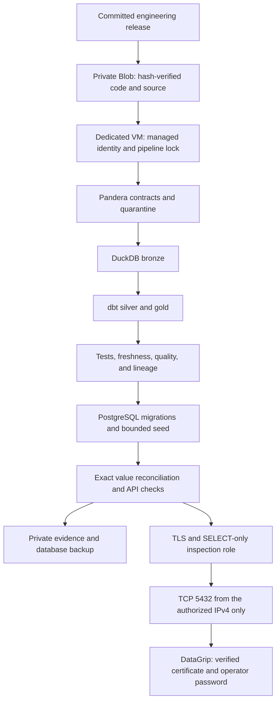

# ADR 0041: data engineering deployment, validation, and DataGrip access

- Status: Accepted; Azure naming replacement superseded
- Date: 2026-10-04
- Decision makers: Julian Valencia
- Superseded by: [ADR 0042](0042-preserve-azure-resource-names.md), Azure naming replacement only
- Supersedes: [ADR 0040](0040-isolated-bank-database-vm.md), resource naming, artifact placement, and PostgreSQL inspection ingress

## Context

The operator requested a complete data engineering environment in Azure, a dedicated `vm-bank-database`,
username/password inspection through DataGrip, consistent repository names, and a record explaining the
process from deployment through testing and connection. Quality takes precedence over loading more rows.
The application VM and unrelated workloads in the subscription must be preserved. Passwords and tokens must never appear in chat or logs.

The source compute is `vm-bank-database` in `rg-bank-agent`, `westus2`: two vCPU, 8 GiB RAM, and a
128 GiB SSD. Source artifact storage is `stla70238253ae46a02964` in `rg-la70-test`, `eastus2`. The operator
also authorized engineering names for Azure resources; the target is isolated in `rg-data-engineering-test`. Eastus2's regional CPU quota is
already allocated; this is a regional allocation limit, not a four-vCPU limit on database operation.
The region and isolation trade-offs are recorded in [ADR 0040](0040-isolated-bank-database-vm.md).

The serving schema is defined by application Alembic migrations and the existing seed mapping, rather
than copying source CSV columns directly into PostgreSQL. The current schema revision is `0014`.
The source is a static organizer snapshot with business date `2026-06-17`.

## Considered options

1. **Run the existing validated Python/dbt pipeline on the dedicated VM.** Reuses Pandera contracts,
   transformations, reconciliation, and application tests. Fits existing quota and isolates workloads.
   Requires VM maintenance, disk management, certificate renewal, and backup restore rehearsal.
2. **Introduce Data Factory and managed PostgreSQL.** Adds managed scheduling and database operations,
   but requires adapting the current Python/DuckDB jobs, new networking and roles, and additional costs.
   It does not remove the need for source contracts, reconciliation, or application-schema compatibility.
3. **Use the existing application VM.** Reuses resources, but couples transformations and inspection
   to another operator's application, CPU, database, and deployment lifecycle.

For inspection, an SSH tunnel would preserve loopback-only PostgreSQL but requires a separate SSH
identity and ingress. A VPN would preserve private routing but adds client setup and gateway cost.
Direct TLS with one authorized client IPv4 matches the requested database username/password workflow.

## Decision

Keep the dedicated VM pipeline and explicit TLS inspection from `181.140.234.12/32` only.
Migrate active engineering resources to the naming convention below while preserving database contents
and the operator's inspection password.
Use `data-engineering` for the deployment directory, tests, local operational state, deployment records,
and local branch. Use the same convention for owned Azure resources; keep the internal persisted database-storage
identifiers stable.
The VM root `/opt/la70-data`, systemd unit `la70-data-pipeline`, Docker project `la70-data`, and its
PostgreSQL volume remain unchanged. Renaming these without migrating persisted state could start an
empty database. Older immutable releases remain readable through a Compose-path fallback.

### Azure names and controlled migration

| Resource | Target name |
|---|---|
| Resource group | `rg-data-engineering-test` |
| VM | `vm-data-engineering-database` |
| OS disk | `disk-data-engineering-database-os` |
| Snapshot | `snap-data-engineering-database-20261004` |
| NSG | `nsg-data-engineering-database` |
| VNet | `vnet-data-engineering` |
| NIC | `nic-data-engineering-database` |
| Public IP resource | `pip-data-engineering-database` |
| Private storage account | `stdataeng213c0ee90850` |

Compute and replacement storage are in westus2, reducing future cross-region transfer. Existing bank
application resources and unrelated workloads are excluded. Azure resource names cannot be changed in place; a new
resource group, storage account, network, disk, and VM are required. Westus2 has all four regional and
B-series vCPU allocated. Deallocation still counts toward quota, so the source VM resource must be
replaced before the new two-vCPU VM can start. See [Azure vCPU quotas](https://learn.microsoft.com/en-us/azure/virtual-machines/quotas).

```bash
uv run --frozen python deploy/data-engineering/migration.py prepare
```

Preparation creates private destination storage and closed networking without creating a VM. It makes
a private database backup, records reference-table counts and hashes, checkpoints PostgreSQL, retains
the source OS disk with `deleteOption=Detach`, and creates a snapshot and an engineering-named disk clone.
It downloads every source artifact, uploads without overwriting existing destination objects, downloads
the destination again, and compares SHA-256 and the source ETag. Copies and transfer files are ignored;
no credential is printed. The source VM and current DataGrip endpoint remain available during preparation.

VM replacement is a distinct, explicitly approved cutover because it deletes the old VM resource and
interrupts its connection. Final protection requires a stopped-source snapshot, a succeeded disk clone,
and a verified database backup before deleting the source VM. Attach the specialized disk to the new
VM, assign its managed identity access only to the new private artifact container, and verify schema,
all reference-table values, inspection login privileges, and application RLS before retiring old resources.
Keep the original disk and snapshots until recovery has been verified. The public IP and certificate can
change; obtain the new certificate with `datagrip.py check` and update DataGrip. The password remains intact.

The preparation manifest records each artifact hash and the exact source/destination resource IDs.
Prepared snapshots and a copied backup alone do not prove that VM replacement or restore succeeded;
the execution evidence must record the subsequent boot, PostgreSQL, and connection checks.

Recovery rehearsal and approved replacement use separate commands:

```bash
uv run --frozen python deploy/data-engineering/restore_check.py \
  data/data-engineering/migration-database.dump data/data-engineering/migration.json \
  --output data/data-engineering/restore-verification.json
# Run only after explicit approval of the source VM deletion and connection interruption.
uv run --frozen python deploy/data-engineering/migration.py cutover --confirm-replace-source
```

The restore checks the backup SHA-256 before starting a network-isolated disposable PostgreSQL container.
It proves schema, all five reference-table hashes/counts, application isolation, and inspection grants.
The cutover requires a successful proof bound to the exact manifest and rechecks current source values.
It never deletes the original OS disk or either protected snapshot.

### Process and boundaries



Each stage must succeed before the next write stage runs. Failed source or transformation validation
never starts PostgreSQL or seeds data. The pipeline lock rejects concurrent executions; inspection
configuration takes the same lock and briefly restarts PostgreSQL while idle.

### 1. Identity, infrastructure, and release

The operator logs in interactively to tenant `4a5e7334-7901-444c-964b-3e6100209fd1` and selects subscription
`32847dfa-5fd4-4276-8bdf-243d72b35119`. The deployment script verifies that tenant, the operator account,
and both resource-group locations. It targets only the dedicated VM, its network, and artifact storage.

```bash
bash deploy/data-engineering/deploy.sh validate
bash deploy/data-engineering/deploy.sh provision
bash deploy/data-engineering/deploy.sh release
```

`database.json` declares only `vm-data-engineering-database` and its dedicated network, with denied ingress by default.
`storage.json` contains only storage, its private container, and the operator's storage role; it cannot
create compute. The VM identity receives Blob contributor rights at the existing artifact-container scope.
Storage disables Shared Key and anonymous access. No subscription offer or other workload is changed.

`release` archives Git HEAD, hashes the archive, and uploads it immutably. Uncommitted files and local
credentials are excluded. Local deployment state lives in ignored `data/data-engineering`.

### 2. Source transfer and transformation

```bash
bash deploy/data-engineering/deploy.sh source data
bash deploy/data-engineering/deploy.sh start local
bash deploy/data-engineering/deploy.sh status
```

`source` packages only contracted CSV/Parquet snapshots and partitions. PDFs, environment files,
warehouses, and ancillary directories are excluded. A manifest records each member's SHA-256 and bytes,
plus the dataset version, business date, and code revision. The private upload is downloaded and verified.

VM Run Command supplies reviewed code without a token or password. The VM downloads through managed
identity, verifies archive and member hashes, and refuses traversal, unexpected members, changed inputs,
and incomplete extraction. Bootstrap installs frozen dependencies and creates protected credentials only
on the VM when absent. It then starts the independently inspectable systemd pipeline unit.

The runner executes ingestion contracts, bronze/silver/gold transformations, dbt tests and freshness,
quality and lineage reports, and the policy retrieval index. DuckDB uses two threads and a 3 GB memory
limit. Contract-invalid rows remain quarantined and counted; warnings are retained as evidence.

### 3. Application schema, load, and retained state

Only after transformation validation does the runner start PostgreSQL, apply forward Alembic migrations,
and seed the application tables through the existing mapping. The owner performs migration/loading;
the API receives only the unprivileged application credentials. Customer tables retain forced RLS.

The current loader selects at most 200 customers and associated products, transactions, complaints,
and credit profiles. The full source has been transformed in Azure; that does not imply a complete
PostgreSQL load. A staging/COPY loader with checkpoints and refresh ownership remains a separate project.

Seeding occurs only when `app.customers` is empty. A rerun retains cards, cases, and other application state.
Strict reconciliation compares every mapped value, including money and dates. If source gold or
application-owned values differ, the run fails rather than overwriting live state.

### 4. Tests, evidence, and backup

The runner requires exact value reconciliation and eight API checks: four workflows in Spanish and
Portuguese using the real composition root and the fake language-model provider. Cross-customer access
must return 404. The API smoke avoids card blocks, dispute creation, and credit intake.

```bash
bash deploy/data-engineering/deploy.sh publish
uv run --frozen pytest scripts/tests/unit/test_data_engineering*.py -q
uv run --frozen pytest services/api/tests/integration/test_data_engineering_database_access.py -q
make check
```

`publish` packages stage results, quality/lineage, gold outputs, hashes, API evidence, and a PostgreSQL
custom-format backup in private Blob storage. Tokens and environment files are excluded. A completed
run is proved by its status and evidence, not by the successful submission of a Run Command request.
Repository checks include lint, typing, real PostgreSQL tests, coverage, web, docs, and secret checks.

Verified full-source runs loaded 23,471,159 valid rows from 7,671 objects and quarantined 24,029 transcripts
with missing duration. The five gold outputs total 5,192,103 rows. PostgreSQL reconciliation verified
200 customers, 559 products, and 6,119 transactions. The retained-state rerun reloaded no source objects
and preserved matching gold and serving values. Detailed hashes and run identifiers are maintained in
[the execution evidence](../data/data-engineering-execution.md).

### 5. DataGrip provisioning and password

```bash
bash deploy/data-engineering/deploy.sh datagrip 181.140.234.12
uv run --frozen python deploy/data-engineering/datagrip.py check
uv run --frozen python deploy/data-engineering/datagrip.py password
```

`datagrip` installs committed helper code, enables server TLS, and creates `bank_datagrip` with SELECT
on the five customer reference tables and the Alembic revision. Role-specific SELECT policies permit
inspection of all loaded reference rows without changing application isolation. No identity, session,
audit, dispute, or credit-intake access is granted. The role owns nothing and has no write, schema-creation,
superuser, or RLS-bypass privileges. Limit connections to five, statements to 30 seconds, and idle
transactions to two minutes. An existing inspection password survives reconfiguration.

Only verified TLS configuration permits the helper to install NSG priority 110 for TCP 5432 from the
client `/32`; priority 200 denies remaining ingress. HBA requires TLS and SCRAM for the inspection role,
rejects its other sources and plaintext connections, and rejects other database users from that client.
The Compose override survives future runner releases; base infrastructure provisioning restores closed
network defaults. Source-IP changes require deliberate reconfiguration of both HBA and the NSG rule.

`check` downloads the public certificate through authenticated Azure administration and verifies the
external PostgreSQL TLS handshake, chain, and server IP without a password. The certificate has the
server IP as a subject alternative name and expires after 90 days.

The password command requires an interactive terminal and hidden repeated input: 16 to 128 printable
ASCII characters without spaces. It derives a salted SCRAM-SHA-256 verifier locally, encrypts it with
the server public key using RSA-OAEP-SHA256, and sends only ciphertext through Run Command. The VM decrypts
in memory and installs the verifier with SQL statement/error logging suppressed. Plaintext is neither
written to disk nor sent to Azure. Initially the role has NOLOGIN; successful password setup enables login.
Validation explains a mismatch or unsupported format without displaying input.

### 6. DataGrip connection and query

Create a PostgreSQL data source with these settings:

| Setting | Value |
|---|---|
| Host after cutover | `4.154.75.23` |
| Port | `5432` |
| Database | `bank_agent` |
| User | `bank_datagrip` |
| Password | Chosen locally through the hidden prompt |
| SSH/SSL | Use SSL; Full Verification (`verify-full`) |
| CA file | `data/data-engineering/datagrip/server.crt` |
| Schemas | `app` |

The source endpoint `13.66.169.189` remains active until the approved cutover; the table shows the
prepared destination IP. Client certificate and client key are unnecessary: authentication uses the database password. Click
**Test Connection**, select `app` for introspection, and open a query console. See the
[DataGrip SSL guide](https://www.jetbrains.com/help/datagrip/configuring-ssh-and-ssl.html).

```sql
SELECT count(*) FROM app.customers;     -- 200
SELECT count(*) FROM app.products;      -- 559
SELECT count(*) FROM app.transactions;  -- 6119
SELECT version_num FROM app.alembic_version; -- 0014
```

## Consequences

- Existing validated transformations, schema mapping, tests, and evidence remain the source of truth.
  Repository naming becomes consistent while persisted Azure identifiers remain stable.
- The authorized operator can query the bounded serving slice directly. Application customer isolation
  remains enforced and tested; the existing application VM keeps its own database and deployment.
- B-series CPU can slow sustained batches after credits are depleted. Cross-region Blob transfer, VM,
  disk, storage, and public-IP costs remain. Managed orchestration and a managed database are deferred.
- OS maintenance, certificate renewal, client-IP changes, inspection-rule closure, and backup restore
  rehearsal remain operational responsibilities. A backup alone does not prove restore readiness.
