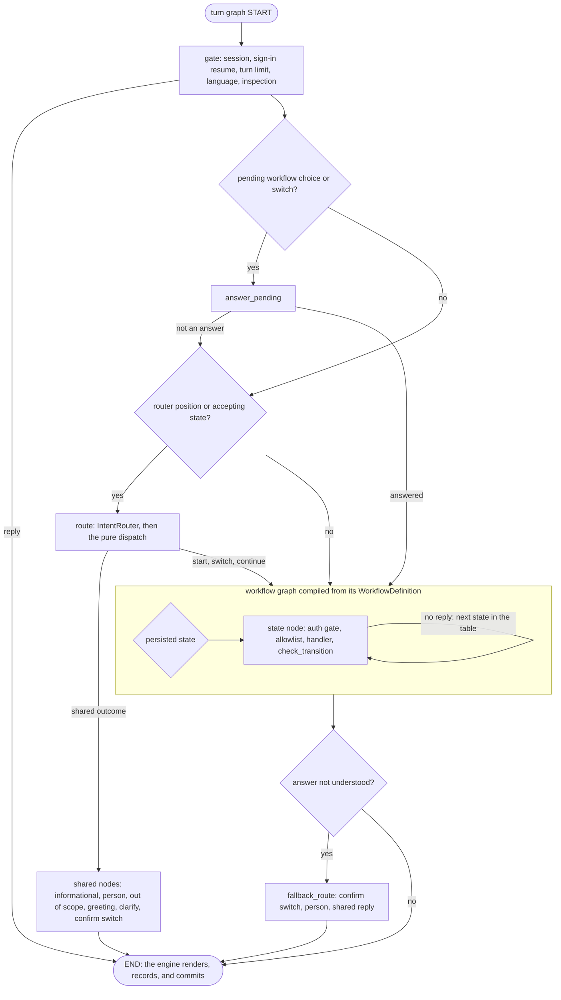

# 0043: A staged migration of the workflow engine to LangGraph StateGraph after the hackathon

- Status: proposed
- Date: 2026-10-05
- Scope: post-hackathon roadmap. On 2026-10-05 the team decided not to migrate the runtime to LangChain or LangGraph before the submission deadline: the submitted system runs on the explicit state machine, and this record authorizes no runtime change, setting, or dependency during the event. [ADR 0014](0014-explicit-state-machine-over-an-agent-framework.md) stays in force until phase 4 below passes its gate.
- Replaces: the unmerged dispute-only proposal of pull request 23, numbered 0037 on its branch (`main` assigns 0037 to [Key Vault](0037-cloud-secret-management-with-azure-key-vault.md)). Its bounded-specialist design becomes phase 5 here.

## Context

Each workflow is data ([ADR 0014](0014-explicit-state-machine-over-an-agent-framework.md)): `WorkflowDefinition` and `StateSpec` in `services/api/src/bank_agent/application/engine/definition.py`, where `build_definition` adds the shared exits (ESCALATED, ABSTAINED, REFUSED, AUTH_REQUIRED) to every non-terminal state and lets AUTH_REQUIRED resume to any open state. One registry of definitions runs on one generic engine ([ADR 0024](0024-workflow-registry-with-router-dispatch.md)). The four proposed definitions hold 60 states and 356 table edges (account_inquiry 14 and 82, card_support 13 and 75, dispute 16 and 94, credit 17 and 105); baseline B0 holds 50 states and 279 edges.

`WorkflowEngine.process_turn` (`application/engine/engine.py`) replays a known turn id, loads the conversation, runs the session gate, the turn limit, language resolution, and the untrusted-content inspection, then calls `route_and_run` (`application/engine/flow.py`): pending answers, router dispatch, and `run_handlers`, the loop that runs one handler per state until a handler returns a reply, bounded by `EngineSettings.max_steps` (12). Rendering with the grounding verifier, the execution record, and one unit of work (the conversation under optimistic concurrency, the turn, the handoff, the record) close the turn. Cross-turn state is `WorkflowPosition` (`data["engine"]` and `data["flow"]`) on the conversation row, under forced row-level security.

ADR 0014 left one door open: "LangGraph remains a possible future adapter: a definition could be compiled into a graph without changing the handlers, the kernel, or the contracts." This record turns that sentence into a staged plan, for two reasons:

- Planned capabilities map onto graph features: pause and resume around a human decision (the live agent of [ADR 0026](0026-live-agent-joins-escalated-conversation.md), credit intake review), progress streaming to the chat, and bounded specialist nodes for disputes (pull request 23).
- A standard runtime with graph rendering is easier for reviewers and new contributors to read than a bespoke loop. The parts that carry the safety case (the kernel, the guarded tools, the write and read-back steps, the records) stay ours.

ADR 0014's three objections still hold and shape this plan: the dependency is sizable, a checkpointer would duplicate the unit of work, idempotency, and execution-record contracts, and conditional edges are easy to hand to a model.

### Design rules

These rules bound any graph runtime for this engine. Each one keeps a decision in deterministic code.

- **Closed routes.** Edges read only `Step.next_state`, which handlers compute from kernel decisions and validated slots, and each conditional edge's path map is generated from the transition table. No model output names an edge, a state, or a tool, so a model cannot route around a required check.
- **Code-enforced breakers.** The step counter (12, as `max_steps`) in the graph state is the primary breaker, checked on the conditional edge; every invocation also passes an explicit `recursion_limit` as a backstop, and `GraphRecursionError` becomes the existing `handler_step_limit` handoff. The framework's default limit is not a bound (see the facts below).
- **Identity outside the graph state.** The session's customer, the guarded tools, and every customer-scoped value live in the runtime context, never in the serializable graph state, so no checkpoint, stream, or trace can carry them.
- **Deterministic routing first.** Routing stays the pure `dispatch` function. Model-routed specialists are optional (phase 5) and must pass a pre-registered cost and latency gate (F).
- **No framework telemetry.** No LangChain callback or chat model: framework tracing callbacks can export prompt and completion content without the gateway's redaction. Telemetry stays OpenTelemetry plus the metadata-only Langfuse exporter, and LangSmith tracing is refused at startup.
- **Parity on real backends.** Gates B and C run the same suites on the memory and PostgreSQL backends and compare execution records field by field against the explicit engine. The execution record, built after the graph returns, stays the only audit artifact.

Facts read on 2026-10-05 from an installation of the published packages outside this repository (Python 3.12, Linux); the API image itself is measured again in phase 2:

| Fact | Value |
|---|---|
| Release examined | `langgraph` 1.2.12 with `langgraph-checkpoint` 4.2.0, `langgraph-prebuilt` 1.1.0, `langgraph-sdk` 0.4.5, `langchain-core` 1.6.6, and `langsmith` 0.14.2, all MIT |
| New packages for `uv.lock` | 17, none present today (also `langchain-protocol`, `httpx2`, `jsonpatch`, `jsonpointer`, `tenacity`, `orjson`, `uuid-utils`, `xxhash`, `zstandard`, `requests-toolbelt`, `ormsgpack`) |
| Installed size of those 17 | about 45 MB (`zstandard` 23 MB, `langsmith` 7.6 MB, `langchain-core` 4.8 MB, `langgraph` 3.1 MB), close to the 50 MB line of CLAUDE.md rule 10 |
| Licenses of the other 11 | BSD (`httpx2`, `jsonpatch`, `jsonpointer`, `uuid-utils`, `xxhash`, `zstandard`), Apache-2.0 (`tenacity`, `requests-toolbelt`), Apache-2.0 or MIT (`ormsgpack`), MIT (`langchain-protocol`), and `orjson` under MPL-2.0 AND (Apache-2.0 OR MIT), which needs a license review before phase 2 |
| Default recursion limit | 10,007 steps (`LANGGRAPH_DEFAULT_RECURSION_LIMIT`), so the default bounds nothing for this engine |
| Node retry when enabled | `RetryPolicy`, 3 attempts with backoff and jitter |
| Checkpoint serialization | msgpack, with an optional strict module allowlist (`LANGGRAPH_STRICT_MSGPACK`) and optional AES encryption (`LANGGRAPH_AES_KEY`) |

## Decision drivers

1. The safety invariants do not move: the policy kernel decides; the model only proposes typed slots; tools run only through `GuardedToolset` and the state's allowlist; writes need confirmation and step-up, are idempotent by key, and are reported only after a read-back; handoffs are structured and carry no transcript; no chain-of-thought is stored ([ADR 0005](0005-trust-state-append-only.md), [ADR 0006](0006-handoff-and-execution-record-contracts.md), [ADR 0010](0010-idempotency-keys-and-read-back-verification.md), [ADR 0011](0011-policy-as-data-and-pure-rule-functions.md)).
2. Parity is measured before any switch: the same execution records on the same inputs, and the same results per workflow, never an aggregate alone (CLAUDE.md section 1).
3. Customer isolation: no new store of customer data outside PostgreSQL row-level security ([ADR 0009](0009-row-level-security-as-defense-in-depth.md)).
4. One unit of work per turn and optimistic concurrency on the conversation stay the persistence contract.
5. Determinism and offline tests: `FakeLLM`, `FixedClock`, cassette replay, and pytest-socket keep working.
6. Operability on the single VM with Docker Compose ([ADR 0019](0019-single-host-compose-deployment.md)): image size, supply chain (CLAUDE.md rule 10), and no new service.
7. Reversibility: one setting switches back, and the explicit engine stays until the final gate.
8. The brief's trade-offs, stated per option: autonomy, accuracy, latency, cost, and human oversight.

## Considered options

1. **Keep the explicit state machine.** No migration risk and no new dependency, and every guarantee is already tested (278 engine unit tests and 300 collected workflow scenario test items, most of them on both the memory and the PostgreSQL backends). Durable pause and resume, streaming, and specialist sub-graphs would stay bespoke code, and the loop stays a home-grown runtime that every reviewer has to learn. Autonomy, accuracy, latency, and cost are unchanged.
2. **A LangGraph `StateGraph` per workflow, compiled from the existing definitions, under a deterministic turn graph.** Each `WorkflowDefinition` compiles into a graph whose nodes are its states and whose conditional-edge path maps are its transition table; the graph runs once per customer turn with no checkpointer; a top-level turn graph replaces `route_and_run` and keeps the router's pure dispatch rules. Handlers, the kernel, the tools, the templates, the records, and the persistence stay as they are. Costs: about 45 MB of dependencies, a compiler and an adapter to maintain, and every workflow suite running twice during the migration. Autonomy unchanged, accuracy at parity until measured otherwise, latency overhead measured at a gate, no extra model calls.
3. **A LangGraph supervisor over the workflows.** A model chooses workflows or specialists (the `langgraph-supervisor` package, which pull request 23 reports as no longer actively maintained, tool-based handoffs, or a closed structured route); states that await an answer become `interrupt()` calls; a checkpointer keyed by conversation persists the graph state. It is the most flexible with multi-intent messages and is the common multi-agent pattern. But routing becomes probabilistic where today's dispatch is a pure function tested as a table, the model selects among capabilities, a resumed node runs again from its start (trust events and tool reads would repeat), the checkpointer keeps a second copy of customer data with its own row-level security, retention, encryption, and consistency obligations, and each turn spends extra model calls (at least one routing call per hop), with their latency and cost. More autonomy, less predictability, higher latency and cost.

## Decision

Option 2, as a staged roadmap after the event. Nothing in it runs before the submission deadline: on 2026-10-05 the team decided to keep the explicit engine for the submitted system and not to migrate the runtime to LangChain or LangGraph before the deadline. The top-level turn graph is a supervisor only in topology: routing stays the existing `dispatch` function, and no model chooses a workflow, a state, or a tool. Option 3's model-driven supervisor is rejected for customer-facing routing; its bounded-specialist idea survives only inside the dispute graph, as optional phase 5, under closed route schemas and code-enforced breakers. No checkpointer and no `interrupt()` are used before phase 6, and phase 6 only with a saver bound to the turn's unit of work and to row-level security.

### Design

- **Seam.** A `TurnOrchestrator` Protocol in `application/engine/orchestrator.py`, with `ExplicitOrchestrator` (today's `route_and_run`) and `LangGraphOrchestrator` in `adapters/orchestration/langgraph/`. `bootstrap/workflows.py` selects one from `WorkflowSettings.orchestrator` (`WORKFLOW_ORCHESTRATOR`: `explicit`, the default, or `langgraph`), so the evaluation harness can compare both with `bank-eval run --set WORKFLOW_ORCHESTRATOR=langgraph`.
- **Engine.** `WorkflowEngine` keeps replay, loading, rendering, grounding, the execution record, and the unit of work; only the call to `route_and_run` goes through the seam.
- **Graph state.** Minimal and serializable: the current state name, a step counter, and the turn's outcome flags. Everything else (`TurnContext`: the guarded tools, the recorder, the flow and engine data, and the per-turn credit values) lives in the runtime context (`context_schema`), so identity and customer-scoped objects never enter a serializable state.
- **Nodes.** One node per state. A node adapter runs exactly what one iteration of `run_handlers` runs today: the binding's authentication gate, `GuardedToolset.allow` with the state's allowlist, the handler inside its `bank.workflow.state` span, the same exception mapping (re-authentication, step-up, tool not allowed, tool failure), and `check_transition`.
- **Edges.** `add_conditional_edges(state, next_from_step, path_map)`, where the path map is the table's targets plus the state itself plus `END`; a handler that returns a reply routes to `END`.
- **Entry.** A conditional edge from `START` keyed by the persisted state resumes the graph where the conversation stands.
- **Bounds.** The step counter (12, as `max_steps`) is the primary breaker; every invocation passes an explicit `recursion_limit` as a backstop; `GraphRecursionError` becomes the same handoff as today (`handler_step_limit`).
- **Not used.** No node `RetryPolicy`, `CachePolicy`, or `TimeoutPolicy`; no `ToolNode`, `bind_tools`, `create_agent`, or prebuilt agents; no LangChain chat model or callback handler; no `MessagesState`; no `Send` fan-out; no store; no LangSmith or LangGraph Platform.
- **Packaging.** An optional `langgraph` extra of `bank-agent`, pinned exactly, imported lazily by the adapter (as LiteLLM is), and installed in the API image only from phase 4. Import-linter forbids `langgraph`, `langchain_core`, and `langsmith` in `domain`, `ports`, `policy`, and `application`.
- **Contracts.** The execution record gains an optional `orchestrator` field (for example `langgraph@1.2.12 turn@1`), an additive change regenerated with `make contracts`. No other contract changes.

### Mapping: engine constructs

| Today | LangGraph construct, phases 1 to 5 | Interrupt and checkpointer |
|---|---|---|
| `WorkflowDefinition` | One compiled `StateGraph` per workflow and system, built once at startup in `bootstrap/workflows.py` after `build_registry` validates the definition | None |
| `StateSpec` and its handler | One node named after the state; the node adapter calls the handler unchanged | None |
| Transition table after `build_definition` | `add_conditional_edges` with the table as the path map, plus the state itself and `END` | None |
| `Step(next_state)` without a reply | Edge to `next_state` within the same invocation | None |
| `Step(next_state, reply)` | Edge to `END`; the graph returns the step and the engine persists `next_state` | None |
| `StateKind.WORKING` | Intermediate node | None |
| `StateKind.AWAITS_ANSWER` | The run ends at `END` after the question; the next turn re-enters at this node | `interrupt()` only in phase 6 |
| `StateKind.ACCEPTS_REQUEST` | The turn graph's `route` node runs before the workflow node, as `route_and_run` does | None |
| `StateKind.TERMINAL` (ESCALATED) | Node whose only edge is `END` | None |
| `resume_state` and AUTH_REQUIRED | AUTH_REQUIRED node with every open state in its path map; `check_transition` still validates the target | None |
| `check_transition` and `WorkflowTransitionError` | Called by the node adapter; a compile-time test asserts that the edge set equals the table | None |
| `max_steps` and `handler_step_limit` | Step counter in the graph state, explicit `recursion_limit`, `GraphRecursionError` mapped to the same handoff | None |
| `TurnContext` | Runtime context, never graph state | Never checkpointed |
| `WorkflowPosition` on the conversation | Unchanged, written by `WorkflowEngine._persist` in the turn's unit of work | The only cross-turn store |
| Pending workflow choice and switch | `answer_pending` node in the turn graph | None |
| Router `dispatch` (`engine/router.py`) | `route` node with conditional edges keyed by `RouteKind`; the pure function is unchanged | None |
| Shared outcomes (`informational`, `human_requested`, `out_of_scope`, `in_domain_unsupported`, `outside_banking`, `greeting`, `clarify_workflow`, `confirm_switch`) | One node each in the turn graph, each ending the run | None |
| `enter()` and `workflow_before` | Edge into the target workflow graph with the entry state reset, recorded as today | None |
| `Step.unanswered` | `fallback_route` node after the workflow graph | None |
| Session gate, sign-in resume, turn limit, language, `inspect` | `gate` node chain at the start of the turn graph | None |
| Replay, loading, rendering, grounding, `build_record`, `_persist` | Outside the graph, in `WorkflowEngine` | None |
| Baseline B0 definitions | Compiled by the same compiler, so P and B0 stay comparable | None |

In every workflow below, each non-terminal state also has the shared exits ESCALATED, ABSTAINED, REFUSED, and AUTH_REQUIRED, and AUTH_REQUIRED reaches every open state. A state that awaits an answer ends the run after its question, and the next turn re-enters the graph at that node.

The 12 awaiting states (account_inquiry CLARIFY and STATEMENT_PERIOD; card_support CLARIFY and CONFIRM_BLOCK; dispute CLARIFY, CLASSIFY_REASON, OFFER_PROTECTIVE_BLOCK, and CONFIRM_SUMMARY; credit CLARIFY, COLLECT_APPLICATION_FACTS, EXPLAIN_ELIGIBILITY, and CONFIRM_INTAKE) are the only places where phase 6 could put an `interrupt()`. The confirmations that guard a write (CONFIRM_BLOCK, CONFIRM_SUMMARY, CONFIRM_INTAKE) would come first; the write nodes after them keep their kernel re-evaluation and idempotency keys, so a resumed confirmation can never write twice. Until then no state uses a checkpoint: the conversation's `WorkflowPosition` is the checkpoint, written once per turn.

### Mapping: account_inquiry (`account_inquiry@1`, 14 nodes, 82 edges, read only)

| State | Kind | Binding | Edges beyond the shared exits | Tools | Writes and resume |
|---|---|---|---|---|---|
| START | accepts_request | START | UNDERSTAND | none | none |
| AUTH_REQUIRED | working | START | the resume state or the entry state | none | none |
| UNDERSTAND | working | START | BALANCES, LOCATE_PAYMENT, SELECT_PRODUCT | none (model: `extract_account_inquiry_slots@1`, with fallback) | none |
| SELECT_PRODUCT | working | IDENTIFY_PRODUCT | CLARIFY, STATEMENT_PERIOD, RESOLVED | list_my_balances, list_my_cards | none |
| CLARIFY | awaits_answer | IDENTIFY_PRODUCT | SELECT_PRODUCT, STATEMENT_PERIOD, LOCATE_PAYMENT, PAYMENT_STATUS | the above, list_recent_transactions, get_transaction | none |
| BALANCES | accepts_request, holds context | ANSWER_BALANCE | UNDERSTAND, RESOLVED | list_my_balances | none |
| LOCATE_PAYMENT | working | ANSWER_PAYMENT_STATUS | PAYMENT_STATUS, CLARIFY | as CLARIFY | none |
| PAYMENT_STATUS | accepts_request, holds context | ANSWER_PAYMENT_STATUS | UNDERSTAND, LOCATE_PAYMENT | get_payment_status, get_transaction | none |
| STATEMENT_PERIOD | awaits_answer | ANSWER_STATEMENT | STATEMENT_SUMMARY | none | none |
| STATEMENT_SUMMARY | accepts_request, holds context | ANSWER_STATEMENT | UNDERSTAND, SELECT_PRODUCT | list_my_balances, list_my_cards, get_statement_summary | none |
| RESOLVED, ABSTAINED, REFUSED | accepts_request | START | UNDERSTAND | none | none |
| ESCALATED | terminal | ESCALATE | none | none | none |

### Mapping: card_support (`card_support@1`, 13 nodes, 75 edges)

| State | Kind | Binding | Edges beyond the shared exits | Tools | Writes and resume |
|---|---|---|---|---|---|
| START | accepts_request | START | UNDERSTAND | none | none |
| AUTH_REQUIRED | working | START | the resume state or the entry state | none | none |
| UNDERSTAND | working | START | SELECT_CARD | none (model: `extract_card_support_slots@1`, with fallback) | none |
| SELECT_CARD | working | IDENTIFY_CARD | CLARIFY, CARD_STATUS, CONFIRM_BLOCK, RESOLVED | list_my_cards, get_product_status | none |
| CLARIFY | awaits_answer | IDENTIFY_CARD | SELECT_CARD, CARD_STATUS, CONFIRM_BLOCK | list_my_cards, get_product_status | none |
| CARD_STATUS | accepts_request, holds context | ANSWER_CARD_STATUS | CONFIRM_BLOCK, SELECT_CARD, UNDERSTAND | the above, list_recent_transactions | none |
| CONFIRM_BLOCK | awaits_answer | CONFIRM_BLOCK | EXECUTE, RESOLVED | list_my_cards, get_product_status | resume: CONFIRM_BLOCK |
| EXECUTE | working | EXECUTE_BLOCK | VERIFY, CONFIRM_BLOCK | the above, block_card | block_card in EXECUTE_BLOCK; resume: CONFIRM_BLOCK |
| VERIFY | working | EXECUTE_BLOCK | RESOLVED, CONFIRM_BLOCK | list_my_cards, get_product_status | read-back of the block; resume: CONFIRM_BLOCK |
| RESOLVED, ABSTAINED, REFUSED | accepts_request | START | UNDERSTAND | none | none |
| ESCALATED | terminal | ESCALATE | none | none | none |

Unblock and replacement requests stay escalation-only (`CRD.unblock_requires_human`, `CRD.replacement_requires_human`): no node or tool performs them.

### Mapping: dispute (`dispute@1`, 16 nodes, 94 edges)

| State | Kind | Binding | Edges beyond the shared exits | Tools | Writes and resume |
|---|---|---|---|---|---|
| START | accepts_request | START | UNDERSTAND | none | none |
| AUTH_REQUIRED | working | START | the resume state or the entry state | none | none |
| UNDERSTAND | working | START | STATUS_INQUIRY, LOCATE_TRANSACTION, CLARIFY | none (model: `extract_dispute_slots@1`, with fallback) | none |
| STATUS_INQUIRY | working | ANSWER_CASE_STATUS | RESOLVED | list_my_cases, get_case_status | none |
| LOCATE_TRANSACTION | working | LOCATE_TRANSACTION | CHECK_ELIGIBILITY, CLARIFY | list_recent_transactions, get_transaction, get_product_status, list_my_cards | none |
| CLARIFY | awaits_answer | LOCATE_TRANSACTION | LOCATE_TRANSACTION, CHECK_ELIGIBILITY | as LOCATE_TRANSACTION | none |
| CHECK_ELIGIBILITY | working | COLLECT_DETAILS | CLASSIFY_REASON, LOCATE_TRANSACTION | get_transaction, get_product_status, list_my_cases | none |
| CLASSIFY_REASON | awaits_answer | COLLECT_DETAILS | OFFER_PROTECTIVE_BLOCK, CONFIRM_SUMMARY, LOCATE_TRANSACTION | as CHECK_ELIGIBILITY | none |
| OFFER_PROTECTIVE_BLOCK | awaits_answer | OFFER_CARD_BLOCK | CONFIRM_SUMMARY | as CHECK_ELIGIBILITY | none |
| CONFIRM_SUMMARY | awaits_answer | CONFIRM_DISPUTE | EXECUTE, RESOLVED, LOCATE_TRANSACTION | as CHECK_ELIGIBILITY | resume: CONFIRM_SUMMARY |
| EXECUTE | working | CREATE_CASE | VERIFY, CONFIRM_SUMMARY | as CHECK_ELIGIBILITY, create_dispute_case, block_card | create_dispute_case in CREATE_CASE, block_card in EXECUTE_BLOCK; resume: CONFIRM_SUMMARY |
| VERIFY | working | CREATE_CASE | RESOLVED, CONFIRM_SUMMARY | as CHECK_ELIGIBILITY, get_case_status | read-backs of the case and the block; resume: CONFIRM_SUMMARY |
| RESOLVED, ABSTAINED, REFUSED | accepts_request | START | UNDERSTAND | none | none |
| ESCALATED | terminal | ESCALATE | none | none | none |

Phase 5 may add bounded specialist nodes between CHECK_ELIGIBILITY and CONFIRM_SUMMARY. They return typed recommendations that a deterministic node validates against the state, the kernel, and the allowlist; they never write and never name a customer.

### Mapping: credit (`credit@1`, 17 nodes, 105 edges)

| State | Kind | Binding | Edges beyond the shared exits | Tools | Writes and resume |
|---|---|---|---|---|---|
| START | accepts_request | START | UNDERSTAND | none | none |
| AUTH_REQUIRED | working | START | the resume state or the entry state | none | none |
| UNDERSTAND | working | START | PRODUCT_INFO, COLLECT_APPLICATION_FACTS, APPLICATION_STATUS, CLARIFY | none (model: `extract_credit_slots@1`, with fallback) | none |
| PRODUCT_INFO | accepts_request | PRODUCT_DETAIL | COLLECT_APPLICATION_FACTS, UNDERSTAND, CLARIFY | list_credit_products, get_credit_product | none |
| CLARIFY | awaits_answer | COLLECT_APPLICATION | PRODUCT_INFO, COLLECT_APPLICATION_FACTS | the catalog tools | none |
| COLLECT_APPLICATION_FACTS | awaits_answer | COLLECT_APPLICATION | ESTIMATE_RISK, CLARIFY, PRODUCT_INFO | the catalog tools | none |
| ESTIMATE_RISK | working | COLLECT_APPLICATION | ASSESS_ELIGIBILITY, COLLECT_APPLICATION_FACTS | the catalog tools; the credit profile read and the `RiskEstimator` are engine calls on no allowlist | none |
| ASSESS_ELIGIBILITY | working | PRESENT_ELIGIBILITY | EXPLAIN_ELIGIBILITY, COLLECT_APPLICATION_FACTS | the catalog tools; the synthetic `EligibilityPolicy` is an engine call | none |
| EXPLAIN_ELIGIBILITY | awaits_answer | PRESENT_ELIGIBILITY | CONFIRM_INTAKE, COLLECT_APPLICATION_FACTS, RESOLVED | the catalog tools | none |
| CONFIRM_INTAKE | awaits_answer | CONFIRM_APPLICATION | EXECUTE, RESOLVED, COLLECT_APPLICATION_FACTS | the catalog tools | resume: CONFIRM_INTAKE |
| EXECUTE | working | SUBMIT_APPLICATION | VERIFY, CONFIRM_INTAKE | the catalog tools, submit_credit_application | submit_credit_application in SUBMIT_APPLICATION; resume: CONFIRM_INTAKE |
| VERIFY | working | SUBMIT_APPLICATION | RESOLVED, CONFIRM_INTAKE | the catalog tools | read-back of the intake; resume: CONFIRM_INTAKE |
| APPLICATION_STATUS | working | ANSWER_APPLICATION_STATUS | RESOLVED | the catalog tools, get_credit_application_status, list_my_credit_applications | none |
| RESOLVED, ABSTAINED, REFUSED | accepts_request | START | UNDERSTAND | none | none |
| ESCALATED | terminal | ESCALATE | none | none | none |

ESTIMATE_RISK and ASSESS_ELIGIBILITY must run in the same invocation, because the profile and the estimate live in `TurnContext.turn_values` for one turn only ([ADR 0021](0021-credit-risk-and-eligibility-separation.md)).

### How the deterministic controls stay deterministic

- **Policy kernel.** Handlers call `decide.evaluate`, which builds an `EvaluationRequest` from verified facts and calls the pure kernel. No node, edge, or route reads model text: edges read only `Step.next_state`, which handlers compute from kernel decisions and validated slots. Write nodes evaluate each confirmed `ActionRequest` again in its binding state (`execute_writes` in `application/workflows/shared/writes.py`), and the registry's startup checks (canonical binding states, matrix-allowed write tools, no engine-only tool on an allowlist) run before any graph compiles.
- **Verified tools and writes.** `GuardedToolset` stays the only path to a tool: the state's allowlist, redacted audit, bounded retries for transient failures within `ESC-ALL-1`, and the per-attempt timeout (`WORKFLOW_TOOL_TIMEOUT_SECONDS`). Writes keep their keys from `derive_key` (conversation, target, action), the executed-write ledger in `EngineData.executed`, and success only after `WriteVerifier` reads the write back. A second retry layer in the graph would duplicate tool-call records and spend the retry budget twice; a cached read could report stale state. Both stay off.
- **Trust state.** `add_trust_event` (`application/engine/gate.py`) appends to the session lineage outside the turn's unit of work by design, and the tier never decreases. Without a checkpointer no node runs twice for one turn, so no event is appended twice. Phase 6 must keep side effects after any `interrupt()` and deduplicate trust events by turn id before it may enable replay.
- **Execution records.** `TurnRecorder` lives in the runtime context and `build_record` runs after the graph returns, so each turn still has exactly one record with rule ids, clause versions, tool calls with verification, model and prompt versions, latency, and cost, and still no reasoning field. LangGraph checkpoints, streams, and run ids are never the audit artifact.
- **Handoffs.** `escalate` and `HandoffBuilder` (`application/engine/shared.py`, `application/engine/handoff.py`) build the handoff from verified facts, executed actions with their verification status, the policy basis, and open questions, and validate it against `handoff.v1` when built and again before it is stored. The graph keeps no message list, so no transcript sits in graph state where it could reach a handoff. The live agent channel ([ADR 0026](0026-live-agent-joins-escalated-conversation.md)) stays a separate application service.
- **Prompt injection.** Customer text, record text, and retrieved text stay data: the model proposes typed slots through `structured` (`application/engine/llm.py`), deterministic code validates them, and nothing a model returns names a node, a state, a tool, or a customer.
- **Model gateway.** Every model call still goes through `LLMClient` and its decorators ([ADR 0013](0013-litellm-behind-a-port-with-composable-decorators.md)), whatever provider is configured behind it. Phase 2 adds a startup check that refuses `LANGSMITH_TRACING=true` and `LANGCHAIN_TRACING_V2=true`, so no graph data can leave through LangSmith; observability stays OpenTelemetry ([ADR 0035](0035-telemetry-export-and-degradation-ladder.md)) plus the opt-in, metadata-only Langfuse export.
- **Determinism and tests.** `Clock` and `IdGenerator` stay the only sources of time and identifiers, and LangGraph's internal run and task ids never enter a record. Nodes run one at a time in table order. The graph does no I/O of its own, so `FakeLLM`, `FixedClock`, cassette replay, and pytest-socket keep working.

### Migration phases, exit criteria, and evaluation gates

| Phase | Scope | Exit criteria | Gate |
|---|---|---|---|
| 0, 2026-10-05 | This record and the index rows; pull request 23 closed as superseded | `make docs-check` passes; no code, setting, or dependency change | None |
| 1, seam | `TurnOrchestrator` Protocol; `ExplicitOrchestrator` wraps `route_and_run`; `WorkflowEngine` receives it from `bootstrap/workflows.py`; `WorkflowSettings.orchestrator` with `explicit` only, documented in `.env.example`; an execution-record comparator for differential tests | `make check` passes with no existing test changed; `make eval-smoke` results identical to the previous commit | A0 |
| 2, compiler | The pinned `langgraph` extra (installed in CI, not yet in the API image), approved by the human with its measured size, license, and `pip-audit` result in the phase log; `adapters/orchestration/langgraph/` (compiler, node adapter, orchestrator); import-linter contracts; the `orchestrator` record field; `WORKFLOW_ORCHESTRATOR=langgraph` | Every engine and workflow suite runs under both orchestrators; coverage gates hold | A and B |
| 3, turn graph | The deterministic turn graph replaces `route_and_run` in the LangGraph orchestrator; B0 compiled the same way | Records identical on the dev split; no regression on the frozen test split | C and D |
| 4, rollout | The API image installs the extra; a canary on the VM; then the default flips; ADR 0014 becomes superseded and this record accepted in one commit with both index rows; the explicit orchestrator is removed one release later | Canary signals within bounds for the stated period; rollback rehearsed | E |
| 5, optional | Bounded dispute specialists from pull request 23, inside the dispute graph | Measured benefit with no new unsafe outcome, within the cost and latency budget | F |
| 6, optional | Durable interrupts with a saver bound to the unit of work and row-level security | Threat model updated; saver contract suite on memory and PostgreSQL; retention and encryption verified | G |

- **A0, no behavior change.** The seam alone changes nothing: the full suite and the smoke evaluation give identical results.
- **A, static parity.** For each of the eight definitions (four proposed, four B0), the compiled nodes equal the definition's states (60 proposed, 50 B0) and the conditional edges equal the table (356 proposed, 279 B0) plus one edge to `END` per state. CI keeps the rendered graph as an artifact for review.
- **B, suite parity.** The engine unit tests (`services/api/tests/unit/application/engine`, 278 tests) and the workflow scenario tests (`services/api/tests/integration/workflows`, 300 collected items: 130 on each of the memory and PostgreSQL backends and 40 backend-independent) pass under both orchestrators, including failure injection: timeouts, transient and permanent errors, partial writes, and read-back mismatches.
- **C, record parity.** On the dev split (122 scenarios, Spanish and Portuguese) with cassette replay and scripted customers, P and B0 under LangGraph produce execution records equal to the explicit engine's, field by field, except latency, trace id, and the `orchestrator` field. Zero cassette misses shows the same prompts in the same order.
- **D, evaluation non-regression.** On the frozen test split (332 scenarios, 76 in scope per workflow), three runs on the stratified subset with the same model and cassettes, reported per workflow: unsafe outcomes not higher in any workflow; safe automated resolution, missed transfers, and handoff completeness within the run-to-run spread; cost per attempted case unchanged; added latency at most 10 ms at p95 for B0 (no model, so the overhead is visible) and within 5% at p95 for P. The comparison is against the explicit engine on the same commit, model, and cassettes; the 2026-09-29 results ([results](../evaluation/results.md)) are context only.
- **E, canary.** On the VM with `WORKFLOW_ORCHESTRATOR=langgraph` for a period stated before it starts: no step-limit or recursion-limit handoff that the explicit engine does not produce on the same inputs, error and escalation rates within the dashboards' normal band, and a rehearsed rollback by setting through the deploy workflow.
- **F, specialist benefit.** Pre-registered before the run: dispute safe automated resolution up, or unnecessary transfers down, beyond the run-to-run spread; unsafe outcomes not higher; new adversarial scenarios that try to steer specialist routes pass; at most two extra model calls per dispute turn and at most 3 seconds more at p95. Otherwise the phase is dropped and recorded as a limitation.
- **G, durable interrupts.** A saver port with a contract suite on the memory and PostgreSQL adapters; a table with a `customer_id` column under forced row-level security, written in the turn's unit of work; AES encryption with a key from Key Vault; the strict msgpack allowlist; thread deletion in the retention job; nodes replay-safe (side effects only after `interrupt()`, trust events deduplicated by turn id); the threat model updated.

## Consequences

- The engine moves to a standard, widely documented runtime, with graph rendering, streaming, and an upgrade path to durable human-in-the-loop, without moving any decision into the model.
- The guarantees are not reimplemented: the kernel, the guarded tools, the write and read-back steps, the handoff builder, and the recorder run unchanged, and the transition table becomes the graph's edge set under a test.
- Every phase is reversible by one setting until phase 4 removes the explicit orchestrator.
- The API image gains about 45 MB and 17 packages from phase 4, from a project with a fast release cadence; the LangSmith client ships even though it is never enabled. Upgrades need the same review as LiteLLM's.
- Two orchestrators coexist during phases 1 to 4: the workflow suites run twice, and a compiler and an adapter need maintenance.
- The graph state is deliberately thin, so checkpoint-based features (time travel, `interrupt()`) stay unavailable until phase 6 redesigns the state; a reader expecting a typical LangGraph application will find the turn context in the runtime context instead.
- The per-turn overhead is unknown until gate D measures it.
- Phase 5, if adopted, adds model calls and latency to disputes in exchange for a measured gain.
- The deployment stays one VM with Docker Compose; nothing here needs Kubernetes or a new service.

## Production delta

What a regulated production deployment would add beyond this plan: durable execution only through a checkpointer owned by the bank's data platform (PostgreSQL with forced row-level security on a customer column, writes in the turn's unit of work, encryption keys in Key Vault, the strict msgpack allowlist, deletion with the conversation's retention); long investigations and human approvals off the request path, in a queue with bounded deliveries and a dead-letter path; per-workflow orchestrator switches with automated rollback on alerts (escalation rate, step-limit handoffs, p95 latency per orchestrator); the compiled graph's version in every record and graph diffs reviewed like policy changes; the evaluation as a required check for every graph, prompt, or model change, plus a nightly run against the hosted model; exact pins, an SBOM, and scheduled advisory review for `langgraph` and `langchain-core`; no LangSmith or LangGraph Platform, so no conversation data leaves the bank's network; the stateless per-turn graph scaled out on managed containers along the documented path of ADR 0019; four-eyes review for high-value disputes through the agent inbox rather than graph interrupts.

## References

- [ADR 0014](0014-explicit-state-machine-over-an-agent-framework.md), [ADR 0024](0024-workflow-registry-with-router-dispatch.md), [ADR 0026](0026-live-agent-joins-escalated-conversation.md), [ADR 0021](0021-credit-risk-and-eligibility-separation.md), [ADR 0013](0013-litellm-behind-a-port-with-composable-decorators.md), [ADR 0035](0035-telemetry-export-and-degradation-ladder.md), [ADR 0019](0019-single-host-compose-deployment.md)
- [Workflow router and engine](../workflows/workflow-router.md) and the four workflow pages in [docs/workflows](../workflows/README.md)
- [Evaluation results](../evaluation/results.md)
- Pull request 23, branch `docs/adr-0037-langgraph-dispute-workflow` (closed as superseded by this record)
