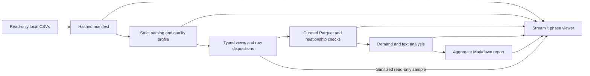

# Reproducible local EDA

## Run locally

Requirements: Python 3.12 through uv, at least 4 GB available RAM and disk space for the
warehouse, curated Parquet and temporary spills. Reserve at least 30 GB beyond the original
CSV files for this snapshot: the full curation was observed using over 10 GB of temporary
spill space. The original dataset is about 5.35 GB.
DuckDB starts with two threads and a 2 GB buffer limit; this is not a hard process RSS limit.

```bash
make eda-setup
make eda
make eda-ui
```

The viewer binds to `127.0.0.1:8501`. Its five process pages read completed aggregate artifacts.
The Laboratory section can also read a bounded, sanitized sample from the warehouse in read-only
mode; it never exposes original free text, direct personal fields or the private review sample.
Use its refresh button after another phase completes.
The analysis runs independently from Streamlit, so changing filters does not rescan CSVs.
The sidebar changes the interface language between Spanish and English; metric identifiers,
source categories and the technical Markdown report remain in English.
The generated report is written to `data/eda/<RUN_ID>/report.md`. Its aggregate findings are
recorded in [RESULTS.md](RESULTS.md), which identifies the local run that produced them. The
implementation and documentation review is in [EDA_STANDARDS_REVIEW.md](EDA_STANDARDS_REVIEW.md).

For separate phases or a different local input directory:

```bash
uv run --extra eda bank-data eda inventory --source data --output data/eda
uv run --extra eda bank-data eda profile data/eda/RUN_ID
uv run --extra eda bank-data eda curate data/eda/RUN_ID
uv run --extra eda bank-data eda analyze data/eda/RUN_ID
uv run --extra eda bank-data eda report data/eda/RUN_ID
```

Replace `RUN_ID` with the directory printed by inventory. The viewer discovers runs under
`data/eda`; use that output location when running the UI. `run` resumes completed phases.
Changes to source content, pipeline code, contracts or the lockfile create a new run. Viewer-only
changes do not invalidate the analytical artifacts.
A rerun of a phase invalidates downstream phase statuses. Old runs remain selectable.

## Dependencies

The optional engine is DuckDB 1.5.5 (MIT); the viewer uses Streamlit 1.64.0 (Apache-2.0).
The shared lockfile also resolves `websockets` to 16.1.1 because Streamlit requires a version
below 17. All other previously locked package versions are unchanged. Backend integration
and health tests are included in validation of this compatibility change.

## Data flow and artifacts



Each run contains:

| Artifact | Purpose |
| --- | --- |
| `manifest.json`, `inventory.json` | SHA-256 fingerprints, local coverage, schemas and partitions |
| `status.json` | Pending, running, failed or complete status with timestamps |
| `ingestion_progress.json`, `file_counts.json` | Table progress and successfully parsed row counts |
| `warehouse.duckdb` | Original string columns, typed views, clean tables and local audit lineage |
| `profile.json` | Column counts, invalid casts, domain checks and categorical aggregates |
| `curate.json`, `curated/` | Row reconciliation, join coverage and clean Parquet |
| `analyze.json` | Demand cubes, survey metrics, currencies, text diversity and workflow evidence |
| `private_review.jsonl` | Local-only stratified source text sample, excluded from viewer and report |
| `report.md` | Shareable aggregate report; review before explicitly publishing |

All artifacts stay in the gitignored data directory. Do not commit local databases,
review samples or customer-level records. Logs suppress raw parser exception messages,
which can contain cell contents. The current dataset is organizer-supplied synthetic data.

## Quality and curation policies

The machine-readable contract is transcribed from the organizer dictionary. Observed
violations are findings, not instructions to alter the dictionary to make checks pass.
The initial inventory has all 13 tables and 7,671 CSVs; remote completeness is unverified.

- Inventory rejects changing files, ignores temporary files and excludes its output tree.
- CSV records, including multiline fields, retain file and one-based record ordinal.
  Strict parse errors reject the file and record its error type; its row count remains unknown.
  Batches of 32 files commit data and checkpoints together. After an interruption, committed
  files are reused. A malformed batch is rolled back and retried file by file; resource or I/O
  failures stop the phase rather than being mislabeled as bad data.
- Original values are stored as strings. Additional valid source columns remain in raw storage
  and row fingerprints. Typed conversion preserves invalid-value counts; optional invalid values
  become null in typed views. Missing required fields prevent clean-table eligibility.
- Identical parsed business rows collapse to one representative, deterministically ordered by
  source file and record ordinal. All source occurrences remain in the audit and raw tables.
- Repeated keys with different row content are quarantined from clean joins. Distinct update
  timestamps mark potential versions, not confirmed valid snapshots. No last-write-wins policy
  is assumed without source semantics. All versions remain available in raw storage.
- Required-field failures take precedence over conflicting keys in row reconciliation.
  The identity is `original = clean + collapsed_duplicates + invalid_required + conflicting_key`.
- Orphans and semantic anomalies remain in clean tables with explicit audit findings.
  Clean means structurally eligible, not certified correct for every business use.
  Row-level semantic issues are in `audit.<table>_rows.semantic_issues`.
- Relationships report both typed-original and clean counts, absent parents, non-null keys,
  matches, unmatched keys, ambiguous parent keys and actual inner/left join row counts.
- Money remains decimal. USD conversion uses the event date and a direct positive rate only;
  missing rates are not filled. Different source currencies are never added together.

Dynamic SQL identifiers are contract-controlled and validated by `qi`; source paths are
escaped by `literal`. Narrow lint annotations document those audited constructions.
Regression tests include paths with apostrophes and rejected identifier fragments.

## Interpretation and workflow decisions

Demand metrics retain unknown dimensions and expose original versus curated layers. Rates
are recomputed from numerators and known-value denominators; group rates are never averaged.
Country and segment come from the available customer snapshot and are not historical attributes.
Negative durations are excluded from duration summaries, not silently converted to zero.

CSAT uses scores 1 through 5; NPS uses 0 through 10. CES has no documented scale and is not
combined with other scores. Open complaints are censored; observed resolution duration does
not measure the time to resolution of all cases. Extraction time is unknown. Processing date
cannot establish file arrival time or provide an observation cutoff.

Text repetition is measured separately from duplicated events. Exact and NFC/case/whitespace
normalized customer text groups reveal template concentration and contradictory contact labels.
A chronological 80th-percentile probe reports later rows sharing customer IDs or text groups
with earlier rows. It is a feasibility diagnostic, not a frozen evaluation split.

The local manual-review sample has a fixed seed, at most 1,200 rows and round-robin coverage
of reason, channel, country and month strata. It is not a population estimate or ground truth.
Post-outcome flags, agent replies and complete conversations are flagged as unsuitable
intake-time predictors. Recorded language metadata is not independent language verification.
Portuguese team-authored cases must be labeled separately.

The workflow matrix exposes required tables, usable counts, parse errors, relationship evidence,
label limitations and implementation dependencies. Category proxies do not establish precise
workflow demand. No weighted ranking, causal claim or production ROI is generated.

## Interactive laboratory

**Explorar tablas** shows typed or curated row counts, required missing values, exact duplicates,
key conflicts, column profiles, categorical distributions, row disposition and a sanitized sample.
The sample is deterministic for a run and capped at 100 rows. A fail-closed allowlist permits only
entity ID references, reviewed low-cardinality categories, month-bucketed dates and a few technical
flags. It excludes free text, fine-grained location, personal characteristics, financial values and
outcome labels. ID hashes are useful only as local references and must not be published as anonymous
customer data.

**Mapa de relaciones** makes missing joins visible without displaying keys. Edge colors follow
coverage and customer/agent consistency. The current snapshot highlights invalid branch references
from customers and agents, absent complaint origin interactions, and complaint products owned by a
different customer.

**Decidir caso de uso** compares demand, historical outcomes, text concentration and five workflow
dimensions. The current project steering selects dispute handling. The matrix exposes the weak
complaint links and label limitations that the team must address; it does not change the steering
or select an alternative automatically. Account and payment relationships are stronger, but the
available contact category is only a broad demand proxy.

## Failure recovery and tests

Only one writer may update a run. If a process is killed, inspect whether it is still active
before removing that run's `.writer.lock`. Rerun the unfinished phase; Streamlit never treats
running or failed artifacts as complete. Phase outputs are atomically published; downstream
statuses are invalidated before changing a predecessor.

```bash
uv run --extra eda-ui pytest data_platform/tests --cov=bank_data
make check
```

Tests use generated synthetic fixtures and a temporary DuckDB. They cover conservation of rows,
multiline ordinals, malformed files, orphan joins, conflicting IDs, currency calculations,
text groups, source mutation, deterministic reuse, interrupted phases, sanitized sample privacy,
relationship traffic lights, workflow evidence and all eight Streamlit pages.
The project coverage gate remains 80 percent for the data-platform package.
