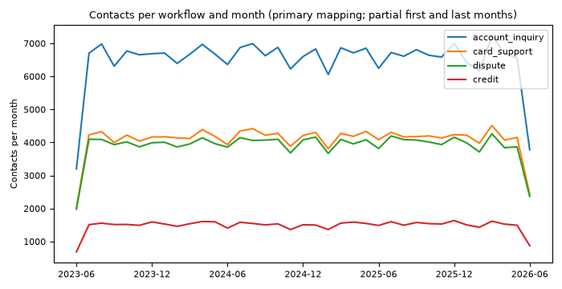
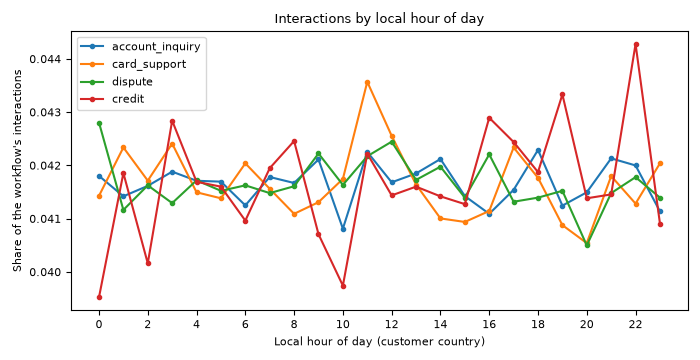
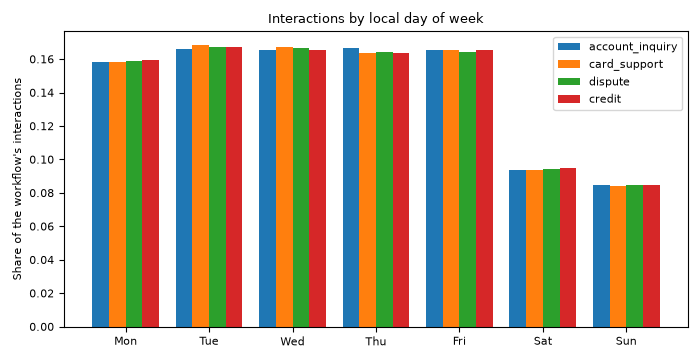
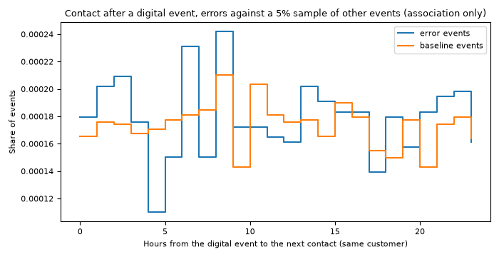

# Workflow evidence

Generated by `make analysis` at 2026-09-27T00:29:19+00:00 from commit `2d71a25-dirty`. Source: `s3` (full organizer delivery); delivery `organizer-v1.0.0-2026-08-31`; contacts from 2023-06-17 to 2026-06-17. Pre-registration version 1. Do not edit by hand.

Every figure here is an offline measurement of the historical organizer data, except the cost figures, which are projections from stated assumptions (`data_platform/analysis/cost_assumptions.yaml`, all marked `assumption: true`). Intervals are bootstrap 95% intervals (1,000 resamples). The method is pre-registered in [`workflow-scoring-preregistration.md`](workflow-scoring-preregistration.md); the scores are in [`workflow-scores.md`](workflow-scores.md).

## Summary per workflow

| Workflow | Interactions | Complaints | Share of all contacts | First contact resolution | Escalation | Handle time (s) | Low CSAT (1 or 2) | Automatable, proxy | Automatable, human labels | Cost per contact (projected) |
|---|---|---|---|---|---|---|---|---|---|---|
| `account_inquiry` | 240,056 | 0 | 31.9% | 91.5% | 9.9% | 221 | 20.8% | 70.1% | pending human labels | 0.69 USD |
| `card_support` | 150,863 | 0 | 20.0% | 89.6% | 10.0% | 266 | 22.2% | 68.6% | pending human labels | 0.84 USD |
| `dispute` | 117,021 | 27,133 | 19.1% | 43.6% | 10.0% | 435 | 54.5% | 33.2% | pending human labels | 1.37 USD |
| `credit` | 54,879 | 0 | 7.3% | 65.2% | 9.8% | 540 | 39.1% | 50.0% | pending human labels | 1.70 USD |

`other` (technical support, retention, and service, app, and branch complaints) holds 123,477 interactions and 39,962 complaints (21.7% of all contacts).

## Reason mapping

From [`data_platform/mappings/workflow_mapping.csv`](../../data_platform/mappings/workflow_mapping.csv). The contact reasons are coarse (six values), so three of the four interaction mappings are assumptions; the strict and alternative columns are the pre-registered sensitivity scenarios.

| Contact reason | Interactions | Primary | Strict | Alternative |
|---|---|---|---|---|
| Transaccional | 240,056 | account_inquiry | account_inquiry | account_inquiry |
| Producto | 150,863 | card_support | other | credit |
| Queja | 117,021 | dispute | other | dispute |
| Técnico | 102,899 | other | other | other |
| Comercial | 54,879 | credit | other | credit |
| Retención | 20,578 | other | other | other |

| Complaint category | Subcategory | Complaints | Workflow | Sub-intent |
|---|---|---|---|---|
| Branch | (null) | 1,469 | other |  |
| Branch | Atención en sucursal | 11,892 | other |  |
| Fees | (null) | 1,359 | dispute | dispute_new |
| Fees | Cobro indebido | 12,194 | dispute | dispute_new |
| Service | (null) | 1,308 | other |  |
| Service | Calidad de servicio | 11,886 | other |  |
| Technical | (null) | 1,279 | other |  |
| Technical | Problema con app | 12,128 | other |  |
| Transactions | (null) | 1,283 | dispute | dispute_new |
| Transactions | Cargo no reconocido | 12,297 | dispute | dispute_new |

Unmapped volume: 0 interactions (0.00%) and 0 complaints (0.00%); unmapped values: none. Interactions whose `reason_category` row disagrees with their `contact_reason` row: 0.

## Volume and trend

Share of all contacts (interactions plus complaints) per mapping scenario:

| Workflow | Primary | Strict | Alternative |
|---|---|---|---|
| `account_inquiry` | 31.9% (240,056) | 31.9% (240,056) | 31.9% (240,056) |
| `card_support` | 20.0% (150,863) | 0.0% (0) | 0.0% (0) |
| `dispute` | 19.1% (144,154) | 3.6% (27,133) | 19.1% (144,154) |
| `credit` | 7.3% (54,879) | 0.0% (0) | 27.3% (205,742) |
| `other` | 21.7% (163,439) | 64.5% (486,202) | 21.7% (163,439) |

Trend: contacts in the first 12 full months (2023-07 to 2024-06) against the last 12 (2025-06 to 2026-05).

| Workflow | First 12 months | Last 12 months | Change |
|---|---|---|---|
| `account_inquiry` | 79,882 | 79,674 | -0.3% |
| `card_support` | 49,917 | 50,237 | 0.6% |
| `dispute` | 47,778 | 47,946 | 0.4% |
| `credit` | 18,310 | 18,424 | 0.6% |

## Workflow `account_inquiry`

| Metric | Value (95% interval) | n |
|---|---|---|
| Interactions | 240,056 |  |
| First contact resolution | 91.5% (91.4% to 91.6%) | 240,056 |
| Escalation rate | 9.9% (9.8% to 10.0%) | 240,056 |
| Needs follow-up | 22.1% (22.0% to 22.3%) | 240,056 |
| Handle time, seconds | 220.8 (220.4 to 221.2) | 206,465 |
| Wait time, seconds | 119.7 (119.4 to 119.9) | 168,074 |
| CSAT mean (observed scale 1 to 4) | 2.91 (2.91 to 2.92) | 44,837 |
| CSAT share 1 or 2 | 20.8% (20.5% to 21.1%) | 44,837 |
| NPS (promoters minus detractors; no score above 7 exists) | -69.9 | 22,341 |
| CES mean | 2.91 (2.90 to 2.93) | 7,354 |
| Automatable share, proxy (resolved, not escalated, no follow-up) | 70.1% (70.0% to 70.3%) | 240,056 |
| Automatable share, human labels | pending human labels |  |

Channel mix: phone 85.0%, email 4.0%, app 3.9%, web_chat 3.3%, whatsapp 3.3%, web 0.5%. Country mix: MX 49.9%, CO 30.2%, AR 19.9%.

No complaint category maps to this workflow, so SLA, resolution days, repeat complainers, and compensation are not defined for it.

Demand pattern: flat across the local hours of the day (peak to trough 1.04, no intraday peak); busiest weekday Thursday, quietest Sunday (peak to trough 1.97; a weekend day carries 54.2% of a weekday's volume); mean 218.8 contacts a day over 1,097 days, 0 spike days (robust z above the pre-registered threshold).

Cost (projected from assumptions): 0.69 USD per contact, 0.76 USD per resolved contact, 55,519 USD of handle cost in the last 365 days.

## Workflow `card_support`

| Metric | Value (95% interval) | n |
|---|---|---|
| Interactions | 150,863 |  |
| First contact resolution | 89.6% (89.5% to 89.8%) | 150,863 |
| Escalation rate | 10.0% (9.8% to 10.1%) | 150,863 |
| Needs follow-up | 23.8% (23.6% to 24.0%) | 150,863 |
| Handle time, seconds | 266.4 (265.9 to 266.8) | 129,644 |
| Wait time, seconds | 120.0 (119.6 to 120.3) | 105,610 |
| CSAT mean (observed scale 1 to 4) | 2.90 (2.89 to 2.90) | 27,942 |
| CSAT share 1 or 2 | 22.2% (21.7% to 22.6%) | 27,942 |
| NPS (promoters minus detractors; no score above 7 exists) | -70.0 | 13,997 |
| CES mean | 2.91 (2.89 to 2.93) | 4,627 |
| Automatable share, proxy (resolved, not escalated, no follow-up) | 68.6% (68.4% to 68.8%) | 150,863 |
| Automatable share, human labels | pending human labels |  |

Channel mix: phone 85.0%, email 4.0%, app 3.9%, web_chat 3.3%, whatsapp 3.3%, web 0.5%. Country mix: MX 49.9%, CO 30.2%, AR 19.9%.

No complaint category maps to this workflow, so SLA, resolution days, repeat complainers, and compensation are not defined for it.

Demand pattern: flat across the local hours of the day (peak to trough 1.07, no intraday peak); busiest weekday Tuesday, quietest Sunday (peak to trough 2.00; a weekend day carries 53.9% of a weekday's volume); mean 137.5 contacts a day over 1,097 days, 0 spike days (robust z above the pre-registered threshold).

Cost (projected from assumptions): 0.84 USD per contact, 0.93 USD per resolved contact, 42,248 USD of handle cost in the last 365 days.

## Workflow `dispute`

| Metric | Value (95% interval) | n |
|---|---|---|
| Interactions | 117,021 |  |
| First contact resolution | 43.6% (43.3% to 43.9%) | 117,021 |
| Escalation rate | 10.0% (9.9% to 10.2%) | 117,021 |
| Needs follow-up | 63.0% (62.7% to 63.2%) | 117,021 |
| Handle time, seconds | 434.6 (433.7 to 435.4) | 100,727 |
| Wait time, seconds | 120.0 (119.6 to 120.4) | 82,261 |
| CSAT mean (observed scale 1 to 4) | 2.43 (2.42 to 2.44) | 21,843 |
| CSAT share 1 or 2 | 54.5% (53.9% to 55.1%) | 21,843 |
| NPS (promoters minus detractors; no score above 7 exists) | -85.3 | 10,821 |
| CES mean | 2.43 (2.41 to 2.46) | 3,693 |
| Automatable share, proxy (resolved, not escalated, no follow-up) | 33.2% (33.0% to 33.5%) | 117,021 |
| Automatable share, human labels | pending human labels |  |

Channel mix: phone 85.1%, email 4.0%, app 3.8%, web_chat 3.4%, whatsapp 3.3%, web 0.5%. Country mix: MX 49.9%, CO 30.1%, AR 20.0%.

| Complaint metric | Value (95% interval) |
|---|---|
| Complaints | 27,133 |
| SLA breach rate | 20.0% (19.5% to 20.4%) |
| Resolution days (resolved complaints) | 15.5 (15.3 to 15.7) |
| Repeat complainer rate | 14.9% (14.5% to 15.3%) |
| Share with compensation granted | 7.1% |
| Share with a claimed amount | 33.0% |
| Case type mix | complaint 60.5%, claim 24.7%, request 9.9%, suggestion 4.9% |
| Status mix | in_process 40.1%, open 29.7%, resolved 20.3%, escalated 5.1%, closed 3.8%, rejected 1.0% |
| Reception channel mix | call_center 50.5%, email 19.5%, web 14.8%, app 10.2%, branch 3.9%, regulator 1.1% |
| Country mix | MX 49.4%, CO 30.6%, AR 20.0% |

Demand pattern: flat across the local hours of the day (peak to trough 1.06, no intraday peak); busiest weekday Tuesday, quietest Sunday (peak to trough 1.98; a weekend day carries 54.4% of a weekday's volume); mean 131.4 contacts a day over 1,097 days, 0 spike days (robust z above the pre-registered threshold).

Cost (projected from assumptions): 1.37 USD per contact, 3.13 USD per resolved contact, 53,517 USD of handle cost in the last 365 days.

## Workflow `credit`

| Metric | Value (95% interval) | n |
|---|---|---|
| Interactions | 54,879 |  |
| First contact resolution | 65.2% (64.9% to 65.6%) | 54,879 |
| Escalation rate | 9.8% (9.6% to 10.1%) | 54,879 |
| Needs follow-up | 44.5% (44.2% to 44.9%) | 54,879 |
| Handle time, seconds | 539.9 (538.5 to 541.5) | 47,082 |
| Wait time, seconds | 120.2 (119.6 to 120.8) | 38,338 |
| CSAT mean (observed scale 1 to 4) | 2.66 (2.65 to 2.67) | 10,243 |
| CSAT share 1 or 2 | 39.1% (38.2% to 40.0%) | 10,243 |
| NPS (promoters minus detractors; no score above 7 exists) | -78.4 | 5,144 |
| CES mean | 2.67 (2.64 to 2.70) | 1,760 |
| Automatable share, proxy (resolved, not escalated, no follow-up) | 50.0% (49.6% to 50.4%) | 54,879 |
| Automatable share, human labels | pending human labels |  |

Channel mix: phone 84.8%, email 4.0%, app 3.8%, web_chat 3.5%, whatsapp 3.4%, web 0.5%. Country mix: MX 50.4%, CO 30.1%, AR 19.6%.

No complaint category maps to this workflow, so SLA, resolution days, repeat complainers, and compensation are not defined for it.

Demand pattern: flat across the local hours of the day (peak to trough 1.12, no intraday peak); busiest weekday Tuesday, quietest Sunday (peak to trough 1.98; a weekend day carries 54.6% of a weekday's volume); mean 50.0 contacts a day over 1,097 days, 0 spike days (robust z above the pre-registered threshold).

Cost (projected from assumptions): 1.70 USD per contact, 2.60 USD per resolved contact, 31,399 USD of handle cost in the last 365 days.

## Demand patterns

Hours and weekdays are local to the customer's country (fixed offsets: Mexico UTC-6, Colombia UTC-5, Argentina UTC-3), from UTC timestamps. The hour-of-day curves are flat in every workflow (a generator property: no intraday staffing signal exists in this data); the weekly pattern is real, with weekend days at about half a weekday's volume.

Spike days: daily contacts (interactions plus complaints) above the trailing 28-day median by more than the pre-registered robust z-score.

| Workflow | Days | Spike days | Largest spikes |
|---|---|---|---|
| `account_inquiry` | 1,097 | 0 | none |
| `card_support` | 1,097 | 0 | none |
| `dispute` | 1,097 | 0 | none |
| `credit` | 1,097 | 0 | none |

## Digital errors followed by a contact

For digital events of identified customers: the share followed by a contact-center interaction of the same customer within 24 hours, for `error` events against a deterministic 5% hash sample of all other events. **This is an association, not a causal effect**: customers who use digital channels more also call more, and the synthetic generator may not link the two at all.

| Events | Count | Contact within the window (95% interval) |
|---|---|---|
| Error events | 272,663 | 0.4% (0.4% to 0.5%) |
| Other events (5% sample) | 579,858 | 0.4% (0.4% to 0.4%) |

Rate ratio (error over other): 1.03. Workflow of the contact after an error: account_inquiry 36.8%, card_support 19.6%, other 17.9%, dispute 17.4%, credit 8.2%.

| Page of the error | Error events | Contact within the window |
|---|---|---|
| /transactions | 43,322 | 0.44% |
| /payments | 43,108 | 0.45% |
| /transfer | 43,092 | 0.46% |
| /help | 32,634 | 0.40% |
| /home | 32,493 | 0.46% |
| /products | 32,388 | 0.38% |
| /accounts | 32,180 | 0.43% |
| (none) | 13,446 | 0.34% |

## Automatable share and the labeling task

The automatable share is a human labeling task ([`labeling-protocol.md`](labeling-protocol.md)). Until at least the pre-registered number of adjudicated items per workflow match that workflow, every score uses the structured proxy (resolved at first contact, not escalated, no follow-up), labeled as a proxy.

| Workflow | Items | Adjudicated | Matching the workflow | Kappa | Status | Labeled share |
|---|---|---|---|---|---|---|
| `account_inquiry` | 150 | 0 | 0 | not defined | pending human labels | not defined |
| `card_support` | 150 | 0 | 0 | not defined | pending human labels | not defined |
| `dispute` | 150 | 0 | 0 | not defined | pending human labels | not defined |
| `credit` | 150 | 0 | 0 | not defined | pending human labels | not defined |

Labeling file: `data/labeling/automatable_sample.csv` (written; 600 items: account_inquiry 150, card_support 150, dispute 150, credit 150). Machine pre-labels (review status `pending`, never used as labels) are in `data/labeling/automatable_prelabels.csv`:

| Stratum | Pre-label topic | Matches stratum | Items |
|---|---|---|---|
| `account_inquiry` | balance_inquiry | yes | 150 |
| `card_support` | balance_inquiry | no | 150 |
| `credit` | balance_inquiry | no | 150 |
| `dispute` | balance_inquiry | no | 150 |

### Transcripts carry no workflow signal

147,292 served transcripts hold 42 distinct customer texts; `detected_intents` has 1 distinct value(s) (consulta_general 140,039, (null) 7,253); `main_topics` equals `contact_reason` on 147,292 transcripts (a copy of the label, not an independent signal). The balance question in the customer text does not depend on the contact reason (Cramer's V 0.008; 0 means independence):

| Contact reason | Balance sentence of the customer text | Transcripts |
|---|---|---|
| Comercial | Buenas tardes, necesito consultar el saldo de mi tarjeta de crédito. | 6,058 |
| Comercial | Quisiera saber cuál es mi saldo actual en mi cuenta de ahorros. | 5,819 |
| Producto | Buenas tardes, necesito consultar el saldo de mi tarjeta de crédito. | 16,026 |
| Producto | Quisiera saber cuál es mi saldo actual en mi cuenta de ahorros. | 16,261 |
| Queja | Buenas tardes, necesito consultar el saldo de mi tarjeta de crédito. | 12,695 |
| Queja | Quisiera saber cuál es mi saldo actual en mi cuenta de ahorros. | 12,442 |
| Retención | Buenas tardes, necesito consultar el saldo de mi tarjeta de crédito. | 2,264 |
| Retención | Quisiera saber cuál es mi saldo actual en mi cuenta de ahorros. | 2,180 |
| Transaccional | Buenas tardes, necesito consultar el saldo de mi tarjeta de crédito. | 25,726 |
| Transaccional | Quisiera saber cuál es mi saldo actual en mi cuenta de ahorros. | 25,726 |
| Técnico | Buenas tardes, necesito consultar el saldo de mi tarjeta de crédito. | 11,043 |
| Técnico | Quisiera saber cuál es mi saldo actual en mi cuenta de ahorros. | 11,052 |

Consequence: a human label on these texts measures a balance question, whatever the workflow stratum. The protocol therefore records whether the text matches the workflow, and only matching items count. For `card_support`, `dispute`, and `credit` the labels are expected to confirm that transcripts cannot measure the automatable share, and phase 10 needs team-authored or paraphrased utterances, labeled as such, to train and evaluate the router.

## Cost baseline (projected, from assumptions)

Handle cost = handled minutes (`duration_seconds`) times the assumed loaded cost per minute of the customer's country times the after-call-work factor. Contacts without a duration are costed at the workflow mean. Complaint back-office handling is not in the data and is excluded. The addressable cost is the last 365 days of handle cost times the automatable share: the label-based figure waits for human labels; the ceiling assumes a share of 100%; the proxy figure uses the structured proxy. None of these is a measured saving. Window end: 2026-06-17.

| Workflow | Contacts | Mean handled minutes | Cost per contact | Cost per resolved contact | Total, full period | Handle cost, last 365 days | Addressable, label-based | Addressable, proxy |
|---|---|---|---|---|---|---|---|---|
| `account_inquiry` | 240,056 | 3.68 | 0.69 USD | 0.76 USD | 166,546 USD | 55,519 USD | pending human labels | 38,936 USD |
| `card_support` | 150,863 | 4.44 | 0.84 USD | 0.93 USD | 126,253 USD | 42,248 USD | pending human labels | 28,981 USD |
| `dispute` | 117,021 | 7.24 | 1.37 USD | 3.13 USD | 159,806 USD | 53,517 USD | pending human labels | 17,791 USD |
| `credit` | 54,879 | 9.00 | 1.70 USD | 2.60 USD | 93,169 USD | 31,399 USD | pending human labels | 15,699 USD |

Sensitivity of the cost per resolved contact to the assumed loaded cost:

| Workflow | 0.5 x | 1 x | 1.5 x |
|---|---|---|---|
| `account_inquiry` | 0.38 USD | 0.76 USD | 1.14 USD |
| `card_support` | 0.47 USD | 0.93 USD | 1.40 USD |
| `dispute` | 1.57 USD | 3.13 USD | 4.70 USD |
| `credit` | 1.30 USD | 2.60 USD | 3.91 USD |

## Segment baseline

Historical first contact resolution, escalation, and CSAT by country, detected accent, and customer segment: the reference values for the later disparity analysis. `small` marks cells under the pre-registered minimum of interactions or CSAT surveys.

### Country

| Group | Country | Interactions | First contact resolution | Escalation | CSAT mean | CSAT surveys | Cell |
|---|---|---|---|---|---|---|---|
| all_in_scope | AR | 111,732 | 78.4% | 9.8% | 2.79 | 20,973 |  |
| all_in_scope | CO | 169,840 | 78.5% | 10.1% | 2.79 | 31,487 |  |
| all_in_scope | MX | 281,247 | 78.5% | 9.9% | 2.78 | 52,405 |  |
| account_inquiry | AR | 47,660 | 91.6% | 9.8% | 2.92 | 8,972 |  |
| account_inquiry | CO | 72,511 | 91.5% | 10.0% | 2.92 | 13,522 |  |
| account_inquiry | MX | 119,885 | 91.5% | 9.9% | 2.91 | 22,343 |  |
| card_support | AR | 29,948 | 89.6% | 10.0% | 2.90 | 5,560 |  |
| card_support | CO | 45,564 | 89.8% | 10.1% | 2.90 | 8,322 |  |
| card_support | MX | 75,351 | 89.6% | 9.9% | 2.89 | 14,060 |  |
| dispute | AR | 23,392 | 43.4% | 9.8% | 2.43 | 4,411 |  |
| dispute | CO | 35,257 | 43.6% | 10.3% | 2.44 | 6,605 |  |
| dispute | MX | 58,372 | 43.7% | 10.0% | 2.43 | 10,827 |  |
| credit | AR | 10,732 | 65.3% | 9.7% | 2.67 | 2,030 |  |
| credit | CO | 16,508 | 64.9% | 10.0% | 2.66 | 3,038 |  |
| credit | MX | 27,639 | 65.4% | 9.8% | 2.66 | 5,175 |  |

### Detected accent

| Group | Detected accent | Interactions | First contact resolution | Escalation | CSAT mean | CSAT surveys | Cell |
|---|---|---|---|---|---|---|---|
| all_in_scope | argentine | 78,780 | 78.3% | 9.8% | 2.78 | 14,832 |  |
| all_in_scope | colombian | 118,748 | 78.7% | 10.1% | 2.79 | 21,930 |  |
| all_in_scope | mexican | 197,412 | 78.4% | 9.9% | 2.78 | 36,812 |  |
| all_in_scope | unknown | 167,879 | 78.5% | 9.9% | 2.79 | 31,291 |  |
| account_inquiry | argentine | 33,648 | 91.6% | 9.8% | 2.91 | 6,354 |  |
| account_inquiry | colombian | 50,896 | 91.6% | 10.1% | 2.92 | 9,440 |  |
| account_inquiry | mexican | 83,966 | 91.4% | 9.9% | 2.91 | 15,623 |  |
| account_inquiry | unknown | 71,546 | 91.5% | 9.9% | 2.91 | 13,420 |  |
| card_support | argentine | 21,091 | 89.4% | 9.9% | 2.89 | 3,968 |  |
| card_support | colombian | 31,874 | 89.8% | 10.1% | 2.90 | 5,815 |  |
| card_support | mexican | 52,961 | 89.5% | 9.9% | 2.89 | 9,894 |  |
| card_support | unknown | 44,937 | 89.7% | 9.9% | 2.90 | 8,265 |  |
| dispute | argentine | 16,444 | 43.2% | 9.7% | 2.42 | 3,079 |  |
| dispute | colombian | 24,544 | 43.6% | 10.3% | 2.44 | 4,590 |  |
| dispute | mexican | 41,158 | 43.6% | 10.0% | 2.43 | 7,659 |  |
| dispute | unknown | 34,875 | 43.8% | 10.1% | 2.44 | 6,515 |  |
| credit | argentine | 7,597 | 65.1% | 9.9% | 2.67 | 1,431 |  |
| credit | colombian | 11,434 | 65.1% | 9.7% | 2.66 | 2,085 |  |
| credit | mexican | 19,327 | 65.3% | 9.8% | 2.66 | 3,636 |  |
| credit | unknown | 16,521 | 65.2% | 9.9% | 2.66 | 3,091 |  |

### Segment

| Group | Segment | Interactions | First contact resolution | Escalation | CSAT mean | CSAT surveys | Cell |
|---|---|---|---|---|---|---|---|
| all_in_scope | basic | 337,327 | 78.5% | 10.0% | 2.79 | 62,406 |  |
| all_in_scope | plus | 141,200 | 78.4% | 9.9% | 2.78 | 26,623 |  |
| all_in_scope | premium | 56,363 | 78.6% | 9.9% | 2.77 | 10,544 |  |
| all_in_scope | student | 27,929 | 78.6% | 9.8% | 2.79 | 5,292 |  |
| account_inquiry | basic | 143,663 | 91.5% | 10.0% | 2.91 | 26,668 |  |
| account_inquiry | plus | 60,298 | 91.4% | 9.8% | 2.91 | 11,442 |  |
| account_inquiry | premium | 24,229 | 91.6% | 10.1% | 2.90 | 4,478 |  |
| account_inquiry | student | 11,866 | 91.5% | 9.9% | 2.93 | 2,249 |  |
| card_support | basic | 90,580 | 89.6% | 10.0% | 2.90 | 16,662 |  |
| card_support | plus | 37,706 | 89.7% | 9.8% | 2.90 | 7,055 |  |
| card_support | premium | 14,994 | 89.2% | 9.9% | 2.87 | 2,839 |  |
| card_support | student | 7,583 | 90.1% | 9.8% | 2.91 | 1,386 |  |
| dispute | basic | 70,178 | 43.6% | 10.1% | 2.44 | 13,013 |  |
| dispute | plus | 29,423 | 43.5% | 10.1% | 2.43 | 5,555 |  |
| dispute | premium | 11,692 | 43.8% | 9.8% | 2.44 | 2,176 |  |
| dispute | student | 5,728 | 43.8% | 9.8% | 2.40 | 1,099 |  |
| credit | basic | 32,906 | 65.4% | 9.9% | 2.66 | 6,063 |  |
| credit | plus | 13,773 | 64.6% | 9.8% | 2.66 | 2,571 |  |
| credit | premium | 5,448 | 66.2% | 9.7% | 2.65 | 1,051 |  |
| credit | student | 2,752 | 63.9% | 9.1% | 2.69 | 558 |  |

## Data support

Measured coverage ratios behind the data support criterion (definitions in the pre-registration).

| Item | Definition | Value |
|---|---|---|
| `product_balance_present` | Non-closed products with a balance | 100.0% |
| `transactions_classifiable_for_totals` | Transactions whose direction is encoded (not transfer or adjustment) | 76.8% |
| `payment_transfer_status_present` | Payments and transfers with a status | 100.0% |
| `transaction_status_present` | Transactions with a status | 100.0% |
| `card_expiry_present` | Credit and debit cards with an expiration date | 95.1% |
| `card_status_present` | Credit and debit cards with a status | 100.0% |
| `card_blocked_status_observed` | At least one blocked card (1 or 0) | 100.0% |
| `purchase_merchant_present` | Purchases with a merchant name | 95.0% |
| `complaint_transaction_link_present` | Complaints with a transaction reference (no such column exists) | 0.0% |
| `complaint_own_product_reference` | Complaint product references that name the complainant's own product | 0.0% |
| `complaint_claimed_amount_present` | Dispute-mapped complaints with a claimed amount | 33.0% |
| `complaint_status_present` | Dispute-mapped complaints with a status | 100.0% |
| `customer_credit_score_present` | Customers with a credit score | 85.0% |
| `customer_income_present` | Customers with an estimated monthly income | 80.0% |
| `credit_product_interest_rate_present` | Credit cards, personal loans, and mortgages with an interest rate | 90.0% |
| `credit_product_days_past_due_present` | Credit cards, personal loans, and mortgages with days past due | 95.0% |
| `forward_risk_label_available` | More than one snapshot of customers and products (1 or 0) | 0.0% |
| `system_owned_record` | The record is created by the system itself (1) | 100.0% |

Per workflow (mean of its items): `account_inquiry` 92.3%, `card_support` 98.4%, `dispute` 32.0%, `credit` 70.0%.

## Stop conditions

| Check | Result | Evidence | Workflows |
|---|---|---|---|
| account_inquiry read path | pass | 1,635,402 payment or transfer transactions | account_inquiry |
| card_support read path | pass | 140,040 card products | card_support |
| dispute read path | pass | 1,083,406 purchases | dispute |
| credit read path | pass | 131,284 credit products with a limit or an interest rate | credit |
| mapped volume | pass | unmapped: 0.00% of interactions, 0.00% of complaints (limit 5%) | all |
| credit profile columns | pass | credit_score 85.0% and income 80.0% of customers; days_past_due 95.0% of credit products | credit |

No stop condition fired.

## Limitations

- The organizer data is fully synthetic. Several fields look generated independently of each other: complaint outcomes are flat across categories, sentiment is constant on transactional contacts, and transcripts are two templates. Differences between workflows come mostly from the contact reason.
- The contact reasons are coarse; only `Transaccional` maps unambiguously. The strict and alternative scenarios show how much each conclusion depends on the mapping.
- The automatable share is a structured proxy until humans label; the proxy measures historically simple contacts, not what the system can do.
- Costs are projections from stated, unverified assumptions.
- Timestamps are read as UTC (a phase 03 inference); local hours use fixed country offsets.
