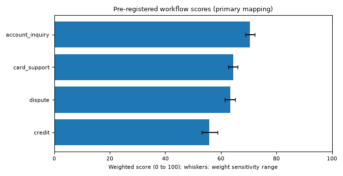

# Workflow scores

Generated by `make analysis` at 2026-09-27T00:29:19+00:00 from commit `2d71a25-dirty`. Source: `s3` (full organizer delivery); delivery `organizer-v1.0.0-2026-08-31`; contacts from 2023-06-17 to 2026-06-17. Pre-registration version 1. Do not edit by hand.

Computed exactly as pre-registered in [`workflow-scoring-preregistration.md`](workflow-scoring-preregistration.md) (`data_platform/analysis/scoring.yaml`). The decision that uses these numbers is [`docs/decisions/workflow-prioritization.md`](../decisions/workflow-prioritization.md). The automatable share is the structured proxy wherever the source column says so.

## Weights

| demand | pain | automatable_share | harm_inverse | data_support | demo_depth |
|---|---|---|---|---|---|
| 20 | 25 | 20 | 10 | 15 | 10 |

## Criteria and scores (primary mapping)

| Workflow | demand | pain | automatable_share | harm_inverse | data_support | demo_depth | Automatable source | Score | Rank |
|---|---|---|---|---|---|---|---|---|---|
| `account_inquiry` | 1.000 | 0.362 | 0.701 | 0.750 | 0.923 | 0.600 | proxy | 70.4 | 1 |
| `card_support` | 0.628 | 0.415 | 0.686 | 0.500 | 0.984 | 0.800 | proxy | 64.4 | 2 |
| `dispute` | 0.601 | 1.000 | 0.332 | 0.500 | 0.320 | 1.000 | proxy | 63.5 | 3 |
| `credit` | 0.229 | 0.830 | 0.500 | 0.000 | 0.700 | 1.000 | proxy | 55.8 | 4 |

Raw inputs behind demand and pain:

| Workflow | Contact share | unresolved_first_contact | escalated | low_csat | relative_handle_time | complaint_sla_breach | Pain (mean) |
|---|---|---|---|---|---|---|---|
| `account_inquiry` | 31.9% | 0.085 | 0.099 | 0.208 | 0.409 | 0.000 | 0.160 |
| `card_support` | 20.0% | 0.104 | 0.100 | 0.222 | 0.493 | 0.000 | 0.184 |
| `dispute` | 19.1% | 0.564 | 0.100 | 0.545 | 0.805 | 0.200 | 0.443 |
| `credit` | 7.3% | 0.348 | 0.098 | 0.391 | 1.000 | 0.000 | 0.368 |

## Weight sensitivity

Each weight moved by plus and minus the pre-registered delta and renormalized to 100: 1 of 12 variants change the primary order.

| Workflow | Score range | Rank range |
|---|---|---|
| `account_inquiry` | 68.8 to 72.2 | 1 to 1 |
| `card_support` | 62.6 to 66.0 | 2 to 3 |
| `dispute` | 61.5 to 65.2 | 2 to 3 |
| `credit` | 53.2 to 58.8 | 4 to 4 |

| Variant | Order | Changed |
|---|---|---|
| demand +5 | account_inquiry, card_support, dispute, credit |  |
| demand -5 | account_inquiry, card_support, dispute, credit |  |
| pain +5 | account_inquiry, card_support, dispute, credit |  |
| pain -5 | account_inquiry, card_support, dispute, credit |  |
| automatable_share +5 | account_inquiry, card_support, dispute, credit |  |
| automatable_share -5 | account_inquiry, card_support, dispute, credit |  |
| harm_inverse +5 | account_inquiry, card_support, dispute, credit |  |
| harm_inverse -5 | account_inquiry, card_support, dispute, credit |  |
| data_support +5 | account_inquiry, card_support, dispute, credit |  |
| data_support -5 | account_inquiry, dispute, card_support, credit | yes |
| demo_depth +5 | account_inquiry, card_support, dispute, credit |  |
| demo_depth -5 | account_inquiry, card_support, dispute, credit |  |

## Mapping sensitivity

| Scenario | `account_inquiry` | `card_support` | `dispute` | `credit` | Order |
|---|---|---|---|---|---|
| primary | 70.4 | 64.4 | 63.5 | 55.8 | account_inquiry, card_support, dispute, credit |
| strict | 86.4 | 27.8 | 25.6 | 20.5 | account_inquiry, card_support, dispute, credit |
| alternative | 70.7 | 27.8 | 63.5 | 64.0 | account_inquiry, credit, dispute, card_support |

## Sub-intents

| Workflow | Sub-intent | Capability | Harm | Data support | Score | Class | Automation order |
|---|---|---|---|---|---|---|---|
| `account_inquiry` | `balance_inquiry` | 1.0 | 2 | 1.000 | 71.6 | automate | 1 |
| `account_inquiry` | `payment_status` | 1.0 | 2 | 1.000 | 71.6 | automate | 2 |
| `account_inquiry` | `statement_request` | 1.0 | 2 | 0.768 | 68.1 | automate | 3 |
| `card_support` | `card_status` | 1.0 | 2 | 0.975 | 66.8 | automate | 1 |
| `card_support` | `card_block` | 1.0 | 3 | 1.000 | 64.7 | automate | 2 |
| `card_support` | `card_replacement_request` | 0.0 | 4 | 0.951 | 47.7 | hand off |  |
| `card_support` | `card_unblock_request` | 0.0 | 5 | 1.000 | 45.9 | hand off |  |
| `dispute` | `dispute_status` | 1.0 | 2 | 1.000 | 76.2 | automate | 1 |
| `dispute` | `dispute_new` | 0.5 | 3 | 0.975 | 70.0 | automate | 2 |
| `credit` | `credit_application_status` | 1.0 | 2 | 1.000 | 67.8 | automate | 1 |
| `credit` | `credit_product_info` | 1.0 | 2 | 0.900 | 66.3 | automate | 2 |
| `credit` | `credit_application` | 0.5 | 4 | 0.800 | 54.8 | automate | 3 |
| `credit` | `credit_eligibility` | 0.5 | 5 | 0.867 | 53.3 | automate | 4 |

## Stop conditions

No stop condition fired.

The automatable share uses human labels only when a workflow has enough matching adjudicated items; otherwise it is the proxy. Label status: `account_inquiry` pending human labels, `card_support` pending human labels, `dispute` pending human labels, `credit` pending human labels. The label-based addressable cost reads "pending human labels" until then.
