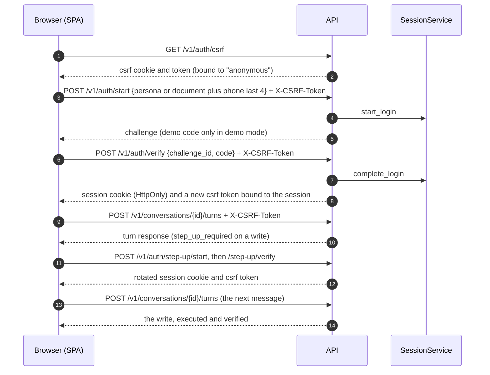

# HTTP API

The API is a FastAPI application over the application core (`services/api/src/bank_agent/api`). Routers only map request models to use cases and use-case results to response models; every rule lives in the engine, the policy kernel, and the tools. The contract is `contracts/openapi.json`, exported by `make openapi`, which also regenerates the frontend types in `apps/web/src/shared/api/generated/schema.d.ts`. Tests fail when either file is stale.

## Endpoint catalog

Roles: `anyone` needs no session; the others need a session of that role. CSRF: the operation needs `X-CSRF-Token` (see "Auth model"). Rate class: the limit that applies per client IP and per session.

| Method | Path | Role | CSRF | Rate class |
|---|---|---|---|---|
| GET | `/health/live` | anyone | no | none |
| GET | `/health/ready` | anyone | no | none |
| GET | `/v1/auth/csrf` | anyone | no | auth |
| POST | `/v1/auth/start` | anyone | yes | auth |
| POST | `/v1/auth/verify` | anyone | yes | auth |
| POST | `/v1/auth/step-up/start` | agent, customer, evaluator | yes | auth |
| POST | `/v1/auth/step-up/verify` | agent, customer, evaluator | yes | auth |
| POST | `/v1/auth/logout` | anyone | yes | auth |
| GET | `/v1/auth/me` | agent, customer, evaluator | no | read |
| POST | `/v1/conversations` | customer | yes | write |
| POST | `/v1/conversations/{conversation_id}/turns` | customer | yes | write |
| GET | `/v1/conversations/{conversation_id}` | customer | no | read |
| GET | `/v1/conversations/{conversation_id}/trace` | customer | no | read |
| GET | `/v1/agent/handoffs` | agent | no | read |
| GET | `/v1/agent/handoffs/{handoff_id}` | agent | no | read |
| POST | `/v1/agent/handoffs/{handoff_id}/claim` | agent | yes | write |
| POST | `/v1/agent/handoffs/{handoff_id}/resolve` | agent | yes | write |
| GET | `/v1/agent/credit-applications` | agent | no | read |
| GET | `/v1/agent/credit-applications/{application_id}` | agent | no | read |
| GET | `/v1/eval/summaries` | evaluator (anyone when `EVAL_SUMMARIES_PUBLIC=true`) | no | read |
| GET | `/v1/eval/conversations/{conversation_id}/trace` | evaluator | no | read |

`services/api/tests/unit/api/test_api_docs.py` fails when this table and the OpenAPI document disagree.

Notes on the catalog:

- **One set of conversation endpoints serves all four workflows.** The engine's router picks the workflow per turn; the response names it (`workflow`, with `router@1` before one is chosen) and carries every part the chat renders: text, citations (`clause_id@version` plus the rendered excerpt), clarification options, one confirmation card (dispute, card action, or credit intake), action statuses with their verification evidence, the escalation reference, the step-up request, notices, balances with their as-of instant, payment statuses, a statement summary, card status, credit product views, and the customer-facing eligibility view.
- **Turns are idempotent.** The body is `{turn_id, text}` with a client-made UUID; sending the same `turn_id` again returns the stored result with `replayed: true`, and a `turn_id` used in another conversation is a `409`. Text has 1 to 2,000 characters.
- **Traces have two views.** The customer trace (own conversations only) shows that a risk estimate was used and which model made it, never its probability, interval, band, or flags, and leaves out the session id, trust events, risk tier, and safety interventions. The evaluator trace (any conversation) has everything, the internal risk estimates included. The prompt placed both under `/v1/conversations/{id}/trace`; they are separate operations so each role has one exact schema and the credit exposure test can check the customer one.
- **Agents never read conversations.** They see structured handoffs (verified facts, actions taken, policy basis, open questions, and the credit review with its internal estimate) and the credit application intakes: every reviewable one (status `submitted` or `under_human_review`, a review item of its own even without a handoff) plus any a handoff references, newest first, read only (status moves for agents come in phase 16). Claims and resolutions are audited.
- **Evaluation summaries** are offline measurements published by the evaluation harness (phase 14) into `EVAL_SUMMARIES_DIR`, always with the per-workflow numbers next to the aggregate. The list is empty until a run is published.

## Auth model



- **Sessions** are server-side and opaque ([ADR 0008](../adr/0008-server-side-opaque-sessions.md)): 15-minute idle and 60-minute absolute expiry, rotation on step-up, a 5-minute step-up window, revocation on logout and when a browser signs in again. Identification alone never creates a session.
- **Cookies** ([ADR 0031](../adr/0031-cookie-sessions-with-signed-double-submit-csrf.md)): production uses `__Host-session` (`HttpOnly`, `Secure`, `SameSite=Strict`, `Path=/`) and `__Host-csrf` (readable); development and test use `session` and `csrf` with the same flags except `Secure`, because the local servers speak plain http. A `401` with `authentication-required` or `session-expired` also deletes the session cookie when the request carried one, so a stale cookie does not linger until the next login; other `401`s (a wrong code during step-up) keep it. Logout does not send `Clear-Site-Data`: `"cookies"` would also drop the anonymous CSRF cookie the same response sets, and `"storage"` would erase the viewer's theme and language.
- **CSRF**: a signed double-submit token. Fetch it from `GET /v1/auth/csrf` (or take it from the login and step-up responses) and echo it in `X-CSRF-Token` on every POST. It is bound to the current session, so it changes on login, step-up, and logout. After a `401` or a `csrf-token-invalid` problem, fetch a new one.
- **Roles**: `customer`, `agent`, and `evaluator`, enforced per route (a wrong role is `403 role-not-permitted`). Another customer's conversation is a `404` with the same body as a missing one, from the same single scoped query.
- **Step-up and re-authentication**: a write asks for step-up in the turn response (`step_up_required: true`); after `POST /v1/auth/step-up/verify` the client sends the next message and the engine executes the pending write. An expired session is a `401 session-expired`; after a new login, the next message resumes the conversation at its last safe state and asks the question there again.
- **Limits**: 16 KiB bodies (`413`), field limits (`422`), and per-minute rate limits by class (defaults per IP and per session: auth 10 and 10, write 30 and 20, read 120 and 60; `429` with `Retry-After`). Health checks are not limited. Counters live in each API process.
- **Headers** on every response: `Content-Security-Policy: default-src 'none'; frame-ancestors 'none'; base-uri 'none'; form-action 'none'`, `X-Content-Type-Options: nosniff`, `Referrer-Policy: no-referrer`, a `Permissions-Policy` that disables device features, `X-Frame-Options: DENY`, `Cross-Origin-Opener-Policy` and `Cross-Origin-Resource-Policy: same-origin`, `Cache-Control: no-store` on `/v1`, and HSTS in production. The development docs page (`/docs`) gets a CSP that allows the Swagger UI assets; docs are disabled in production.
- **CORS**: an allowlist (`CORS_ALLOWED_ORIGINS`), credentials only for listed origins, methods GET and POST. In production the SPA is same-origin behind Caddy, so CORS matters only in development.

## Error types

Every error is RFC 9457 problem details (`application/problem+json`) with `type`, `title`, `status`, `instance`, the `request_id`, and, for validation errors, `errors` (location and error type only, never the rejected value). Stack traces and error messages never leave the process. The `type` URIs are `https://bank-agent.local/problems/<slug>`:

| Status | Slug | When |
|---|---|---|
| 401 | `authentication-required` | No session, an unknown token, or a revoked session |
| 401 | `session-expired` | The session passed its idle or absolute expiry |
| 401 | `verification-failed` | A wrong code or an unknown identification (one message for both) |
| 401 | `code-expired` | The one-time code is older than 5 minutes |
| 403 | `csrf-token-invalid` | Missing, mismatched, or foreign CSRF token |
| 403 | `role-not-permitted` | The session's role may not call the operation |
| 403 | `step-up-required`, `action-not-permitted` | Domain authorization errors |
| 404 | `resource-not-found` | Unknown or another customer's resource |
| 409 | `conflict`, `invalid-state-transition` | A turn id from another conversation, an illegal handoff move, a concurrent update |
| 413 | `payload-too-large` | The body is over the limit |
| 422 | `validation-error`, `unprocessable-request` | Request validation, or a domain invariant |
| 429 | `rate-limited`, `identity-locked` | A rate limit, or five failed codes (15-minute lockout); both send `Retry-After` |
| 503 | `service-unavailable`, `dependency-unavailable` | Identity not configured (`SESSION_SECRET`), or a dependency failed |
| 500 | `internal-error` | Anything unexpected (logged with the request id) |

## Versioning

- Paths carry the major version (`/v1`). Additive changes (a new optional request field, a new response field, a new operation, a new enum value) stay in `v1`; anything that can break a client (removing or renaming a field, narrowing a type, changing a meaning) needs `/v2` next to `/v1` for a transition period.
- Operation ids are explicit and stable (`conversations_send_turn`, `agent_claim_handoff`, ...); the generated client keys on them.
- `info.version` is the `bank-agent` package version. `contracts/openapi.json` is regenerated in the same commit as the change that alters it.

## Running it

```bash
make up && make seed                                   # PostgreSQL with the demo personas
uv run uvicorn bank_agent.asgi:create_app --factory    # reads .env; docs at http://localhost:8000/docs
make api-local-llm                                     # the same with the opt-in local Ollama model
make openapi                                           # after any API change
```
