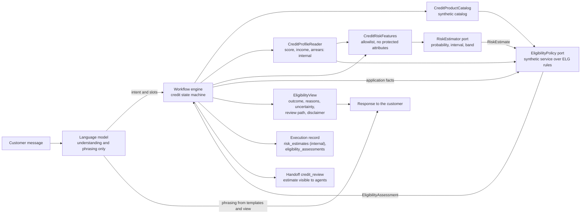

# Credit separation

The brief requires that credit workflows separate conversation handling, predictive risk estimates, and eligibility policy, use a clearly labeled synthetic policy service, never let the conversational model invent rules or approve credit, and show explanations, uncertainty, and review paths. [ADR 0021](../adr/0021-credit-risk-and-eligibility-separation.md) records the decision; this page shows how the parts connect.

## Components and data flow

An arrow means "passes data to". The language model has no edge to the risk estimate, the credit profile, or the `ELG` rules.

## Rules

| Rule | Where it is enforced |
|---|---|
| The model never receives the estimate or the credit profile | Both are marked `Internal()`; the prompt registry refuses any prompt input named after an internal field or a risk feature (`forbidden_variable_reason`), and `phrase_response` declares only the outcome code, the rendered reasons, and the disclaimer; the view has no such field |
| The model never invents eligibility rules or implies approval | Eligibility comes only from `EligibilityPolicy`; no outcome or status means approved (a vocabulary test); graders flag `credit_approval_claim` (scenario disclosure kind) |
| The estimate is predictive only | `RiskEstimator` returns a probability, interval, band, and flags, never an outcome; it raises `risk_estimator_unavailable` instead of guessing |
| Missing data leads to review | A missing fact gives `insufficient_data` or `review_required`, never `indicatively_eligible` (model validator plus a property test); a missing estimate or an `unknown` band gives `review_required` |
| Protected and proxy attributes are excluded | `CreditRiskFeatures` is an allowlist with no gender, age, marital status, accent, location below country, segment, occupation, or education level |
| Everything is labeled synthetic | Catalog entries, assessments (`eligibility:synthetic@<pack>`), estimates, and intakes carry a literal `True` marker; the view carries the "indicative, not an offer or a decision" disclaimer |
| Estimates and assessments stay apart in the records | Separate execution record fields; the glass box (phase 13) shows them separately |
| Agents see the estimate, customers never do | `CreditReview.risk` in the handoff and `ExecutionRecord.risk_estimates` are internal; customer DTOs (phase 11) strip `internal_fields` |

## Outcomes and review paths

| Outcome | Meaning | Review path offered | Uncertainty statement |
|---|---|---|---|
| `indicatively_eligible` | Every `ELG` rule passed and nothing is missing | Submit an application intake for human review | Indicative only |
| `not_eligible` | At least one rule failed, with its clause | Talk to a human | Indicative only |
| `review_required` | Borderline estimate, missing estimate, arrears, amount above the review threshold, contested result, or a product that needs a human assessment (mortgages) | Talk to a human | Borderline estimate, estimate unavailable, or indicative only |
| `insufficient_data` | A needed fact is missing (for example income) | Provide the missing information | Missing information |

A submitted intake is a review item of its own, listed for agents in phase 13; its statuses are `submitted`, `under_human_review`, `withdrawn`, and `closed`. There is no approved or declined status.

## Implementation

The `EligibilityPolicy` port is implemented by `SyntheticEligibilityService` on the policy kernel (phase 06, [ADR 0011](../adr/0011-policy-as-data-and-pure-rule-functions.md)). Its rules, parameters per jurisdiction and product, outcome mapping, and customer-facing rendering are in [docs/policy/eligibility.md](../policy/eligibility.md); the synthetic catalog is under `policies/credit/` and listed in the [policy catalog](../policy/catalog.md#credit-catalog).
