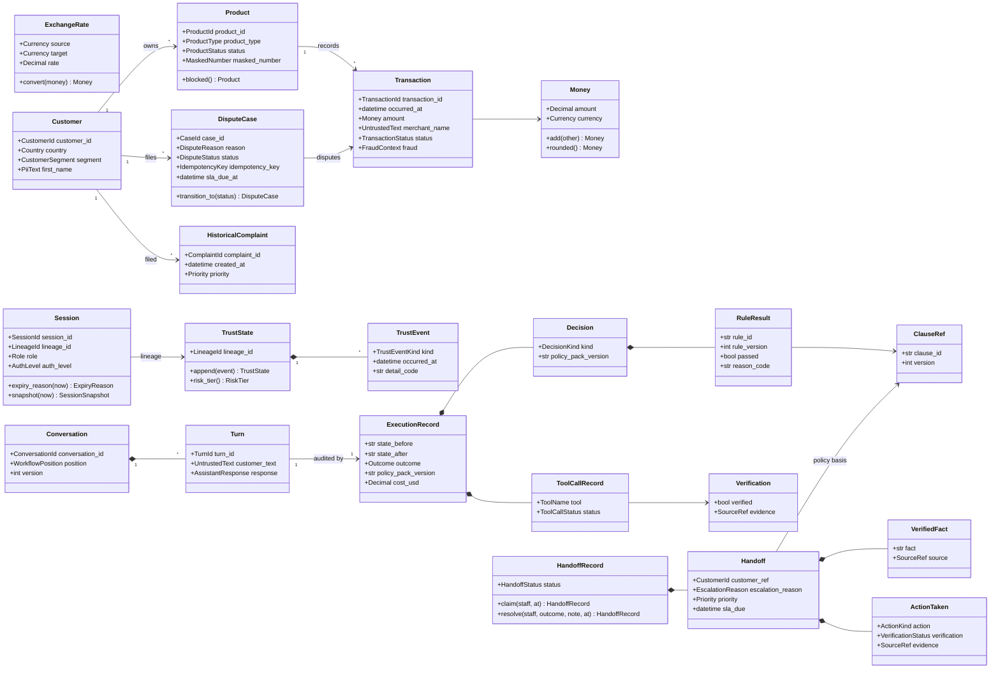
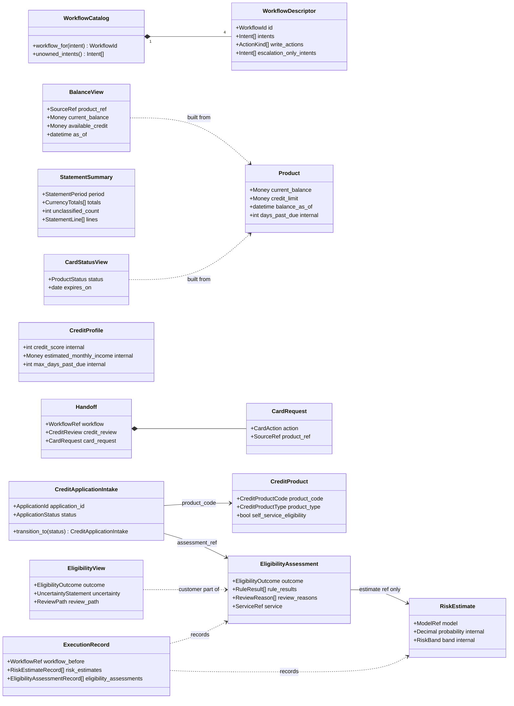
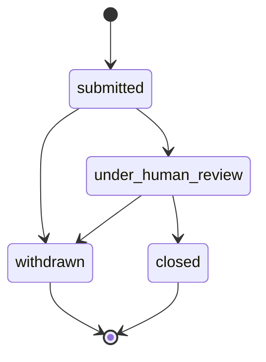
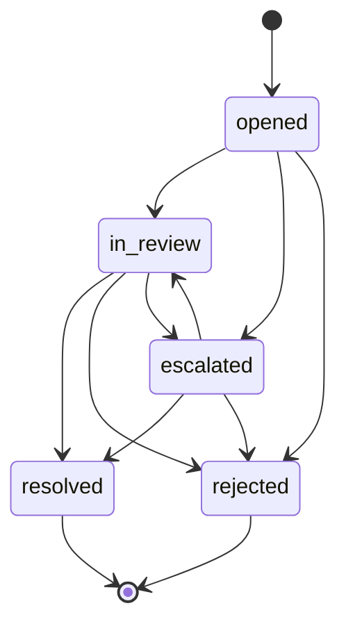

# Domain model

The domain layer (`services/api/src/bank_agent/domain`) holds the vocabulary of the four workflows (account inquiries, card support, disputes, and credit): value objects, entities, the trust state, workflow concepts, the handoff and execution record contracts, and the error taxonomy. It is pure: no I/O, no framework, no configuration. Every model is an immutable Pydantic model that rejects unknown keys; entities change by returning a validated copy (`evolve`, or a named method such as `transition_to`).

Approved at the phase 02 checkpoint on 2026-09-26 and extended by phase 02b for the four workflows ([the phase 02 plan](../plans/phase-02.md), [the phase 02b plan](../plans/phase-02b.md)). The workflow registry is described in [workflow-registry.md](workflow-registry.md) and the credit separation in [credit-separation.md](credit-separation.md).

## Class diagram

## Multi-workflow additions (phase 02b)

New types, and existing types that gained fields (existing fields omitted):

| Module | Contents |
|---|---|
| `workflow.py` | `WorkflowId`, seventeen `Intent` members, `CROSS_WORKFLOW_INTENTS` |
| `workflow_catalog.py` | `WorkflowDescriptor`, `WorkflowCatalog`, `WORKFLOW_CATALOG`, `CARD_ACTION_HANDLING` |
| `escalation.py` | `EscalationReasonCode` (re-exported by `handoff.py`), with the card and credit codes |
| `accounts.py` | `BalanceView`, `available_credit` over an explicit `CreditBalanceConvention`, `PaymentStatusView`, `StatementPeriod`, `StatementSummary` with totals per currency |
| `cards.py` | `CardAction`, `CardBlockReason`, `CardStatusView`, `CardRequest` |
| `credit.py` | `CreditProduct`, `CreditProfile`, `ApplicationStatus`, `CreditApplicationIntake` and its lifecycle |
| `eligibility.py` | `CreditRiskFeatures`, `RiskEstimate`, `EligibilityOutcome`, `ReviewReason`, `ServiceRef`, `EligibilityAssessment`, `EligibilityView`, `CreditReview`, and the execution record entries |

`AssistantResponse` gained balances, payment statuses, a statement, card statuses, credit products, the eligibility view, and two confirmation variants next to the dispute card (`card_action_confirmation`, `credit_intake_confirmation`); a response asks for at most one confirmation. `Product` gained optional balance, limit, rate, date, and days-past-due fields; `TransactionQuery` a `types` filter; `BlockCardArguments` an optional reason.

## Credit application lifecycle

An intake records an application for human review; it never decides and never moves money. There is no approved or declined status: a reviewer outside the prototype decides. A customer can only withdraw; reviewers move applications to review and close them (phase 13). Illegal moves raise `InvalidApplicationTransitionError`.

## Modules

| Module | Contents |
|---|---|
| `base.py` | `DomainModel` (frozen, extra keys forbidden, `evolve`), the `Pii` and `Internal` markers with `pii_fields` and `internal_fields`, `UtcDatetime`, `UntrustedText`, `Code`, `SingleLineText`, `SummaryText` |
| `errors.py` | The error taxonomy with stable codes (see below) |
| `money.py` | `Currency`, `Money`, `ExchangeRate` ([ADR 0004](../adr/0004-money-and-currency-handling.md)) |
| `locale.py` | `Country`, `CountryCode`, `Language`, `Locale` |
| `identifiers.py` | Typed identifiers (`CustomerId`, `CaseId`, `TurnId`, and so on), `IdKind`, `SourceRef` (`table:id`) |
| `masking.py` | `MaskedNumber` (last four characters only) |
| `access.py` | `AuthLevel`, `Role`, `Channel`, `AccessContext` |
| `customer.py`, `product.py`, `transaction.py`, `complaint.py` | Banking entities |
| `dispute.py` | `DisputeReason`, `DisputeStatus`, `DisputeCase` and its lifecycle |
| `session.py`, `identity.py` | Sessions, session snapshots, token digests, identification, one-time-code challenges |
| `trust.py` | `TrustEvent`, `TrustState`, `RiskTier` ([ADR 0005](../adr/0005-trust-state-append-only.md)) |
| `workflow.py` | `StateName`, `Intent`, `Outcome`, `WorkflowRef` |
| `intelligence.py` | Model and prompt references, intent predictions, transaction descriptors and resolutions, language detection, retrieval, model artifacts, language model results |
| `decision.py` | `DecisionKind`, `ClauseRef`, `RuleResult`, `Decision` |
| `actions.py` | `ActionKind`, `ToolName`, `ToolFailureMode`, `ActionRequest`, `ActionResult`, `Verification` |
| `policy.py` | `ClauseMetadata`, `PolicyClause`, `ActionRequirement` |
| `conversation.py` | `Conversation`, `WorkflowPosition`, `Turn`, `AssistantResponse` and its parts, `TurnResult` |
| `handoff.py` | `Handoff` version 1 and `HandoffRecord` ([ADR 0006](../adr/0006-handoff-and-execution-record-contracts.md)) |
| `execution_record.py` | `ExecutionRecord` version 1 |
| `audit.py` | `AuditEvent` |

## Dispute case lifecycle

Self-transitions and any transition out of `resolved` or `rejected` raise `InvalidCaseTransitionError`, and a change dated before the last update is refused. There is no `opened` to `resolved` shortcut. `DisputeCase.open` copies the customer, product, and amount from the transaction, so a case cannot point at another customer's transaction.

## Handoff lifecycle

A `Handoff` document never changes after it is stored. Its `HandoffRecord` moves from `open` to `claimed` (by one agent) to `resolved` (by the same agent, with an outcome code and a note).

## Trust state

| Severity | Event kinds |
|---|---|
| Low | `failed_otp`, `unusual_amount` |
| Medium | `otp_lockout`, `injection_detected`, `third_party_admission` |
| High | `cross_customer_probe`, `identity_mismatch` |

The risk tier is the highest reached by these rules: one medium event gives `elevated`; one high event gives `high`; two medium-or-higher events give `high`; three low events give `elevated`. The tier never decreases as events are appended, and the state is keyed by the session lineage, which survives rotation and re-authentication into the same conversation.

## Personal and internal data

| Model | Field | Marker |
|---|---|---|
| `Customer` | `first_name` | `Pii("name")` |
| `Turn` | `customer_text` | `Pii("free_text")` |
| `DocumentIdentification` | `document_number`, `phone_last4` | `Pii("document_number")`, `Pii("phone")`; hidden from `repr` |
| `OtpDispatch`, `OtpDeliveryReceipt` | `code`, `demo_code` | `Pii("credential")`; hidden from `repr` |
| `HandoffResolution` | `note` | `Pii("free_text")` |
| `Transaction` | `fraud` (label and score) | `Internal()`; hidden from `repr`, never rendered or sent to a model |
| `Product` | `days_past_due` | `Internal()` |
| `CreditProfile` | `credit_score`, `estimated_monthly_income`, `max_days_past_due`, `utilization` | `Internal()` |
| `CreditApplicationIntake`, `SubmitCreditApplicationArguments`, `CreditApplicationFacts` | `declared_monthly_income` | `Pii("financial")` |
| `RiskEstimate`, `RiskEstimateRecord` | `probability`, `interval_low`, `interval_high`, `band` | `Internal()` |
| `ExecutionRecord` | `risk_estimates` | `Internal()` |
| `CreditReview` (in `Handoff`) | `risk` | `Internal()`; agents see it, customers never do |
| `EligibilityRequest` | `profile`, `risk_estimate` | `Internal()` |

Document numbers, phones, emails, birth dates, and addresses never enter the domain `Customer`, and credit facts live in the separate `CreditProfile`. No response part and no handoff field carries personal data (the tests pin `pii_fields(Turn)` and `pii_fields(HandoffRecord)`). Customer and record text travels as `UntrustedText`, which prompt builders must wrap as data.

## Error taxonomy

Every error has a stable snake-case `code` and a `retryable` flag, and its message never contains personal data. `bank_agent/api/domain_problems.py` maps the families to problem types:

| Family | Status | Examples |
|---|---|---|
| `NotFoundError` | 404 | `case_not_found`, `credit_application_not_found`; another customer's resource raises the same error |
| `AuthenticationError` | 401 | `session_expired` (own problem type), `identity_challenge_failed` (deliberately generic), `identity_locked` |
| `AuthorizationError` | 403 (500 for `access_context_invalid`) | `step_up_required` (own problem type), `auth_level_insufficient` |
| `ConflictError` | 409 | `idempotency_key_conflict`, `concurrency_conflict`, `append_only_violation` |
| `StateTransitionError` | 409 | `case_transition_invalid`, `product_state_invalid`, `credit_application_transition_invalid` |
| `InvariantViolationError` | 422 | `currency_mismatch`, `money_precision_exceeded`, `trust_state_append_only` |
| `DependencyError` | 503 | the LLM, tool, and model artifact errors, `risk_estimator_unavailable` (never retried; the eligibility service falls back to review), `eligibility_service_unavailable` |
| `ConfigurationError` | 500 | `prompt_not_found`, `policy_binding_missing` |

## Limitations

- The dataset's `response_code` is not interpreted, because the data has no code table; declined card purchases are shown without a reason.
- Available credit is not computed until phase 03 records whether a credit balance is the amount owed or negative when owed; transfers and adjustments are `unclassified` in statement totals until phase 03 profiles amount signs.

## Contracts

The handoff, execution record, decision, scenario, and policy clause models (version `1.1.0`) are published as JSON Schemas in [`contracts/schemas/`](../../contracts/README.md), generated by `make contracts`, with a test that fails when they are stale.
