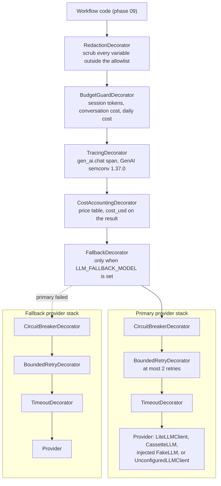

# LLM gateway

The language model understands; deterministic code decides. Every model call goes through one port, `LLMClient` (`services/api/src/bank_agent/ports/llm.py`), with structured outputs derived from Pydantic models, versioned prompts, and cross-cutting behavior added as decorators that implement the same port ([ADR 0013](../adr/0013-litellm-behind-a-port-with-composable-decorators.md)). Callers handle every LLM error by falling back to deterministic behavior (clarify, abstain, or hand off).

**Provider status.** The human has not chosen a provider. The LiteLLM adapter exists but nothing calls a live provider: tests use `FakeLLM` or cassettes, the default setting (`LLM_PROVIDER=fake` with no injected client) refuses every call, and the committed cassettes are hand-authored fixtures. Model choice is decided by evaluation in phase 14.

## Decorator stack

The composition root (`bootstrap/llm.py`, `build_llm_client`) builds the stack from settings. Outermost first:



Why this order:

- Redaction is outermost, so nothing below it (tracing, cassettes, providers) ever sees raw personal data.
- The budget guard refuses before anything is spent or traced.
- Tracing wraps cost accounting, so each span carries the call's cost; cost accounting wraps the fallback, so it prices whichever model answered.
- Each provider has its own breaker, retries, and timeout: a failing primary opens only its own circuit. The timeout bounds one attempt; the retry above it decides whether to try again.

`STACK_ORDER` in `bootstrap/llm.py` states the order, and `tests/unit/bootstrap/test_llm_composition.py` walks the built chain and asserts it.

## Providers

| `LLM_PROVIDER` | Base client | Notes |
|---|---|---|
| `fake` (default) | The client injected through `LlmOverrides` (tests, evaluation harness), otherwise `UnconfiguredLLMClient` | The unconfigured client raises `LlmProviderRejectedError` (never retried), so workflows run deterministically |
| `cassette` | `CassetteLLM` in replay mode, keyed by `LLM_PRIMARY_MODEL` | Record mode (`LLM_CASSETTE_MODE=record`) wraps `LiteLLMClient` and is refused in production |
| `litellm` | `LiteLLMClient` | Needs the optional `litellm` extra, `LLM_PRIMARY_MODEL`, and a key for every hosted model; local Ollama models (`ollama/...`, `ollama_chat/...`) need no key. `LLM_API_BASE` sets the provider base URL (https only in production) |

`LiteLLMClient` is `PromptedLLMClient` (provider-neutral: rendering, the language directive, structured output, repair) over `LiteLLMCompletion` (one `litellm.acompletion` call with explicit model, key, timeout, and `num_retries=0`).

## Structured outputs

1. The registry renders the prompt; untrusted variables are wrapped in data delimiters.
2. The client appends the session language directive and, for a structured call, the JSON Schema of the output model (`model_json_schema()`), and also sends the schema as `response_format`.
3. The reply is parsed as one JSON object with floats read as `Decimal`, then validated.
4. On failure, exactly one repair attempt quotes the validation errors (field paths and messages, never the rejected values). A second failure raises `LlmInvalidOutputError`.

## Error handling per decorator

| Decorator | Raises | Handles | Passes through |
|---|---|---|---|
| `RedactionDecorator` | nothing | nothing | everything |
| `BudgetGuardDecorator` | `LlmBudgetExceededError` before the call | keeps the reservation after `invalid_output` and `timeout` (the provider may have billed); releases it after any other error | everything from below |
| `TracingDecorator` | nothing | records `error.type` with the error code on the span and the duration metric | everything |
| `CostAccountingDecorator` | nothing | nothing (prices only successful replies) | everything |
| `FallbackDecorator` | the fallback's error, chained to the primary's | any LLM error from the primary sends the request to the fallback | `LlmBudgetExceededError` (never falls back) |
| `CircuitBreakerDecorator` | `LlmCircuitOpenError` while open, or when the half-open trial slots are taken | counts `retryable` errors (timeout, rate limited, provider error) as failures; invalid output and rejections count as successes | everything |
| `BoundedRetryDecorator` | the last error after two retries | retries `retryable` errors with exponential backoff and jitter | `invalid_output`, `provider_rejected`, budget and circuit errors (no retry) |
| `TimeoutDecorator` | `LlmTimeoutError` when an attempt exceeds `LLM_TIMEOUT_SECONDS` | converts `TimeoutError` | everything else |
| `PromptedLLMClient` | `LlmInvalidOutputError` after one repair; `ConfigurationError` when the output model disagrees with the prompt | JSON and validation failures (one repair) | provider errors |
| `LiteLLMCompletion` | the mapped LLM error, not chained (provider text may quote the request) | maps 408 and 504 and timeout classes to `timeout`, 429 to `rate_limited`, other 4xx to `provider_rejected`, everything else to `provider_error` | typed LLM errors |
| `CassetteLLM` | `CassetteMissingError` and `CassetteMismatchError` (configuration errors, deliberately outside the LLM family so a caller's fallback cannot hide them); `LlmInvalidOutputError` when a recording no longer fits the output model | nothing | everything from the inner client in record mode |

## Budgets and prices

- Caps: `LLM_SESSION_TOKEN_LIMIT` per session lineage, `LLM_CONVERSATION_BUDGET_USD` per conversation, `LLM_DAILY_BUDGET_USD` per UTC day. A call without a lineage or conversation id is subject only to the daily cap.
- Before a call the guard reserves `max_output_tokens` at the highest effective output price among the configured models.
- Prices live only in `services/api/config/llm_prices.yaml`: model id, input and output price per million tokens, date, source URL, and `verified`. Unverified entries are charged at `unverified_price_multiplier` (1.5 today); unknown models at the highest known prices times the multiplier. Every current entry is an unverified candidate (Anthropic `claude-sonnet-5` and `claude-haiku-4-5-20251001`, OpenAI `gpt-5-mini`) that a person must confirm against its source.
- Costs round up to eight decimal places.
- **The ledger is shared** (phase 15): with a database configured (`LLM_BUDGET_LEDGER=auto`, the default), the counters live in `app.llm_budget` (migration `0011`) and a reservation locks the session, conversation, and day rows in a fixed order in one transaction, so several API workers enforce the same caps. Without a database, or with `LLM_BUDGET_LEDGER=memory`, the ledger is per process (tests, the evaluation harness). A ledger that cannot be read refuses the call; a settle that fails keeps the worst case reserved.
- **80 and 100 percent**: the guard remembers the day's spend it last saw; at 80 percent of the daily cap it logs `llm_budget_alert` once a day (and the `LlmBudgetAt80Percent` alert fires on `bank.llm.budget.daily_used_ratio`); when the daily cap refuses a call, the degradation ladder switches to template-only mode (L2) until the next UTC day ([degradation](../operations/degradation.md)).

## Tracing

One `gen_ai.chat` span per logical call (the `Telemetry` port requires dot-separated names, so the convention's `chat {model}` name becomes attributes). Attributes: `gen_ai.operation.name`, `gen_ai.provider.name`, `gen_ai.request.model`, `gen_ai.request.max_tokens`, `gen_ai.request.temperature`, `gen_ai.output.type`, `gen_ai.response.model`, `gen_ai.usage.input_tokens`, `gen_ai.usage.output_tokens`, `error.type`, plus `bank.prompt.id`, `bank.prompt.version`, `bank.language`, `bank.llm.latency_ms`, `bank.llm.cost_usd`, `bank.llm.repaired`. Metrics: `gen_ai.client.operation.duration` and `gen_ai.client.token.usage` histograms, and `bank.llm.cost_usd`. Phase 15 exports them through the OpenTelemetry adapter, whose tracer and meter carry the schema URL `https://opentelemetry.io/schemas/1.37.0` (the pinned `GENAI_SEMCONV_VERSION`); the circuit states, budget refusals, and the daily ratio are gauges and counters of the degradation monitor ([observability](../operations/observability.md)). Content capture (`LLM_TRACE_CONTENT`) is off by default and refused in production; when on, spans carry the already redacted variables and the output.

## Opt-in local model (development only)

A developer with [Ollama](https://ollama.com) serving `qwen2.5:7b-instruct` can run the gateway against it without changing any default:

```bash
LLM_PROVIDER=litellm LLM_PRIMARY_MODEL=ollama/qwen2.5:7b-instruct LLM_API_BASE=http://localhost:11434 make llm-smoke
make api-local-llm                    # the API on 127.0.0.1:8000 with the same three settings
```

- `make llm-smoke` (`scripts/llm_smoke.py`) runs every committed fixture cassette case (es and pt, the four workflows' extraction prompts plus phrasing, 32 cases) through the full decorator stack, validates each structured reply against its output model, and prints a pass/fail and latency table. It checks that the Ollama server answers and the model is pulled before the first call, and exits 2 with the fix when it does not. It is never part of `make check` or CI.
- Both targets use `uv run --extra litellm`, which installs the optional extra; uv keeps it in the environment afterwards (`uv sync --frozen --all-packages` removes it again). `make setup` and CI never install it.
- The price table lists the model at zero cost, `verified: true`, noted as local, so the budget guard does not charge the unverified multiplier.
- Measured once on the developer's machine (phase 11): 32 of 32 cases passed, p50 4.1 s and p95 7.8 s per call, 17.9 s for the first (cold) call. This is a local development measurement of schema-valid replies, not an evaluation of answer quality.

## Cassettes

`CassetteLLM` keys each call by a SHA-256 over the prompt reference, model id, session language, and canonical JSON of the redacted variables, and stores one JSON file per call in `evals/cassettes/<prompt_id>/<version>/`. Variables and outputs are redacted before writing. Replay never calls a provider and fails loudly when a cassette is missing. See [`evals/cassettes/README.md`](../../evals/cassettes/README.md) for the format, the coverage, and how to record real cassettes.

## Limitations

- No hosted provider has been exercised: request shapes are tested against LiteLLM's documented interface with an injected completion function. The only live runs are the opt-in local Ollama smoke runs, which check schema validity, not quality.
- Without a database the budget ledger is per process; with one it is shared in PostgreSQL (phase 15).
- The Portuguese check over cassettes is lexical; it catches Spanish leakage, not awkward phrasing.
- Name redaction masks the session's known names and names introduced by phrases such as "me llamo"; a name mentioned without such a phrase passes through. Workflow code must never put names in variables (CLAUDE.md rule 6); the redaction is a second line of defense.
- Workflow callers, their fallbacks, and the grounding verifier that re-checks `summarize_for_handoff` arrive in phase 09.
