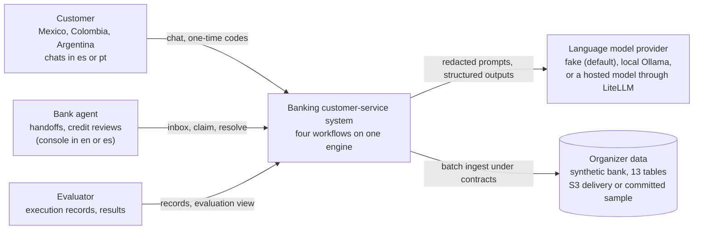
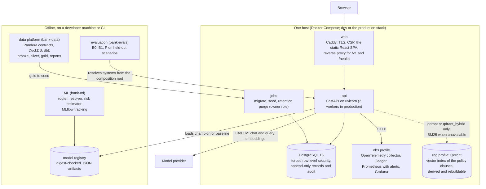
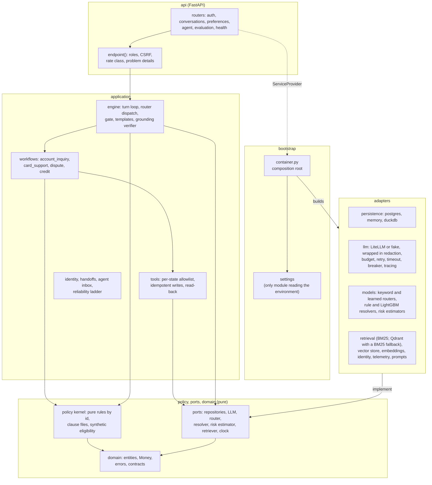
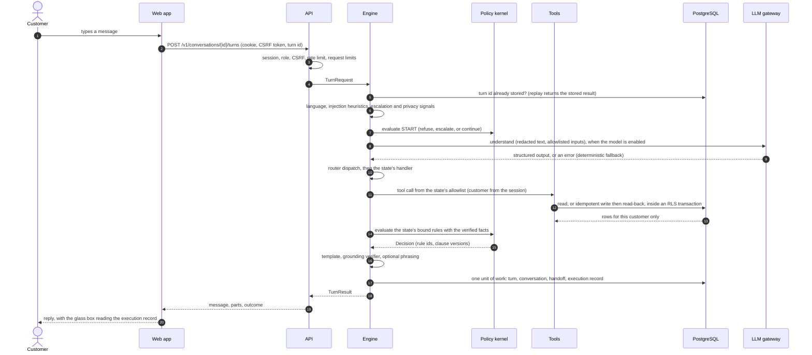

# Architecture overview

The final views of the system at three C4-like levels (context, containers, and the components of the API), drawn as flowcharts, plus the sequence of one customer turn. Details live in [domain-model.md](domain-model.md), [ports-and-adapters.md](ports-and-adapters.md), [workflow-registry.md](workflow-registry.md), [credit-separation.md](credit-separation.md), [llm-gateway.md](llm-gateway.md), and the [workflow pages](../workflows/README.md). An arrow from A to B means "A calls, reads, or depends on B".

## System context

## Containers

The production topology, hardening, and the path to managed services are in [ADR 0019](../adr/0019-single-host-compose-deployment.md) and [deploy/README.md](../../deploy/README.md); telemetry and alerts in [observability](../operations/observability.md).

## Components of the API

`api` and `bootstrap` never import each other; the entry points (`asgi.py`, `cli.py`) wire them. The evaluation harness and the CLIs resolve from the same composition root, so a provider, a model, or a store changes by settings only.

## One customer turn

## Rules the diagrams encode

- **Backend layers** import inward only (`domain` <- `ports` <- `policy` <- `application` <- `adapters` <- `api` and `bootstrap`). import-linter enforces seven contracts, among them the layers, a pure core without framework or I/O imports, production code never importing the test doubles, and the evaluation harness separation. See [ADR 0002](../adr/0002-uv-workspace-and-hexagonal-backend.md).
- **Frontend layers** import downward only (`pages` -> `features` -> `entities` -> `shared`), and features are reached only through their `index.ts`; ESLint boundary rules enforce this ([ADR 0003](../adr/0003-frontend-layering-and-state.md)).
- **The language model understands; code decides.** The model returns structured outputs validated against Pydantic models; decisions come from the policy kernel, writes from allowlisted tools, and replies from templates that pass the grounding verifier. With `LLM_PROVIDER=fake` every workflow still works on its deterministic path.
- **The API never imports the offline packages.** It reads models through the `ModelRegistry` port and data through repositories.
- **The API connects to PostgreSQL as the application role**, which owns nothing and has no `BYPASSRLS` ([data isolation](../security/data-isolation.md)).

## Quality gates

`make check` runs every gate locally, and CI runs the same gates:

| Gate | Tool |
|---|---|
| Lint and format | ruff, ESLint, Prettier |
| Types | mypy (strict), TypeScript strict |
| Boundaries | import-linter, ESLint boundary rules, each with a test proving the rules fire |
| Tests | pytest (unit with the network blocked, integration with PostgreSQL through testcontainers, contract suites per port), Vitest with MSW and vitest-axe |
| Coverage | Per-directory gates from `pyproject.toml`; 70% for web features |
| Security | bandit and gitleaks in `make check`; pip-audit, pnpm audit, hadolint, shellcheck, trivy in `make security` and CI |
| Docs | markdownlint, Mermaid parsing |
| Repository rules | No emojis, no AI attribution, the committed sample's bound |
