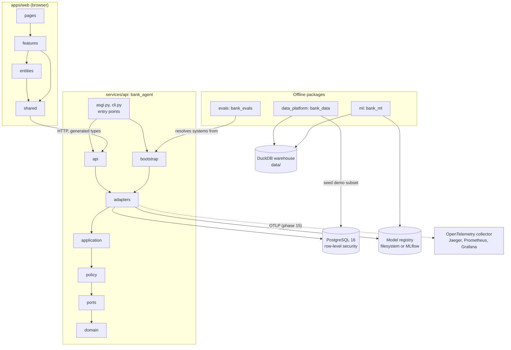

# Architecture overview

This page shows the monorepo components and the direction of their dependencies as of phase 01. Phase 17 replaces it with the final context, container, and component views.

## Components and dependency direction

An arrow from A to B means "A depends on B" (imports it, calls it, or reads from it).

## Rules the diagram encodes

- **Backend layers** import inward only. `api` and `bootstrap` are independent of each other; the entry points wire them. import-linter enforces three contracts (layers, a pure core without framework or I/O imports, and no layer importing the entry points). See [ADR 0002](../adr/0002-uv-workspace-and-hexagonal-backend.md).
- **Frontend layers** import downward only, and features are reached only through their `index.ts`. ESLint boundary policies enforce this. See [ADR 0003](../adr/0003-frontend-layering-and-state.md).
- **The API never imports the offline packages.** It reads models through the `ModelRegistry` port and data through repositories. The evaluation harness depends on the API composition root, not the other way around.
- **The API connects to PostgreSQL as the application role**, which owns nothing and has no `BYPASSRLS`. See [deploy/README.md](../../deploy/README.md).

## Quality gates

`make check` runs every gate locally and CI runs the same gates in four jobs (python, web, guards, audit):

| Gate | Tool |
|---|---|
| Lint and format | ruff, ESLint, Prettier |
| Types | mypy (strict everywhere), TypeScript strict |
| Boundaries | import-linter, eslint-plugin-boundaries, each with a test proving the rules fire |
| Tests | pytest (unit with the network blocked, integration with PostgreSQL through testcontainers), Vitest with MSW |
| Coverage | Per-layer gates from `pyproject.toml`; 70% for web features |
| Security | bandit, gitleaks, pip-audit, pnpm audit |
| Docs | markdownlint, Mermaid parsing |
| Repository rules | No emojis, no AI attribution |
