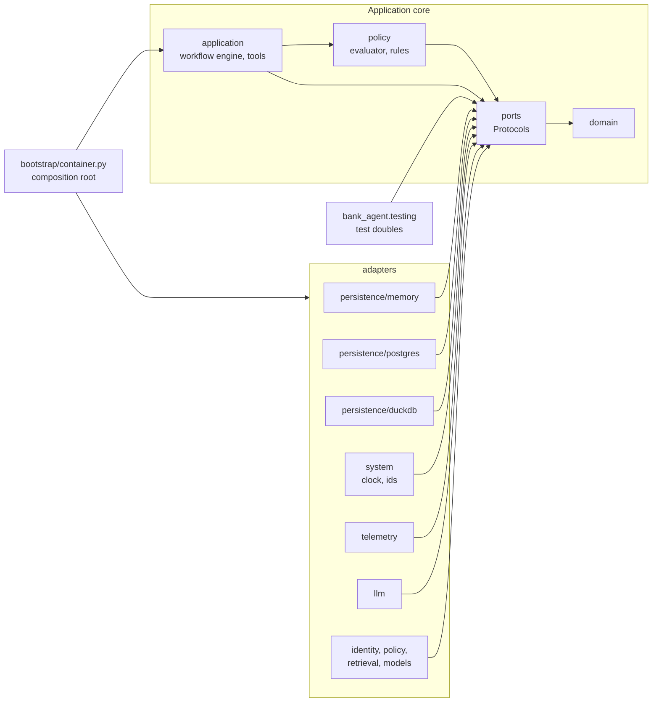

# Ports and adapters

The application reaches every external capability through a port, a `typing.Protocol` in `services/api/src/bank_agent/ports`. Adapters in `bank_agent/adapters` implement the ports, and the composition root (`bootstrap/container.py`) is the only module that chooses them. Cross-cutting behavior (retry, timeout, circuit breaker, budget guard, tracing, redaction, failure injection) is added by decorators that implement the same port and wrap another implementation.

## Structure

An arrow from A to B means "A depends on B".

`bank_agent.testing` is not a layer: production code never imports it and it imports only `domain` and `ports`. Two import-linter contracts enforce both directions.

## Isolation by construction

Repositories are bound to an `AccessContext` (role plus customer or staff id) when a unit of work creates them, and no repository method accepts a customer identifier. Another customer's resource behaves exactly like a missing one. The PostgreSQL unit of work (phase 05) also sets `app.customer_id` and `app.role` inside each transaction, so row-level security backs up the repository scoping.

Role rules every repository adapter implements identically:

| Repository | Customer | Agent | Evaluator |
|---|---|---|---|
| Customers, products, transactions, complaints | Own records | Refused | Refused |
| Cases | Own cases, all methods | `get` of a case a handoff references | Refused |
| Conversations and turns | Own | Refused | Refused |
| Execution records | Append and read own | Refused | Read all |
| Handoffs | Add and read own | Read, list, claim, resolve | Refused |
| Audit log | Append | Append | Append and list |
| Credit profiles | Read own | Refused | Refused |
| Credit applications | Create, read, list own; withdraw only | `get` and `list_for_review` of a reviewable application (`submitted`, `under_human_review`) or one a handoff's credit review references (status moves in phase 16) | Refused |

The read side of each customer-data repository is its own Protocol (`CustomerReader`, `ProductReader`, `TransactionReader`, `HistoricalComplaintReader`, `CreditProfileReader`), so read-only backends implement it without a unit of work. The credit catalog is public information and is not customer-scoped.

## Ports, adapters, and phases

Every port with its adapters as built, and the phase that added each. The default the composition root selects is marked; test doubles live in `bank_agent.testing`.

| Port | Mode | Adapters (phase) |
|---|---|---|
| `CustomerReader`, `CustomerRepository` | async | memory; DuckDB reader over gold Parquet (03); PostgreSQL (05, default) |
| `ProductReader`, `ProductRepository` | async | memory; DuckDB reader over gold Parquet (03); PostgreSQL (05, default) |
| `TransactionReader`, `TransactionRepository` | async | memory; DuckDB reader over gold Parquet (03); PostgreSQL (05, default) |
| `HistoricalComplaintReader`, `HistoricalComplaintRepository` | async | memory; DuckDB reader over gold Parquet (03); PostgreSQL (05, default) |
| `CreditProfileReader` | async | memory; DuckDB reader over gold Parquet (03); PostgreSQL (05, default) |
| `CreditApplicationRepository` | async | memory; PostgreSQL (05), with agent review moves (16) |
| `CaseRepository` | async | memory; PostgreSQL (05) |
| `ConversationRepository` | async | memory; PostgreSQL (05) |
| `ExecutionRecordRepository` | async | memory; PostgreSQL, append-only at the database level (05) |
| `HandoffRepository` | async | memory; PostgreSQL (05) |
| `AuditLog` | async | memory (in a unit of work and standalone); PostgreSQL, append-only at the database level (05) |
| `UnitOfWork`, `UnitOfWorkFactory` | async | memory; PostgreSQL with the row-level security context set in each transaction (05) |
| `SessionStore` | async | memory; PostgreSQL (05), with a deployment-wide active count (16) |
| `IdentityProvider` | async | the mock identity provider over keyed lookups (05) |
| `OtpSender` | async | `DemoOtpSender` (05); a real delivery channel is post-event work (BACKLOG) |
| `Clock` | sync | `SystemClock`; `FixedClock` (testing) |
| `IdGenerator` | sync | `RandomIdGenerator`; `SequentialIdGenerator` (testing) |
| `LLMClient` | async | `UnconfiguredLLMClient` (`LLM_PROVIDER=fake`, default), `CassetteLLM`, `LiteLLMClient` (optional extra; the local Ollama model in 14b, a hosted provider by settings), each wrapped in the decorator stack ([llm-gateway.md](llm-gateway.md)); `FakeLLM` (testing) |
| `BudgetLedger` | async | `InMemoryBudgetLedger` (08); `PostgresBudgetLedger`, shared by every worker (15, default with a database) |
| `PromptRegistry` | sync | `FilePromptRegistry` over `bank_agent/prompts/<id>/<version>.md` (08) |
| `PolicyRepository` | sync | `PolicyPack` (in memory), `FilesystemPolicyRepository` (06); `BoundPolicyLookup` resolves every state at startup (07) |
| `CreditProductCatalog` | sync | memory (fixture entries); the filesystem catalog under `policies/credit/` (06) |
| `EligibilityPolicy` | sync | the synthetic eligibility service over `ELG` rules in `bank_agent/policy/eligibility` (06); `FakeEligibilityPolicy` (testing) |
| `RiskEstimator` | sync | `risk_estimator:score_band@1` (09b, default); `logreg` and `lgbm` through `ModelRegistry` (10b); `FakeRiskEstimator` (testing) |
| `Retriever` | sync, in a worker thread | `Bm25Retriever` (07, the API default), `DenseRetriever` (optional `ml` extra), `HybridRetriever` ([grounding](../workflows/grounding.md)); `VectorRetriever` over the `VectorStore` and a hosted `Embedder`, always behind `FallbackRetriever` to BM25 ([ADR 0047](../adr/0047-qdrant-vector-index-for-knowledge-retrieval.md)) |
| `VectorStore` | sync, in a worker thread | `QdrantVectorStore` over Qdrant's REST API with httpx (the `rag` compose profile); `InMemoryVectorStore` (exact cosine search, tests and offline evaluation) |
| `Embedder` | sync, in a worker thread | `SentenceTransformerEmbedder` (optional `ml` extra) with `CachingEmbedder`; the hosted gateway `RedactingEmbedder(GatewayEmbedder(...))` over LiteLLM with cost accounting, circuit breaker, retry, and timeout; `RecordedEmbedder` (committed recording for offline evaluation); `HashingEmbedder` (testing) |
| `IntentRouter` | sync | `router:keyword@1` (09a, default); `router:tfidf` and `router:embeddings` (10a); `FakeIntentRouter` (testing) |
| `TransactionResolver` | sync | `resolver:rules@1` (09a, default); `resolver:lgbm` (10a); `FakeTransactionResolver` (testing) |
| `LanguageDetector` | sync | `language_detector:lexical@1` (09a, default); a lingua adapter waits for a size decision (pending action 22); `FakeLanguageDetector` (testing) |
| `ModelRegistry` | sync | `FilesystemModelRegistry` (10a, default); an MLflow registry adapter is optional and not built (BACKLOG) |
| `Telemetry` | sync | OpenTelemetry (15); `NoopTelemetry`; `RecordingTelemetry` (testing) |
| `DegradationSource` | sync | `DegradationMonitor` over database and model health (15) |
| `ReadinessCheck` | async | `PostgresReadinessCheck` (11) |
| `RateLimitStore` | async | the in-process sliding log; a PostgreSQL sliding-window counter shared by every worker (16, production) |
| `EvaluationSummaryReader` | async | `FilesystemEvaluationSummaries` over `evals/reports/summaries/` (13) |

Async ports may perform I/O. Sync ports run in process on data loaded at startup; a remote implementation (for example a hosted classifier) would need an async variant of the port. The exception is open retrieval: the engine calls the `Retriever` in a worker thread (`asyncio.to_thread`), so the Qdrant implementation can call the embedding provider and the store with bounded timeouts without blocking the event loop.

## Contract suites

Every adapter runs the shared suite for its port in `services/api/tests/contracts/`: one parameterized class per port. Backends are listed in `services/api/tests/bank_agent_contracts.py`: `READ_BACKENDS` for the reader suites and `WRITE_BACKENDS` for the writer, unit of work, audit, and session store suites. The memory backend is marked `unit`; the `duckdb` read backend (phase 03, `services/api/tests/bank_agent_duckdb.py`, which writes the contract dataset as gold serving Parquet with `GOLD_SCHEMAS`) and the PostgreSQL backends of phase 05 are marked `integration`. The API serves customer data from PostgreSQL, seeded from the same gold files; the DuckDB readers serve the offline packages and the contract suites. The model and determinism suites parameterize over the test doubles and the system adapters, and phases 09 and 10 add their implementations to the same lists. The credit suites (`test_credit_profile_contract.py`, `test_credit_application_contract.py`, `test_credit_catalog_contract.py`, `test_credit_model_ports_contract.py`) follow the same pattern: phases 03 and 05 added database backends, phase 06 the filesystem catalog (`filesystem`) and the synthetic eligibility service (`synthetic`), both marked `integration` because they read `policies/`, and phases 09 and 10 add the estimators.

The suites check, for every adapter: domain objects are returned; another customer's record behaves like a missing one; roles are enforced; ordering and limits are deterministic; idempotent writes return the stored result; append-only records reject changes; optimistic versions reject stale writes; session rotation retires the old token digest; trust state is append-only; and a unit of work applies writes only on commit, rolls back otherwise, and refuses a conflicting commit.

A separate conformance test checks, through mypy, that each implementation satisfies its port, and at runtime that every port docstring states preconditions, postconditions, errors, and isolation.
