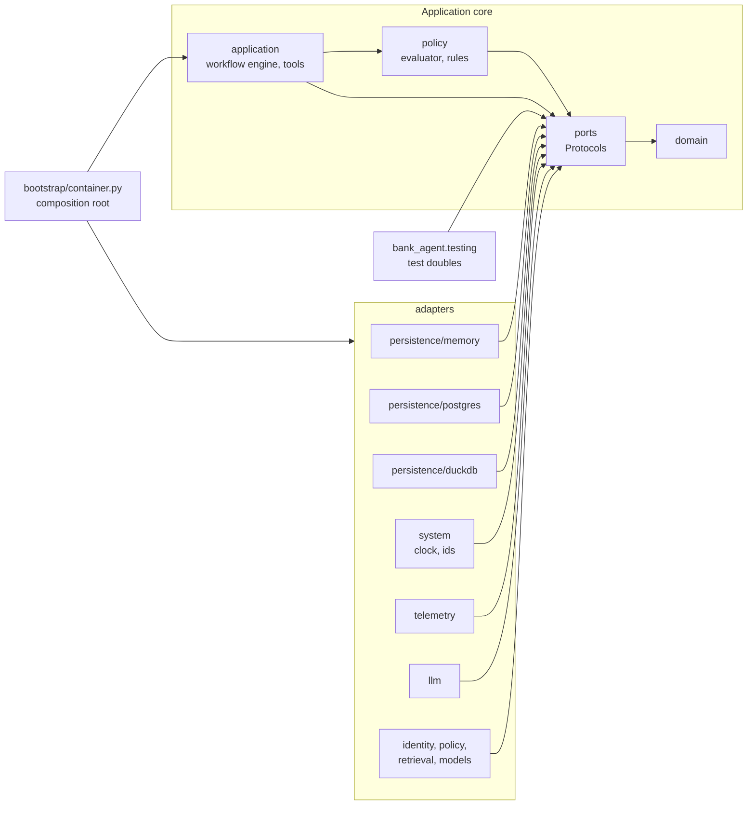

# Ports and adapters

The application reaches every external capability through a port, a `typing.Protocol` in `services/api/src/bank_agent/ports`. Adapters in `bank_agent/adapters` implement the ports, and the composition root (`bootstrap/container.py`) is the only module that chooses them. Cross-cutting behavior (retry, timeout, circuit breaker, budget guard, tracing, redaction, failure injection) is added by decorators that implement the same port and wrap another implementation.

## Structure

An arrow from A to B means "A depends on B".

`bank_agent.testing` is not a layer: production code never imports it and it imports only `domain` and `ports`. Two import-linter contracts enforce both directions.

## Isolation by construction

Repositories are bound to an `AccessContext` (role plus customer or staff id) when a unit of work creates them, and no repository method accepts a customer identifier. Another customer's resource behaves exactly like a missing one. The PostgreSQL unit of work (phase 05) also sets `app.customer_id` and `app.role` inside each transaction, so row-level security backs up the repository scoping.

Role rules every repository adapter implements identically:

| Repository | Customer | Agent | Evaluator |
|---|---|---|---|
| Customers, products, transactions, complaints | Own records | Refused | Refused |
| Cases | Own cases, all methods | `get` of a case a handoff references | Refused |
| Conversations and turns | Own | Refused | Refused |
| Execution records | Append and read own | Refused | Read all |
| Handoffs | Add and read own | Read, list, claim, resolve | Refused |
| Audit log | Append | Append | Append and list |
| Credit profiles | Read own | Refused | Refused |
| Credit applications | Create, read, list own; withdraw only | `get` and `list_for_review` of a reviewable application (`submitted`, `under_human_review`) or one a handoff's credit review references (status moves in phase 16) | Refused |

The read side of each customer-data repository is its own Protocol (`CustomerReader`, `ProductReader`, `TransactionReader`, `HistoricalComplaintReader`, `CreditProfileReader`), so read-only backends implement it without a unit of work. The credit catalog is public information and is not customer-scoped.

## Ports, adapters, and phases

| Port | Mode | Present adapters | Planned adapters (phase) |
|---|---|---|---|
| `CustomerReader`, `CustomerRepository` | async | memory; DuckDB reader over gold Parquet | PostgreSQL (05) |
| `ProductReader`, `ProductRepository` | async | memory; DuckDB reader over gold Parquet | PostgreSQL (05) |
| `TransactionReader`, `TransactionRepository` | async | memory; DuckDB reader over gold Parquet | PostgreSQL (05) |
| `HistoricalComplaintReader`, `HistoricalComplaintRepository` | async | memory; DuckDB reader over gold Parquet | PostgreSQL (05) |
| `CreditProfileReader` | async | memory; DuckDB reader over gold Parquet | PostgreSQL (05) |
| `CreditApplicationRepository` | async | memory | PostgreSQL (05) |
| `CaseRepository` | async | memory | PostgreSQL (05) |
| `ConversationRepository` | async | memory | PostgreSQL (05) |
| `ExecutionRecordRepository` | async | memory | PostgreSQL, append-only at the database level (05) |
| `HandoffRepository` | async | memory | PostgreSQL (05) |
| `AuditLog` | async | memory (in a unit of work and standalone) | PostgreSQL, append-only at the database level (05) |
| `UnitOfWork`, `UnitOfWorkFactory` | async | memory | PostgreSQL with row-level security context (05) |
| `SessionStore` | async | memory | PostgreSQL (05) |
| `IdentityProvider` | async | none | mock identity provider (05) |
| `OtpSender` | async | none | `DemoOtpSender` (05) |
| `Clock` | sync | `SystemClock`; `FixedClock` (testing) | none |
| `IdGenerator` | sync | `RandomIdGenerator`; `SequentialIdGenerator` (testing) | none |
| `LLMClient` | async | `LiteLLMClient` (optional extra), `CassetteLLM`, `UnconfiguredLLMClient`, and the decorator stack ([llm-gateway.md](llm-gateway.md)); `FakeLLM` (testing) | provider chosen by evaluation (14) |
| `PromptRegistry` | sync | `FilePromptRegistry` over `bank_agent/prompts/<id>/<version>.md` | none |
| `PolicyRepository` | sync | `PolicyPack` (in memory), `FilesystemPolicyRepository` (06); `BoundPolicyLookup` resolves every state at startup (07) | none |
| `CreditProductCatalog` | sync | memory (fixture entries) | filesystem catalog under `policies/credit/` (06) |
| `EligibilityPolicy` | sync | `FakeEligibilityPolicy` (testing) | synthetic eligibility service over `ELG` rules in `bank_agent/policy/eligibility` (06) |
| `RiskEstimator` | sync | `FakeRiskEstimator` (testing) | score-band baseline (09 part B), learned estimators through `ModelRegistry` (10) |
| `Retriever` | sync | `Bm25Retriever`, `DenseRetriever` (optional `ml` extra), `HybridRetriever` (07, [grounding](../workflows/grounding.md)) | none |
| `IntentRouter` | sync | `FakeIntentRouter` (testing) | `router:keyword@1` (09), `router:tfidf` and `router:embeddings` (10) |
| `TransactionResolver` | sync | `FakeTransactionResolver` (testing) | `resolver:rules@1` (09), `resolver:lgbm` (10) |
| `LanguageDetector` | sync | `FakeLanguageDetector` (testing) | lingua adapter (09) |
| `ModelRegistry` | sync | none | `FilesystemModelRegistry` (10a, the default); an MLflow registry adapter is optional and not built (BACKLOG) |
| `Telemetry` | sync | `NoopTelemetry`; `RecordingTelemetry` (testing) | OpenTelemetry (15) |
| `ReadinessCheck` | async | `PostgresReadinessCheck` | further dependencies (15) |

Async ports may perform I/O. Sync ports run in process on data loaded at startup; a remote implementation (for example a hosted classifier) would need an async variant of the port.

## Contract suites

Every adapter runs the shared suite for its port in `services/api/tests/contracts/`: one parameterized class per port. Backends are listed in `services/api/tests/bank_agent_contracts.py`: `READ_BACKENDS` for the reader suites and `WRITE_BACKENDS` for the writer, unit of work, audit, and session store suites. The memory backend is marked `unit`; the `duckdb` read backend (phase 03, `services/api/tests/bank_agent_duckdb.py`, which writes the contract dataset as gold serving Parquet with `GOLD_SCHEMAS`) and the PostgreSQL backends of phase 05 are marked `integration`. The DuckDB readers are not wired into the composition root yet: phase 05 seeds PostgreSQL from the same gold files and selects backends by settings. The model and determinism suites parameterize over the test doubles and the system adapters, and phases 09 and 10 add their implementations to the same lists. The credit suites (`test_credit_profile_contract.py`, `test_credit_application_contract.py`, `test_credit_catalog_contract.py`, `test_credit_model_ports_contract.py`) follow the same pattern: phases 03 and 05 added database backends, phase 06 the filesystem catalog (`filesystem`) and the synthetic eligibility service (`synthetic`), both marked `integration` because they read `policies/`, and phases 09 and 10 add the estimators.

The suites check, for every adapter: domain objects are returned; another customer's record behaves like a missing one; roles are enforced; ordering and limits are deterministic; idempotent writes return the stored result; append-only records reject changes; optimistic versions reject stale writes; session rotation retires the old token digest; trust state is append-only; and a unit of work applies writes only on commit, rolls back otherwise, and refuses a conflicting commit.

A separate conformance test checks, through mypy, that each implementation satisfies its port, and at runtime that every port docstring states preconditions, postconditions, errors, and isolation.
