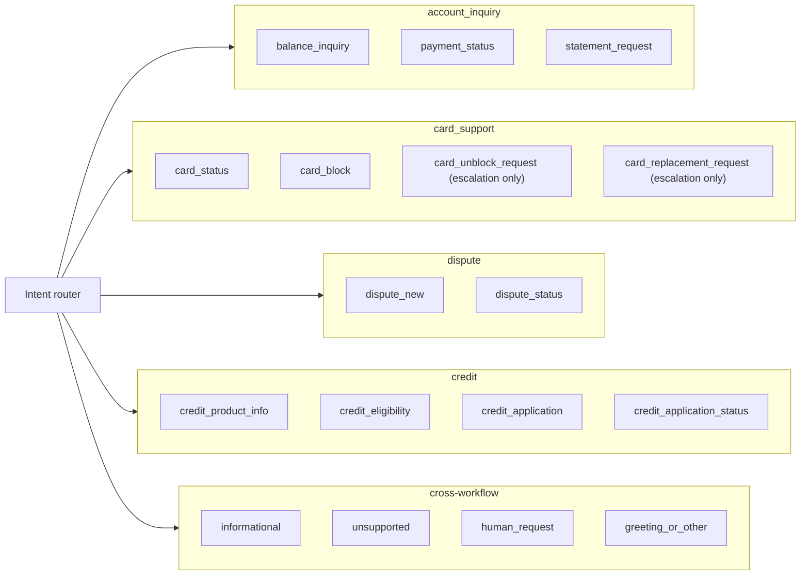

# Workflow registry

The system supports four workflows (CLAUDE.md section 1, [ADR 0020](../adr/0020-four-workflows-and-the-workflow-registry.md)). The registry is pure data in `services/api/src/bank_agent/domain/workflow_catalog.py`: `WORKFLOW_CATALOG` assigns every intent to exactly one workflow or marks it cross-workflow, and records each workflow's canonical states, write actions, escalation-only intents, and bound clause families. The router uses it to dispatch an intent and to move a conversation between workflows (recorded as `workflow_before` in the execution record); the workflow engine (phase 09) builds its state machines keyed by it. A test fails when an intent has no owner.

## Intent ownership

| Workflow | Owned intents | Write actions | Escalation-only intents | Clause families |
|---|---|---|---|---|
| `account_inquiry` | `balance_inquiry`, `payment_status`, `statement_request` | none | none | SCOPE, AUTH, PRV, ACC, ESC |
| `card_support` | `card_status`, `card_block`, `card_unblock_request`, `card_replacement_request` | `block_card` | `card_unblock_request`, `card_replacement_request` | SCOPE, AUTH, PRV, CRD, ESC |
| `dispute` | `dispute_new`, `dispute_status` | `create_dispute_case`, `block_card` | none | SCOPE, AUTH, PRV, DSP, CRD, ESC |
| `credit` | `credit_product_info`, `credit_eligibility`, `credit_application`, `credit_application_status` | `submit_credit_application` | none | SCOPE, AUTH, PRV, CRE, ELG, ESC |

Cross-workflow intents (`informational`, `unsupported`, `human_request`, `greeting_or_other`) are handled from any workflow with an answer from open retrieval, a clarifying question, a clause-backed abstention, or a handoff. An intent outside the registry is out of scope.

## What each workflow does

| Workflow | Answers | Confirms (write, with verified read-back) | Abstains or clarifies | Escalates |
|---|---|---|---|---|
| `account_inquiry` | Balances with their as-of instant, available credit on credit cards (the data's balance is the amount owed), payment and transfer status, statement summaries with totals per currency | Nothing: read only | Requests for documents, statement delivery, balances of another customer, or anything not in the data (opening or closing statement balances) | Human requested, distress, legal mention, repeated failure |
| `card_support` | Card status and expiry; declined purchases (the response code is not interpreted) | A protective block (`block_card`, confirmation, step-up, read-back) | Ambiguous card choice, unsupported card requests | Unblock and replacement requests (`card_unblock_requested`, `card_replacement_requested`), because they need identity and fraud checks the prototype cannot verify |
| `dispute` | Dispute status with the SLA | Opening a dispute case, optionally with a protective block | Ambiguous transaction, dispute window closed (clause-backed) | Amount above the automatic limit, repeat complainer, legal mention, verification mismatch |
| `credit` | Synthetic catalog information; an indicative eligibility result with reasons, uncertainty, review path, and the disclaimer | Recording an application intake for human review (`submit_credit_application`) | Missing information (asks for it), mortgages (information only) | Borderline results (`credit_review_required`), contested results (`eligibility_contested`), products that need a human assessment |

Every workflow has a normal path, an ambiguous or unsupported path, and a human-escalation path, each in Spanish and Portuguese; the per-workflow state machines, sequence diagrams, and state-to-rule tables land in `docs/workflows/` with phase 09.

## Actions across workflows

A write is allowed only when it is one of the current workflow's `write_actions` and the policy matrix (`ActionRequirement.allowed_states`) allows it in the current state. State names repeat across workflows (every workflow starts at `START`), so the bound clause lookup is `PolicyRepository.get_bound(workflow, state, jurisdiction, language)`. `CARD_ACTION_HANDLING` states that a block is a self-service write from `card_support` and `dispute`, and that unblock and replacement are escalation-only with no tool.

## Limitations

- Entry states are `START` everywhere. `WorkflowDescriptor.states` lists the canonical state names phase 09 must use for its state machines; the pack loader rejects `policies/bindings.yaml` when it misses one or binds an unknown one, and the bound lookup resolves every state at startup ([grounding](../workflows/grounding.md), [policy evaluation](../workflows/policy-evaluation.md#what-each-workflow-binds)). Every write requires confirmation and step-up (`policies/matrix.yaml`).
- The dataset's `response_code` has no code table, so declined card purchases are shown without a reason.
- Transfers and adjustments stay `unclassified` in statement totals: phase 03 found every amount positive, so the data does not encode their direction. Available credit uses the profiled convention (`balance_is_amount_owed`) and applies to credit cards only, because a loan's limit is not a drawable line ([data card](../data/data-card.md)).
- `complaints.affected_product_id` always names another customer's product in the delivery, so historical complaints are served without a product reference; dispute intake cannot rely on it.
