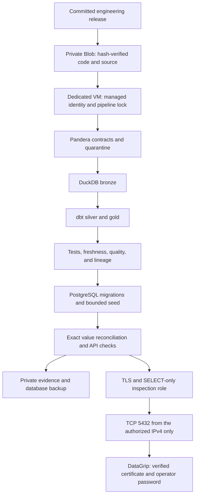

# Data engineering process: Azure deployment through DataGrip

Updated: 2026-10-04. Owner: Julian Valencia.

## Scope and resource references

This is the current operating guide. Repository code, tests, local operational state, and documentation
use `data-engineering`. Azure resource names remain unchanged by the operator's decision in
[ADR 0042](../adr/0042-preserve-azure-resource-names.md). There is no VM replacement or quota-increase step.

| Purpose | Existing resource or location |
|---|---|
| Subscription | `32847dfa-5fd4-4276-8bdf-243d72b35119` |
| Tenant | `4a5e7334-7901-444c-964b-3e6100209fd1` |
| Dedicated data VM | `vm-bank-database`, `rg-bank-agent`, westus2 |
| VM capacity | `Standard_B2as_v2`, 2 vCPU, 8 GiB RAM, 128 GiB Standard SSD |
| VM network | `vm-bank-database-vnet`, `vm-bank-database-nic`, `vm-bank-database-nsg` |
| Public IP resource | `vm-bank-database-ip`, currently `13.66.169.189` |
| Private Blob storage | `stla70238253ae46a02964`, `rg-la70-test`, eastus2, container `artifacts` |
| Database and schema | `bank_agent`, `app`, verified Alembic revision `0014` |
| Deployment package | `deploy/data-engineering` |
| Ignored operator state | `data/data-engineering` |
| Persistent VM state | `/opt/la70-data`, Docker project `la70-data` |

The existing application VM `vm-bank-agent` has its own database and deployment; this task does not
rewire it to the engineering database. Unrelated workloads remain outside the deployment scope.

## Input, transformations, and serving contract

The source is the organizer's static synthetic bank snapshot, with business date `2026-06-17`.
Execution time is distinct from data freshness. The full delivery stays outside Git; only the documented,
bounded, pseudonymized sample under `data_platform/sample` is committed.

| Layer | Responsibility | Validation before proceeding |
|---|---|---|
| Input | Hash-verified CSV/Parquet snapshots and dated partitions | Source manifest, allowed paths, member bytes and SHA-256 |
| Ingestion and bronze | Parse sources through the declared contracts | Pandera validation, rejected-row quarantine, source manifest |
| Silver | Typed, deduplicated, flagged dbt models | Model tests, relationships, explicit orphan flags |
| Gold | Serving Parquet, analytical marts, and ML inputs | dbt tests, snapshot freshness, quality and lineage |
| PostgreSQL | Application-shaped reference tables through the existing seed mapping | Alembic schema head and exact mapped-row reconciliation |
| Application | Real API composition over the engineering database | Four workflows in Spanish/Portuguese and cross-customer 404 |

Contracts and dbt models live in `data_platform`; the schema and domain mapping are maintained with the
application. Source CSV names do not define PostgreSQL columns. Currency amounts and dates preserve
the application types. Runtime cases, sessions, execution records, and audit data are separate from
reference data and are not overwritten by the loader.

## Process and stage boundaries



Each stage must succeed before the next write stage runs. Failed source or transformation validation
never starts PostgreSQL or seeds data. The pipeline lock rejects concurrent executions; inspection
configuration takes the same lock and briefly restarts PostgreSQL while idle.

### 1. Identity, infrastructure, and release

The operator logs in interactively to tenant `4a5e7334-7901-444c-964b-3e6100209fd1` and selects subscription
`32847dfa-5fd4-4276-8bdf-243d72b35119`. The deployment script verifies that tenant, the operator account,
and both resource-group locations. It targets only the dedicated VM, its network, and artifact storage.

In a normal terminal, log in interactively and select the subscription before running the scripts:

```bash
az login --tenant 4a5e7334-7901-444c-964b-3e6100209fd1
az account set --subscription 32847dfa-5fd4-4276-8bdf-243d72b35119
az account show --query '{subscription:name,tenant:tenantId,user:user.name}' -o table
```

Use `--use-device-code` for interactive login when no browser is available. Never copy tokens into logs.
The VM and storage are already deployed. Infrastructure validation/provisioning commands below describe
bootstrap, not a required step for each batch. Reapplying provision closes inspection ingress, so restore
DataGrip configuration afterwards only when TLS setup succeeds.

```bash
bash deploy/data-engineering/deploy.sh validate
bash deploy/data-engineering/deploy.sh provision
bash deploy/data-engineering/deploy.sh release
```

`database.json` declares only `vm-bank-database` and its dedicated network, with denied ingress by default.
`storage.json` contains only storage, its private container, and the operator's storage role; it cannot
create compute. The VM identity receives Blob contributor rights at the existing artifact-container scope.
Storage disables Shared Key and anonymous access. No subscription offer or other workload is changed.

`release` archives Git HEAD, hashes the archive, and uploads it immutably. Uncommitted files and local
credentials are excluded. Local deployment state lives in ignored `data/data-engineering`.
Run `release` before the first `start` using the renamed package; it publishes the committed engineering
paths to the original storage and records the matching revision/hash. The existing running release and
persisted data remain intact until a deliberate new batch is started.

### 2. Source transfer and transformation

```bash
bash deploy/data-engineering/deploy.sh source data
bash deploy/data-engineering/deploy.sh start local
bash deploy/data-engineering/deploy.sh status
```

`source` packages only contracted CSV/Parquet snapshots and partitions. PDFs, environment files,
warehouses, and ancillary directories are excluded. A manifest records each member's SHA-256 and bytes,
plus the dataset version, business date, and code revision. The private upload is downloaded and verified.

VM Run Command supplies reviewed code without a token or password. The VM downloads through managed
identity, verifies archive and member hashes, and refuses traversal, unexpected members, changed inputs,
and incomplete extraction. Bootstrap installs frozen dependencies and creates protected credentials only
on the VM when absent. It then starts the independently inspectable systemd pipeline unit.

The runner executes ingestion contracts, bronze/silver/gold transformations, dbt tests and freshness,
quality and lineage reports, and the policy retrieval index. DuckDB uses two threads and a 3 GB memory
limit. Contract-invalid rows remain quarantined and counted; warnings are retained as evidence.

### 3. Application schema, load, and retained state

Only after transformation validation does the runner start PostgreSQL, apply forward Alembic migrations,
and seed the application tables through the existing mapping. The owner performs migration/loading;
the API receives only the unprivileged application credentials. Customer tables retain forced RLS.

The current loader selects at most 200 customers and associated products, transactions, complaints,
and credit profiles. The full source has been transformed in Azure; that does not imply a complete
PostgreSQL load. A staging/COPY loader with checkpoints and refresh ownership remains a separate project.

Seeding occurs only when `app.customers` is empty. A rerun retains cards, cases, and other application state.
Strict reconciliation compares every mapped value, including money and dates. If source gold or
application-owned values differ, the run fails rather than overwriting live state.

### 4. Tests, evidence, and backup

The runner requires exact value reconciliation and eight API checks: four workflows in Spanish and
Portuguese using the real composition root and the fake language-model provider. Cross-customer access
must return 404. The API smoke avoids card blocks, dispute creation, and credit intake.

```bash
bash deploy/data-engineering/deploy.sh publish
uv run --frozen pytest scripts/tests/unit/test_data_engineering*.py -q
uv run --frozen pytest services/api/tests/integration/test_data_engineering_database_access.py -q
make check
```

`publish` packages stage results, quality/lineage, gold outputs, hashes, API evidence, and a PostgreSQL
custom-format backup in private Blob storage. Tokens and environment files are excluded. A completed
run is proved by its status and evidence, not by the successful submission of a Run Command request.
Repository checks include lint, typing, real PostgreSQL tests, coverage, web, docs, and secret checks.

Verified full-source runs loaded 23,471,159 valid rows from 7,671 objects and quarantined 24,029 transcripts
with missing duration. The five gold outputs total 5,192,103 rows. PostgreSQL reconciliation verified
200 customers, 559 products, and 6,119 transactions. The retained-state rerun reloaded no source objects
and preserved matching gold and serving values. Detailed hashes and run identifiers are maintained in
[the execution evidence](../data/data-engineering-execution.md).

### 5. DataGrip provisioning and password

```bash
bash deploy/data-engineering/deploy.sh datagrip 181.140.234.12
uv run --frozen python deploy/data-engineering/datagrip.py check
uv run --frozen python deploy/data-engineering/datagrip.py password
```

`datagrip` installs committed helper code, enables server TLS, and creates `bank_datagrip` with SELECT
on the five customer reference tables and the Alembic revision. Role-specific SELECT policies permit
inspection of all loaded reference rows without changing application isolation. No identity, session,
audit, dispute, or credit-intake access is granted. The role owns nothing and has no write, schema-creation,
superuser, or RLS-bypass privileges. Limit connections to five, statements to 30 seconds, and idle
transactions to two minutes. An existing inspection password survives reconfiguration.

Only verified TLS configuration permits the helper to install NSG priority 110 for TCP 5432 from the
client `/32`; priority 200 denies remaining ingress. HBA requires TLS and SCRAM for the inspection role,
rejects its other sources and plaintext connections, and rejects other database users from that client.
The Compose override survives future runner releases; base infrastructure provisioning restores closed
network defaults. Source-IP changes require deliberate reconfiguration of both HBA and the NSG rule.

`check` downloads the public certificate through authenticated Azure administration and verifies the
external PostgreSQL TLS handshake, chain, and server IP without a password. The certificate has the
server IP as a subject alternative name and expires after 90 days.

The password command requires an interactive terminal and hidden repeated input: 16 to 128 printable
ASCII characters without spaces. It derives a salted SCRAM-SHA-256 verifier locally, encrypts it with
the server public key using RSA-OAEP-SHA256, and sends only ciphertext through Run Command. The VM decrypts
in memory and installs the verifier with SQL statement/error logging suppressed. Plaintext is neither
written to disk nor sent to Azure. Initially the role has NOLOGIN; successful password setup enables login.
Validation explains a mismatch or unsupported format without displaying input.

### 6. DataGrip connection and query

Create a PostgreSQL data source with these settings:

| Setting | Value |
|---|---|
| Host | `13.66.169.189` |
| Port | `5432` |
| Database | `bank_agent` |
| User | `bank_datagrip` |
| Password | Chosen locally through the hidden prompt |
| SSH/SSL | Use SSL; Full Verification (`verify-full`) |
| CA file | `data/data-engineering/datagrip/server.crt` |
| Schemas | `app` |

Client certificate and client key are unnecessary: authentication uses the database password. Click
**Test Connection**, select `app` for introspection, and open a query console. See the
[DataGrip SSL guide](https://www.jetbrains.com/help/datagrip/configuring-ssh-and-ssl.html).

```sql
SELECT count(*) FROM app.customers;     -- 200
SELECT count(*) FROM app.products;      -- 559
SELECT count(*) FROM app.transactions;  -- 6119
SELECT version_num FROM app.alembic_version; -- 0014
```

## Production application integration

The API connects as `bank_app`; DataGrip uses the separate read-only `bank_datagrip` role.
[The production connection guide](production-database-connection.md) documents the supported internal
Compose connection, loopback access to the engineering database, the private-network/TLS work required
for another VM, separate owner jobs, and readiness/isolation/write verification. The engineering
connection is not automatically substituted into the existing application's deployment.

## Operation, recovery, and trade-offs

A pipeline succeeds only when every stage and reconciliation pass and `result.json` says `succeeded`.
A submitted Azure Run Command alone proves neither successful execution nor correct data. Inspect
`deploy.sh status`, run-specific results, logs, hashes, and published evidence together.

The nonblocking pipeline lock prevents concurrent writers. Failed input or transformation checks stop
before PostgreSQL loading. Existing serving rows are retained on rerun; changed source or mapped values
cause a failure requiring an explicit refresh decision. Do not use an automatic reseed to hide a mismatch.
Keep the warehouses, PostgreSQL volume, and persistent VM paths when releasing new code.

Private custom-format PostgreSQL backups accompany runs. An isolated restore rehearsal passed for the
current database: schema, all five reference-table counts/hashes, application RLS, and inspection grants.
The rehearsal container exposed no ports. A backup file alone is not proof of recovery; a future backup
must pass its own SHA-256 and restore checks. The existing `restore_check.py` accepts a private manifest
whose `backup` object declares the expected schema, hash, and reference counts/hashes; it restores into
a disposable PostgreSQL container and removes it afterwards. Never restore a rehearsal over the live database.

Renew the 90-day TLS certificate before expiry and download the replacement CA through authenticated
Azure administration. If the client's public IPv4 changes, update both the NSG and HBA configuration
through the inspection helper. Keep passwords, source credentials, tokens, environment files, full
organizer data, and private backups out of Git, prompts, and shared logs.

| Choice | Benefit | Cost or limit |
|---|---|---|
| Keep Azure names | Preserves working infrastructure, IP, password, and deployment | Repo must explicitly map logical engineering names to existing resource names |
| Existing Python/dbt jobs on a VM | Reuses tested contracts, models, schema mapping, and evidence | OS, storage, scheduling, backups, and TLS maintenance remain team responsibilities |
| Burstable 2-vCPU VM | Fits the already deployed capacity | Long batches may slow after CPU credits are depleted |
| Existing cross-region storage | Preserves the verified artifacts and access configuration | eastus2-to-westus2 transfer has latency and cost |
| Bounded serving slice | Predictable application validation and customer isolation | 200 customers is not a complete PostgreSQL load of the organizer delivery |
| Direct TLS from one IPv4 | DataGrip username/password access with verified server identity | Requires IP updates and certificate renewal; SSH/VPN are future alternatives |
| Static snapshot | Reproducible input, reruns, and comparison | No real-time bank freshness or CDC |

Managed orchestration, managed PostgreSQL, incremental refresh ownership, and the full checkpointed
PostgreSQL batch loader are separate future work. Current evidence does not claim those capabilities.
See [the execution record](data-engineering-execution.md) for measured runs and
[the deployment README](../../deploy/data-engineering/README.md) for operational commands.
