# Data lineage

Generated by `make lineage` at 2026-09-26T23:40:00+00:00 from commit `e91e22f` (dbt manifest of the `s3` warehouse). Do not edit by hand; `dbt docs generate` writes the full catalog under the warehouse `dbt/full/dbt_target/` directory.

55 nodes and 110 dependencies. Bronze tables are the dbt sources over the Parquet written by `bank-data ingest`; `stg_` models type and deduplicate, `silver_` views flag orphans and derive checks, and gold serves the demo, the ML phases, and analytics.

```mermaid
flowchart LR
    subgraph bronze["Bronze (sources)"]
        bronze_branches["bronze.branches"]
        bronze_call_center_interactions["bronze.call_center_interactions"]
        bronze_call_transcripts["bronze.call_transcripts"]
        bronze_campaign_sends["bronze.campaign_sends"]
        bronze_complaints["bronze.complaints"]
        bronze_customers["bronze.customers"]
        bronze_daily_exchange_rates["bronze.daily_exchange_rates"]
        bronze_digital_events["bronze.digital_events"]
        bronze_marketing_campaigns["bronze.marketing_campaigns"]
        bronze_products["bronze.products"]
        bronze_satisfaction_surveys["bronze.satisfaction_surveys"]
        bronze_service_agents["bronze.service_agents"]
        bronze_transactions["bronze.transactions"]
    end
    subgraph seeds["Seeds"]
        canonical_values["canonical_values"]
    end
    subgraph silver["Silver"]
        quarantine_orphans["quarantine_orphans"]
        sampled_customers["sampled_customers"]
        silver_branches["silver_branches"]
        silver_call_center_interactions["silver_call_center_interactions"]
        silver_call_transcripts["silver_call_transcripts"]
        silver_campaign_sends["silver_campaign_sends"]
        silver_complaints["silver_complaints"]
        silver_customers["silver_customers"]
        silver_daily_exchange_rates["silver_daily_exchange_rates"]
        silver_digital_events["silver_digital_events"]
        silver_marketing_campaigns["silver_marketing_campaigns"]
        silver_products["silver_products"]
        silver_satisfaction_surveys["silver_satisfaction_surveys"]
        silver_service_agents["silver_service_agents"]
        silver_transactions["silver_transactions"]
        stg_branches["stg_branches"]
        stg_call_center_interactions["stg_call_center_interactions"]
        stg_call_transcripts["stg_call_transcripts"]
        stg_campaign_sends["stg_campaign_sends"]
        stg_complaints["stg_complaints"]
        stg_customers["stg_customers"]
        stg_daily_exchange_rates["stg_daily_exchange_rates"]
        stg_digital_events["stg_digital_events"]
        stg_marketing_campaigns["stg_marketing_campaigns"]
        stg_products["stg_products"]
        stg_satisfaction_surveys["stg_satisfaction_surveys"]
        stg_service_agents["stg_service_agents"]
        stg_transactions["stg_transactions"]
    end
    subgraph serving["Gold serving (Parquet)"]
        complaints_serving["complaints_serving"]
        credit_profiles_serving["credit_profiles_serving"]
        customers_serving["customers_serving"]
        products_serving["products_serving"]
        transactions_serving["transactions_serving"]
    end
    subgraph ml["Gold ML inputs"]
        complaints_with_context["complaints_with_context"]
        credit_risk_inputs["credit_risk_inputs"]
        interactions_with_transcripts["interactions_with_transcripts"]
    end
    subgraph marts["Gold marts"]
        channel_mix["channel_mix"]
        complaint_funnel["complaint_funnel"]
        contact_reason_daily["contact_reason_daily"]
        digital_errors_daily["digital_errors_daily"]
        sla_performance["sla_performance"]
    end
    bronze_branches --> stg_branches
    bronze_call_center_interactions --> stg_call_center_interactions
    bronze_call_transcripts --> stg_call_transcripts
    bronze_campaign_sends --> stg_campaign_sends
    bronze_complaints --> stg_complaints
    bronze_customers --> stg_customers
    bronze_daily_exchange_rates --> stg_daily_exchange_rates
    bronze_digital_events --> stg_digital_events
    bronze_marketing_campaigns --> stg_marketing_campaigns
    bronze_products --> stg_products
    bronze_satisfaction_surveys --> stg_satisfaction_surveys
    bronze_service_agents --> stg_service_agents
    bronze_transactions --> stg_transactions
    canonical_values --> stg_branches
    canonical_values --> stg_call_center_interactions
    canonical_values --> stg_call_transcripts
    canonical_values --> stg_campaign_sends
    canonical_values --> stg_complaints
    canonical_values --> stg_customers
    canonical_values --> stg_daily_exchange_rates
    canonical_values --> stg_digital_events
    canonical_values --> stg_marketing_campaigns
    canonical_values --> stg_products
    canonical_values --> stg_satisfaction_surveys
    canonical_values --> stg_service_agents
    canonical_values --> stg_transactions
    credit_profiles_serving --> credit_risk_inputs
    sampled_customers --> stg_branches
    sampled_customers --> stg_call_center_interactions
    sampled_customers --> stg_call_transcripts
    sampled_customers --> stg_campaign_sends
    sampled_customers --> stg_complaints
    sampled_customers --> stg_customers
    sampled_customers --> stg_daily_exchange_rates
    sampled_customers --> stg_digital_events
    sampled_customers --> stg_marketing_campaigns
    sampled_customers --> stg_products
    sampled_customers --> stg_satisfaction_surveys
    sampled_customers --> stg_service_agents
    sampled_customers --> stg_transactions
    silver_call_center_interactions --> channel_mix
    silver_call_center_interactions --> contact_reason_daily
    silver_call_center_interactions --> interactions_with_transcripts
    silver_call_center_interactions --> quarantine_orphans
    silver_call_transcripts --> interactions_with_transcripts
    silver_call_transcripts --> quarantine_orphans
    silver_campaign_sends --> quarantine_orphans
    silver_complaints --> channel_mix
    silver_complaints --> complaint_funnel
    silver_complaints --> complaints_serving
    silver_complaints --> complaints_with_context
    silver_complaints --> credit_risk_inputs
    silver_complaints --> quarantine_orphans
    silver_complaints --> sla_performance
    silver_customers --> complaints_with_context
    silver_customers --> credit_profiles_serving
    silver_customers --> credit_risk_inputs
    silver_customers --> customers_serving
    silver_customers --> quarantine_orphans
    silver_digital_events --> channel_mix
    silver_digital_events --> digital_errors_daily
    silver_digital_events --> quarantine_orphans
    silver_products --> complaints_with_context
    silver_products --> credit_profiles_serving
    silver_products --> credit_risk_inputs
    silver_products --> products_serving
    silver_products --> quarantine_orphans
    silver_satisfaction_surveys --> quarantine_orphans
    silver_service_agents --> quarantine_orphans
    silver_transactions --> credit_risk_inputs
    silver_transactions --> quarantine_orphans
    silver_transactions --> transactions_serving
    stg_branches --> silver_branches
    stg_branches --> silver_complaints
    stg_branches --> silver_customers
    stg_branches --> silver_products
    stg_branches --> silver_service_agents
    stg_branches --> silver_transactions
    stg_call_center_interactions --> silver_call_center_interactions
    stg_call_center_interactions --> silver_call_transcripts
    stg_call_center_interactions --> silver_complaints
    stg_call_center_interactions --> silver_satisfaction_surveys
    stg_call_transcripts --> silver_call_transcripts
    stg_campaign_sends --> silver_campaign_sends
    stg_complaints --> silver_complaints
    stg_customers --> silver_call_center_interactions
    stg_customers --> silver_call_transcripts
    stg_customers --> silver_campaign_sends
    stg_customers --> silver_complaints
    stg_customers --> silver_customers
    stg_customers --> silver_digital_events
    stg_customers --> silver_products
    stg_customers --> silver_satisfaction_surveys
    stg_customers --> silver_transactions
    stg_daily_exchange_rates --> silver_daily_exchange_rates
    stg_daily_exchange_rates --> silver_transactions
    stg_digital_events --> silver_digital_events
    stg_marketing_campaigns --> silver_campaign_sends
    stg_marketing_campaigns --> silver_marketing_campaigns
    stg_products --> silver_complaints
    stg_products --> silver_digital_events
    stg_products --> silver_products
    stg_products --> silver_transactions
    stg_satisfaction_surveys --> silver_satisfaction_surveys
    stg_service_agents --> silver_call_center_interactions
    stg_service_agents --> silver_call_transcripts
    stg_service_agents --> silver_complaints
    stg_service_agents --> silver_satisfaction_surveys
    stg_service_agents --> silver_service_agents
    stg_transactions --> silver_transactions
```

