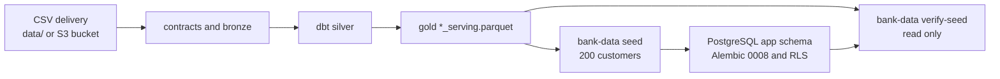

# MVP data in PostgreSQL

How to prepare, load, and verify the MVP data from the full organizer delivery, and the plan for loading
the complete delivery later. This guide implements [ADR 0034](../adr/0034-bounded-local-gold-seed-for-mvp.md).

## What gets built

The delivery (13 tables in CSV) is validated and transformed with DuckDB and dbt into five gold serving
tables. PostgreSQL receives only a deterministic slice of 200 customers with everything the four workflows
read: accounts, cards, disputes, and credit.



| Layer | Location | Role |
|---|---|---|
| Source | `data/*.csv` and daily partitions, or the organizer bucket | The delivery, gitignored |
| Bronze, silver, gold | `data/warehouse-local/` (`local`) or `data/warehouse/` (`s3`) | Preparation and analysis |
| Application | The compose PostgreSQL | Customer-scoped reads, sessions, cases, audit |

The other nine tables (call center interactions, call transcripts, marketing campaigns, campaign sends, digital events,
surveys, branches, service agents, exchange rates) stay in DuckDB. No MVP workflow reads them from
PostgreSQL. `app.customers` holds only `customer_id`, `country`, `segment`, `status`, `first_name`, and
`snapshot_date`; documents and phones reach `app.identity_directory` only as keyed digests.

## Requirements

- `uv`, Docker with Compose, and `make setup` run once.
- Disk: about 10 GB free for the local source. Measured on this delivery: 5.1 GB of CSV, a 5.1 GB raw copy,
  1 GB of bronze, 2.3 GB for `warehouse.duckdb`, and 231 MB of gold.
- Memory: the full `dbt build` is the heaviest step; size DuckDB to the machine (see below).

## Get the source

The two options use separate warehouses and are never mixed.

**Local CSVs.** Copy the complete delivery to `data/`, keeping its layout: flat snapshot tables
(`customers.csv`, `products.csv`, and so on) and one directory per partitioned table with
`year=*/month=*/day=*` partitions (`transactions/`, `complaints/`, and so on). Local discovery lists only
contracted table layouts before hashing, so `data/eda`, `data/contexto`, and `data/warehouse-*` are never
ingested even when they sit under the same directory.

**Organizer bucket.** The read-only credentials come from the organizer data dictionary PDF. Put them only
in `.env` (`AWS_ACCESS_KEY_ID`, `AWS_SECRET_ACCESS_KEY`, `AWS_DEFAULT_REGION=us-east-2`, `DATA_BUCKET`,
`DATA_PREFIX=data/`), never in documents, issues, commits, or prompts (CLAUDE.md rule 4). Then run
`make data-download` and use `DATA_SOURCE=s3` instead of `DATA_SOURCE=local LOCAL_DIR=data` below.

## Configure `.env`

```bash
cp .env.example .env
```

Set at least `POSTGRES_ADMIN_PASSWORD`, `POSTGRES_APP_PASSWORD`, and a stable `SESSION_SECRET` of at least
32 random bytes (for example `openssl rand -base64 64`). The secret keys the identity digests; rotating it
requires seeding again. Leave unused options empty as `NAME=`, without a comment on the same line.
`make env-check` reports which variables are set without printing values.

The `.env.example` DuckDB defaults (`BANK_DATA_DUCKDB_MEMORY_LIMIT=8GB`, 8 threads) do not fit an 8 GB
machine. On a 7.7 GB machine the operating system killed `dbt build` while it built `stg_transactions`:
the command printed no error, and `transactions_serving.parquet` and `complaints_serving.parquet` were
missing. With 3 GB and 2 threads the same build finished in about 9 minutes and stayed under 5 GB of
resident memory. Set the values in `.env` or for one shell:

```bash
export BANK_DATA_DUCKDB_MEMORY_LIMIT=3GB BANK_DATA_DUCKDB_THREADS=2
```

Only the 8 GB setting was measured. On larger machines, keep the memory limit well below the free RAM.

## Build gold

```bash
make pipeline DATA_SOURCE=local LOCAL_DIR=data
make data-report DATA_SOURCE=local LOCAL_DIR=data
find data/warehouse-local/gold -maxdepth 1 -name '*_serving.parquet' -printf '%f\n' | sort
```

`make pipeline` runs three steps. Observed results on this delivery:

| Step | Result |
|---|---|
| `ingest` | 7,671 CSV listed; first run accepted 23,471,159 rows, quarantined 24,029, 0 objects failed. A rerun without changes reports `unchanged=7671 loaded=0` |
| `build` | `dbt build` over 315 nodes: `PASS=313 WARN=2 ERROR=0` |
| `test` | `tests and freshness passed` |

The two warnings are `relationships` tests at warn severity: 149,995 customers and 831 service agents
reference a `branch_id` missing from `branches.csv`. They do not block the MVP, but branches almost never
join. The five files `complaints`, `credit_profiles`, `customers`, `products`, and `transactions`
`_serving.parquet` must exist before seeding. `data/warehouse-local/quality-report.md` lists accepted rows,
quarantine, and freshness.

## Seed and verify PostgreSQL

```bash
make up
make seed DATA_SOURCE=local LOCAL_DIR=data SEED_CUSTOMERS=200
make verify-seed DATA_SOURCE=local LOCAL_DIR=data SEED_CUSTOMERS=200
```

When a different source or selection assigns a demo persona to another customer, the seed clears the
previous persona assignment in the same transaction. Existing customers, identity digests, sessions,
conversations, and audit records are retained; the persona identifies the newly selected customer.

`make seed` applies pending Alembic migrations, then upserts in one transaction. The selection
(`data_platform/src/bank_data/seed/selection.py`) is deterministic:

1. Each of the 16 personas in `data_platform/seed/personas.yaml` takes the first customer matching its
   criterion (`criteria.py`), for example a blocked card, a borderline score, or a repeat complainer.
2. Coverage adds a minimum per country (MX, CO, AR) and at least one customer per segment.
3. The fill reaches `SEED_CUSTOMERS` in `md5(seed || customer_id)` order.

Candidates are active customers with a phone of at least four digits, because identification uses them.

`make verify-seed` writes nothing. It rebuilds the same selection and compares the IDs of every table, the
identity digests, the staff, and the synthetic demo records with PostgreSQL. It must print
`verified revision=0008 personas=16`. Verified counts on this delivery:

| `app.*` table | Rows |
|---|---|
| `customers`, `identity_directory`, `credit_profiles` | 200 each |
| `products` | 559 |
| `transactions` | 6,119 |
| `historical_complaints` | 84 |
| `staff_members` | 2 |
| `dispute_cases`, `credit_applications` (synthetic) | 1 each |

The related counts come from gold and change when the delivery or the persona file changes.

## Technical validation

```bash
uv run --frozen pytest data_platform/tests/unit/test_sources.py data_platform/tests/unit/test_seed_verify.py -q
uv run --frozen pytest data_platform/tests/integration/test_seed.py -q
uv run --frozen pytest services/api/tests/integration/test_row_level_security.py -q
```

The 43 tests pass on this checkout; the integration tests need Docker. Functional validation continues with
the four workflow scenarios in `services/api/tests/integration/workflows/` on the PostgreSQL backend.

## Operation

| Situation | Action |
|---|---|
| The build ends without an error but Parquet files are missing | Memory. Lower the limit and threads, rerun `make pipeline`; ingestion reprocesses nothing |
| `warehouse.duckdb.tmp` or `.wal` remain | Left by an interrupted build; DuckDB recovered them on the next run here. Do not delete them by hand |
| The CSVs changed | Rerun `make pipeline`, read the report, then `seed` and `verify-seed` |
| A dbt test or freshness check fails | Do not seed; inspect the manifest, quarantine, and report |
| `verify-seed` fails | Do not present that database; seed and verify again |
| `SESSION_SECRET` was rotated | Seed again; identity digests depend on it |
| A demo changed a card status | `make seed` resets product status to gold; run it before, not during, a demo |

The seed never clears the operational tables (sessions, conversations, turns, audit).

## Loading the complete delivery

Raising `SEED_CUSTOMERS` is not the migration strategy. The seed maps every selected row to domain objects
in memory, filters with `IN (unnest($ids))`, writes everything in one transaction with `executemany`, and
skips customers that are not active or have no phone. Gold on this delivery:

| Gold table | Total rows | In the MVP |
|---|---|---|
| `customers_serving` | 150,000 | 200 |
| `products_serving` | 400,000 | 559 |
| `transactions_serving` | 4,425,008 | 6,119 |
| `complaints_serving` | 67,095 | 84 |
| `credit_profiles_serving` | 150,000 | 200 |

Of the 150,000 customers, 127,700 are active, 14,914 inactive, 4,407 suspended, and 2,979 closed; 4,707
have no phone with four digits, and 123,744 are seed candidates. Transactions span 2023-06-17 to
2026-06-18. Extrapolating the seeded table (about 590 bytes per transaction with indexes) puts
`app.transactions` near 2.6 GB; this is an estimate to be measured.

Proposed phases, each closed by its own ADR or pull request:

1. **Decisions.** Load all customers into `app.customers` with their real status and create
   `identity_directory` rows only for customers with a valid document and phone; test that workflows refuse
   non-active customers. Define which columns the source owns and which the application may change (for
   example `product_status` after a block); update a row only while it still equals the last seeded
   version, tracked by a source row hash. Keep the other nine tables in DuckDB unless a workflow needs one.
   Synthesize demo records only for personas.
2. **Batch loader.** A separate command (for example `bank-data load-full`); the MVP seed stays for demos.
   Batches of about 5,000 customers in a stable order, read from DuckDB as Arrow or CSV without per-row
   domain objects, `COPY` into `UNLOGGED` staging tables, then `INSERT ... SELECT ... ON CONFLICT` into
   `app.*` in one transaction per batch, in foreign key order. Reuse the mapper conversions
   (`product_to_row`, `transaction_to_row`) and test both paths against the committed sample.
3. **Checkpoints and reconciliation.** A control table (for example `app.load_batches`, new Alembic
   revision) with run, batch, customer range, gold input hash, per-table counts, status, and timings.
   Resume skips `done` batches with the same hash. Reconcile each batch with counts and an ordered ID
   checksum on both sides, and add a full mode to `verify-seed` with a column-level sample comparison.
4. **Capacity.** Indexes for the real queries (transactions by `customer_id` and `transaction_at`, products
   by customer), monthly partitioning of `app.transactions` if measurements justify it, secondary indexes
   after `COPY`, `ANALYZE` at the end. Measure p95 latency of the four workflows with RLS on, disk size, and
   load duration.
5. **Incremental refresh.** Ingestion and incremental dbt models already process only new or changed CSVs;
   the loader should reload only affected batches, using a watermark for transactions and complaints, run
   as a scheduled job with alerts on reconciliation or dbt failures.
6. **Shared environments.** Managed PostgreSQL with backups and point-in-time recovery, secrets from a
   manager rather than `.env`, a load role separate from the application role, and a staging rehearsal
   before the demo database.

The full load is accepted when `app.*` counts match gold under the phase 1 policy with every batch `done`,
a rerun without source changes modifies no rows, application-owned state survives a reload, the RLS tests
and the four workflow scenarios pass on the full database, and an interrupted load resumes without
duplicates. `docs/BACKLOG.md` tracks this work.
