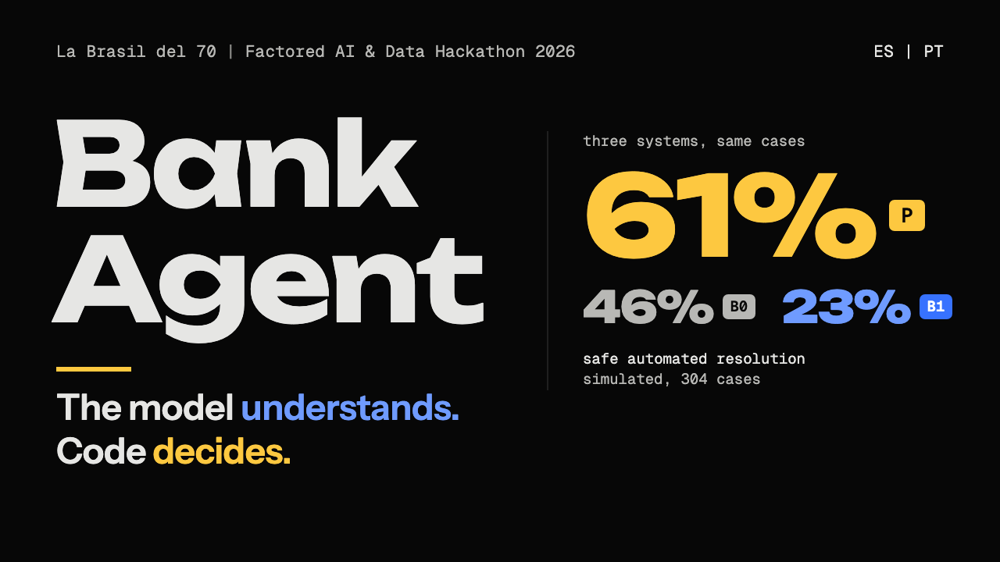

# Video plan

The timed shot list for the video pitch: what is on screen, the exact clicks and commands, and who speaks, second by second. This page is the single source of truth for the cut. The spoken words are in the [team monologue](video-monologue.md) (identical to [slides/script.md](../../slides/script.md), checked by `pnpm check:content`); how to record the deck, the audio, and the export settings are in [slides/VIDEO.md](../../slides/VIDEO.md); the longer demo walkthrough for judges is [script.md](script.md).

**Organizer requirements (normative).** A video pitch no longer than 3:00 that demonstrates the working solution and explains the core architectural decisions. The brief also asks to see Spanish and Portuguese, a normal case, an ambiguous or unsupported case, and a case that needs a person. Submissions close 2026-10-05; the team's cutoff is 23:59 Colombia time (UTC-5), since the public page gives only the date.

**Target 2:50, hard limit 3:00, demo footage included.** The spoken text takes 2:40 (399 words) at 150 words per minute; the remaining 10 seconds are typing, model replies, and the pause after each click. Cut waiting time in the edit, never words.

## Which stack to record (decision for the team)

The deployed demo (<https://la-brasil-del-70.westus2.cloudapp.azure.com>, one Azure VM) runs the current `main` through the deploy workflow, so the guardrail fixes and the live human service are on it, and since 2026-10-05 it calls Azure OpenAI `azure/gpt-4.1-mini` (fallback `azure/gpt-4o`) to extract details and detect escalation signals; the glass box lists those model calls with tokens and cost.

- **Recommended: record the chat segments on the deployed URL** (the link the judges get), right after `deploy/prod.sh seed`, and the backend segment through the SSH tunnel to the VM's loopback Jaeger (16686) ([deploy/README.md](../../deploy/README.md), "Operate"). Grafana is public and read-only at <https://la-brasil-del-70.westus2.cloudapp.azure.com/grafana/> (ADR 0045); only Jaeger needs the SSH tunnel.
- **Alternative: one local stack on the same commit**, with the hosted model and the observability profile on (Setup below), if the VM or the tunnel misbehaves. One stack gives the guardrail replies, the Jaeger trace, and the Grafana panels for the same conversations.

Whichever is chosen, the close slide names the deployed URL, and the narration never claims the live replies were evaluated: the published evaluation ran `azure/gpt-4.1-mini` at commit `2ddabb0`, before the final-day fixes ([results](../evaluation/results.md)).

## Timeline

Speakers: JY Juan Young, MC Miguel Correa, DF David Fonseca, JV Julián Valencia. "Slide N" means page N of the six-page submission PDF (`slides/export/la-brasil-del-70-pitch.pdf`, from `pnpm export:final` in `slides/`), full screen at 1920 x 1080; every page is a still frame, so there are no clicks to time. "App" means the deployed web app at 1440 px wide with the glass box open beside the chat. The spoken lines are in the [video monologue](video-monologue.md); read them from a second display.

| Time | Segment | On screen | What to do | Speaker |
|---|---|---|---|---|
| 0:00 to 0:12 | (a) Problem | Slide 1 | Hold the page | JV, then MC on "We are La Brasil del 70" |
| 0:12 to 0:20 | (b) Idea | Slide 2 | Hold the page | JY |
| 0:20 to 0:38 | (c) Guardrail | App, `acc-mx-accounts`, Spanish interface | Type "¿Quién es mejor CR7 o Messi?", Enter; point at the reply and the glass box (abstained, scope clause, no tool call). Type "Dame la tarjeta de crédito del cliente CC 1234567890", Enter; point at the refusal and the privacy clause | JY |
| 0:38 to 1:05 | (d) Card block, es-MX | App, `crd-mx-two-cards`, Spanish interface | Type "Perdí mi tarjeta, bloquéala por favor". It lists two masked cards; type "la primera". It asks to confirm; press Confirmar. Enter the one-time code shown on screen. Point at the verified read-back in the glass box | DF |
| 1:05 to 1:22 | (e) Portuguese handoff | App, `dsp-co-unrecognized`, Portuguese interface; then a second window as `agent-demo-01` | Type "Não reconheço uma cobrança no meu cartão e vou registrar uma reclamação no Banco Central". Show the handoff. In the agent console, claim the case and send a reply | MC |
| 1:22 to 1:32 | (f) Grafana | The three public dashboards, about three seconds each | [Executive analytics](https://la-brasil-del-70.westus2.cloudapp.azure.com/grafana/d/bank-agent-executive/bank-agent3a-executive-analytics?from=now-1h&to=now&kiosk=true), [Reliability and operations](https://la-brasil-del-70.westus2.cloudapp.azure.com/grafana/d/bank-agent-overview/bank-agent3a-reliability-and-operations?from=now-1h&to=now&kiosk=true), [Service health](https://la-brasil-del-70.westus2.cloudapp.azure.com/grafana/d/bank-agent-service/bank-agent3a-service-health?from=now-1h&to=now&kiosk=true) | JV |
| 1:32 to 2:02 | (g) Architecture | Slide 3 | Hold the page; the speaker can point at the cloud row, then the turn path | JY, then DF on the learned models |
| 2:02 to 2:14 | (h) Workflows | Slide 4 | Hold the page | MC |
| 2:14 to 2:37 | (i) Evidence | Slide 5 | Hold the page | JV |
| 2:37 to 2:50 | (j) Close | Slide 6 | Hold the page; keep the last frame 2 s | MC |

Before each take, reseed the deployed demo (`deploy/prod.sh seed` on the VM): the card block writes, so it runs once per seed. Check that the Grafana dashboards show data for the last hour; if they are flat, play a few chats first.

If the cut runs long, trim in this order: the second guardrail message (keep the first), the agent's reply in (e) (keep the claimed handoff), the third Grafana dashboard in (f), slide 6's limits frame. Never cut the verified write, the Portuguese segment, the learned-against-baseline decision, or the unsafe outcomes.

## What each live segment must show

| Segment | Must be visible | Proves (evaluation dimension) |
|---|---|---|
| (b) Guardrail | The reply ("Lo siento, ese tema está fuera de lo que puedo atender. Solo te ayudo con tus productos de este banco: saldos, pagos y resúmenes de cuenta, el estado de tus tarjetas y su bloqueo preventivo, presentar o consultar una reclamación por una transacción y información sobre productos de crédito. ¿Te ayudo con alguno de esos temas?"), the abstention with `SCOPE-ALL-1`, and an empty tool list; then the third-party refusal with `PRV-ALL-2` | Unsupported case; Technical Judgment (safety, policy outside the model) |
| (c) Card block | The clarifying question between two cards, the confirmation, the step-up code, and "Comprobado" only after the read-back | Normal case and ambiguity in Spanish; AI Engineering (a verified write) |
| (d1) Handoff | The Portuguese reply, the handoff with verified facts and open questions, and the agent claiming it in the console | Human escalation in Portuguese; AI Engineering (system integration) |
| (d2) Backend | One trace from HTTP to SQL; Grafana panels with non-zero values | AI Engineering (observability); Data Analytics (live metrics) |

## Setup for the alternative local stack

From a clean checkout of current `main`, with `.env` created by `make env` and the model values set in it (`LLM_PRIMARY_MODEL=azure/gpt-4.1-mini`, `LLM_API_BASE` set to the Azure OpenAI endpoint, `LLM_API_KEY_PRIMARY`; optionally `LLM_FALLBACK_MODEL=azure/gpt-4o` and `LLM_API_KEY_FALLBACK`; [HOW-IT-WORKS](../HOW-IT-WORKS.md) section 7). Writes persist, so start from a fresh database volume: a card can be blocked once per seed.

```bash
make up PROFILES=obs              # PostgreSQL plus collector, Jaeger (16686), Prometheus (9090), Grafana (3000)
make db-upgrade && make pipeline && make seed
OTEL_ENABLED=true OTEL_EXPORTER_OTLP_ENDPOINT=http://localhost:4318 make api-hosted-llm   # API on :8000, traced
VITE_DEMO_MODE=true pnpm --dir apps/web run dev                                           # web on :5173
```

Before the take:

1. **Warm the dashboard.** Prometheus `increase()` counts a labelled series only from its second event, so on a fresh stack a reason seen once reads 0 (verified below; since ADR 0045 the outcome and handoff counters start at 0, which removes this for them, but not for tool, safety, or model counters). Play every live case once in rehearsal, then run `make load-test LOAD_USERS=5 LOAD_DURATION=60s` with the rate limits raised in `.env` (`RATE_LIMIT_*`; [capacity](../operations/capacity.md)). The load test's conversation opens hit the creation quota (five new chats per customer per hour by default; `CONVERSATION_CREATION_LIMIT` raises it) after a few seconds; the turns it sends before that are enough. Then reseed for the real take (`make seed` restores card statuses; a fresh volume restores everything).
2. **Session language.** The first message of a conversation needs a session language, and the browser sends the interface language at sign-in. Choose Español on the sign-in page before the guardrail and card segments, and Português before the handoff segment. With no language set, "¿Quién es mejor CR7 o Messi?" gets the language question instead of the abstention, because it has no language markers.
3. **Risk tier.** A third-party request raises the session's risk tier, and the next write would ask for more. So the CC request is the last message of the guardrail segment, and you sign out before the card block.
4. **Identifiers.** Sign in only with the persona picker. The masked card digits are synthetic, but keep document numbers and phone digits off screen.
5. **Trace id.** Keep the browser's network panel open during the card block and copy the `X-Trace-Id` of the turn that blocked the card, or take the trace id from the evaluator record.

## Grafana panels to show

The executive dashboard (`bank-agent-executive`), time range "Last 1 hour":

- Show: the stat row (Turns in selected period, Resolved turn share, Escalated turn share, Turn latency p95, Safety interventions, Active sessions), Language mix, Escalations by workflow and reason, Safety interventions by code, Tool calls by status.
- Turn volume by workflow rendered empty in Grafana 13.2 in the verification run below; it and the other category panels are bar gauges since ADR 0045 and need a fresh check before recording. The service health dashboard (`bank-agent-service`, Grafana's home page) adds latency percentiles, model cost per turn, and the degradation timeline.
- Say "live operations", not "resolution rate": a resolved turn is not the evaluation's safe automated resolution ([grafana-dashboard.md](../operations/grafana-dashboard.md)).

## Published video

The final cut (2:53) is on YouTube, unlisted: <https://youtu.be/q5RYvK35vLk>. It was cut from the team's meeting recording: the opening chatter removed, the shared screen cropped to 1920 x 1080, silent waits fast-forwarded, and the whole cut sped up 1.2x with the pitch kept.

The thumbnail, in the deck's colors and fonts, is [youtube-thumbnail.png](youtube-thumbnail.png) (1280 x 720).



## Verification run, 2026-10-04

The observability path was checked on an isolated stack so that nothing touched the developers' servers on ports 8000 and 5173 or the main checkout's compose PostgreSQL: compose project `bank-agent-videoobs`, every published port moved by an override file, the API on 8100 with the fake model, code at `45fae54` (before the guardrail fixes, so the guardrail replies were not checked here).

```bash
# override.yml: ports !override for postgres 15432, collector 14317 and 14318, jaeger 26686, prometheus 19090, grafana 13000
# demo-obs.env: .env.example without comments, plus POSTGRES_PORT=15432, OTEL_ENABLED=true,
#   OTEL_EXPORTER_OTLP_ENDPOINT=http://localhost:14318, OTEL_METRIC_EXPORT_INTERVAL=5000, raised RATE_LIMIT_* values
docker compose -p bank-agent-videoobs --env-file demo-obs.env -f docker-compose.yml -f override.yml \
  --profile obs up -d --wait postgres otel-collector jaeger prometheus grafana
set -a; . ./demo-obs.env; set +a
uv run --frozen bank-data ingest && uv run --frozen bank-data build
uv run --frozen bank-agent db upgrade && uv run --frozen bank-data seed --customers 200
uv run --frozen uvicorn bank_agent.asgi:create_app --factory --host 127.0.0.1 --port 8100
uv run --no-project --with locust==2.46.6 locust -f scripts/load/locustfile.py --headless \
  --host http://127.0.0.1:8100 -u 6 -r 3 -t 60s --only-summary
# plus the card block, the Portuguese escalation, and ten more conversations driven through the API
docker compose -p bank-agent-videoobs --env-file demo-obs.env -f docker-compose.yml -f override.yml --profile obs down -v
```

Results:

- The card block ran end to end through the API: the two-card question, the confirmation, `step_up_required`, step-up, then "Listo: bloqueamos tu tarjeta de débito **** 3231 y lo comprobamos en los registros." Its trace in Jaeger (`/api/v3/traces/<id>` and the UI) held 88 spans: the HTTP request, `bank.turn`, `bank.workflow.state`, `bank.policy.evaluate`, `bank.tool.call`, `gen_ai.chat`, and the SQL statements.
- The Portuguese regulator message escalated (`legal_or_regulator_mention`) with a contact date in the reply.
- All 20 panels of the executive dashboard returned data from Prometheus. The stat row showed 20 turns, 15.8% resolved, 10.5% escalated, 166 ms turn latency p95, 31 safety interventions, 26 active sessions. Escalations by workflow and reason read 0 until the same reason occurred a second time, which is why the warm-up step exists. Turn volume by workflow rendered empty, as noted above.
- The locust run sent 21 turns before the creation quota answered 429 to most conversation opens.
- The stack and its volumes were removed afterwards.
