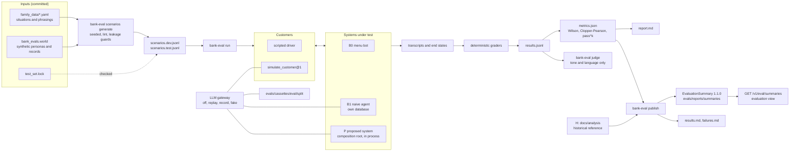

# Evaluation

The evaluation documents of the project. Every number here is labeled with how it was obtained: **offline** (measured on held-out data), **simulated** (measured against scripted or model-played customers), or **projected** (extrapolated under stated assumptions). None is a production measurement.

| Document | What it holds |
|---|---|
| [plan.md](plan.md) | The phase 14 plan: systems, mix, splits, metrics, statistics, the local-model run protocol, budget, decided questions |
| [methodology.md](methodology.md) | Definitions, splits and leakage prevention, customers, graders, statistics, the judge's validation, limitations |
| [judge-rubric.md](judge-rubric.md) | The judge's rubric and the human rating protocol |
| [results.md](results.md), [failures.md](failures.md) | The published test run `test-local` (session 14b, local model `qwen2.5:7b-instruct`): the part generated by `bank-eval publish` (per workflow, then aggregate, routing, slices, repeated runs, H, and the failure table), then a hand-written analysis section that a new `publish` overwrites |
| `runs/<run_id>/` | The published run's `metrics.json` and `manifest.json` |
| [router.md](router.md), [resolver.md](resolver.md), [risk-estimator.md](risk-estimator.md), [retrieval.md](retrieval.md) | The learned components' offline evaluations (phases 07 and 10) |

## The scenario harness



## Commands

```bash
make eval-scenarios                        # regenerate the set deterministically; lint, leakage, lock
make eval-smoke                            # 12 dev scenarios, every system, scripted client (what CI runs)
make eval                                  # the dev suite from cassettes (EVAL_LLM=off runs without a model)
make eval-test                             # the test split replayed from cassettes: not the published numbers (methodology)
uv run bank-eval run --help                # every option: systems, runs, --workflow, --scenario, --set KEY=VALUE
uv run bank-eval report reports/eval/<run_id>
uv run bank-eval compare reports/eval/<a> reports/eval/<b>
uv run bank-eval estimate reports/eval/<dev run> --price-model anthropic/claude-haiku-4-5-20251001
uv run bank-eval judge reports/eval/<run_id> --llm replay --sample 100
uv run bank-eval publish reports/eval/<run_id>
```

The live runs of session 14b on the local model (Ollama serving `qwen2.5:7b-instruct`):

```bash
export LLM_PROVIDER=litellm LLM_PRIMARY_MODEL=ollama/qwen2.5:7b-instruct LLM_API_BASE=http://localhost:11434
export LLM_TIMEOUT_SECONDS=120 LLM_SESSION_TOKEN_LIMIT=1000000
uv run --frozen --extra litellm bank-eval run --run-id dev-local --split dev --llm record --mlflow
uv run --frozen bank-eval estimate reports/eval/dev-local                      # stop if the projection exceeds 6 h
uv run --frozen --extra litellm bank-eval run --run-id test-local --split test --llm record --runs 3 --repeat subset --resume --mlflow
uv run --frozen --extra litellm bank-eval judge reports/eval/test-local --llm record --sample 100
uv run --frozen bank-eval publish reports/eval/test-local --title "Evaluation results: session 14b test run (test split, local model qwen2.5:7b-instruct)"
```

Session 14b ran the test split from a separate worktree pinned at the run's commit, so the code could not change during the run, and ran the judge and `publish` there too.

The published documents come from that run directory, `reports/eval/test-local` (gitignored because `results.jsonl` holds the transcripts; it lives on the technical lead's machine). With a copy of it, the last command above regenerates `evals/reports/summaries/test-local-*.json` and `docs/evaluation/runs/test-local/` byte for byte, and the generated part of `results.md` and `failures.md`; it drops their hand-written analysis sections, so restore those with `git checkout` afterwards. The committed cassettes cannot regenerate the published numbers without that directory: a replay diverges where a later recording overwrote an earlier one ([methodology](methodology.md)).

The hosted run on 2026-10-05 (`azure/gpt-4.1-mini` on the evaluation-only Azure OpenAI account, every model role, code pinned at `2ddabb0`), published as `test-hosted`. B0 and P and then B1 ran as separate processes and were merged with `--resume`, which replays nothing and recomputes the metrics from the concatenated `results.jsonl`:

```bash
export LLM_PROVIDER=litellm LLM_PRIMARY_MODEL=azure/gpt-4.1-mini LLM_API_BASE=https://<evaluation account>.openai.azure.com/
export LLM_API_KEY_PRIMARY=<from the key vault, never echoed> LLM_TIMEOUT_SECONDS=30 LLM_DAILY_BUDGET_USD=100 LLM_SESSION_TOKEN_LIMIT=1000000
uv run --frozen --extra litellm bank-eval run --run-id dev-azure-41mini --split dev --llm record --resume
uv run --frozen --extra litellm bank-eval run --run-id test-azure-41mini --split test --systems b0,p --llm record --runs 3 --repeat subset --resume
uv run --frozen --extra litellm bank-eval run --run-id test-azure-b1 --split test --systems b1 --llm record --runs 3 --repeat subset --resume
cat reports/eval/test-azure-41mini/results.jsonl reports/eval/test-azure-b1/results.jsonl > reports/eval/test-hosted/results.jsonl
uv run --frozen --extra litellm bank-eval run --run-id test-hosted --split test --systems b0,p,b1 --llm record --runs 3 --repeat subset --resume
uv run --frozen bank-eval publish reports/eval/test-hosted --title "Evaluation results: hosted test run (test split, azure/gpt-4.1-mini)"
```

`bank-eval publish` accepts a run whose model calls degraded silently (a 401, 429, budget refusal, or content-filter block makes P fall back and B1 apologize without a harness error), so every hosted run was also audited call by call; the findings are in [results.md](results.md#hidden-provider-failures-strict-audit). The escalation-signal comparison on dev pinned `detect_escalation_signals@1` for one arm without a code change and used `--driver scripted --systems p` for both arms.

A hosted model later needs only other settings (`LLM_PRIMARY_MODEL`, a key, and no `LLM_API_BASE`) and a new run; nothing in the harness names a provider.
