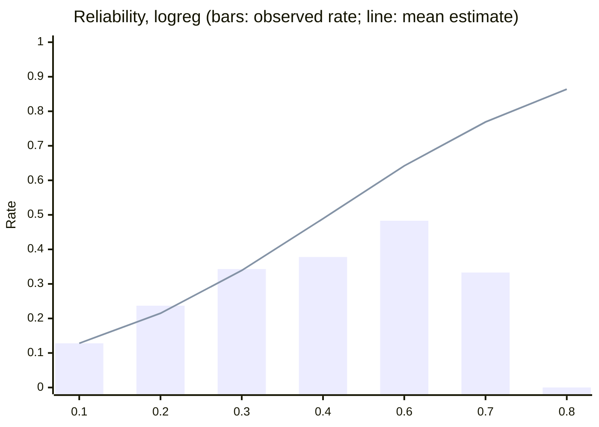
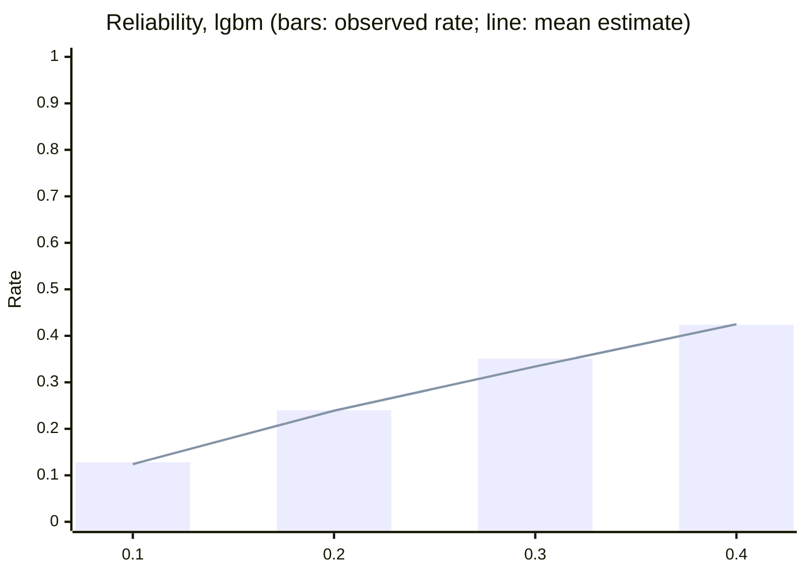

# Evaluation: credit risk estimator (snapshot risk estimate)

This is a risk estimate trained on synthetic organizer data. It is not a lending model, it is not validated for any real credit decision, and it never approves or declines anything. It is one input to the synthetic eligibility service (phase 06), which is also labeled synthetic.

- Generated: 2026-09-27T22:41:00+00:00 at commit `f45154c` by `bank-ml risk evaluate`.
- Artifacts (candidate): `risk_estimator:logreg@2afb401aa70e`, `risk_estimator:lgbm@1c54c935b495`.
- Dataset `risk-v1`, hash `fc4fdee798791aae`, snapshot 2026-06-17; rows: train 46,264, calibration 7,799, selection 7,844, test 15,322.
- Label `snapshot_dpd30_any_credit_product`: any open credit product 30 or more days past due at the single snapshot. **Cross-sectional**: it measures a concurrent association, not a forecast.
- Band cut points from `ELG-ALL-2`: 0.20 and 0.35, margin 0.01.
- Test was scored once, after every choice was made on train and dev. Intervals are 95% customer bootstraps.

Filters: customers with at least one open credit product; excluded: 2784 customers with no known days past due on any open credit product; excluded: 3178 customers with an unknown value on some open credit product; snapshot 2026-06-17; no temporal split (one snapshot).

## Headline (test split)

15,322 test customers, 2,645 positive (17.3%).

| Model | ROC AUC | PR AUC | Brier | Log loss | ECE |
|---|---|---|---|---|---|
| `score_band@1` (shipped priors) | 0.504 [0.492, 0.514] | 0.174 [0.167, 0.182] | 0.1935 [0.1908, 0.1963] | 0.5785 | 0.1938 [0.1874, 0.2005] |
| score bands re-estimated on train | 0.505 [0.493, 0.517] | 0.174 [0.167, 0.182] | 0.1428 [0.1386, 0.1466] | 0.4600 | 0.0031 [0.0002, 0.0086] |
| `logreg` | 0.611 [0.599, 0.623] | 0.258 [0.246, 0.273] | 0.1383 [0.1344, 0.1423] | 0.4452 | 0.0078 [0.0057, 0.0149] |
| `lgbm` | 0.612 [0.599, 0.624] | 0.257 [0.243, 0.272] | 0.1380 [0.1346, 0.1418] | 0.4447 | 0.0039 [0.0019, 0.0105] |

### Paired differences (candidate minus reference, same resampled customers)

| Candidate | Reference | ROC AUC | PR AUC | Brier |
|---|---|---|---|---|
| `logreg` | `score_band@1` (shipped priors) | 0.1071 [0.0925, 0.1238] | 0.0843 [0.0732, 0.0981] | -0.0552 [-0.0578, -0.0522] |
| `logreg` | score bands re-estimated on train | 0.1052 [0.0906, 0.1210] | 0.0840 [0.0716, 0.0973] | -0.0045 [-0.0056, -0.0036] |
| `lgbm` | `score_band@1` (shipped priors) | 0.1082 [0.0921, 0.1239] | 0.0834 [0.0710, 0.0966] | -0.0554 [-0.0583, -0.0529] |
| `lgbm` | score bands re-estimated on train | 0.1063 [0.0907, 0.1245] | 0.0831 [0.0707, 0.0968] | -0.0048 [-0.0057, -0.0039] |
| `lgbm` | `logreg` | 0.0011 [-0.0048, 0.0071] | -0.0010 [-0.0059, 0.0042] | -0.0003 [-0.0006, 0.0001] |

## Promotion rule check (pre-registered in `docs/plans/phase-10b.md`)

- `logreg` meets the rule: vs score_band@1: ROC AUC difference lower bound +0.0925 (needs > 0): pass; vs score_band@1: PR AUC +0.0843 (needs >= 0): pass; vs score_band@1: Brier -0.0552 (needs <= 0.002): pass; vs score_band_reestimated: ROC AUC difference lower bound +0.0906 (needs > 0): pass; vs score_band_reestimated: PR AUC +0.0840 (needs >= 0): pass; vs score_band_reestimated: Brier -0.0045 (needs <= 0.002): pass; test ECE 0.0078 (needs <= 0.03): pass.
- `lgbm` does not meet the rule: vs score_band@1: ROC AUC difference lower bound +0.0921 (needs > 0): pass; vs score_band@1: PR AUC +0.0834 (needs >= 0): pass; vs score_band@1: Brier -0.0554 (needs <= 0.002): pass; vs score_band_reestimated: ROC AUC difference lower bound +0.0907 (needs > 0): pass; vs score_band_reestimated: PR AUC +0.0831 (needs >= 0): pass; vs score_band_reestimated: Brier -0.0048 (needs <= 0.002): pass; vs logreg: ROC AUC difference lower bound -0.0048 (needs > 0): fail; vs logreg: PR AUC -0.0010 (needs >= 0): fail; vs logreg: Brier -0.0003 (needs <= 0.002): pass; test ECE 0.0039 (needs <= 0.03): pass.

`make promote` records the decision (approver, time, commit, metrics compared) in the registry.

## Calibration

Calibrators were fitted on the dev calibration half and chosen by log loss on the dev selection half.

| Model | Chosen | Identity | Platt | Isotonic |
|---|---|---|---|---|
| `logreg` | `identity` | 0.4394 | 0.4395 | 0.4428 |
| `lgbm` | `identity` | 0.4385 | 0.4386 | 0.4395 |

### Reliability, `logreg`

| Bin | Customers | Mean estimate | Observed rate |
|---|---|---|---|
| 0.1 to 0.2 | 10268 | 0.128 | 0.128 |
| 0.2 to 0.3 | 3852 | 0.215 | 0.237 |
| 0.3 to 0.4 | 973 | 0.339 | 0.343 |
| 0.4 to 0.5 | 196 | 0.489 | 0.378 |
| 0.6 to 0.7 | 29 | 0.642 | 0.483 |
| 0.7 to 0.8 | 3 | 0.769 | 0.333 |
| 0.8 to 0.9 | 1 | 0.864 | 0.000 |

### Reliability, `lgbm`

| Bin | Customers | Mean estimate | Observed rate |
|---|---|---|---|
| 0.1 to 0.2 | 10268 | 0.124 | 0.128 |
| 0.2 to 0.3 | 4008 | 0.239 | 0.240 |
| 0.3 to 0.4 | 961 | 0.334 | 0.351 |
| 0.4 to 0.5 | 85 | 0.425 | 0.424 |

## Bands (test)

Share of customers per band, with the observed positive rate in parentheses. Borderline: the interval, widened by the margin, reaches a cut point, so the synthetic eligibility service would ask for review.

| Model | Low | Medium | High | Borderline |
|---|---|---|---|---|
| `score_band@1` (shipped priors) | 25.5% (0.173) | 34.2% (0.169) | 40.4% (0.175) | 49.2% |
| score bands re-estimated on train | 100.0% (0.173) | 0 | 0 | 0.0% |
| `logreg` | 67.0% (0.128) | 31.5% (0.258) | 1.5% (0.387) | 22.2% |
| `lgbm` | 67.0% (0.128) | 31.4% (0.258) | 1.6% (0.383) | 2.6% |

## Uncertainty intervals

Two candidates per model, chosen on the dev selection half: a bootstrap ensemble (20 members refit on train bootstraps and recalibrated on dev bootstraps; 2.5% to 97.5% percentiles) and binned inductive Venn-Abers. Group coverage: ten equal-count groups by estimate; a group is covered when its mean interval intersects the 95% Wilson interval of its observed rate. The narrower method with coverage of at least 0.9 wins. "Inside" is the stricter share of customers in groups whose observed rate lies inside the mean interval.

| Model | Method (dev) | Group coverage | Inside | Mean width | Chosen |
|---|---|---|---|---|---|
| `logreg` | bootstrap | 1.00 | 0.40 | 0.0145 | yes |
| `logreg` | venn_abers | 1.00 | 0.00 | 0.0155 |  |
| `lgbm` | bootstrap | 1.00 | 0.70 | 0.0306 |  |
| `lgbm` | venn_abers | 1.00 | 0.20 | 0.0087 | yes |

Test coverage of the served intervals (all models; the baselines use their own intervals):

| Model | Group coverage | Inside | Mean width |
|---|---|---|---|
| `score_band@1` (shipped priors) | 0.20 | 0.20 | 0.3210 |
| score bands re-estimated on train | 1.00 | 0.80 | 0.0166 |
| `logreg` | 1.00 | 0.40 | 0.0144 |
| `lgbm` | 1.00 | 0.20 | 0.0088 |

Flags on test (share of customers):

| Model | Missing features | Out of distribution | Wide interval (over 0.10) |
|---|---|---|---|
| `logreg` | 34.5% | 0.0% | 0.0% |
| `lgbm` | 34.5% | 0.0% | 0.6% |

## Slices and disparities (test)

**This is a disparity report for investigation, not a fairness certification.** Segment and country are never features. A group is listed when, against the rest of the population, its calibration gap (mean estimate minus observed rate) differs by more than 0.02 with an interval excluding zero, its ROC AUC differs by more than 0.05, or its low-band share ratio is below 0.8. Cells under 300 customers or 30 positives are flagged small and never listed.

### `logreg`

#### Country

| Group | Customers | Positives | Prevalence | Mean estimate | Gap | Gap vs rest | ROC AUC | Low band | Borderline | Cell | Above a threshold |
|---|---|---|---|---|---|---|---|---|---|---|---|
| AR | 3,051 | 530 | 0.174 | 0.168 | -0.006 [-0.019, 0.008] | -0.002 [-0.018, 0.012] | 0.608 [0.585, 0.634] | 67.5% | 22.3% |  | none |
| CO | 4,622 | 814 | 0.176 | 0.169 | -0.007 [-0.018, 0.003] | -0.005 [-0.018, 0.007] | 0.615 [0.595, 0.638] | 66.7% | 23.4% |  | none |
| MX | 7,649 | 1301 | 0.170 | 0.169 | -0.001 [-0.009, 0.007] | 0.005 [-0.005, 0.018] | 0.609 [0.591, 0.626] | 67.0% | 21.4% |  | none |

#### Segment (slice only, never a feature)

| Group | Customers | Positives | Prevalence | Mean estimate | Gap | Gap vs rest | ROC AUC | Low band | Borderline | Cell | Above a threshold |
|---|---|---|---|---|---|---|---|---|---|---|---|
| basic | 9,085 | 1570 | 0.173 | 0.170 | -0.003 [-0.010, 0.004] | 0.002 [-0.009, 0.013] | 0.617 [0.603, 0.633] | 66.9% | 17.8% |  | none |
| plus | 3,895 | 668 | 0.172 | 0.167 | -0.004 [-0.016, 0.007] | -0.001 [-0.014, 0.013] | 0.606 [0.584, 0.628] | 67.3% | 28.3% |  | none |
| premium | 1,580 | 281 | 0.178 | 0.168 | -0.010 [-0.029, 0.009] | -0.007 [-0.029, 0.014] | 0.595 [0.560, 0.632] | 65.5% | 33.1% |  | none |
| student | 762 | 126 | 0.165 | 0.165 | -0.000 [-0.024, 0.027] | 0.004 [-0.022, 0.029] | 0.601 [0.544, 0.655] | 69.7% | 20.7% |  | none |

#### Income band (within-country tertile)

| Group | Customers | Positives | Prevalence | Mean estimate | Gap | Gap vs rest | ROC AUC | Low band | Borderline | Cell | Above a threshold |
|---|---|---|---|---|---|---|---|---|---|---|---|
| lower | 4,063 | 716 | 0.176 | 0.171 | -0.005 [-0.017, 0.005] | -0.002 [-0.015, 0.011] | 0.619 [0.596, 0.641] | 66.9% | 19.1% |  | none |
| middle | 4,035 | 692 | 0.171 | 0.168 | -0.003 [-0.014, 0.007] | 0.001 [-0.012, 0.015] | 0.610 [0.584, 0.632] | 67.6% | 17.5% |  | none |
| missing | 3,073 | 529 | 0.172 | 0.168 | -0.004 [-0.017, 0.009] | -0.000 [-0.014, 0.015] | 0.619 [0.588, 0.649] | 67.7% | 21.2% |  | none |
| upper | 4,151 | 708 | 0.171 | 0.168 | -0.003 [-0.014, 0.008] | 0.001 [-0.012, 0.015] | 0.595 [0.573, 0.619] | 66.1% | 30.5% |  | none |

#### Credit product count (diagnostic; the main feature)

| Group | Customers | Positives | Prevalence | Mean estimate | Gap | Gap vs rest | ROC AUC | Low band | Borderline | Cell | Above a threshold |
|---|---|---|---|---|---|---|---|---|---|---|---|
| 1 | 10,268 | 1310 | 0.128 | 0.128 | 0.000 [-0.007, 0.007] | 0.012 [-0.001, 0.026] | 0.492 [0.477, 0.508] | 100.0% | 0.0% |  | roc auc |
| 2 | 3,852 | 912 | 0.237 | 0.215 | -0.022 [-0.035, -0.009] | -0.024 [-0.040, -0.010] | 0.493 [0.472, 0.514] | 0.0% | 63.1% |  | calibration gap, roc auc, low-band share ratio |
| 3 | 973 | 334 | 0.343 | 0.339 | -0.005 [-0.034, 0.027] | -0.001 [-0.029, 0.029] | 0.528 [0.492, 0.562] | 0.0% | 100.0% |  | roc auc, low-band share ratio |
| 4+ | 229 | 89 | 0.389 | 0.514 | 0.125 [0.067, 0.189] | 0.131 [0.067, 0.196] | 0.510 [0.433, 0.591] | 0.0% | 0.0% | small | calibration gap, roc auc, low-band share ratio |

### `lgbm`

#### Country

| Group | Customers | Positives | Prevalence | Mean estimate | Gap | Gap vs rest | ROC AUC | Low band | Borderline | Cell | Above a threshold |
|---|---|---|---|---|---|---|---|---|---|---|---|
| AR | 3,051 | 530 | 0.174 | 0.168 | -0.006 [-0.018, 0.007] | -0.002 [-0.016, 0.012] | 0.621 [0.597, 0.647] | 67.5% | 2.9% |  | none |
| CO | 4,622 | 814 | 0.176 | 0.169 | -0.007 [-0.017, 0.004] | -0.004 [-0.016, 0.009] | 0.611 [0.588, 0.634] | 66.7% | 2.6% |  | none |
| MX | 7,649 | 1301 | 0.170 | 0.169 | -0.001 [-0.010, 0.007] | 0.005 [-0.005, 0.017] | 0.608 [0.592, 0.627] | 67.0% | 2.5% |  | none |

#### Segment (slice only, never a feature)

| Group | Customers | Positives | Prevalence | Mean estimate | Gap | Gap vs rest | ROC AUC | Low band | Borderline | Cell | Above a threshold |
|---|---|---|---|---|---|---|---|---|---|---|---|
| basic | 9,085 | 1570 | 0.173 | 0.170 | -0.003 [-0.011, 0.005] | 0.003 [-0.008, 0.015] | 0.617 [0.601, 0.634] | 66.9% | 2.6% |  | none |
| plus | 3,895 | 668 | 0.172 | 0.167 | -0.005 [-0.016, 0.007] | -0.001 [-0.014, 0.011] | 0.606 [0.581, 0.633] | 67.3% | 2.6% |  | none |
| premium | 1,580 | 281 | 0.178 | 0.168 | -0.010 [-0.029, 0.010] | -0.007 [-0.026, 0.012] | 0.603 [0.564, 0.638] | 65.5% | 2.3% |  | none |
| student | 762 | 126 | 0.165 | 0.164 | -0.002 [-0.029, 0.023] | 0.002 [-0.025, 0.027] | 0.598 [0.531, 0.652] | 69.7% | 3.1% |  | none |

#### Income band (within-country tertile)

| Group | Customers | Positives | Prevalence | Mean estimate | Gap | Gap vs rest | ROC AUC | Low band | Borderline | Cell | Above a threshold |
|---|---|---|---|---|---|---|---|---|---|---|---|
| lower | 4,063 | 716 | 0.176 | 0.170 | -0.006 [-0.017, 0.007] | -0.003 [-0.016, 0.011] | 0.624 [0.601, 0.648] | 66.9% | 2.8% |  | none |
| middle | 4,035 | 692 | 0.171 | 0.169 | -0.003 [-0.013, 0.009] | 0.002 [-0.012, 0.014] | 0.611 [0.587, 0.635] | 67.6% | 2.7% |  | none |
| missing | 3,073 | 529 | 0.172 | 0.168 | -0.004 [-0.016, 0.008] | -0.001 [-0.016, 0.015] | 0.614 [0.588, 0.639] | 67.7% | 2.3% |  | none |
| upper | 4,151 | 708 | 0.171 | 0.168 | -0.003 [-0.014, 0.007] | 0.002 [-0.012, 0.017] | 0.599 [0.578, 0.622] | 66.1% | 2.6% |  | none |

#### Credit product count (diagnostic; the main feature)

| Group | Customers | Positives | Prevalence | Mean estimate | Gap | Gap vs rest | ROC AUC | Low band | Borderline | Cell | Above a threshold |
|---|---|---|---|---|---|---|---|---|---|---|---|
| 1 | 10,268 | 1310 | 0.128 | 0.124 | -0.004 [-0.010, 0.002] | 0.000 [-0.014, 0.013] | 0.495 [0.481, 0.513] | 100.0% | 0.4% |  | roc auc |
| 2 | 3,852 | 912 | 0.237 | 0.238 | 0.001 [-0.012, 0.015] | 0.006 [-0.008, 0.023] | 0.494 [0.472, 0.513] | 0.0% | 6.0% |  | roc auc, low-band share ratio |
| 3 | 973 | 334 | 0.343 | 0.319 | -0.025 [-0.054, 0.007] | -0.022 [-0.053, 0.005] | 0.503 [0.466, 0.539] | 0.0% | 9.4% |  | roc auc, low-band share ratio |
| 4+ | 229 | 89 | 0.389 | 0.393 | 0.005 [-0.053, 0.064] | 0.009 [-0.054, 0.067] | 0.517 [0.442, 0.592] | 0.0% | 13.5% | small | roc auc, low-band share ratio |

### Listed for investigation

- None: no population group crosses a threshold.

## Error analysis

The most confident misses on test (synthetic organizer data; no identifier; credit score rounded to tens, other values to one decimal).

### `logreg`, highest estimates among negatives

| Estimate | Label | Credit score | Tenure (months) | Credit products | Utilization |
|---|---|---|---|---|---|
| 0.864 | 0 | 600.0 | 28.0 | 7.0 | 0.0 |
| 0.772 | 0 | 600.0 | 51.0 | 6.0 | 0.1 |
| 0.766 | 0 | 840.0 | 49.0 | 6.0 | 0.0 |
| 0.649 | 0 | 570.0 | 27.0 | 5.0 | missing |
| 0.646 | 0 | 580.0 | 17.0 | 5.0 | 0.1 |

### `logreg`, lowest estimates among positives

| Estimate | Label | Credit score | Tenure (months) | Credit products | Utilization |
|---|---|---|---|---|---|
| 0.123 | 1 | 850.0 | 93.0 | 1.0 | 0.0 |
| 0.123 | 1 | 830.0 | 90.0 | 1.0 | 0.0 |
| 0.124 | 1 | missing | 95.0 | 1.0 | 0.0 |
| 0.124 | 1 | 850.0 | 79.0 | 1.0 | 0.0 |
| 0.124 | 1 | missing | 93.0 | 1.0 | 0.0 |

### `lgbm`, highest estimates among negatives

| Estimate | Label | Credit score | Tenure (months) | Credit products | Utilization |
|---|---|---|---|---|---|
| 0.451 | 0 | 630.0 | 88.0 | 4.0 | missing |
| 0.44 | 0 | 580.0 | 85.0 | 4.0 | missing |
| 0.44 | 0 | 560.0 | 67.0 | 4.0 | missing |
| 0.44 | 0 | 610.0 | 81.0 | 4.0 | missing |
| 0.438 | 0 | 740.0 | 87.0 | 4.0 | missing |

### `lgbm`, lowest estimates among positives

| Estimate | Label | Credit score | Tenure (months) | Credit products | Utilization |
|---|---|---|---|---|---|
| 0.115 | 1 | missing | 59.0 | 1.0 | 0.0 |
| 0.115 | 1 | missing | 74.0 | 1.0 | 0.0 |
| 0.115 | 1 | 770.0 | 70.0 | 1.0 | 0.0 |
| 0.115 | 1 | missing | 50.0 | 1.0 | 0.0 |
| 0.116 | 1 | 850.0 | 71.0 | 1.0 | 0.1 |
