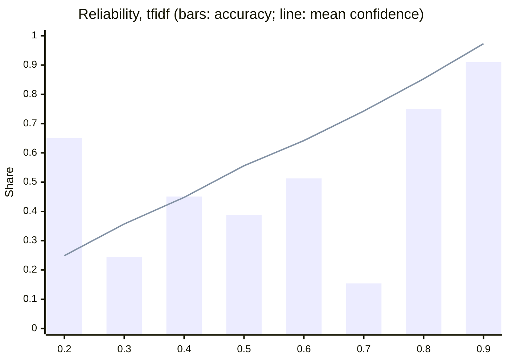
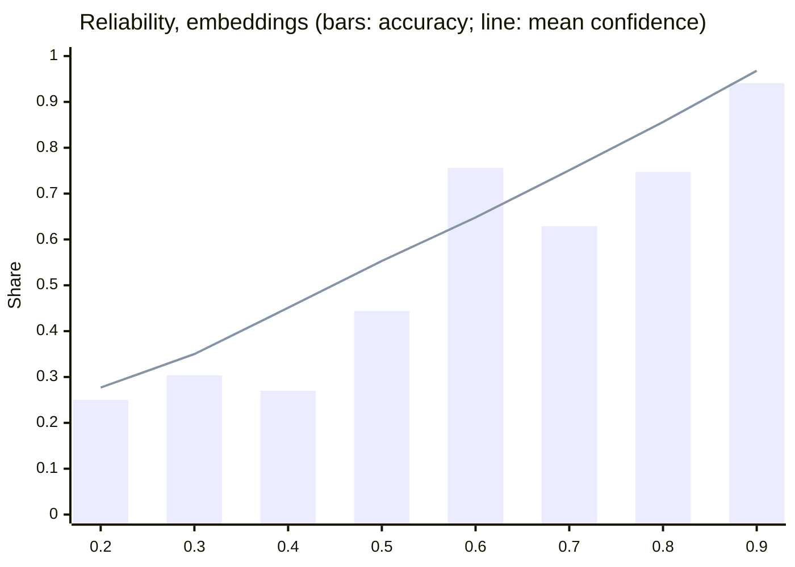

# Router evaluation

Generated 2026-09-27T20:09:44+00:00 from commit `2c19633` by `bank-ml router evaluate`. Do not edit by hand; rerun `make train` (or `bank-ml router evaluate`).

- Dataset `router-v1`, content hash `5ec099abd3718810`: train 1464, dev 286, test 601 items.
- Evaluated artifacts (champion): `router:tfidf@986872f0284f`, `router:embeddings@32666d7d4e3f`.
- All text is synthetic: team-authored seeds in es-MX, es-CO, es-AR, and pt-BR plus deterministic augmentation (`docs/models/router.md`). Organizer transcripts carry no intent signal (see the last section). pt-BR seeds await native review, and no language-model paraphrase is included yet.
- Intervals are 95% percentile bootstraps that resample whole seed groups (1,000 resamples); `n` is items and seed groups. The test split was never used for any choice: C, the temperature, the abstention threshold, and promotion all use dev.

## Test split (held out)

| Model | Accuracy | Macro-F1 | Workflow accuracy | Coverage | Risk at threshold | ECE | High-stakes recall (mean) | n (items / seed groups) |
|---|---|---|---|---|---|---|---|---|
| `majority` | 0.075 [0.031, 0.128] | 0.008 [0.003, 0.013] | 0.136 [0.077, 0.200] | 1.000 [1.000, 1.000] | 0.925 [0.872, 0.971] | 0.007 | 0.167 | 601 / 136 |
| `keyword@1` | 0.381 [0.299, 0.455] | 0.385 [0.299, 0.439] | 0.574 [0.503, 0.656] | 0.491 [0.409, 0.575] | 0.363 [0.255, 0.484] | 0.185 | 0.471 | 601 / 136 |
| `tfidf` | 0.677 [0.596, 0.749] | 0.661 [0.575, 0.718] | 0.827 [0.761, 0.885] | 0.484 [0.406, 0.568] | 0.096 [0.034, 0.175] | 0.125 | 0.741 | 601 / 136 |
| `embeddings` | 0.749 [0.679, 0.805] | 0.742 [0.665, 0.796] | 0.834 [0.784, 0.884] | 0.619 [0.556, 0.682] | 0.102 [0.047, 0.161] | 0.072 | 0.805 | 601 / 136 |

## Dev split (used for C, temperature, threshold, and promotion)

| Model | Accuracy | Macro-F1 | Workflow accuracy | Coverage | Risk at threshold | ECE | High-stakes recall (mean) | n (items / seed groups) |
|---|---|---|---|---|---|---|---|---|
| `majority` | 0.052 [0.010, 0.108] | 0.006 [0.002, 0.012] | 0.112 [0.042, 0.190] | 1.000 [1.000, 1.000] | 0.948 [0.892, 0.990] | 0.015 | 0.167 | 286 / 68 |
| `keyword@1` | 0.388 [0.276, 0.500] | 0.378 [0.271, 0.438] | 0.531 [0.416, 0.644] | 0.444 [0.323, 0.556] | 0.299 [0.138, 0.484] | 0.148 | 0.464 | 286 / 68 |
| `tfidf` | 0.748 [0.648, 0.849] | 0.715 [0.591, 0.801] | 0.825 [0.730, 0.910] | 0.406 [0.295, 0.505] | 0.043 [0.000, 0.108] | 0.083 | 0.751 | 286 / 68 |
| `embeddings` | 0.811 [0.727, 0.888] | 0.812 [0.712, 0.865] | 0.927 [0.875, 0.969] | 0.643 [0.544, 0.732] | 0.049 [0.005, 0.111] | 0.046 | 0.696 | 286 / 68 |

## Abstention thresholds (chosen on dev)

| Model | Threshold | Dev coverage | Dev risk | Target risk | Met |
|---|---|---|---|---|---|
| `tfidf` | 0.8838 | 40.6% | 4.3% | 5.0% | True |
| `embeddings` | 0.8006 | 64.3% | 4.9% | 5.0% | True |
| `keyword@1` | 0.6000 (fixed in code) | - | - | - | - |

## Per intent (test)

| Intent | Workflow | n (items / groups) | majority P / R | keyword@1 P / R | tfidf P / R | embeddings P / R |
|---|---|---|---|---|---|---|
| `balance_inquiry` | account_inquiry | 33 / 8 | 0.00 / 0.00 | 1.00 / 0.36 | 0.97 / 0.94 | 0.96 / 0.79 |
| `card_block` (high stakes) | card_support | 33 / 8 | 0.00 / 0.00 | 0.45 / 0.82 | 0.60 / 0.88 | 0.71 / 0.82 |
| `card_replacement_request` (high stakes) | card_support | 37 / 8 | 0.00 / 0.00 | 1.00 / 0.49 | 0.83 / 0.65 | 0.75 / 0.89 |
| `card_status` | card_support | 40 / 8 | 0.00 / 0.00 | 1.00 / 0.55 | 0.53 / 0.72 | 0.76 / 0.85 |
| `card_unblock_request` (high stakes) | card_support | 34 / 8 | 0.00 / 0.00 | 0.82 / 0.53 | 0.74 / 0.74 | 0.51 / 0.68 |
| `credit_application` (high stakes) | credit | 40 / 8 | 0.00 / 0.00 | 1.00 / 0.15 | 0.57 / 0.65 | 0.74 / 0.88 |
| `credit_application_status` | credit | 38 / 8 | 0.00 / 0.00 | 0.00 / 0.00 | 0.50 / 0.58 | 0.84 / 0.82 |
| `credit_eligibility` | credit | 34 / 8 | 0.00 / 0.00 | 0.32 / 0.21 | 0.57 / 0.35 | 0.92 / 0.71 |
| `credit_product_info` | credit | 38 / 8 | 0.00 / 0.00 | 0.41 / 0.55 | 0.58 / 0.82 | 0.80 / 0.92 |
| `dispute_new` (high stakes) | dispute | 45 / 8 | 0.07 / 1.00 | 0.53 / 0.60 | 0.77 / 0.73 | 0.63 / 0.89 |
| `dispute_status` | dispute | 37 / 8 | 0.00 / 0.00 | 0.00 / 0.00 | 0.52 / 0.78 | 0.69 / 0.59 |
| `greeting_or_other` | shared | 28 / 8 | 0.00 / 0.00 | 0.10 / 1.00 | 0.80 / 0.71 | 0.76 / 0.89 |
| `human_request` (high stakes) | shared | 25 / 8 | 0.00 / 0.00 | 1.00 / 0.24 | 1.00 / 0.80 | 0.81 / 0.68 |
| `informational` | shared | 32 / 8 | 0.00 / 0.00 | 0.00 / 0.00 | 0.53 / 0.28 | 0.95 / 0.62 |
| `payment_status` | account_inquiry | 38 / 8 | 0.00 / 0.00 | 1.00 / 0.08 | 0.94 / 0.89 | 0.78 / 0.66 |
| `statement_request` | account_inquiry | 37 / 8 | 0.00 / 0.00 | 1.00 / 0.59 | 0.89 / 0.86 | 0.89 / 0.65 |
| `unsupported` | out_of_scope | 32 / 8 | 0.00 / 0.00 | 0.48 / 0.38 | 0.17 / 0.03 | 0.47 / 0.28 |

## By workflow (test)

| Workflow | n (items / groups) | majority accuracy | keyword@1 accuracy | tfidf accuracy | embeddings accuracy |
|---|---|---|---|---|---|
| account_inquiry | 108 / 24 | 0.00 [0.00, 0.00] | 0.34 [0.18, 0.53] | 0.90 [0.79, 0.99] | 0.69 [0.56, 0.83] |
| card_support | 144 / 32 | 0.00 [0.00, 0.00] | 0.59 [0.43, 0.74] | 0.74 [0.60, 0.86] | 0.81 [0.71, 0.92] |
| credit | 150 / 32 | 0.00 [0.00, 0.00] | 0.23 [0.11, 0.36] | 0.61 [0.42, 0.76] | 0.83 [0.72, 0.93] |
| dispute | 82 / 16 | 0.55 [0.29, 0.78] | 0.33 [0.12, 0.56] | 0.76 [0.53, 0.92] | 0.76 [0.57, 0.93] |
| out_of_scope | 32 / 8 | 0.00 [0.00, 0.00] | 0.38 [0.11, 0.71] | 0.03 [0.00, 0.10] | 0.28 [0.06, 0.59] |
| shared | 85 / 24 | 0.00 [0.00, 0.00] | 0.40 [0.20, 0.59] | 0.58 [0.38, 0.77] | 0.73 [0.57, 0.88] |

## By language and locale (test)

| Language | n (items / groups) | majority accuracy | keyword@1 accuracy | tfidf accuracy | embeddings accuracy |
|---|---|---|---|---|---|
| es | 446 / 102 | 0.07 [0.02, 0.13] | 0.37 [0.28, 0.46] | 0.70 [0.61, 0.78] | 0.75 [0.67, 0.81] |
| pt | 155 / 34 | 0.09 [0.00, 0.22] | 0.41 [0.25, 0.57] | 0.63 [0.47, 0.77] | 0.75 [0.62, 0.88] |

| Locale | n (items / groups) | majority accuracy | keyword@1 accuracy | tfidf accuracy | embeddings accuracy |
|---|---|---|---|---|---|
| es-AR | 139 / 34 | 0.06 [0.00, 0.17] | 0.36 [0.21, 0.51] | 0.73 [0.57, 0.87] | 0.76 [0.63, 0.87] |
| es-CO | 153 / 34 | 0.07 [0.00, 0.17] | 0.39 [0.23, 0.55] | 0.73 [0.56, 0.86] | 0.78 [0.64, 0.90] |
| es-MX | 154 / 35 | 0.08 [0.00, 0.18] | 0.36 [0.23, 0.51] | 0.63 [0.48, 0.78] | 0.70 [0.58, 0.82] |
| pt-BR | 155 / 34 | 0.09 [0.00, 0.22] | 0.41 [0.25, 0.57] | 0.63 [0.47, 0.77] | 0.75 [0.62, 0.88] |

## By augmentation kind (test)

| Augmentation | n (items / groups) | majority accuracy | keyword@1 accuracy | tfidf accuracy | embeddings accuracy |
|---|---|---|---|---|---|
| accents | 108 / 107 | 0.05 [0.01, 0.09] | 0.41 [0.31, 0.50] | 0.66 [0.56, 0.75] | 0.78 [0.70, 0.86] |
| canonical | 137 / 136 | 0.06 [0.02, 0.10] | 0.43 [0.35, 0.51] | 0.67 [0.59, 0.75] | 0.77 [0.70, 0.84] |
| casing | 130 / 129 | 0.05 [0.02, 0.09] | 0.42 [0.33, 0.50] | 0.67 [0.58, 0.74] | 0.72 [0.64, 0.79] |
| slang | 17 / 17 | 0.06 [0.00, 0.18] | 0.47 [0.24, 0.71] | 0.71 [0.47, 0.88] | 0.71 [0.47, 0.88] |
| slots | 72 / 28 | 0.22 [0.07, 0.38] | 0.38 [0.20, 0.57] | 0.78 [0.64, 0.91] | 0.79 [0.65, 0.92] |
| typo | 137 / 136 | 0.06 [0.02, 0.10] | 0.26 [0.18, 0.34] | 0.65 [0.57, 0.73] | 0.72 [0.64, 0.79] |

## Workflow confusion (test)

### `keyword@1`

| True \ predicted | account_inquiry | card_support | dispute | credit | shared | out_of_scope |
|---|---|---|---|---|---|---|
| **account_inquiry** | 37 | 0 | 0 | 0 | 71 | 0 |
| **card_support** | 0 | 110 | 4 | 0 | 30 | 0 |
| **dispute** | 0 | 0 | 43 | 5 | 34 | 0 |
| **credit** | 0 | 0 | 0 | 74 | 63 | 13 |
| **shared** | 0 | 12 | 4 | 0 | 69 | 0 |
| **out_of_scope** | 0 | 0 | 0 | 0 | 20 | 12 |

### `tfidf`

| True \ predicted | account_inquiry | card_support | dispute | credit | shared | out_of_scope |
|---|---|---|---|---|---|---|
| **account_inquiry** | 98 | 3 | 2 | 1 | 0 | 4 |
| **card_support** | 1 | 137 | 3 | 0 | 3 | 0 |
| **dispute** | 0 | 8 | 69 | 3 | 2 | 0 |
| **credit** | 0 | 3 | 12 | 135 | 0 | 0 |
| **shared** | 0 | 15 | 4 | 8 | 57 | 1 |
| **out_of_scope** | 5 | 0 | 9 | 17 | 0 | 1 |

### `embeddings`

| True \ predicted | account_inquiry | card_support | dispute | credit | shared | out_of_scope |
|---|---|---|---|---|---|---|
| **account_inquiry** | 77 | 9 | 12 | 2 | 1 | 7 |
| **card_support** | 4 | 137 | 3 | 0 | 0 | 0 |
| **dispute** | 1 | 8 | 70 | 2 | 1 | 0 |
| **credit** | 0 | 0 | 7 | 139 | 4 | 0 |
| **shared** | 0 | 9 | 3 | 1 | 69 | 3 |
| **out_of_scope** | 4 | 9 | 0 | 10 | 0 | 9 |

## Calibration and coverage (test)

### `tfidf`

| Bin | Items | Mean confidence | Accuracy |
|---|---|---|---|
| 0.2 to 0.3 | 20 | 0.249 | 0.650 |
| 0.3 to 0.4 | 41 | 0.357 | 0.244 |
| 0.4 to 0.5 | 51 | 0.448 | 0.451 |
| 0.5 to 0.6 | 49 | 0.556 | 0.388 |
| 0.6 to 0.7 | 39 | 0.642 | 0.513 |
| 0.7 to 0.8 | 39 | 0.743 | 0.154 |
| 0.8 to 0.9 | 84 | 0.853 | 0.750 |
| 0.9 to 1.0 | 278 | 0.973 | 0.910 |

Coverage against risk (test):

| Threshold | Coverage | Risk |
|---|---|---|
| 0.998 | 10.0% | 8.3% |
| 0.991 | 20.0% | 7.5% |
| 0.971 | 30.1% | 9.4% |
| 0.931 | 39.9% | 7.5% |
| 0.876 | 49.9% | 11.3% |
| 0.806 | 60.2% | 12.7% |
| 0.642 | 70.2% | 21.3% |
| 0.514 | 79.9% | 25.8% |
| 0.399 | 90.0% | 28.8% |
| 0.213 | 100.0% | 32.3% |

### `embeddings`

| Bin | Items | Mean confidence | Accuracy |
|---|---|---|---|
| 0.2 to 0.3 | 8 | 0.277 | 0.250 |
| 0.3 to 0.4 | 23 | 0.350 | 0.304 |
| 0.4 to 0.5 | 37 | 0.451 | 0.270 |
| 0.5 to 0.6 | 54 | 0.553 | 0.444 |
| 0.6 to 0.7 | 45 | 0.648 | 0.756 |
| 0.7 to 0.8 | 62 | 0.751 | 0.629 |
| 0.8 to 0.9 | 83 | 0.856 | 0.747 |
| 0.9 to 1.0 | 289 | 0.968 | 0.941 |

Coverage against risk (test):

| Threshold | Coverage | Risk |
|---|---|---|
| 0.994 | 10.0% | 0.0% |
| 0.984 | 20.0% | 0.8% |
| 0.962 | 30.0% | 2.2% |
| 0.936 | 39.9% | 4.6% |
| 0.891 | 49.9% | 6.7% |
| 0.819 | 60.1% | 9.7% |
| 0.722 | 70.0% | 13.5% |
| 0.598 | 80.0% | 15.2% |
| 0.479 | 90.0% | 20.1% |
| 0.250 | 100.0% | 25.1% |

## Robustness: speech-to-text noise (test)

Each set is the 137 canonical test seeds, perturbed deterministically.

| Model | clean | accents | homophones | fillers | truncation | combined |
|---|---|---|---|---|---|---|
| `keyword@1` | 0.43 [0.35, 0.51] | 0.43 [0.35, 0.52] | 0.43 [0.35, 0.52] | 0.39 [0.31, 0.48] | 0.32 [0.24, 0.40] | 0.39 [0.31, 0.47] |
| `tfidf` | 0.67 [0.60, 0.75] | 0.67 [0.59, 0.75] | 0.67 [0.59, 0.75] | 0.69 [0.61, 0.76] | 0.53 [0.44, 0.61] | 0.69 [0.62, 0.77] |
| `embeddings` | 0.77 [0.70, 0.85] | 0.78 [0.71, 0.85] | 0.77 [0.69, 0.84] | 0.72 [0.64, 0.79] | 0.53 [0.44, 0.61] | 0.73 [0.65, 0.80] |

Paraphrase robustness set: pending: needs a language model provider (`bank-ml router paraphrase --purpose eval`); none generated

## Transfer and out of distribution

TF-IDF retrained with the same C without the held-out part; reference: `router:tfidf@986872f0284f`.

| Slice | Items | Trained with it (in distribution) | Trained without it |
|---|---|---|---|
| pt-BR test (Spanish-to-Portuguese transfer) | 155 | 0.63 [0.47, 0.77] | 0.59 [0.44, 0.74] |
| es-MX test (held-out dialect) | 154 | 0.63 [0.48, 0.78] | 0.73 [0.57, 0.86] |
| es-CO test (held-out dialect) | 153 | 0.73 [0.56, 0.86] | 0.81 [0.67, 0.93] |
| es-AR test (held-out dialect) | 139 | 0.73 [0.57, 0.87] | 0.76 [0.62, 0.89] |

## Language detector

Detector `language_detector:lexical@1` on every corpus item (all splits).

| Language | Items | Correct | Uncertain (asks) | Wrong |
|---|---|---|---|---|
| es | 1760 | 88.2% | 11.4% | 0.3% |
| pt | 591 | 87.1% | 9.3% | 3.6% |

## Human validation

Status: **pending** (200 items in `ml/corpus/router/validation/router_validation_v1.csv`; protocol in `docs/evaluation/router-labeling.md`). Agreement and label accuracy are reported once labeled.

## Failure examples (canonical test seeds, most confident first)

### `tfidf`

| Text (synthetic) | Locale | True | Predicted | Confidence |
|---|---|---|---|---|
| Porfa, inicien mi solicitud de crédito automotriz | es-MX | credit_application | credit_application_status | 1.00 |
| Hola, si bloqueo mi tarjeta, ¿después la puedo desbloquear? | es-MX | informational | card_unblock_request | 0.99 |
| Oigan, llevo dos semanas esperando respuesta del préstamo, ¿en qué va? | es-MX | credit_application_status | dispute_status | 0.98 |
| ¿Cumplo los requisitos para crédito de libre inversión? | es-CO | credit_eligibility | credit_product_info | 0.98 |
| ¿A cuántos meses me pueden prestar en un crédito personal? | es-MX | credit_product_info | credit_eligibility | 0.92 |
| Hola, ¿me cargás la solicitud de préstamo personal? | es-AR | credit_application | credit_application_status | 0.88 |
| ¿El bloqueo de la tarjeta es temporal o definitivo? | es-CO | informational | card_unblock_request | 0.88 |
| Tengo una duda | es-CO | greeting_or_other | informational | 0.85 |
| Quero fazer um Pix de R$ 150 | pt-BR | unsupported | credit_application | 0.83 |
| Meu cartão foi bloqueado por senha errada, preciso liberar | pt-BR | card_unblock_request | card_status | 0.82 |
| ¿La tarjeta que termina en 3310 está bloqueada? | es-CO | card_status | card_block | 0.76 |
| ¿Cómo es el proceso de un reclamo por transacción no reconocida? | es-CO | informational | dispute_status | 0.76 |
| Eu consigo um empréstimo pessoal? | pt-BR | credit_eligibility | credit_application | 0.74 |
| Quisiera saber si ya aprobaron el reclamo del cobro doble | es-CO | dispute_status | credit_application_status | 0.73 |
| Me bloquearon la débito por equivocarme con el PIN, necesito que la habiliten | es-AR | card_unblock_request | card_block | 0.73 |
| Perdi o cartão e já bloqueei, agora quero um novo | pt-BR | card_replacement_request | card_block | 0.73 |
| Exijo que me devuelvan la guita ya, quiero un contracargo garantizado | es-AR | unsupported | dispute_new | 0.73 |
| Soy pensionado, ¿me dan crédito de libranza? | es-CO | credit_eligibility | credit_product_info | 0.73 |
| Queria acompanhar a análise do meu financiamento | pt-BR | credit_application_status | dispute_status | 0.67 |
| ¿Dónde meto la solicitud del préstamo? Ya tengo mis papeles listos | es-MX | credit_application | credit_application_status | 0.66 |

### `embeddings`

| Text (synthetic) | Locale | True | Predicted | Confidence |
|---|---|---|---|---|
| ¿Cumplo los requisitos para crédito de libre inversión? | es-CO | credit_eligibility | credit_product_info | 0.96 |
| Quero fazer um Pix de R$ 150 | pt-BR | unsupported | credit_application | 0.95 |
| Meu cartão foi bloqueado por senha errada, preciso liberar | pt-BR | card_unblock_request | card_block | 0.94 |
| Oi, tem alguém de verdade aí? | pt-BR | human_request | greeting_or_other | 0.84 |
| ¿Dónde meto la solicitud del préstamo? Ya tengo mis papeles listos | es-MX | credit_application | credit_application_status | 0.83 |
| Me bloquearon la débito por equivocarme con el PIN, necesito que la habiliten | es-AR | card_unblock_request | card_block | 0.82 |
| Hace un mes puse una reclamación por un cobro de 50 mil pesos y nada que me responden | es-CO | dispute_status | dispute_new | 0.81 |
| Si denuncio la tarjeta por robo, ¿los débitos automáticos se siguen cobrando? | es-AR | informational | card_status | 0.79 |
| Le giré plata a mi mamá y dice que no le ha llegado nada | es-CO | payment_status | dispute_new | 0.79 |
| Hola, si bloqueo mi tarjeta, ¿después la puedo desbloquear? | es-MX | informational | card_unblock_request | 0.78 |
| No te pido que abras uno nuevo, solo decime si el que tengo ya salió | es-AR | dispute_status | card_replacement_request | 0.77 |
| estado de cuenta tarjeta de crédito | es-MX | statement_request | card_status | 0.77 |
| ejecutivo | es-MX | human_request | greeting_or_other | 0.66 |
| Mi tarjeta vence este mes, ¿me pueden enviar la renovación? | es-MX | card_replacement_request | card_status | 0.62 |
| Quiero invertir en acciones, ¿qué me recomiendan? | es-MX | unsupported | credit_product_info | 0.54 |
| Me colabora enviándome el extracto de la tarjeta de crédito | es-CO | statement_request | credit_application | 0.52 |
| Me envia o extrato do cartão final 7345, por favor | pt-BR | statement_request | card_replacement_request | 0.51 |
| ¿Me alcanza para gastar 500 pesos con lo que tengo en débito? | es-MX | balance_inquiry | unsupported | 0.51 |
| Sumercé, ¿ya estudiaron mi solicitud? | es-CO | credit_application_status | dispute_status | 0.51 |
| Me rechazaron un pago con la de crédito, ¿tiene algún problema? | es-AR | card_status | payment_status | 0.49 |

## Why not transcripts

147,292 interactions carry customer text, but only **42 distinct texts** exist (balance-question templates). `detected_intents`: `consulta_general` 140,039, `null` 7,253. Agreement between the mapped contact reason and `detected_intents`: 0.0% (no detected intent maps to a workflow). The mapped contact reason therefore cannot label router intents, and the router uses team-authored seeds instead (`docs/analysis/labeling-protocol.md`).

| Workflow of the mapped contact reason | Texts |
|---|---|
| account_inquiry | 51452 |
| card_support | 32287 |
| credit | 11877 |
| dispute | 25137 |
| other | 26539 |
