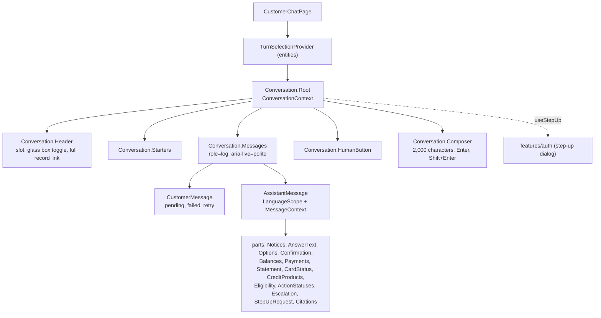
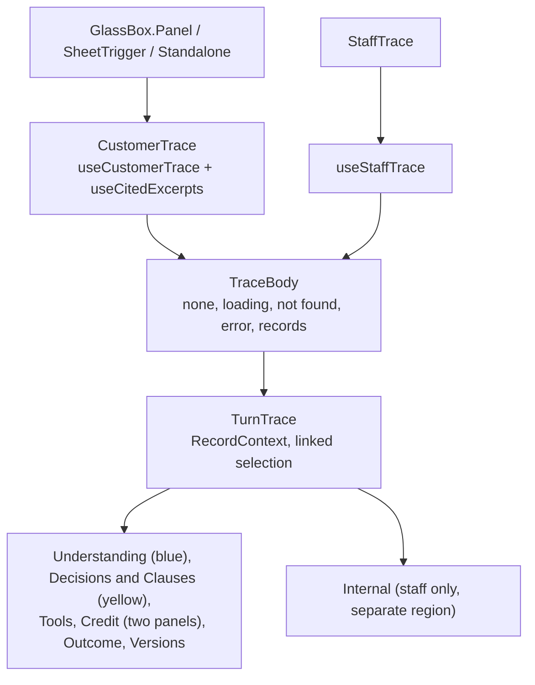
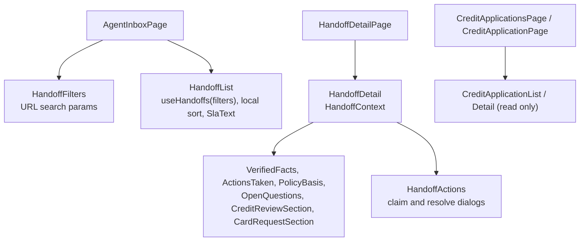
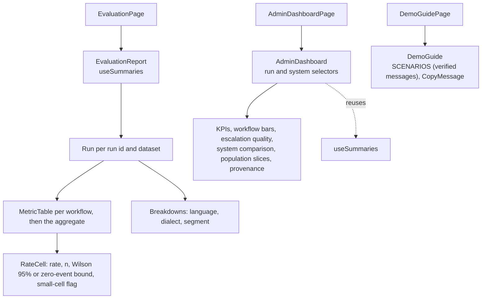
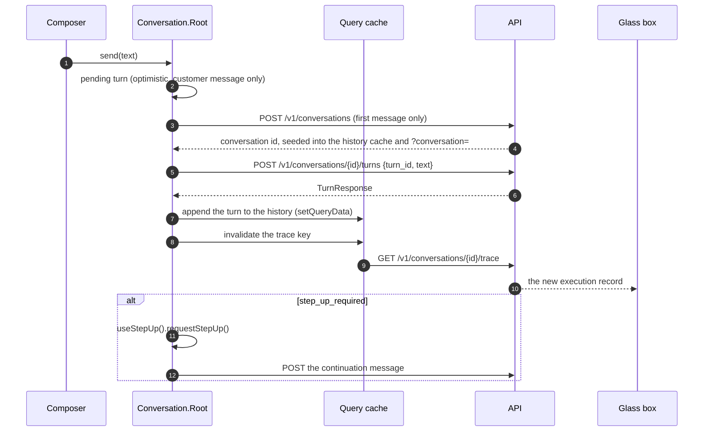
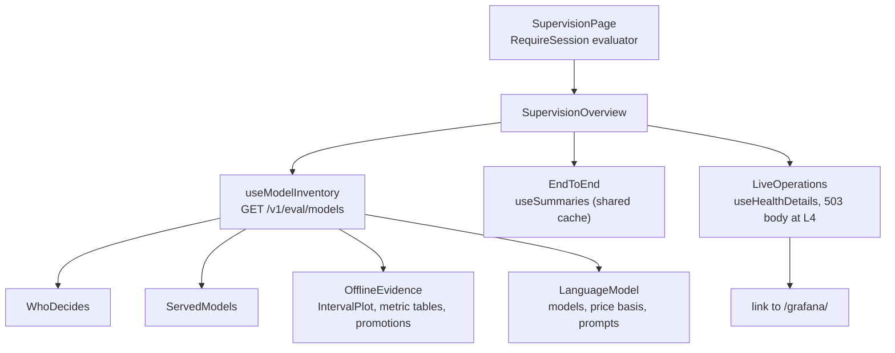

# Frontend features

The product surfaces of phase 13, as self-contained features under `apps/web/src/features/`, composed by route-level pages under `apps/web/src/pages/`. Each feature exposes only its `index.ts`; other code never imports its internals (ESLint boundaries). State rules and the full inventory are in [state.md](state.md); primitives in [components.md](components.md); visual rules in [DESIGN.md](../design/DESIGN.md).

| Feature | Public API | Pages that compose it |
|---|---|---|
| `conversation` | `Conversation.Root`, `.Header`, `.Starters`, `.Messages`, `.HumanButton`, `.Composer`; `useConversation` | `CustomerChatPage` (`/`) |
| `human-service` | `useHumanChannel`, `useSendHumanMessage`, `HumanTimeline` | Customer conversation and agent handoff detail |
| `glass-box` | `GlassBox.Panel`, `GlassBox.SheetTrigger`, `GlassBox.Standalone`, `StaffTrace` | `CustomerChatPage`, `GlassBoxPage` (`/glass-box/:id`), `TraceLookupPage` (`/console/traces/:id`) |
| `agent-inbox` | `HandoffFilters`, `HandoffList`, `HandoffDetail`, `CreditApplicationList`, `CreditApplicationDetail` | `AgentInboxPage`, `HandoffDetailPage`, `CreditApplicationsPage`, `CreditApplicationPage` |
| `eval-report` | `EvaluationReport`, the interval helpers | `EvaluationPage` (`/console/evaluation`) |
| `admin-dashboard` | `AdminDashboard` | `AdminDashboardPage` (`/console/dashboard`) |
| `supervision` | `SupervisionOverview` | `SupervisionPage` (`/console/supervision`) |
| `demo-guide` | `DemoGuide`, `SCENARIOS` | `DemoGuidePage` (`/demo`, demo mode only) |

Linked selection between the chat and the glass box lives in `entities/turn-selection` (`TurnSelectionProvider`, `useTurnSelection`): the page provides it, both features read it, so neither feature depends on the other. Every page is a lazy route (`app/routes.tsx`), so the sign-in screen never downloads the console or the chat.

## Conversation

- **Contexts.** `ConversationContext` (in `Root`) carries the id, the history, the messages in flight, the local notices, and the actions (`send`, `reply`, `retry`, `stepUpAgain`, `startNew`). `MessageContext` scopes one assistant message for its parts (the message, its turn id, and whether its buttons act). Nothing is passed more than one level as props.
- **Quick replies.** Option, confirmation, review, "talk to a person", and the step-up continuation send words the engine's deterministic parsers read; the words live in `chat.replies` and show as the customer's own message. See the decisions in [phase-13.md](../plans/phase-13.md).
- **Language.** Each answer renders in its own language through `LanguageScope` (copy from that language, `Intl` formats for its locale unless it is the viewer's language).

## Glass box

- `RecordContext` scopes one execution record for its sections; the view (`customer` or `staff`) decides what the credit panel and the internal section show. The customer trace has no estimate values by schema; the staff trace adds them in the risk panel and the internal section.
- Clause excerpts come from the same turn's message citations (the conversation history cache); the staff view has no history and shows ids only.

## Agent inbox

## Evaluation view and demo guide

## Data flow with TanStack Query

| Query key | Hook | Written by |
|---|---|---|
| `['api','conversations',id]` | `useConversationHistory`, `useCitedExcerpts` | `useCreateConversation` (seed), `useSendTurn` (append) |
| `['api','conversations',id,'trace']` | `useCustomerTrace` | invalidated by `useSendTurn` |
| `['api','handoffs','list',filters]` | `useHandoffs` | invalidated by claim and resolve |
| `['api','handoffs',id]` | `useHandoff` | set by claim and resolve |
| `['api','credit-applications', ...]` | `useCreditApplications`, `useCreditApplication` | read only |
| `['api','evaluation','summaries']` | `useSummaries` | read only |
| `['api','evaluation','trace',id]` | `useStaffTrace` | read only |

The administrative dashboard reuses `['api','evaluation','summaries']`; changing its run or system is local UI
state and never starts another request. See [the field and formula catalog](admin-dashboard.md).

## Supervision

The evaluator's supervision view composes three read-only sources, each loading and failing in its own section.
It reuses `useSummaries`, `RateCell`, and `SystemLabel` from `@/features/eval-report` through that feature's
`index.ts`. Field catalog: [supervision.md](supervision.md).

A sign-in, sign-out, or lost session drops every cached record (phase 12 `replaceSession`), so nothing from one identity reaches the next.

## Human service

The customer composer switches from assistant turns to persisted human messages after escalation. The assigned agent replies in the handoff detail. Both use the public `human-service` feature, TanStack Query cursor pages and two-second polling; transport failure leaves the persisted lifecycle intact. Closed threads are readable and disable sending. All lifecycle, reconnect, and quota copy lives in es, pt, and en locales. See [the channel specification](../workflows/human-service.md).
