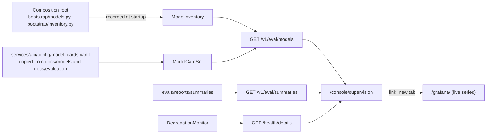

# Supervision view

The supervision view is available at `/console/supervision` to the existing `evaluator` role, which plays the
supervisor in this product (there is no `supervisor` role; adding one is a backlog item). Agents and customers cannot
open the page, and `GET /v1/eval/models` answers them `403 role-not-permitted`.

It shows the machine learning components as decision support: which model serves each step and why, the offline
evidence behind that choice, the end-to-end evaluation, the language model setup with its price basis, and the live
degradation level. It never reads customer records, and it computes no live aggregates: live time series stay in
Grafana ([ADR 0036](../adr/0036-grafana-live-analytics-separate-from-offline-evaluation.md)), which the view links to.

## Data sources

| Source | Endpoint | Query key | Freshness | What it gives |
|---|---|---|---|---|
| Model inventory and cards | `GET /v1/eval/models` (evaluator) | `['api', 'supervision', 'models']` | 5 minutes (it changes only on restart) | `inventory`: what this process serves, recorded at startup; `cards`: the curated offline model cards and promotion decisions |
| Evaluation summaries | `GET /v1/eval/summaries` | `['api', 'evaluation', 'summaries']` | 30 s default | The same cache as the dashboard and the evaluation view (`useSummaries` from `@/features/eval-report`) |
| Degradation | `GET /health/details` (public) | `['api', 'health', 'details']` | polled every 30 s | Level, status, reasons, component states, budget share. At L4 it answers `503` with the same body, which the view reads as an answer, not an error |

Each source loads and fails on its own section (skeleton, then an error with the request id and a retry), so one
failing request never blanks the page.

## Sections and fields

| Section | Fields | Source and meaning |
|---|---|---|
| Header | Evaluator access badge, title, intro; "configuration recorded" time | `inventory.generated_at`: when this process started |
| Who decides | Four steps: the model proposes (language model id or "no language model", the router, resolver, and risk estimator served), policy decides (policy pack version), verified tools act (enabled workflows), people take over (handoff contents) | `inventory.llm.models`, `inventory.components`, `inventory.policy_pack_version`, `inventory.workflows_enabled`. Blue is model understanding, yellow deterministic decisions and verified actions, red the hand-over |
| Models in service | Component, configured selection, served model (concrete version; the alias it came from, if any), kind (baseline, trained, unavailable), fallback reason | `inventory.components[]`. A learned model that could not load shows its reason code (`artifact_not_found`, `model_unavailable`, `registry_unreadable`), never a path or a message. The risk estimator note says its output never reaches customers or a language model |
| Offline model evidence | Per component (and per task for the resolver): split, sample size and unit, the Offline badge, and a Provisional badge when the labels await human review; a dot-and-whisker plot of the headline metric on a fixed 0 to 1 axis; a table with every metric per model, its 95% interval when the report has one, "lower is better" where it applies, the role (default, champion, candidate) and note, and the model in service marked; the report, commit, generation time, and model card | `cards.cards[]`. Headline metrics: router macro F1, resolver coverage (auto-selected at the wrong-transaction limit), risk estimator ROC AUC, retrieval recall at 1. Defaults are drawn in the decision tone, trained models in the understanding tone |
| Why the baselines are served | Per decision: the Simulated badge, the outcome and reason, split, language model, session, and source; a table of the compared configurations with safe automated resolution (rate, count over cases, Wilson 95% interval), unsafe outcomes (count first), routing correct, unnecessary and missed transfers | `cards.promotions[]`, the session 14b dev comparisons in `docs/evaluation/results.md`. Simulated, on the local model of that session |
| End-to-end evaluation | The newest run that includes P: per workflow, then the aggregate, each system (B0, B1, P) with safe automated resolution and its interval and the cost per resolution next to it; dataset, generation time, commit; a note on what the cost measures | `useSummaries`, `latestComparableRun`. Rates use `RateCell` from `@/features/eval-report` (Wilson intervals, zero-event upper bound, small-sample badge). Links open the dashboard and the full evaluation view |
| Language model | Provider, budget limits (daily, per conversation, tokens per session), the unverified price margin, "no model configured" when none is; the three model features (understanding, phrasing, handoff summary) on or off; a table of configured models with the price basis (verified, unverified, no listed price) and the effective USD per million input and output tokens; every prompt version with its use and whether the flags let it run | `inventory.llm`, `inventory.prompts[]`. The prices are the ones the budget guard and the cost metrics charge (`adapters/llm/prices.py`) |
| Live operations | Level (L0 to L4 with words), status, daily model budget used, templates only, reason codes, each dependency's state; the per-worker note; the Grafana link | `/health/details`. The level is that of the worker that answered; the link opens `/grafana/` in a new tab with `rel="noopener noreferrer"` |
| Provenance and limits | Offline, provisional, and simulated defined; no figure is a production measurement or a projection | Fixed copy |

## Model cards file

`services/api/config/model_cards.yaml` is a reviewed, hand-copied subset of the generated reports
(`docs/evaluation/router.md`, `resolver.md`, `risk-estimator.md`, `retrieval.md`) and the session 14b decision in
`docs/evaluation/results.md`. Unit tests (`services/api/tests/unit/adapters/test_model_cards.py`) check that every
cited file exists, that each report was generated at the commit its card names, that every metric value and every
promotion count appears in its source, and that the default cards name the baselines the settings serve. Update it
whenever `make train`, `make eval-retrieval`, or a new defaults decision rewrites those reports
([backlog](../BACKLOG.md): generate it instead).

## Accessibility

Every section is a labeled region with an `h2`; tables carry captions (hidden where the section heading already
names them); the interval plot is an image whose accessible description lists every value and interval, and the
table next to it carries the same numbers. Colors always come with a text label. The view is checked with axe in
both themes (`src/app/a11y-surfaces.test.tsx`) and in its feature test.

## Limitations

- The inventory is per process and recorded at startup; with two workers each has its own, identical unless their
  configuration differs. The degradation level is per worker too.
- The model cards are curated, not generated: they can drift from a regenerated report until the file is updated
  (the unit tests catch a value that no longer appears in its report).
- The end-to-end costs are what each run recorded with its model; a run on a local model records zero.
- No live aggregates over execution records: an in-console operations snapshot would amend ADR 0036 and is in the
  backlog.

## Files

- `apps/web/src/features/supervision/` (`api/supervision.ts`, `model/evidence.ts`, `ui/*`), page
  `apps/web/src/pages/supervision/SupervisionPage.tsx`, MSW fixtures `apps/web/src/test/msw/supervision.ts`.
- Backend: `domain/model_inventory.py`, `ports/evaluation.py` (`ModelCardReader`),
  `adapters/evaluation/model_cards.py`, `application/supervision/prompts.py`, `bootstrap/inventory.py`,
  `bootstrap/models.py` (`ModelFallbacks.served`), `api/routers/evaluation.py` (`eval_model_inventory`).
