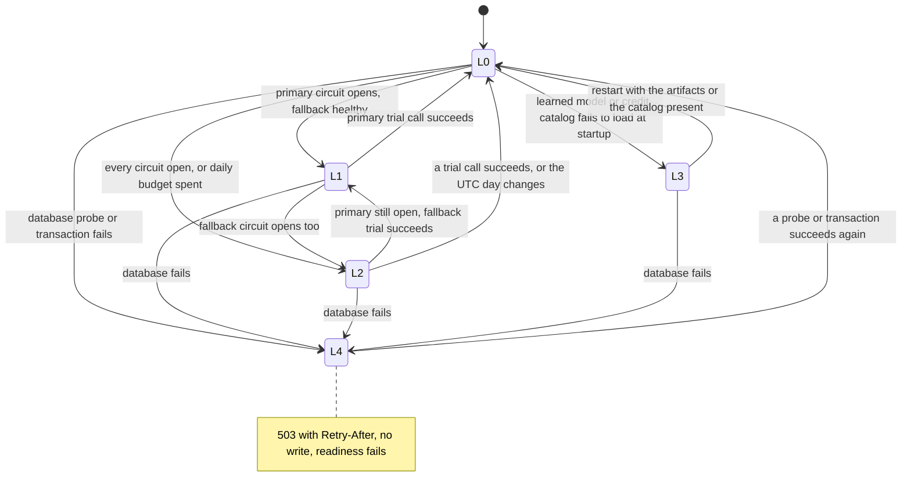

# Degradation ladder

When a dependency fails, the service steps down a ladder of levels instead of failing a customer. Each level has a trigger, a behavior, a feature flag (except L4), customer wording in Spanish and Portuguese, and tests that prove it. **Writes never fail open at any level**: an action is reported as done only after its read-back verified it, whatever the level.

The decision is a pure function (`application/reliability/ladder.py`, table-tested in `tests/unit/application/test_degradation_ladder.py`); `DegradationMonitor` (`adapters/reliability/monitor.py`) feeds it the circuit breakers, the model budget, the startup load results, and the latest database probe, without blocking on I/O. The engine reads the level once per turn; `/health/details` and the `bank.degradation.level` gauge publish it.

## Levels

| Level | Trigger | Behavior | Flag (`DEGRADATION_*`) | Customer wording |
|---|---|---|---|---|
| L0 | Normal, or no model configured on purpose (`LLM_PROVIDER=fake`) | Full behavior for the configuration | none | none |
| L1 | The primary provider's circuit is open and a fallback model is configured and available | `FallbackDecorator` sends each call to the fallback stack (own breaker, retries, timeout) | `FALLBACK_PROVIDER` (true); off, a primary outage is L2 | none (the reply is the same) |
| L2 | No configured provider can serve (every circuit open), or the daily model budget is spent | Template-only: no model call is attempted; deterministic slot extraction and the configured router; one clarifying question fewer before a handoff, so complex cases reach a person | `TEMPLATE_ONLY` (true); off, calls still fail fast through the open circuit one by one | Every reply starts with `common.limited_service`: "En este momento funciono en modo limitado: te respondo con mensajes estándar y, si tu caso lo necesita, te comunico con una persona del equipo." / "No momento estou funcionando em modo limitado: respondo com mensagens padrão e, se o seu caso precisar, encaminho você para uma pessoa da equipe." |
| L3 | A learned router, resolver, or risk estimator cannot load (no artifact, the `ml` extra absent, the registry unreadable), or the credit catalog cannot load | Keyword and rule baselines, the keyword router at the stricter `ROUTER_THRESHOLD` (0.75), one clarifying question fewer. The risk estimator falls back to `score_band@1` only with `RISK_BAND_FALLBACK=true`; otherwise every eligibility request is `review_required` (never a default estimate). A catalog that cannot load disables `credit`: its intents reach the out-of-scope answer and the other three workflows run unchanged | `MODEL_BASELINES` (true; off, startup stops), `RISK_BAND_FALLBACK` (false), `CREDIT_CATALOG_FALLBACK` (true; off, startup stops) | Eligibility answers say "La estimación de riesgo no está disponible." / "A estimativa de risco não está disponível." and offer the review path; out-of-scope credit requests get the standard out-of-scope answer with a person offered |
| L4 | The database refuses or drops connections, times out, has too many connections, or is read-only | Nothing is done: the unit of work rolls back, the API answers `503 dependency-unavailable` with `Retry-After` (`DATABASE_RETRY_AFTER_SECONDS`, 30), readiness fails. The same turn sent again after recovery runs normally (turns are idempotent) | none: failing closed is not optional | The web client shows `errors.unavailable`: "El servicio no está disponible en este momento, así que no confirmamos ningún cambio. Inténtalo de nuevo en unos minutos." / "O serviço não está disponível no momento, então não confirmamos nenhuma alteração. Tente de novo em alguns minutos." |

The reported level is the highest active one; each active condition applies its own behavior (L2 and L3 can hold together). A tampered model artifact (digest mismatch) is not a degradation: it stops startup at every level. Open retrieval that cannot run answers with the bound `SCOPE-ALL-2` abstention (phase 07), so informational questions degrade to bound clauses only.

## Triggers in detail

- **Circuit breaker** (per provider, `LLM_CIRCUIT_*`): `LLM_CIRCUIT_FAILURE_THRESHOLD` consecutive transient failures (timeout, rate limit, provider error after `LLM_MAX_RETRIES` retries) open it; after `LLM_CIRCUIT_RESET_SECONDS` one half-open trial call decides. The ladder treats half-open as degraded, not unavailable, so the trial can run.
- **Budget**: the guard reserves the worst case of each call in the shared ledger (PostgreSQL when a database is configured, `LLM_BUDGET_LEDGER=auto`). At 80 percent of `LLM_DAILY_BUDGET_USD` it logs `llm_budget_alert` once a day and Prometheus fires `LlmBudgetAt80Percent`; a refusal by the daily cap (or 100 percent spent) switches to L2 until the next UTC day. A ledger that cannot be read refuses the call (fail closed).
- **Startup loads**: `ModelFallbacks` records which components serve a baseline; the policy services record whether the catalog loaded.
- **Database**: every unit of work reports whether it reached the database, and `/health/ready` and `/health/details` probe it (a read-only server counts as unavailable). The level returns to normal on the next success.

## Evidence

| Behavior | Test |
|---|---|
| The decision table, flags, and combinations | `tests/unit/application/test_degradation_ladder.py` |
| The monitor over real breakers and a real budget guard (L1, L2, recovery, 80 percent alert, day rollover, L3, L4) | `tests/unit/adapters/test_degradation_monitor.py` |
| Provider errors and timeouts open the circuit; template-only replies in es and pt; the trial closes it | `tests/integration/chaos/test_llm_outage.py` |
| The daily budget runs out mid-conversation | same file |
| Database cut right before a card block, before a request, read-only; slow table past the tool timeout | `tests/integration/chaos/test_database_outage.py` |
| Failing read tools, partial writes, registry failure at startup, risk estimator failing mid-conversation, catalog failure, an unsafe template blocked | `tests/integration/chaos/test_component_failures.py` |
| Model fallbacks and the risk band flag | `tests/unit/bootstrap/test_models.py` |

Every chaos test asserts a safe outcome, the wording in both languages where the customer sees it, a complete execution record, and no false success. The same failure modes are the `tool_failure` category of the evaluation harness (phase 14), which injects them through `ToolFailureInjector` and the gateway's inject mode.

## Limitations

- The monitor is per process; each API worker decides its own level from its own breakers, while the budget ledger, the rate limits, and the active-session count are shared. Phase 16 decided not to publish the level through the database: a breaker reflects the calls of its own worker, a provider outage trips every worker's breaker within a few calls, and a shared level would add a query to every turn for no safety gain (`docs/plans/phase-16.md`, decision 10). Dashboards take the maximum over workers.
- Recovery from L3 needs a restart: artifacts load at startup only.
- L1 needs `LLM_FALLBACK_MODEL`. The deployed demo sets it: `azure/gpt-4o` backs up `azure/gpt-4.1-mini` on the same Azure OpenAI resource since 2026-10-05, so an outage of the whole resource still drops to L2.
