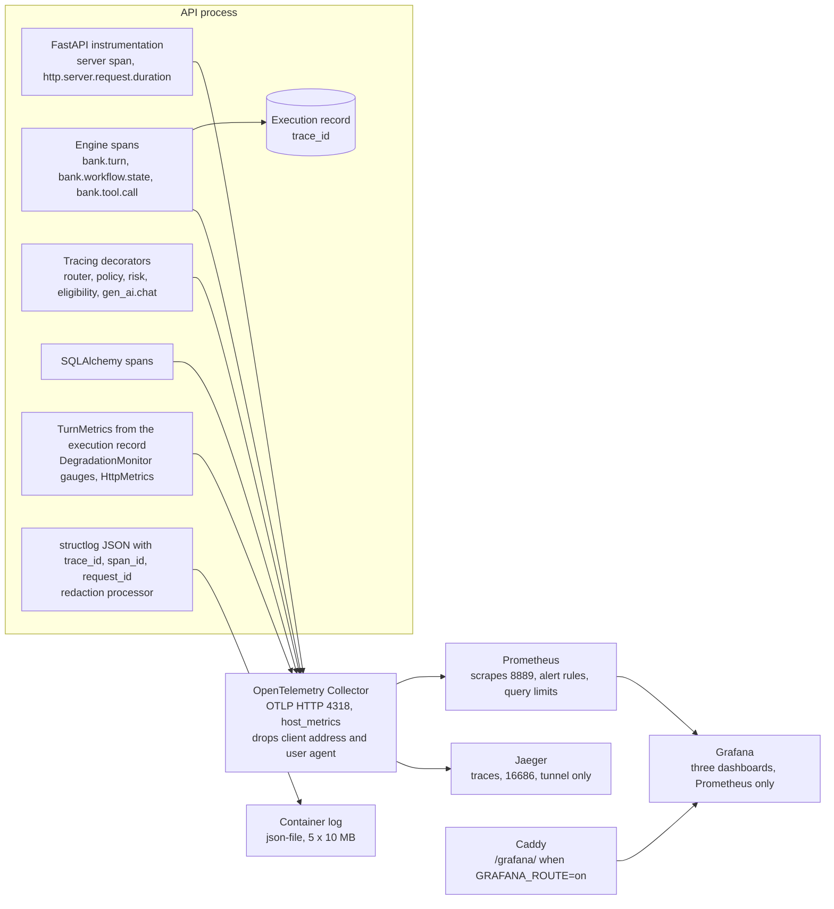

# Observability

Every request and every turn can be followed from the customer's screen to the database statement and back: the response carries `X-Request-ID` and `X-Trace-Id`, the JSON log lines carry the request id, the trace id, and the span id, the turn's execution record stores the same trace id, and the trace in Jaeger holds one span per HTTP request, turn, state handler, router dispatch, policy evaluation, tool call, risk estimate, eligibility assessment, model call, and SQL statement. Metrics go to Prometheus and three provisioned [Grafana dashboards](grafana-dashboard.md), served read-only at `/grafana/` in production when the route is on ([ADR 0045](../adr/0045-expose-grafana-read-only-under-grafana.md)); alert rules map to the [runbook](runbook.md).

## Telemetry flow



General OTLP export is on with `OTEL_ENABLED=true` (the compose `api` service passes the variable, `make api-obs` sets it). With both `OTEL_ENABLED=false` and `LANGFUSE_ENABLED=false`, nothing leaves the process, but trace ids, `X-Trace-Id`, and log correlation still work, because the SDK tracer provider is always installed (`bootstrap/observability.py`). Sampling is parent-based on the trace id ratio `OTEL_TRACES_SAMPLER_ARG` (1.0 keeps every trace); an unsampled turn still stores its trace id. Metrics are exported every `OTEL_METRIC_EXPORT_INTERVAL` milliseconds (15 s by default). Health probes are not traced.

## Optional Langfuse generation export

The runtime uses the already locked OpenTelemetry SDK and OTLP HTTP exporter 1.45.0 with LiteLLM 1.102.1. An existing Langfuse v4 server receives the spans; the API does not require the Langfuse Python SDK. The verifier uses Langfuse Python SDK 4.7 or later as a command-scoped dependency.

Set `LANGFUSE_ENABLED=true`, `LANGFUSE_BASE_URL`, `LANGFUSE_PUBLIC_KEY`, and `LANGFUSE_SECRET_KEY` in the API environment. The default base URL is `http://localhost:3000` for an existing local Langfuse instance; production requires HTTPS. `LLM_PROVIDER=litellm` and its optional extra are required. The flag defaults to false, and with it false the API creates no Langfuse exporter. `OTEL_ENABLED` may remain false: Langfuse has its own exporter on the existing tracer provider. For complete turn correlation, use `OTEL_TRACES_SAMPLER_ARG=1.0`.

The API sends one `gen_ai.chat` generation span per logical gateway call over OTLP/HTTP to `/api/public/otel/v1/traces`. The exporter reconstructs the span from a strict allowlist: OpenTelemetry trace and span IDs, turn correlation and conversation IDs, provider and model IDs, prompt ID and version, schema ID and content hash (the first 12 hash characters are its content-addressed version), success or error code, latency, token usage, and known USD cost. It discards prompt and completion content, retrieved records, tool data, customer IDs, exception messages, span events, links, and other attributes on both success and failure. The model receives the same inputs as before. No LiteLLM Langfuse callback is registered, so its default message capture is not used. A failed export logs its error class and batch size; the customer request still succeeds, and the log does not claim delivery. Shutdown flushes the OpenTelemetry batch processor. PostgreSQL remains the durable execution record.

For a local API process with an existing Langfuse service and a configured model, set the variables above, then run `uv run --frozen --package bank-agent --extra litellm uvicorn bank_agent.asgi:create_app --factory`. The live correlation verifier is opt in: `uv run --frozen --package bank-agent --extra litellm --with 'langfuse>=4.7,<5' python scripts/verify_e2e_tracing.py`. The verifier reads the same API settings, performs a real demo turn, and checks the PostgreSQL record against the Langfuse generation. It needs a local PostgreSQL and has not been rerun against Langfuse Cloud.

Without a database or a running API, `make llm-smoke` (`scripts/llm_smoke.py`) with `LANGFUSE_ENABLED=true` builds the API's own observability, so each of its 32 fixture calls goes through the same allowlisting exporter, flushed before the script exits.

**Verified against Langfuse Cloud on 2026-10-05** (US region, `LANGFUSE_BASE_URL=https://us.cloud.langfuse.com`, a project created for this deployment): `make llm-smoke` from a workstation with `LLM_PROVIDER=litellm`, `LLM_PRIMARY_MODEL=azure/gpt-4.1-mini` on the evaluation account, and `LANGFUSE_ENABLED=true` passed 32 of 32 cases. Read back through the public API (`GET /api/public/v2/observations?fromStartTime=<start>&fields=core,basic,time,io,metadata,model,usage,metrics`, basic auth with the project keys):

- 32 observations in 32 traces, every one of type `GENERATION`, named `gen_ai.chat`, level `DEFAULT`, model `azure/gpt-4.1-mini`;
- `input`, `output`, and `userId` empty on all 32, and none of the fixture messages' words found anywhere in the returned JSON;
- metadata limited to the allowlist: `call_id`, `trace_id`, `conversation_id`, `prompt_id`, `prompt_version`, `schema_id`, `schema_version`, `schema_hash`, `status`, `latency_ms`, `provider_returned_model_id`, the attributes `gen_ai.provider.name`, `gen_ai.request.model`, `gen_ai.response.model`, `gen_ai.usage.input_tokens`, `gen_ai.usage.output_tokens`, `langfuse.observation.type`, `langfuse.observation.usage_details`, `langfuse.observation.cost_details`, and the OpenTelemetry resource and scope (`service.name`, `service.instance.id`, the SDK name, language, and version);
- `usageDetails` (`input`, `output`, `total`) and `costDetails` (`total`) on all 32: 40,292 input and 1,236 output tokens, 0.0271416 USD in total, which is the budget guard's charge at 1.5 times the unverified list price (0.0180944 USD at list price).

Langfuse organizations created on or after 2026-09-16 answer `410 Gone` on the legacy `GET /api/public/traces` and `GET /api/public/observations`; read back with `/api/public/v2/observations`. To read without putting the keys on a command line: `printf 'user = "%s:%s"\n' "$LANGFUSE_PUBLIC_KEY" "$LANGFUSE_SECRET_KEY" | curl -s -K - "$LANGFUSE_BASE_URL/api/public/v2/observations?fromStartTime=<UTC start>&fields=core,basic,io,metadata,model,usage&limit=100"`.

Production: the keys are Key Vault secrets (`langfuse-public-key`, `langfuse-secret-key`) staged as files for the API only, and the export is off until the env file sets `LANGFUSE_ENABLED=true` and `LANGFUSE_BASE_URL` ([deploy/README.md](../../deploy/README.md), "Langfuse export").

If the general OTLP collector is also enabled, keep `OTEL_EXPORTER_OTLP_ENDPOINT` pointed at that collector rather than Langfuse to avoid duplicate generations. `LLM_TRACE_CONTENT=true` is refused when Langfuse is enabled. The collector can export content if that flag is enabled without Langfuse. The repo's `obs` profile uses Grafana on port 3000, so it conflicts with a Langfuse instance bound to the same host port; run one on another port when using both.

**Semantic conventions.** HTTP spans and metrics follow the stable HTTP conventions (`OTEL_SEMCONV_STABILITY_OPT_IN=http`). Model calls follow the OpenTelemetry GenAI semantic conventions **version 1.37.0**, pinned in `adapters/llm/tracing.py` (`GENAI_SEMCONV_VERSION`); the tracer and meter carry the schema URL `https://opentelemetry.io/schemas/1.37.0`. Project attributes use the `bank.` prefix.

**What never goes into telemetry.** Attribute values are ids, codes, versions, and counts: never message text, names, documents, amounts, the credit profile, or the risk estimate (the risk span names the model only). The ASGI instrumentation records the caller's address, port, and user agent on every server span; the collector's `attributes/privacy` processor deletes them (and their pre-stable names) from spans and metrics before anything reaches Jaeger or Prometheus, verified with the 0.161.0 collector binary. `LLM_TRACE_CONTENT=true` adds the already redacted prompt variables to `gen_ai.chat` spans and is refused in production. SQL spans carry the statement with bind placeholders, never the bound values.

## Signal catalog

The instrument catalog in `adapters/telemetry/catalog.py` is the source of truth (names, units, buckets, and the allowed attributes); a unit test fails when code emits something outside it or when an alert or dashboard queries a metric the service does not emit. Prometheus names replace dots with underscores, add `_seconds` for seconds, and `_total` for counters.

| Metric (OpenTelemetry name) | Kind | Attributes | Source |
|---|---|---|---|
| `http.server.request.duration` | histogram, s, buckets 5 ms to 60 s (a view replaces the instrumentation's 10 s ceiling) | method, route, status | FastAPI instrumentation |
| `http.server.active_requests` | up-down counter | method, scheme | FastAPI instrumentation |
| `db.client.connections.usage` | up-down counter | pool name, state (`used`, `idle`) | SQLAlchemy instrumentation (export on only) |
| `bank.turn.duration` | histogram, s | workflow, outcome | execution record |
| `bank.turn.outcomes` | counter, published at 0 for every label set at startup | workflow, outcome, language | execution record |
| `bank.escalations` | counter, published at 0 for every label set at startup | workflow, reason code | the handoff of the turn |
| `bank.router.dispatches`, `bank.router.switches` | counter | workflow (from, to) | execution record |
| `bank.tool.calls`, `bank.tool.failures`, `bank.tool.duration` | counter, counter, histogram | tool, status, error code | execution record |
| `bank.eligibility.outcomes` | counter | product, outcome | execution record (synthetic service) |
| `bank.risk_estimator.failures` | counter | workflow | execution record |
| `bank.safety.unsafe_blocked` | counter | detector (`success_without_verification`, `approval_wording`, `internal_credit_value`), workflow | grounding violations of the turn |
| `bank.safety.interventions` | counter | intervention code, workflow | execution record |
| `bank.llm.fallbacks` | counter | prompt, error code, workflow | execution record |
| `gen_ai.client.operation.duration`, `gen_ai.client.token.usage` | histogram | operation, provider, requested model, serving model (success only, so a failover shows), prompt id, error or token type | `TracingDecorator` |
| `bank.llm.cost_usd` | histogram | response model, price basis, prompt | `CostAccountingDecorator` |
| `bank.llm.circuit.state` | gauge (0 closed, 1 half-open, 2 open) | model | `DegradationMonitor` |
| `bank.llm.budget.daily_used_ratio`, `bank.llm.budget.refusals` | gauge, counter | cap | budget guard and monitor |
| `bank.degradation.level`, `bank.degradation.component` | gauge | component | `DegradationMonitor` |
| `bank.database.unavailable` | counter | none | unit of work and probes |
| `bank.sessions.active` | gauge (deployment-wide: live sessions counted in the shared session store every 30 s by each worker; dashboards take the maximum) | none | `HttpMetrics` |
| `bank.http.rate_limited` | counter | rate class, key kind (`ip` or `session`) | `HttpMetrics` |
| `system.cpu.time`, `system.cpu.load_average.*`, `system.memory.utilization`, `system.disk.*`, `system.filesystem.utilization` | counters and gauges | cpu state, memory state, device, mount point | the collector's `host_metrics` receiver (production and development) |

Every worker start begins new series (the resource carries a fresh `service.instance.id`), and Prometheus `increase()` never counts the first sample of a series. The outcome and handoff counters are therefore published at 0 when a worker starts, so the first turn or handoff after a deploy is counted; the label sets are closed enumerations (5 x 6 x 4 and 5 x 16 per worker). The collector drops a series after 5 minutes without an update, so a stopped worker's last value leaves `max()` panels and alerts quickly.

The host metrics come from the collector container's own `/proc`, which is not namespaced: CPU, load, memory, disk I/O, and the root filesystem describe the VM, with no Docker socket or host mount. Network counters are not collected, because `/proc/net/dev` shows the container's own interface.

Spans: `bank.turn` (turn id, conversation id, channel, workflow, state, outcome), `bank.workflow.state` (workflow, state, kind, next state, outcome), `bank.router.dispatch` (language, intent, confidence, below threshold, model), `bank.policy.evaluate` (workflow, policy state, decision, decisive rules, pack version), `bank.tool.call` (tool, status, attempts, error), `bank.risk.estimate` (product type, model), `bank.eligibility.assess` (product, estimate present, outcome, review reasons), `gen_ai.chat` (GenAI attributes), and the SQLAlchemy and HTTP spans.

## Logs and retention

Logs are JSON lines on stdout with `timestamp`, `level`, `logger`, `event`, `request_id`, and, inside a span, `trace_id` and `span_id`. The redaction processor (`bootstrap/logging.py`) masks sensitive keys and scrubs emails, document numbers, phones, and long digit runs in every value, tracebacks included; `trace_id` and `span_id` pass unredacted only when they are hex ids of the right length (tests: `tests/unit/bootstrap/test_logging.py`, `test_observability.py`).

| Store | Development (`docker-compose.yml`) | Production (`deploy/compose.prod.yml`) |
|---|---|---|
| Container logs | 5 files of 10 MB per service | 5 files of 10 MB per service; the API writes no access log (no client addresses) |
| Prometheus | 7 days | 15 days or 2 GB, on the `prometheus-data` volume |
| Jaeger | In memory until the container restarts | Badger on the `jaeger-data` volume, 7-day TTL (`deploy/observability/jaeger.yaml`); verified to survive a restart |
| Execution records, audit events | Kept (append-only by design) | Kept for the life of the deployment; conversation text, sessions, challenges, and trust events are purged ([data retention](../security/data-retention.md)) |

In production the `obs` profile runs when the server env file has `OBS=1` (with `OTEL_ENABLED=true`); every `deploy/prod.sh up` and release then keeps it current, continuous deployment included. Grafana listens on 127.0.0.1 for the SSH tunnel and, with `GRAFANA_ROUTE=on`, is served read-only at `/grafana/` through Caddy, anonymously only with `GRAFANA_ANONYMOUS_VIEWER=true` ([ADR 0045](../adr/0045-expose-grafana-read-only-under-grafana.md), [deploy/README.md](../../deploy/README.md), "Grafana at /grafana"). Prometheus bounds each query (30 s, 5 million samples, 4 concurrent). Grafana's only datasource is Prometheus: the Jaeger datasource was deleted (it never read Jaeger 2.21's v3 API, and it would let any Grafana viewer read traces), so traces are read in the Jaeger UI through the tunnel. The local load test at 50 customers with every trace kept took Jaeger to about 470 MB; set `OTEL_TRACES_SAMPLER_ARG` below 1.0 (for example 0.2) for sustained traffic.

## How to read the trace of one conversation

1. Take the `X-Trace-Id` of a turn response (the browser's network panel), or the `trace_id` of the turn in the evaluator trace (`GET /v1/eval/conversations/{id}/trace`), or of a log line.
2. Open `http://localhost:16686/trace/<trace id>` (service `bank-agent-api`). To see all turns of a conversation, search by the tag `bank.conversation_id=<id>`.
3. Read it top-down: the HTTP span (route and status); `bank.turn` (the workflow, final state, and outcome); `bank.router.dispatch` (which intent, how confident); one `bank.workflow.state` per handler that ran, each with its next state; inside them `bank.policy.evaluate` (the decision and the rule ids that decided it), `bank.tool.call` (status and attempts) with its SQL children, and `gen_ai.chat` (prompt id and version, model, tokens, cost, or the error type). A failed or skipped model call appears in the record as `fallback` with its code (`llm_circuit_open`, `degraded_template_only`).
4. The execution record with the same trace id explains the turn in audit terms: the clauses cited, the verification of every write, the models and prompts, latency by stage, and the safety interventions (including `degradation_l2` when the turn ran degraded).

## Running it locally

```bash
make up PROFILES=obs            # collector, Jaeger (16686), Prometheus (9090), Grafana (3000)
make api-obs                    # the API on :8000 exporting to the collector
make load-test LOAD_USERS=10    # traffic from the four workflows (raise the rate limits first)
```

Open the service health dashboard at `http://localhost:3000/d/bank-agent-service` (Grafana's home page), the live
executive analytics dashboard at `http://localhost:3000/d/bank-agent-executive`, and the detailed reliability dashboard
at `http://localhost:3000/d/bank-agent-overview`. The [Grafana field catalog](grafana-dashboard.md)
documents every panel, formula, filter, source, access rule, and limitation.

Verified in phase 15 on a local stack: traces with the full span tree and SQL spans in Jaeger, every catalog metric that the traffic exercised in Prometheus, the alert rules loaded (`/api/v1/rules`), and the dashboard provisioned and querying Prometheus through Grafana.

## Limitations

- The development `obs` profile keeps Grafana anonymous and Jaeger in memory; the production profile adds the admin login, the switches for the public route and anonymous viewing, loopback-only ports, and persistent storage.
- The degradation level is per worker (each trips its own circuit breaker; the budget, the rate limits, and the active-session count are shared); dashboards take the maximum over workers.
- Grafana has no trace datasource (removed by ADR 0045; Jaeger 2.21 serves only its v3 API anyway): traces are read in the Jaeger UI.
- `bank.turn.duration` excludes the opening database reads and the closing write; the end-to-end turn panel uses the HTTP histogram of the turn route.
- The collector and Prometheus read single bind-mounted files that a container keeps from its start: after a change to them, restart those containers once (deploy/README.md).
- The SQLAlchemy instrumentation declares support below SQLAlchemy 2.1; it is enabled past its version check after the spans were verified with 2.1.1 (rechecked in phase 16: the lock still holds SQLAlchemy 2.1.1 and the instrumentation 0.66b0), and must be rechecked on upgrades.
