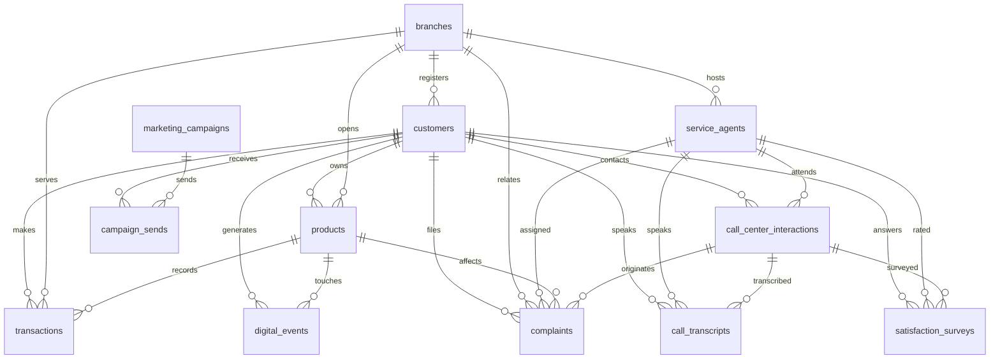

# LATAM Bank dataset: data dictionary

This is a transcription of the organizer data dictionary (dataset version 1.0.0), without access credentials. S3 access details live only in the local `.env` file (see `.env.example`). If you find a discrepancy with the original PDF, the PDF wins; fix this file in the same commit that fixes any affected contract.

## Overview

| Attribute | Value |
|---|---|
| Total records | about 19,000,000 |
| Tables | 13 (5 dimension, 7 fact, 1 reference) |
| Countries | Mexico, Colombia, Argentina |
| Date range | 2023-06-17 to 2026-06-17 |
| Currencies | MXN, COP, ARS, USD |
| Text language | Spanish only (Mexican, Colombian, Argentine variants). No Portuguese. |
| Provenance | Fully synthetic, generated for the event |
| Storage | Amazon S3, read-only, `data/` prefix; large fact tables partitioned by date (year/month/day) |

**Intentional data-quality challenges:**
- about 2% duplicate records across tables,
- about 5% nulls in nullable fields,
- late-arriving partitions,
- schema evolution over time,
- a small percentage of orphaned foreign keys (kept for testing).

Constraint notation used below: `PK` primary key, `FK` foreign key, `NN` not null, `UQ` unique, `-` nullable.

## Dimension tables

### customers (150,000 rows, source Core Banking, partition monthly_snapshot)

| Column | Type | Constraints | Notes |
|---|---|---|---|
| customer_id | VARCHAR(20) | PK, NN | |
| document_number | VARCHAR(20) | NN, UQ | Identity document number. Never proof of identity. |
| document_type | VARCHAR(10) | NN | DNI, CURP, CC, CE, Passport |
| first_name | VARCHAR(100) | NN | PII |
| last_name | VARCHAR(100) | NN | PII |
| date_of_birth | DATE | NN | PII; never used in decisions |
| gender | VARCHAR(1) | - | M, F, O; never used in decisions |
| email | VARCHAR(100) | - | PII |
| mobile_phone | VARCHAR(20) | - | PII; used by the mock identity provider as the one-time-code destination |
| landline_phone | VARCHAR(20) | - | PII |
| address | VARCHAR(200) | - | PII |
| city | VARCHAR(100) | NN | |
| state | VARCHAR(100) | NN | |
| country | VARCHAR(50) | NN | Mexico, Colombia, Argentina |
| postal_code | VARCHAR(10) | - | |
| detected_accent | VARCHAR(50) | - | mexican, colombian, argentine, neutral |
| segment | VARCHAR(50) | NN | Premium, Plus, Basic, Student |
| credit_score | INTEGER | - | 300 to 850 |
| estimated_monthly_income | DECIMAL(12,2) | - | Local currency |
| occupation | VARCHAR(100) | - | |
| marital_status | VARCHAR(20) | - | |
| education_level | VARCHAR(50) | - | |
| registration_date | TIMESTAMP | NN | |
| registration_branch_id | VARCHAR(20) | FK, NN | branches |
| customer_status | VARCHAR(20) | NN | Active, Inactive, Suspended, Closed |
| last_updated | TIMESTAMP | NN | |
| accepts_marketing | BOOLEAN | NN | |

### products (400,000 rows, source Core Banking, partition monthly_snapshot)

| Column | Type | Constraints | Notes |
|---|---|---|---|
| product_id | VARCHAR(20) | PK, NN | |
| customer_id | VARCHAR(20) | FK, NN | customers |
| product_type | VARCHAR(50) | NN | Checking Account, Savings Account, Credit Card, Debit Card, Personal Loan, Mortgage, Investment (value list truncated in the source PDF; profile the data for the full set) |
| product_number | VARCHAR(30) | NN, UQ | Account, card, or policy number; always masked in outputs |
| currency | VARCHAR(3) | NN | MXN, COP, ARS, USD |
| current_balance | DECIMAL(15,2) | NN | |
| credit_limit | DECIMAL(15,2) | - | Credit products |
| interest_rate | DECIMAL(5,2) | - | Annual percent |
| opening_date | DATE | NN | |
| expiration_date | DATE | - | Term products |
| opening_branch_id | VARCHAR(20) | FK, NN | branches |
| product_status | VARCHAR(20) | NN | Active, Blocked, Closed, Suspended |
| opening_channel | VARCHAR(30) | NN | Branch, Web, App, Call Center |
| has_linked_app | BOOLEAN | NN | |
| days_past_due | INTEGER | - | Credit products |
| last_transaction_date | TIMESTAMP | - | |
| last_updated | TIMESTAMP | NN | |

### branches (350 rows, source Internal, partition full_snapshot)

| Column | Type | Constraints | Notes |
|---|---|---|---|
| branch_id | VARCHAR(20) | PK, NN | |
| branch_code | VARCHAR(10) | NN, UQ | |
| branch_name | VARCHAR(100) | NN | |
| branch_type | VARCHAR(30) | NN | Main, Express, Premium, Corporate |
| address | VARCHAR(200) | NN | |
| city | VARCHAR(100) | NN | |
| state | VARCHAR(100) | NN | |
| country | VARCHAR(50) | NN | |
| postal_code | VARCHAR(10) | - | |
| geographic_zone | VARCHAR(50) | NN | Urban, Suburban, Rural |
| phone | VARCHAR(20) | NN | |
| email | VARCHAR(100) | - | |
| opening_time | TIME | NN | |
| closing_time | TIME | NN | |
| has_atms | BOOLEAN | NN | |
| atm_count | INTEGER | - | |
| has_teller_windows | BOOLEAN | NN | |
| teller_window_count | INTEGER | - | |
| latitude | DECIMAL(10,7) | - | |
| longitude | DECIMAL(10,7) | - | |
| branch_opening_date | DATE | NN | |
| branch_status | VARCHAR(20) | NN | Active, Temporarily Closed, Closed |

### service_agents (1,200 rows, source Internal, partition monthly_snapshot)

| Column | Type | Constraints | Notes |
|---|---|---|---|
| agent_id | VARCHAR(20) | PK, NN | |
| employee_code | VARCHAR(15) | NN, UQ | |
| first_name | VARCHAR(100) | NN | PII |
| last_name | VARCHAR(100) | NN | PII |
| email | VARCHAR(100) | NN | PII |
| phone | VARCHAR(20) | - | PII |
| native_accent | VARCHAR(50) | NN | mexican, colombian, argentine |
| country_of_origin | VARCHAR(50) | NN | |
| assigned_branch_id | VARCHAR(20) | FK | branches |
| agent_type | VARCHAR(30) | NN | Phone, In-Person, Digital, Hybrid |
| experience_level | VARCHAR(20) | NN | Junior, Mid-Senior, Senior, Specialist |
| languages | VARCHAR(100) | NN | |
| specialty | VARCHAR(100) | - | |
| hire_date | DATE | NN | |
| avg_csat | DECIMAL(3,2) | - | 1 to 5 |
| total_monthly_interactions | INTEGER | - | |
| agent_status | VARCHAR(20) | NN | Active, Vacation, Leave, Inactive |
| work_shift | VARCHAR(20) | NN | Morning, Afternoon, Night, Rotating |

### marketing_campaigns (200 rows, source Internal, partition full_snapshot)

| Column | Type | Constraints | Notes |
|---|---|---|---|
| campaign_id | VARCHAR(20) | PK, NN | |
| campaign_name | VARCHAR(150) | NN | |
| description | TEXT | - | |
| campaign_type | VARCHAR(50) | NN | Email, SMS, Push, WhatsApp, Voice, Mix |
| campaign_objective | VARCHAR(100) | NN | Acquisition, Retention, Cross-sell, Up-sell, Reactivation |
| promoted_product | VARCHAR(50) | - | |
| target_segment | VARCHAR(50) | - | |
| target_country | VARCHAR(50) | - | |
| start_date | DATE | NN | |
| end_date | DATE | NN | |
| budget | DECIMAL(12,2) | - | |
| campaign_status | VARCHAR(20) | NN | Planned, Active, Paused, Completed |
| expected_conversion_rate | DECIMAL(5,2) | - | Percent |

## Fact tables

### transactions (5,000,000 rows, source Core Banking, partition daily)

| Column | Type | Constraints | Notes |
|---|---|---|---|
| transaction_id | VARCHAR(30) | PK, NN | |
| transaction_date | TIMESTAMP | NN | |
| process_date | DATE | NN | Partition key |
| product_id | VARCHAR(20) | FK, NN | products |
| customer_id | VARCHAR(20) | FK, NN | customers |
| transaction_type | VARCHAR(50) | NN | Deposit, Withdrawal, Transfer, Payment, Purchase, Adjustment |
| transaction_category | VARCHAR(50) | - | Food, Transport, Services, Entertainment, Health, Other |
| amount | DECIMAL(15,2) | NN | |
| currency | VARCHAR(3) | NN | |
| amount_usd | DECIMAL(15,2) | - | Recompute from daily_exchange_rates when null |
| channel | VARCHAR(30) | NN | ATM, Branch, Web, App, POS, Transfer |
| branch_id | VARCHAR(20) | FK | branches |
| merchant_name | VARCHAR(150) | - | Untrusted text; indirect prompt-injection surface |
| merchant_category | VARCHAR(50) | - | MCC |
| transaction_country | VARCHAR(50) | NN | |
| transaction_city | VARCHAR(100) | - | |
| transaction_status | VARCHAR(20) | NN | Approved, Declined, Pending, Reversed |
| response_code | VARCHAR(10) | - | |
| is_fraud | BOOLEAN | NN | Label; use only as routing context, never shown to customers |
| fraud_score | DECIMAL(5,2) | - | 0 to 100, existing bank score |
| latitude | DECIMAL(10,7) | - | |
| longitude | DECIMAL(10,7) | - | |

### call_center_interactions (800,000 rows, source Contact Center, partition daily)

| Column | Type | Constraints | Notes |
|---|---|---|---|
| interaction_id | VARCHAR(30) | PK, NN | |
| interaction_date | TIMESTAMP | NN | |
| process_date | DATE | NN | Partition key |
| customer_id | VARCHAR(20) | FK, NN | customers |
| agent_id | VARCHAR(20) | FK | service_agents |
| interaction_type | VARCHAR(30) | NN | Inbound Call, Outbound Call, Chat, Email, Video |
| channel | VARCHAR(30) | NN | Phone, Web Chat, WhatsApp, Email, App |
| contact_reason | VARCHAR(100) | NN | Main contact reason; primary label source for the router |
| reason_category | VARCHAR(50) | NN | Transactional, Product, Technical, Commercial, Complaint |
| duration_seconds | INTEGER | - | |
| wait_time_seconds | INTEGER | - | |
| was_resolved | BOOLEAN | - | First contact resolution |
| requires_followup | BOOLEAN | NN | |
| detected_sentiment | VARCHAR(20) | - | Positive, Neutral, Negative, Very Negative |
| sentiment_score | DECIMAL(3,2) | - | -1 to 1 |
| customer_detected_accent | VARCHAR(50) | - | |
| agent_used_accent | VARCHAR(50) | - | |
| was_escalated | BOOLEAN | NN | Escalated to supervisor |
| mentioned_products | VARCHAR(200) | - | Comma-separated product ids |
| has_transcript | BOOLEAN | NN | |
| has_recording | BOOLEAN | NN | |

### call_transcripts (200,000 rows, source Contact Center, partition daily)

| Column | Type | Constraints | Notes |
|---|---|---|---|
| transcript_id | VARCHAR(30) | PK, NN | |
| interaction_id | VARCHAR(30) | FK, NN | call_center_interactions |
| process_date | DATE | NN | Partition key |
| customer_id | VARCHAR(20) | FK, NN | customers |
| agent_id | VARCHAR(20) | FK, NN | service_agents |
| full_text | TEXT | NN | Spanish; untrusted text |
| customer_text | TEXT | - | Customer turns only |
| agent_text | TEXT | - | Agent turns only |
| detected_language | VARCHAR(10) | NN | |
| detected_accent | VARCHAR(50) | - | |
| accent_confidence | DECIMAL(3,2) | - | 0 to 1 |
| detected_keywords | VARCHAR(500) | - | |
| mentioned_entities | TEXT | - | JSON |
| detected_intents | VARCHAR(300) | - | Possibly generator-produced; validate before use as labels |
| main_topics | VARCHAR(300) | - | |
| transcription_model | VARCHAR(50) | NN | Whisper, Google STT, and so on |
| audio_quality | VARCHAR(20) | - | High, Medium, Low |
| duration_seconds | INTEGER | NN | |

### satisfaction_surveys (250,000 rows, source Contact Center, partition daily)

| Column | Type | Constraints | Notes |
|---|---|---|---|
| survey_id | VARCHAR(30) | PK, NN | |
| survey_date | TIMESTAMP | NN | |
| process_date | DATE | NN | Partition key |
| interaction_id | VARCHAR(30) | FK | call_center_interactions |
| customer_id | VARCHAR(20) | FK, NN | customers |
| agent_id | VARCHAR(20) | FK | service_agents |
| survey_type | VARCHAR(20) | NN | CSAT, NPS, CES |
| send_channel | VARCHAR(30) | NN | Email, SMS, IVR, App, Web |
| main_score | INTEGER | NN | 1 to 5 for CSAT, 0 to 10 for NPS |
| nps_category | VARCHAR(20) | - | Promoter, Passive, Detractor |
| question_1_text | TEXT | - | |
| question_1_response | INTEGER | - | 1 to 5 |
| question_2_text | TEXT | - | |
| question_2_response | INTEGER | - | 1 to 5 |
| question_3_text | TEXT | - | |
| question_3_response | INTEGER | - | 1 to 5 |
| open_comments | TEXT | - | Spanish; untrusted text |
| comment_sentiment | VARCHAR(20) | - | |
| response_time_hours | DECIMAL(8,2) | - | Hours between interaction and response |
| campaign_response_rate | DECIMAL(5,2) | - | Percent |

### digital_events (10,000,000 rows, source Digital Banking, partition daily)

| Column | Type | Constraints | Notes |
|---|---|---|---|
| event_id | VARCHAR(30) | PK, NN | |
| event_date | TIMESTAMP | NN | |
| process_date | DATE | NN | Partition key |
| customer_id | VARCHAR(20) | FK | customers; nullable (anonymous sessions) |
| session_id | VARCHAR(50) | NN | |
| event_type | VARCHAR(50) | NN | PageView, Click, FormSubmit, Login, Logout, Error, Purchase |
| event_category | VARCHAR(50) | NN | Navigation, Transaction, Authentication, Product |
| channel | VARCHAR(30) | NN | Android App, iOS App, Desktop Web, Mobile Web |
| platform | VARCHAR(30) | - | Android, iOS, Windows, MacOS, Linux |
| browser | VARCHAR(50) | - | |
| app_version | VARCHAR(20) | - | |
| page_url | VARCHAR(300) | - | |
| page_title | VARCHAR(200) | - | |
| action | VARCHAR(100) | - | |
| element_id | VARCHAR(100) | - | |
| product_id | VARCHAR(20) | FK | products |
| event_value | DECIMAL(15,2) | - | |
| duration_seconds | INTEGER | - | |
| ip_address | VARCHAR(45) | - | PII-adjacent; never exposed |
| ip_country | VARCHAR(50) | - | |
| ip_city | VARCHAR(100) | - | |
| is_mobile | BOOLEAN | NN | |
| referrer | VARCHAR(300) | - | |
| utm_source | VARCHAR(100) | - | |
| utm_medium | VARCHAR(100) | - | |
| utm_campaign | VARCHAR(100) | - | |

### complaints (80,000 rows, source PQR, partition daily)

| Column | Type | Constraints | Notes |
|---|---|---|---|
| complaint_id | VARCHAR(30) | PK, NN | |
| creation_date | TIMESTAMP | NN | |
| process_date | DATE | NN | Partition key |
| customer_id | VARCHAR(20) | FK, NN | customers |
| case_type | VARCHAR(30) | NN | Complaint, Claim, Request, Suggestion |
| category | VARCHAR(100) | NN | |
| subcategory | VARCHAR(100) | - | |
| reception_channel | VARCHAR(30) | NN | Call Center, Email, Web, App, Branch, Regulator |
| affected_product_id | VARCHAR(20) | FK | products |
| related_branch_id | VARCHAR(20) | FK | branches |
| origin_interaction_id | VARCHAR(30) | FK | call_center_interactions |
| description | TEXT | NN | Spanish; untrusted text |
| claimed_amount | DECIMAL(15,2) | - | No transaction_id link exists; see silver-label matching in phase 10 |
| currency | VARCHAR(3) | - | |
| priority | VARCHAR(20) | NN | Low, Medium, High, Critical |
| status | VARCHAR(30) | NN | Open, In Process, Escalated, Resolved, Closed, Rejected. Post-outcome field. |
| assigned_agent_id | VARCHAR(20) | FK | service_agents |
| assignment_date | TIMESTAMP | - | |
| first_response_date | TIMESTAMP | - | |
| resolution_date | TIMESTAMP | - | Post-outcome field |
| closing_date | TIMESTAMP | - | Post-outcome field |
| sla_breached | BOOLEAN | NN | Post-outcome field |
| resolution_days | INTEGER | - | Post-outcome field |
| resolution | TEXT | - | Post-outcome field |
| compensation_granted | DECIMAL(15,2) | - | Post-outcome field |
| resolution_satisfaction | INTEGER | - | 1 to 5; post-outcome field |
| is_repeat_complainer | BOOLEAN | NN | Previous complaints in the last 90 days |

Post-outcome fields must never be features of any intake-time model (leakage).

### campaign_sends (2,000,000 rows, source Internal, partition daily)

| Column | Type | Constraints | Notes |
|---|---|---|---|
| send_id | VARCHAR(30) | PK, NN | |
| send_date | TIMESTAMP | NN | |
| process_date | DATE | NN | Partition key |
| campaign_id | VARCHAR(20) | FK, NN | marketing_campaigns |
| customer_id | VARCHAR(20) | FK, NN | customers |
| send_channel | VARCHAR(30) | NN | Email, SMS, Push, WhatsApp, Voice |
| template_used | VARCHAR(100) | - | |
| subject | VARCHAR(200) | - | |
| send_status | VARCHAR(20) | NN | Sent, Failed, Bounced, Blocked |
| was_delivered | BOOLEAN | NN | |
| was_opened | BOOLEAN | - | |
| open_date | TIMESTAMP | - | |
| was_clicked | BOOLEAN | - | |
| click_date | TIMESTAMP | - | |
| click_count | INTEGER | - | |
| had_conversion | BOOLEAN | NN | |
| conversion_date | TIMESTAMP | - | |
| conversion_value | DECIMAL(15,2) | - | |
| open_device | VARCHAR(30) | - | |
| open_country | VARCHAR(50) | - | |
| failure_reason | VARCHAR(200) | - | |
| send_cost | DECIMAL(10,4) | - | |

## Reference tables

### daily_exchange_rates (3,000 rows, source Reference, partition daily)

| Column | Type | Constraints | Notes |
|---|---|---|---|
| date | DATE | PK, NN | |
| source_currency | VARCHAR(3) | PK, NN | |
| target_currency | VARCHAR(3) | PK, NN | |
| exchange_rate | DECIMAL(12,6) | NN | |
| buy_rate | DECIMAL(12,6) | - | |
| sell_rate | DECIMAL(12,6) | - | |
| source | VARCHAR(50) | - | |

## Foreign keys

## Known gaps relevant to this project

- **No Portuguese text anywhere.** Portuguese evaluation data is team-generated and must be labeled as such.
- **No policy documents.** The policy pack under `policies/` is team-authored and synthetic.
- **No identity service.** The identity provider is a documented mock.
- **No direct complaint-to-transaction link.** Matching by amount, product, and date window produces silver labels whose precision must be measured.
- **Transcripts come from phone calls, not chat.** Channel differences are a stated limitation.
