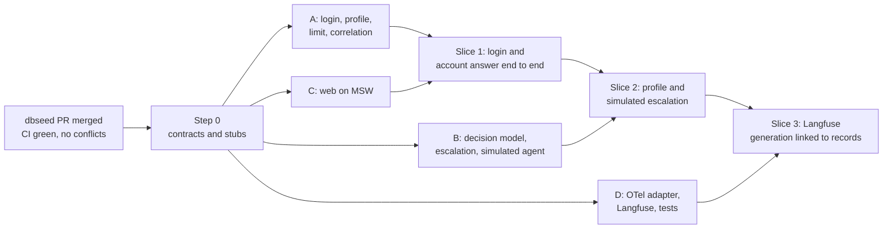

# Tuesday MVP plan: contracts first, then four parallel tracks

Target: Tuesday 2026-09-29. Scope source: [ADR 0025](../adr/0025-tuesday-account-inquiry-mvp-and-observability.md).
Data source: the 200-customer PostgreSQL seed ([ADR 0034](../adr/0034-bounded-local-gold-seed-for-mvp.md)).
Out of scope: the live-agent inbox ([ADR 0026](../adr/0026-live-agent-joins-escalated-conversation.md)) and
generalized retrieval.

## Tuesday acceptance

| # | Demonstration | Evidence |
|---|---|---|
| 1 | Demo login, bound to one fixed customer | Session cookie; `GET /v1/profile` returns that customer's first name; no customer can be picked |
| 2 | Account answer in es and pt | Balance, payment status, or statement reply grounded in PostgreSQL rows, with the as-of date |
| 3 | Persistent assistant name and PNG | Rename and "another image" in chat; the header survives a reload |
| 4 | Simulated same-chat escalation for card, dispute, and credit | Handoff persisted; a reply labeled simulated appears in the same chat; the copy never says a person joined |
| 5 | A visible Langfuse generation linked to PostgreSQL | The Langfuse generation shows `correlation_id`, `conversation_id`, `turn_id`, and `model_call_id`; the same ids are in `app.execution_records` |

## What already exists, and how the proposal maps onto it

The teammate proposal describes a greenfield `schemas.py`. Most of it already exists under other names.
The rule is to extend the existing contracts additively, not add a parallel set.

| Proposal | Existing | Plan |
|---|---|---|
| `POST /login` with `demo_password` | `POST /v1/auth/start` (persona or document) and `POST /v1/auth/verify` (one-time code; `demo_code` shown in `DEMO_MODE`) | Add `POST /v1/auth/demo/start` that uses the configured `DEMO_PERSONA_ID` (decision D4); verify stays as is |
| `LoginResponse` with names and avatar | `SignedInResponse{session, csrf_token}`, no names | Add `GET /v1/profile`; keep the login response unchanged |
| `POST /conversations/{id}/messages` | `POST /v1/conversations/{id}/turns` with a client `turn_id` for idempotent replay | Keep `/turns` (idempotency and the generated web types depend on it) |
| Message roles `user`, `assistant`, `mock_human` | A `Turn` pairs customer text with one `AssistantResponse` | Add `simulated_agent` to the response; the UI renders three roles from it |
| `ModelDecision{schema_version, intent, slots}` | Per-workflow slot models in `domain/llm_outputs.py`; routing is `keyword@1`, not a model | New `ModelDecision` 1.0.0 in `llm_outputs.py`, published as `contracts/schemas/model_decision.v1.json` |
| `get_account_information` | `list_my_balances`, `get_payment_status`, `get_statement_summary` and the account inquiry workflow | Reuse; no new tool |
| `escalate_to_human` | `shared.escalate()` builds and persists a handoff | Record it as tool call `escalate_to_human` so it gets a `tool_call_id` |
| `change_assistant_name`, `mock_assistant_image` | Nothing | New tools, aggregate, repository, and migration (track A) |
| `conversation_id` | `ConversationId` | Reuse |
| `correlation_id` | `X-Request-ID` middleware, logs only; `trace_id` exists but is never set | `CorrelationId` = the request id, persisted and sent to Langfuse |
| `model_call_id`, `tool_call_id` | `LlmCallRecord` and `ToolCallRecord` have no id | New ids, added in execution record 1.3.0 |

Two corrections to the proposal:

- Versions follow `contracts/README.md`: semver `"1.0.0"`, not `"v1.0"`, and schemas are generated from the
  Pydantic models with `make contracts`, never written by hand.
- `clarify` and `abstain` are not model outputs. The model reports an intent and a confidence; the engine
  clarifies below the threshold and abstains on `unsupported` (CLAUDE.md: the model understands, code decides).

## Decisions needed before the contract freeze

| Id | Question | Recommendation | Why it blocks |
|---|---|---|---|
| D1 | Pending action 32 says the build keeps all four workflows automated; ADR 0025 and this request escalate card, dispute, and credit | Add a demo mode (`WORKFLOW_ESCALATE_DISABLED=true` with `WORKFLOW_ENABLED=account_inquiry`); the automated workflows stay built and tested. Record it in ADR 0035 | Decides whether track B changes routing or only configuration |
| D2 | LLM provider, model, and key; installing the `litellm` extra (84 MB, 170 MB with dependencies; pending action 8) | Choose one provider and model now; approve the extra for the demo environment only | Without a provider, `LLM_PROVIDER=fake` refuses every call and no generation reaches Langfuse (acceptance 5) |
| D3 | Langfuse Cloud or self-hosted | Cloud project for Tuesday, redacted attributes only, `LLM_TRACE_CONTENT=false` | Cloud sends telemetry to a third party (CLAUDE.md rule 6); self-hosted v3 needs ClickHouse, Redis, and object storage |
| D4 | Demo credential | `POST /v1/auth/demo/start` for the configured persona plus the existing one-time code in `DEMO_MODE` | A new password endpoint is new authentication surface with its own secret and rate limit |
| D5 | Which persona is the fixed customer | `acc-mx-accounts` (checking and savings with balances) | Track C fixtures and track D scenarios use its data |

## Step 0: contract freeze (one pull request, 60 to 90 minutes, all four owners)

Prerequisite: merge the `dbseed` pull request (head `ea3a7b3`). All five checks pass on it (audit, guards,
python, web, GitGuardian) and it has no conflicts with `main`. It carries the seed and the fixes for the three
failures `main` has today (the flaky CSRF test, the `EvaluationSummaryReader` docstring, and markdownlint
reading `.git/`), so every track branches from a green `main`.

**Status (2026-09-28, branch `feat/mvp-contracts`).** The parts that need no decision are done:

- Ids: `CorrelationId`, `ModelCallId`, `ToolCallId`.
- `ModelDecision` and `DecisionIntent`, published as `model_decision.v1.json`; every contract moved to the
  shared minor release 1.3.0.
- `AssistantProfile` (name rules, six avatar ids, default `Luna` with `avatar-01`) and the
  `AssistantProfileRepository` port, with no adapter yet.
- The three MVP tool names; `SimulatedAgentReply` on the assistant response, allowed only with an escalation.
- Execution record 1.3.0 fields: `correlation_id`, `tool_call_id`, `model_call_id`, `provider`, `output_schema`.
- `GET /v1/profile` (first name and the default profile until track A adds storage); `TurnResponse` now carries
  `correlation_id` (filled from `X-Request-ID`) and `assistant_profile`; `AssistantMessage` carries `simulated_agent`.
- `contracts/openapi.json`, the web API types, and typed MSW fixtures in `apps/web/src/test/msw/mvp.ts`.

Still open in step 0: `POST /v1/auth/demo/start` (waits for D4) and the `conversation_limit_reached` problem
(track A adds it with the limit). Every new field is filled with its default until the owning track fills it:
`correlation_id` reaches the records in track A, the call ids in track B.

The contract pull request holds types, schemas, OpenAPI, and stubs only, with no business logic. Every stub
raises or returns a documented fixture, so the other tracks compile against it.

| Contract | Files | Content |
|---|---|---|
| Identifiers | `domain/identifiers.py` | `CorrelationId` (the request id pattern), `ModelCallId`, `ToolCallId` |
| Model decision | `domain/llm_outputs.py`, `contracts/schemas/model_decision.v1.json` | `ModelDecision{schema_version: "1.0.0", intent: DecisionIntent, confidence, account: AccountInquirySlotExtraction \| None, assistant_name: str \| None}`, `extra="forbid"`, no customer or conversation field. `DecisionIntent` = the `Intent` values plus `change_assistant_name` and `change_assistant_avatar` |
| Assistant profile | `domain/assistant_profile.py`, `ports/repositories/assistant_profiles.py` | `AssistantProfile{customer_id, name (1 to 40 characters, letters, spaces, hyphens), avatar_id (allowlist), updated_at, version}`; port `get(customer_id)` and `save(profile, expected_version)` with the four contract docstring sections |
| Tools | `domain/actions.py` | `ToolName` gains `escalate_to_human`, `change_assistant_name`, `mock_assistant_image` (non-banking writes, recorded but not in `WRITE_TOOLS`, so no step-up) |
| Simulated agent | `domain/conversation.py` | `SimulatedAgentReply{agent_display_name, text, joined_at, simulated: Literal[True]}` on `AssistantResponse` |
| Execution record 1.3.0 | `domain/execution_record.py`, `contracts/schemas/execution_record.v1.json` | `correlation_id`, `ToolCallRecord.tool_call_id`, `LlmCallRecord.model_call_id`, `provider`, `output_schema` (id, version, hash), all with `AddedIn("1.3.0")` |
| HTTP | `api/schemas/*.py`, `contracts/openapi.json`, `apps/web/src/shared/api/generated` | `POST /v1/auth/demo/start`; `GET /v1/profile` returning `{customer_first_name, assistant: {name, avatar_id, avatar_url, updated_at}}`; `TurnResponse` gains `correlation_id` and `assistant_profile`; problem `conversation_limit_reached` (429) |
| Web fixtures | `apps/web/src/test/msw/handlers.ts` | MSW handlers for demo start, verify, profile, create conversation, and three turn replies (account, escalation, rename) |

Done when `make contracts`, `make openapi`, `make typecheck`, and `make test-unit` pass, and the contract
changelog in `contracts/README.md` records execution record 1.3.0 and model decision 1.0.0.

## Parallel tracks

Each track works on a branch cut from the merged contract commit, merges behind stubs, and keeps `make check`
green. The default configuration keeps today's behavior until the demo settings are switched on.

### A: auth, account data, chat persistence (backend and database)

| Task | Files | Tests |
|---|---|---|
| Demo login: `POST /v1/auth/demo/start` issues the challenge for `DEMO_PERSONA_ID`; refused when `DEMO_MODE` is off | `api/routers/auth.py`, `bootstrap/settings.py`, `.env.example` | Integration: demo login works in demo mode, returns 404 otherwise, and follows the auth rate limit |
| Assistant profile storage: migration `0009` `app.assistant_profiles` with RLS on `customer_id`; PostgreSQL and memory adapters | `adapters/persistence/{postgres,memory}` | Shared contract suite for the port; RLS test that another customer's profile is invisible |
| `GET /v1/profile` (customer role) with the default name and avatar when no row exists | `api/routers/profile.py` | Integration and the OpenAPI snapshot |
| Tools `change_assistant_name` and `mock_assistant_image`: validate, choose the image from the allowlist through the `IdGenerator` or a seeded random port, save with optimistic version | `application/engine/tools.py`, new `application/profile/` | Unit tests: rejected names (URLs, markup, empty, over 40 characters), the image never repeats the current one |
| New-chat limit: five conversations per customer per rolling 60 minutes, counted in PostgreSQL | `application/conversations/service.py` | Integration: the sixth returns `conversation_limit_reached` |
| Persist `correlation_id` from the request into the turn context and the execution record | `api/middleware.py`, `application/conversations/service.py`, `engine/records.py` | Integration: the response header, the response body, and the stored record hold the same id |

The seed ([local guide](../data/local-postgres-mvp.md)) already holds the persona and its accounts. No data work
is needed beyond `make seed`.

### B: model routing, decision schema, escalation (backend engine and LLM)

| Task | Files | Tests |
|---|---|---|
| Prompt `decide_intent@1`: intents, slots, and the assistant name; customer text wrapped as untrusted data | `prompts/decide_intent/1.md` | Prompt registry tests |
| `DecisionModel` port `async decide(text, language, context) -> ModelDecision \| None` and a gateway adapter. `IntentRouter.route` is synchronous, so the engine awaits the decision first and maps it to an `IntentPrediction` with model `router:llm@1`; the configured keyword router stays the fallback on any failure | `ports/models.py`, `adapters/models/llm_decision.py`, `application/engine/flow.py` | Unit tests with `FakeLLM`: valid output, one repair, invalid output falls back to `keyword@1`, a customer id in the output is rejected |
| Profile intents route to the profile tools as shared handlers (like `human_request`) in every workflow | `application/engine/router.py`, `shared.py` | Dispatch table tests |
| Demo escalation (D1): with `WORKFLOW_ESCALATE_DISABLED=true`, an intent owned by a disabled workflow calls `escalate()`, recorded as tool call `escalate_to_human` | `application/engine/router.py`, `flow.py`, `bootstrap/settings.py` | Dispatch table tests; the automated workflow suites keep passing with the default settings |
| Simulated agent: after the handoff, a `SimulatedAgentReply` chosen from a bounded es and pt template list by workflow; the copy states it is a simulation and makes no promise about the case | `application/engine/templates/common.py`, new `simulated_agent.py` | Golden template tests in es and pt; a test that no simulated text claims an investigation or a person |
| Execution record: `model_call_id`, `provider`, and `output_schema` on every LLM call; `tool_call_id` on every tool call | `engine/recorder.py`, `adapters/llm/*` | Record builder tests |
| Cassettes for `decide_intent@1` recorded once the provider is chosen (D2); the tests use them in replay | `evals/cassettes/` | Replay tests |

### C: customer UI, profile, simulated-agent presentation (web)

Built against the MSW fixtures from step 0, then pointed at the API with `PROFILES="api web"`.

| Task | Location | Tests |
|---|---|---|
| Providers: router, TanStack Query, i18next (es, pt, en), typed `openapi-fetch` client with `credentials: 'include'` and the CSRF header | `app/`, `shared/api/` | Client tests with MSW |
| Login page: one button that runs demo start and verify, showing the demo code as the backend returns it | `features/demo-login` | Integration test with MSW; vitest-axe |
| Chat: conversation list, new chat (showing the limit problem), turns with three roles, balances and statement parts, the escalation notice, and a visible "Simulated agent" label | `features/chat`, `entities/message` | Integration tests per role; `aria-live` on new messages |
| Header: assistant name and PNG from `GET /v1/profile`, refreshed from `assistant_profile` in turn responses | `features/assistant-profile` | Test that a reload shows the saved name and image |
| Avatar assets: a fixed set of PNGs matching the backend allowlist | `apps/web/public/avatars/` | A test that every allowlisted id has a file |

Local prerequisite for this track: Node 24 (`.nvmrc`) and pnpm. The current development machine has Node 20
and no pnpm.

### D: tracing, audit, integration tests (observability and quality)

| Task | Files | Tests |
|---|---|---|
| OpenTelemetry `Telemetry` adapter with an OTLP HTTP exporter and a batch span processor; replaces `NoopTelemetry` when `OTEL_EXPORTER_OTLP_ENDPOINT` is set | `adapters/telemetry/otel.py`, `bootstrap/container.py` | Unit tests with an in-memory exporter |
| Langfuse export over OTLP HTTP (`/api/public/otel`, Basic auth from `LANGFUSE_PUBLIC_KEY` and `LANGFUSE_SECRET_KEY`, header `x-langfuse-ingestion-version: 4`), through the compose collector or directly | `deploy/otel-collector`, `.env.example`, `docker-compose.yml` | Manual check in Langfuse (acceptance 5); an export failure is logged and counted, never reported as success |
| Span attributes: `TracingDecorator` adds `langfuse.session.id` = conversation, `langfuse.trace.metadata.correlation_id`, `turn_id`, `model_call_id`, prompt, and schema references; no customer text | `adapters/llm/tracing.py` | Unit test of the attribute set; redaction test |
| Set `ExecutionRecord.trace_id` from the active span | `engine/records.py` | Record test |
| Scenario tests over HTTP for the five acceptance rows, including an es and a pt account answer | `services/api/tests/integration/api/test_mvp_demo.py` | Run in CI with `FakeLLM` or cassettes, never a live model |
| Demo runbook: settings, start commands, the five checks, and how to find a turn in Langfuse from its correlation id | `docs/demo/mvp-tuesday.md` | `make docs-check` |

## Merge order



- **Slice 1** (first merge after the freeze): login, a new chat, and a balance answer through the existing
  `keyword@1` router and the seeded data. This needs no LLM.
- **Slice 2**: profile tools, demo escalation, and the simulated agent, still on `keyword@1`, with keyword
  rules for the two profile intents.
- **Slice 3**: `router:llm@1` with the chosen provider, and the Langfuse export.

If D2 or D3 is not decided in time, slices 1 and 2 still ship; acceptance row 5 is then reported as not met,
never simulated.

## Settings for the demo

```bash
DEMO_MODE=true
DEMO_PERSONA_ID=acc-mx-accounts
WORKFLOW_ENABLED=account_inquiry
WORKFLOW_ESCALATE_DISABLED=true
WORKFLOW_ROUTER=keyword@1            # router:llm@1 in slice 3
LLM_PROVIDER=litellm                 # after D2
OTEL_EXPORTER_OTLP_ENDPOINT=...      # after D3
```

## Risks

| Risk | Mitigation |
|---|---|
| One day for four tracks | Slices 1 and 2 need no LLM and no Langfuse; merge them first |
| The contract changes the execution record | Additive 1.3.0 with `AddedIn`; consumers accept any 1.x.y |
| The demo mode diverges from the built workflows | One setting and one dispatch rule; the default configuration and every existing suite stay unchanged |
| Langfuse receives customer data | Only ids, model, prompt, schema, usage, and latency; `LLM_TRACE_CONTENT=false`; redaction test in track D |
| The simulated agent reads as a real person | Fixed "simulated" label in the UI and the payload; golden copy tests |
| Missing local tooling (Node 24, pnpm, gitleaks) | Install before step 0; CI remains the gate |

## Docs updated with the code

ADR 0035 (demo mode and simulated escalation, answering pending action 32), `contracts/README.md` changelog,
`docs/README.md`, `docs/PROGRESS.md`, `docs/BACKLOG.md` (live inbox, general retrieval, profile beyond the demo),
`docs/security/data-isolation.md` (the new table and RLS), and `docs/demo/mvp-tuesday.md`.
