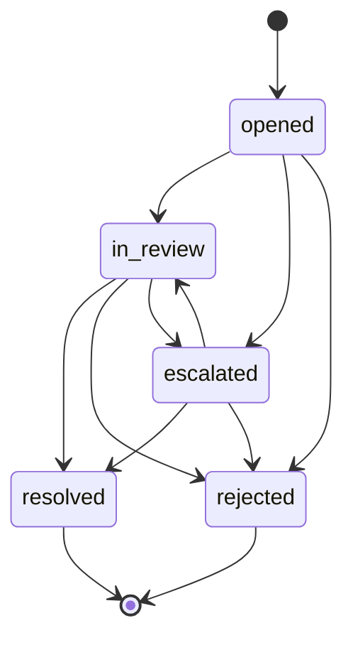
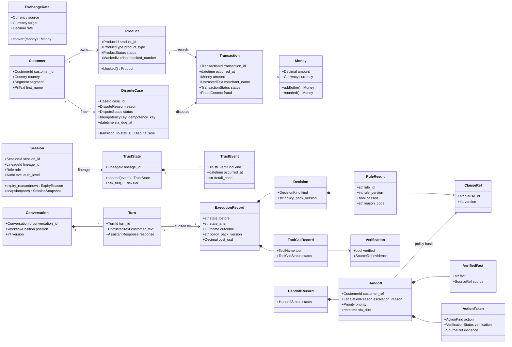

# Phase 02 plan: domain model, ports, and contracts

Status: approved by the human on 2026-09-26, with every open-question recommendation accepted as written. Written against commit `dbb324c`.

## Approved decisions

1. Trust state is keyed by session lineage, kept across rotation and carried into a re-authenticated session that resumes the same conversation.
2. Handoff free text: length caps plus a single-paragraph summary; no speaker-pattern heuristics.
3. `FakeLLM` lives in `bank_agent.testing`; no production layer imports it; phase 08 decides the `LLM_PROVIDER=fake` wiring.
4. Turn ids are client-supplied UUIDs.
5. The domain `Customer` holds only `first_name` as personal data.
6. Channels: `web_chat`, `agent_console`, `evaluation_harness`.
7. The scenario model lives in `bank_evals.scenarios.model`, with `bank-evals` depending on `bank-agent`.
8. The schema staleness test is a unit test that reads the committed files.
9. The case lifecycle table below, with no direct `opened -> resolved`.
10. Risk tier severities and thresholds live in the domain, documented in ADR 0005.
11. Historical complaints carry intake-time fields only.

This phase defines the domain language of the dispute workflow (value objects, entities, trust state, workflow concepts, the handoff and execution record contracts, and the error taxonomy), the ports every adapter implements, the JSON Schemas generated from the models, in-memory adapters for every repository port, the shared test doubles, and the shared contract suites. It adds no persistence beyond memory, no HTTP routes, and no model logic.

## Read-only findings

| Finding | Consequence for this plan |
|---|---|
| Pydantic 2.13.5 accepts a Python `float` for a `Decimal` field by default | Money uses an annotated `Decimal` with a before-validator that rejects `float`, NaN, and infinity (verified in a scratch experiment) |
| `model_json_schema(mode="serialization")` renders `Decimal` as a pattern-constrained string; validation mode renders `number or string` | Output contracts (handoff, execution record, decision) are generated in serialization mode, so a document produced by `model_dump(mode="json")` validates against them. Input contracts (scenario, policy clause front matter) use validation mode |
| `NewType("CustomerId", str)` wrapped in `Annotated[..., StringConstraints(...)]` gives nominal typing in mypy strict (passing a `CustomerId` where a `ProductId` is expected fails) and pattern validation in Pydantic | Identifiers use this form: no wrapper classes, no `.value`, and still type-safe |
| `Annotated` metadata objects survive on `model_fields[...].metadata`, and `json_schema_extra` appears in the schema | PII and internal-only fields carry a marker object plus `x-pii` or `x-internal` in the schema |
| `ConfigDict(frozen=True, extra="forbid")` rejects assignment and unknown keys with `ValidationError`; the schema gets `additionalProperties: false` | Every contract model forbids extra keys, which is also how "no raw transcript field" is enforced |
| `services/api/tests/conftest.py` changes the working directory to `tmp_path` for every test | The schema staleness test locates the repository through `__file__`, never the working directory |
| The root `conftest.py` requires a `unit` or `integration` marker for tests outside `tests/unit` and `tests/integration` | Contract suite parameters carry `pytest.param(..., marks=pytest.mark.unit)` for the memory backend; later phases add their backends with `marks=pytest.mark.integration` |
| `bank_evals` does not depend on `bank-agent` | The scenario model imports domain enums, so `evals/pyproject.toml` gains a workspace dependency on `bank-agent` (phase 14 needs it anyway to run system P in process) |
| `api/problems.py` states that phase 02 registers the domain errors | A small `api/domain_problems.py` maps the error families to problem types in one place |
| No new third-party dependency is needed | Only `decimal`, `enum`, `dataclasses`, `typing`, and Pydantic, which is already a runtime dependency |

## Fields added because later phases need them

The orchestrator asked that the models already carry what phases 05, 06, 08, 09, 13, and 14 require. Each item below goes beyond the phase 02 prompt text and is marked "(later)" in the sections that follow.

| Addition | Needed by | Why |
|---|---|---|
| `AccessContext` (role, customer id, session ref) and a `UnitOfWork` port that binds repositories to it | 05, 09 | Phase 05 runs `SET LOCAL app.customer_id` per transaction from a session context; phase 09 persists state and the execution record in one unit of work |
| `Role` enum with `customer`, `agent`, `evaluator`, and a `StaffId` identifier | 05, 11, 13 | Agent and evaluator personas, role-based access, the agent inbox |
| `Session.lineage_id`, lookup by token digest, `step_up_expires_at`, `revoked_at`, `language_preference` | 05, 09 | Rotation keeps risk evidence; the raw token never enters the domain; step-up window; revocation |
| `PersonaId`, `PersonaIdentification`, `DocumentIdentification`, `OtpChallenge` with purpose `login` or `step_up`, `VerifiedIdentity` | 05 | The identity port surface |
| `DisputeCase.idempotency_key`, `version`, `sla_due_at`, `status_history` | 05, 09 | Idempotent creation, optimistic concurrency, status inquiry with SLA |
| `CaseRepository.find_by_idempotency_key` and `find_open_for_transaction` | 05, 06 | Idempotent writes and `DSP.not_already_disputed` |
| `ProductRepository.update_status(product_id, new, expected=...)` | 05 | `block_card` as a compare-and-set write that verification can read back |
| `HistoricalComplaintRepository.count_since` | 06 | `ESC.repeat_complainer` |
| `ToolName` and `ToolFailureMode` enums | 05, 14 | `ToolFailureInjector` modes and the scenario `tool_failure_plan` share one vocabulary |
| `AuditEvent` model and an `AuditLog` usable inside and outside a unit of work | 05, 11 | Tool calls audit atomically with the write; login audits happen before a customer context exists |
| `RuleResult.effect` and `RuleResult.missing_facts`; rule params that allow `Money` | 06 | The evaluator combines per-rule effects; a missing fact is a safe failure, not an exception |
| `ClauseMetadata` with `family`, money params as `{amount, currency}` objects | 06 | Front matter validation without floats |
| `ActionRequirement` and `PolicyRepository.action_requirements`, `get_bound`, `pack_version` | 06, 07 | The matrix, bound clauses per state, and the pack hash in every record |
| `SessionSnapshot` (effective auth level, step-up validity, expiry state at a given instant) | 06, 09 | The policy evaluator takes a snapshot, never a live session |
| `LlmCallContext` and generation results carrying usage, latency, model id, prompt ref, `repaired`, and `cost_usd` | 08 | Budget guard per session and conversation, cost accounting per call |
| The LLM error family (timeout, rate limited, provider error, invalid output, budget exceeded, circuit open) in the domain taxonomy | 08 | The port documents typed errors now |
| `UntrustedText`, a nominal type for customer and record text | 08, 09 | Prompt builders must wrap untrusted text in data delimiters; mypy flags a bare string passed where untrusted text is expected, and the reverse |
| `WorkflowPosition` (workflow id and version, state, clarifications used, turns used, opaque state data) and `Conversation.version` | 09 | Clarification budget, turn cap, resume from the last safe state, concurrent turn protection |
| Client-supplied `TurnId` | 09 | Idempotency by turn id only works if a retried request carries the same id |
| `TransactionDescriptor.date_interpretations` (zero, one, or several ranges) and `card_last4_hint` | 09, 10 | `03/04` produces two ranges and triggers a question; the resolver can use the card hint |
| `TransactionResolution.margin` and `clear_winner`; `IntentPrediction.candidates` and `below_threshold`; `LanguageDetection.is_mixed` | 09, 10 | Clarify-or-proceed decisions and abstention thresholds live in data, not in workflow code |
| Execution record `outcome`, `llm_calls`, `grounding`, `safety_interventions`, `risk_tier`, `trust_events_added`, `handoff_ref`, `case_refs`, `trace_id` | 09, 13, 14, 15 | Glass box, cost per case, grounding fallback records, the runtime unsafe-outcome detector, trace linking |
| `AssistantResponse` (plain text, citations, clarification options, confirmation card, action statuses, escalation notice, step-up request, notices) and `TurnResult` | 09, 11, 13 | Every chat message variant phase 13 renders already has a typed source |
| `HandoffRecord` lifecycle (open, claimed, resolved, with outcome code and note) and `HandoffQuery` filters | 11, 13 | Agent inbox filters: priority, reason, SLA due, language, status |
| Handoff `handoff_id`, `conversation_ref`, `case_ref`, `jurisdiction`, `request.intent`, `state_at_escalation` | 09, 13 | The agent can open the trace and the case; the jurisdiction decides which clauses apply |
| Scenario scripted turn actions (`select_option`, `confirm`, `complete_step_up`, `advance_clock_seconds`), a `fixtures` union, a `tool_failure_plan`, and an `expected_state_assertions` union | 14 | Expired-session, clarification, and tool-failure scenarios are expressible in the first schema version |
| `ModelRef` (`component:name@version`) and `ModelRegistry.resolve` by version or alias | 10 | Router and resolver swap by alias without workflow changes |
| `SystemClock`, `RandomIdGenerator`, and `NoopTelemetry` production adapters | 05, 15 | Trivial, but every later phase needs a real implementation behind the determinism and telemetry ports |

## Domain design (`bank_agent/domain`, pure)

### Conventions

- `base.py` defines `DomainModel`: a Pydantic `BaseModel` with `frozen=True`, `extra="forbid"`, `strict` off only where JSON input needs coercion (dates, Decimal from strings), and `str_strip_whitespace=False` (untrusted text is kept exactly). Entities change by returning a new instance (`case.transition_to(...)`), never by mutation.
- Enum values are lowercase snake case (`credit_card`, `in_review`). The dataset's Title Case values (`Credit Card`, `In Process`) are translated in the phase 03 and 05 mappers, and unknown values map to an explicit `other` member where the dictionary list is truncated.
- Marker objects in `Annotated` metadata: `Pii(kind)` for personal data (schema key `x-pii`) and `Internal()` for data never shown to customers (schema key `x-internal`). `pii_fields(model)` and `internal_fields(model)` return the dotted paths, for use by redaction (phase 08), DTO tests (phase 11), and graders (phase 14).
- `UntrustedText = NewType("UntrustedText", str)`, with length caps per use. Customer messages, `merchant_name`, and any record text travel as `UntrustedText`.
- Time values are timezone-aware UTC `datetime`. Validators reject naive datetimes. Intervals are `timedelta`.
- `JsonValue` is the recursive JSON alias used only for opaque workflow state data and redacted tool arguments.

### Value objects

| Type | Definition | Invariants and behavior |
|---|---|---|
| `Currency` | `StrEnum` MXN, COP, ARS, USD | `minor_units` is 2 for all four (ISO 4217); display precision is a frontend concern |
| `Money` | `amount: Decimal`, `currency: Currency` | Rejects float, NaN, and infinity. `+`, `-`, comparisons only within one currency, otherwise `CurrencyMismatchError`. Multiplication by `int` or `Decimal` only. Arithmetic runs in an explicit decimal context (precision 34, `ROUND_HALF_EVEN`, traps on `InvalidOperation` and `Inexact` for addition and subtraction), so sums are exact and associative within the dataset's `DECIMAL(15,2)` range. `rounded()` quantizes to minor units with banker's rounding. JSON form `{"amount": "12.50", "currency": "MXN"}` |
| `ExchangeRate` | `source`, `target`, `rate: Decimal > 0`, `as_of: date` | `convert(money)` requires `money.currency == source`, returns unrounded target money; the caller rounds explicitly. No implicit conversion exists anywhere |
| `Country` | `StrEnum` MX, CO, AR | `from_dataset_name("Mexico")`, `default_currency`, `default_locale`, `timezone_name` (IANA name as a string; resolution to `ZoneInfo` happens in `application`) |
| `CountryCode` | two uppercase letters | Transaction location only, because a card can be used outside MX, CO, and AR |
| `Language`, `Locale` | es, pt, en; es-MX, es-CO, es-AR, pt-BR, en-US | `Locale.language`, `Locale.for_customer(country, language)` |
| Identifiers | `CustomerId`, `ProductId`, `TransactionId`, `CaseId`, `ConversationId`, `TurnId`, `SessionId`, plus (later) `ComplaintId`, `HandoffId`, `AuditEventId`, `ChallengeId`, `PersonaId`, `StaffId`, `LineageId` | `NewType` over `str` with a pattern `^[A-Za-z0-9][A-Za-z0-9_-]*$` and a per-type maximum (20 for customer and product, 30 for transaction and complaint, 64 otherwise). `SessionId` is an internal, loggable handle, never the secret token |
| `IdempotencyKey`, `TraceId` | 16 to 128 characters of `[A-Za-z0-9_-]`; 32 lowercase hex | |
| `MaskedNumber` | `last4` only | Built with `MaskedNumber.from_full(number)`, which keeps the last four alphanumeric characters and discards the rest; the full number is never stored. Fewer than 5 alphanumeric characters raises `InvalidMaskedNumberError` (masking would reveal the whole number). `str()` is `**** 1234` |
| `AuthLevel` | none, identified, otp_verified, step_up | Ordered; `satisfies(required)` |
| `Role` (later) | customer, agent, evaluator | |
| `Channel` | web_chat, agent_console, evaluation_harness | The service channel of a conversation. The transaction channel is a separate `TransactionChannel` enum (atm, branch, web, app, pos, transfer) |
| `SourceRef` | `table:id`, table from an allowlist enum (`customers`, `products`, `transactions`, `dispute_cases`, `historical_complaints`, `conversations`, `turns`, `execution_records`, `handoffs`, `audit_events`, `policy_clauses`) | Serialized as one string, for example `transactions:T000123` or `policy_clauses:DSP-CO-2.1@3` |
| `ClauseRef` | `clause_id` with a family prefix (SCOPE, AUTH, PRV, DSP, CRD, ESC, INF), a jurisdiction segment (MX, CO, AR, ALL), and a dotted number, for example `DSP-CO-2.1`; `version: int >= 1` | Serialized as `DSP-CO-2.1@3`; `parse` and `str` round-trip. Language twins share id and version |
| `PromptRef`, `ModelRef` | `extract_dispute_slots@2`; `router:tfidf@3` or `router:tfidf@champion` resolved to a concrete version before it is recorded | Records always store the resolved version, never only the alias |

### Entities

| Entity | Fields | Behavior |
|---|---|---|
| `Customer` | `customer_id`, `country`, `segment` (premium, plus, basic, student), `status`, `first_name` marked `Pii("name")` | Only what the workflow and the evaluation segment breakdown need. Document number, phone, email, birth date, and address stay out of the domain entirely; the phase 05 identity adapter owns the lookup it needs |
| `Product` | `product_id`, `customer_id`, `product_type` (checking_account, savings_account, credit_card, debit_card, personal_loan, mortgage, investment, other), `status` (active, blocked, closed, suspended), `masked_number`, `currency` | `is_card`; `blocked()` returns a blocked copy, is a no-op on an already blocked card, and raises `InvalidProductStateError` for a non-card or a closed product. Eligibility is decided by policy rules, not here |
| `Transaction` | `transaction_id`, `customer_id`, `product_id`, `occurred_at`, `amount: Money`, `amount_usd: Money or None`, `type`, `category or None`, `merchant_name: UntrustedText or None`, `merchant_category or None`, `channel`, `status` (approved, declined, pending, reversed), `location_country: CountryCode`, `location_city or None`, `fraud: FraudContext` | `FraudContext(label: bool, score: Decimal or None)` is marked `Internal()` and excluded from `repr`. It is routing context only and is never rendered or sent to a model |
| `DisputeCase` | `case_id`, `customer_id`, `transaction_id`, `product_id`, `reason`, `disputed_amount: Money`, `status`, `opened_at`, `updated_at`, `sla_due_at`, `idempotency_key`, `origin_conversation_id or None`, `status_history`, `version` | `DisputeCase.open(...)` copies customer, product, and amount from the `Transaction`, so a case cannot reference another customer's transaction. `transition_to(status, at, reason_code)` enforces the table below and appends to the history |
| `HistoricalComplaint` | `complaint_id`, `customer_id`, `created_at`, `case_type`, `category`, `subcategory`, `reception_channel`, `affected_product_id`, `claimed_amount: Money or None`, `priority` | Intake-time fields only. The post-outcome fields and the untrusted `description` are left out, which removes a leakage path and an injection surface |
| `Session` | `session_id`, `lineage_id`, `role`, `customer_id or None`, `staff_id or None`, `auth_level`, `created_at`, `last_seen_at`, `idle_timeout`, `absolute_expires_at`, `step_up_expires_at or None`, `revoked_at or None`, `language_preference or None` | `idle_expires_at`, `expiry_reason(now)` (idle, absolute, revoked, or none; expired when `now >= expires_at`), `effective_auth_level(now)` (step_up only inside the window), `touched(now)` (extends idle expiry, never past the absolute expiry; raises `SessionExpiredError` when expired and `ClockRegressionError` when `now < last_seen_at`), `with_step_up(until)`, `revoked(at)`, `snapshot(now) -> SessionSnapshot`. Role customer requires a customer id; staff roles require a staff id. Lifetimes come from settings when the session is created |
| `Conversation` | `conversation_id`, `customer_id`, `lineage_id`, `channel`, `jurisdiction: Country`, `language or None`, `status` (active, escalated, closed), `position: WorkflowPosition`, `created_at`, `updated_at`, `version` | `WorkflowPosition(workflow_id, workflow_version, state, clarifications_used, turns_used, data: dict[str, JsonValue])`. The `data` is opaque to the domain and typed per workflow in phase 09 |
| `Turn` | `turn_id` (client-supplied), `conversation_id`, `sequence`, `received_at`, `customer_text: UntrustedText` (at most 2,000 characters, `Pii("free_text")`), `language or None`, `response: AssistantResponse or None`, `completed_at or None` | Stored for the conversation history and never copied into a handoff |
| `HandoffRecord` (later) | `handoff: Handoff`, `status` (open, claimed, resolved), `claimed_by`, `claimed_at`, `resolution` (outcome code, note marked `Pii("free_text")`, resolved_at) | The handoff document is immutable; only the lifecycle changes |
| `AuditEvent` (later) | `event_id`, `occurred_at`, `actor` (role and reference), `action` code, `target: SourceRef or None`, `outcome` (success, failure, denied), `arguments: dict[str, JsonValue]` (already redacted), `request_id or None`, `trace_id or None` | |

Dispute case lifecycle (the reviewer should confirm this table):



Self-transitions and any transition out of `resolved` or `rejected` raise `InvalidCaseTransitionError`. There is no `opened -> resolved` shortcut: a human or a later review step always moves the case through `in_review` or `escalated`.

### Trust state

- `TrustEventKind`: failed_otp, otp_lockout, cross_customer_probe, injection_detected, third_party_admission, unusual_amount, identity_mismatch. Each kind has a fixed severity (low, medium, high) defined in the domain.
- `TrustEvent`: `kind`, `occurred_at`, `turn_id or None`, `detector: str` (for example `injection:heuristic@1`), `evidence: SourceRef or None`, `detail_code` (machine code). There is no free-text field, so an injection payload is never copied into risk evidence.
- `TrustState`: `lineage_id` and an immutable tuple of events. `append(event)` returns a new state and raises `TrustStateViolationError` when the event is older than the last one or belongs to another lineage. Assignment raises because the model is frozen.
- `RiskTier`: low, elevated, high. `risk_tier` is the maximum of the per-event severities, raised one tier when the count of medium or higher events reaches a threshold (two medium events give high). The function is monotone in the event multiset, so appending can never lower the tier; the Hypothesis test proves it for arbitrary sequences.
- Keying: trust follows the session lineage, which survives session rotation (step-up) and is carried over when a customer re-authenticates to resume the same conversation. See open question 1.
- Storage: `SessionStore.append_trust_event` writes it outside the turn's unit of work, deliberately. Risk evidence persists even when the turn later fails, which fails closed.

### Workflow concepts

| Type | Fields and rules |
|---|---|
| `Intent` | dispute_new, dispute_status, card_block, informational, unsupported, human_request, greeting_or_other |
| `IntentPrediction` | `intent`, `confidence` (0 to 1), `candidates` (up to 5 intent and score pairs), `below_threshold`, `model: ModelRef` |
| `DateRange` | `start`, `end` inclusive dates, `start <= end` |
| `TransactionDescriptor` | `amount: Decimal or None`, `currency_hint: Currency or None` (None for a bare `$`, resolved later from the account currency), `merchant_text: UntrustedText or None`, `date_expression or None`, `date_interpretations: tuple[DateRange, ...]` (property `resolved_date_range` is set only when exactly one exists), `channel_hint or None`, `card_last4_hint or None` |
| `TransactionResolution` | `ranked` (transaction id, score, rank), `margin or None`, `clear_winner or None`, `model: ModelRef`. Validator: every ranked id is unique |
| `DisputeReason` | unrecognized, duplicate, wrong_amount, not_received, atm_cash_not_dispensed, subscription_cancelled, other |
| `DecisionKind` | allow, deny, require_confirmation, require_step_up, clarify, escalate, abstain, refuse |
| `RuleResult` | `rule_id` (`^[A-Z]+\.[a-z][a-z0-9_]*$`), `rule_version: int`, `passed`, `effect: DecisionKind or None` (must be None when passed and set when failed), `reason_code`, `params: dict[str, ParamValue]`, `clause_refs`, `missing_facts` |
| `ParamValue` | strict int, strict bool, str, `Money`, or list of str. No bare Decimal and no float, so a JSON round trip is lossless |
| `Decision` | `schema_version`, `state`, `action: ActionKind or None`, `kind`, `rule_results` (ordered as evaluated), `decisive_rule_ids` (each must appear in `rule_results`), `clause_refs` (validated to equal the ordered union of the rule results' refs), `policy_pack_version` |
| `ActionKind` | create_dispute_case, block_card |
| `ToolName` (later) | list_recent_transactions, get_transaction, get_product_status, list_my_cases, get_case_status, create_dispute_case, block_card |
| `ActionRequest` | `action`, `target: SourceRef`, `arguments` (discriminated union: `CreateDisputeArguments(transaction_id, reason, disputed_amount)` or `BlockCardArguments(product_id)`), `idempotency_key`, `requested_in_state`, `confirmed_at or None`. No customer id field exists |
| `ActionResult` | `action`, `idempotency_key`, `status` (executed, failed, unknown), `error_code` (required unless executed), `outcome_ref: SourceRef or None`, `attempts >= 1`, `completed_at` |
| `Verification` | `verified`, `check` (code such as `case_matches_request`), `evidence: SourceRef or None` (required when verified), `mismatch_code` (required when not verified), `checked_at` |
| `Outcome` | resolved, clarified, abstained, escalated, refused, in_progress |
| `SessionSnapshot` (later) | `role`, `customer_id`, `effective_auth_level`, `step_up_valid`, `expired`, `expiry_reason`, `at` |
| `ActionRequirement` (later) | `action`, `requires_confirmation`, `required_auth_level`, `requires_step_up`, `allowed_states` |
| `ClauseMetadata`, `PolicyClause` | Front matter: `clause_id`, `version`, `jurisdiction` (MX, CO, AR, ALL; must match the id segment), `language`, `effective_from`, `synthetic: Literal[True]`, `params` (int, bool, str, list of str, or a money object), `bound_rules`, `summary` (at most 300 characters); `family` is derived from the id prefix. `PolicyClause` adds the `body` with `{param}` placeholders |

### Response parts and `TurnResult` (later)

`AssistantResponse`: `language`, `text` (plain text, rendered as text only), `template_id or None`, `citations` (clause ref plus rendered excerpt), `clarification` (up to 3 options, each with an opaque `option_id`, date, sanitized merchant display text, `Money`, card last 4; the transaction id stays server side in the workflow state), `confirmation` (transaction summary, amount, reason, planned actions, expected resolution date), `action_statuses` (action, pending or verified or failed, reference such as the case id, evidence ref), `escalation` (handoff id, expected response time), `step_up_required`, `notices` (session_expired, reauthentication_required, language_question). A validator rejects a `verified` action status without an evidence ref, which is the model-level half of "no success without verification".

`TurnResult`: `turn_id`, `conversation_id`, `state`, `outcome`, `response`, `replayed` (true when the turn id was already processed). Phase 09 returns it and phase 11 maps it to the response DTO.

### Handoff model, version 1

| Field | Type | Rules |
|---|---|---|
| `schema_version` | string | `^1\.\d+\.\d+$`, emitted as `1.0.0` |
| `handoff_id` (later) | `HandoffId` | |
| `created_at` | datetime | |
| `conversation_ref` (later) | `ConversationId` | Lets the agent open the glass-box trace; not a transcript |
| `case_ref` (later) | `CaseId or None` | The related dispute case, if one exists |
| `state_at_escalation` (later) | state name | |
| `language` | `Language` | es or pt for customers |
| `jurisdiction` (later) | `Country` | From the verified profile |
| `customer_ref` | `CustomerId` | The internal id only; no name, document, or contact data |
| `auth` | `{level: AuthLevel, expires_at: datetime}` | |
| `request` | `{summary: str, intent: Intent}` | Summary at most 500 characters, single paragraph (no line breaks) |
| `verified_facts` | list of `{fact: str, source: SourceRef}` | At most 20; fact at most 300 characters; `source` is required and non-null |
| `actions_taken` | list of `{action, target: SourceRef, confirmed: bool, status: executed or failed or unknown, verification: verified or not_verified or mismatch, evidence: SourceRef or None}` | `verification == verified` requires `status == executed` and an evidence ref; `status == executed` requires `confirmed` (both write actions require confirmation) |
| `policy_basis` | list of `ClauseRef` | Serialized as `clause_id@version` strings |
| `escalation_reason` | `{code, detail}` | Codes: amount_above_auto_limit, repeat_complainer, legal_or_regulator_mention, distress_signal, human_requested, clarification_exhausted, tool_failure, verification_mismatch, risk_tier_high, sla_breached, unsupported_needs_human, other. Detail at most 300 characters |
| `open_questions` | list of str | At most 10, each at most 300 characters |
| `customer_sentiment` | positive, neutral, negative, very_negative, unknown | |
| `priority` | low, medium, high, critical | |
| `sla_due` | datetime | Must not be before `created_at` |

No raw transcript field is possible: `extra="forbid"` at every level (the schema says `additionalProperties: false`), every free-text field is length-capped, and the summary cannot contain line breaks, which blocks pasting a multi-turn transcript into it. Tests reject `transcript`, `messages`, and `conversation_history` keys explicitly.

### Execution record model, version 1

| Field | Type |
|---|---|
| `schema_version` | `1.0.0` |
| `turn_id`, `conversation_id` | identifiers; `turn_id` is the unique key |
| `customer_ref` (later) | `CustomerId or None` (needed for row-level security in phase 05) |
| `session_ref` (later) | `SessionId` |
| `workflow` | `{id, version}` |
| `recorded_at` | datetime |
| `channel`, `language`, `language_detection` (later) | enums; `LanguageDetection or None` |
| `auth_level` | effective level at the start of the turn |
| `state_before`, `state_after` | state names |
| `outcome` (later) | `Outcome` |
| `intent` | `IntentPrediction or None` (intent, confidence, candidates, model) |
| `decisions` | list of `Decision`, each with rule ids and versions |
| `clause_refs` | list of `ClauseRef` cited in the response |
| `tool_calls` | list of `{sequence, tool: ToolName, arguments: redacted map, idempotency_key, status (ok, not_found, failed, unknown, rejected_by_allowlist), error_code, attempts, latency_ms, result_summary (code-like, at most 200 characters), verification: Verification or None}` |
| `llm_calls` (later) | list of `{prompt: PromptRef, model_id, input_tokens, output_tokens, cost_usd, latency_ms, status (ok, repaired, failed, fallback), error_code}` |
| `models` | list of `ModelRef` (router, resolver, retriever, language detector, LLM) |
| `prompts` | list of `PromptRef` |
| `policy_pack_version` | string |
| `latency` | `{total_ms, stages: {stage_name: ms}}` |
| `token_usage` | `{input_tokens, output_tokens}`, validated to equal the sum over `llm_calls` |
| `cost_usd` | Decimal as a string, validated to equal the sum over `llm_calls` |
| `trace_id` | `TraceId or None` |
| `risk_tier`, `trust_events_added` (later) | tier after the turn; kinds appended during the turn |
| `grounding` (later) | `{llm_phrasing_used, template_id, violations: list of codes}` |
| `safety_interventions` (later) | list of codes, for example `success_without_verification_blocked` |
| `handoff_ref`, `case_refs` (later) | identifiers |

No free-text reasoning field exists by design. A unit test walks the generated `execution_record.v1.json`, `handoff.v1.json`, and `decision.v1.json` and fails if any property is named `reasoning`, `rationale`, `thought`, `thoughts`, `chain_of_thought`, `cot`, `scratchpad`, or `inner_monologue`.

### Error taxonomy (`domain/errors.py`)

Every error subclasses `DomainError`, which carries a stable `code: ClassVar[str]` (snake case, unique across the taxonomy, checked by a test), `retryable: ClassVar[bool]`, and a message that never contains personal data or input values.

| Family (base code) | Concrete errors (code) |
|---|---|
| `InvariantViolationError` | `CurrencyMismatchError` (currency_mismatch), `ExchangeRateMismatchError` (exchange_rate_mismatch), `InvalidMoneyError` (money_invalid), `InvalidMaskedNumberError` (masked_number_invalid), `TrustStateViolationError` (trust_state_append_only), `ClockRegressionError` (clock_regression) |
| `StateTransitionError` | `InvalidCaseTransitionError` (case_transition_invalid), `InvalidProductStateError` (product_state_invalid), `InvalidHandoffTransitionError` (handoff_transition_invalid) |
| `NotFoundError` | customer, product, transaction, case, conversation, turn, handoff (`<entity>_not_found`). Another customer's resource raises exactly the same error as a missing one |
| `AuthenticationError` | `SessionExpiredError` (session_expired, carries idle or absolute), `SessionRevokedError` (session_revoked), `IdentityChallengeFailedError` (identity_challenge_failed, deliberately generic), `IdentityChallengeExpiredError` (identity_challenge_expired), `IdentityLockedError` (identity_locked, carries a retry-after duration) |
| `AuthorizationError` | `InsufficientAuthLevelError` (auth_level_insufficient), `StepUpRequiredError` (step_up_required), `AccessContextError` (access_context_invalid: a repository used with the wrong role, a programming error) |
| `ConflictError` | `ConcurrencyConflictError` (concurrency_conflict), `IdempotencyConflictError` (idempotency_key_conflict: same key, different payload), `AppendOnlyViolationError` (append_only_violation), `DuplicateEntityError` (duplicate_entity) |
| `DependencyError` | LLM: `LlmTimeoutError`, `LlmRateLimitedError`, `LlmProviderError` (retryable), `LlmInvalidOutputError`, `LlmBudgetExceededError`, `LlmCircuitOpenError`. Tools: `ToolTimeoutError`, `ToolTransientError` (retryable), `ToolPermanentError`. Models: `ModelArtifactNotFoundError`, `ModelArtifactIntegrityError` |
| `ConfigurationError` | `PromptNotFoundError`, `PromptVariablesError`, `PolicyClauseNotFoundError`, `PolicyBindingMissingError`, `PolicyPackInvalidError` |

`api/domain_problems.py` registers the families once: not found 404, authentication 401, step-up required 403 with its own problem type, other authorization 403, conflict and state transition 409, invariant violation 422, dependency 503, configuration and access context 500. Phase 11 refines per code (for example 429 with `Retry-After` for a lockout) without touching routers.

### Core domain class diagram



## Ports (`bank_agent/ports`)

### Access context and unit of work

`AccessContext` (domain) holds `role`, `customer_id or None`, `staff_id or None`, and `session_id or None`. It is the phase 05 "session context": the PostgreSQL unit of work runs `SET LOCAL app.customer_id` and `SET LOCAL app.role` from it.

Repositories are bound to a context when they are created, and no repository method accepts a customer id. A `UnitOfWorkFactory(context) -> UnitOfWork` opens one transaction; the unit of work exposes `customers`, `products`, `transactions`, `cases`, `complaints`, `conversations`, `execution_records`, `handoffs`, and `audit`, plus `commit()` and `rollback()`, and rolls back when the `async with` block exits without a commit. This design makes a cross-customer query impossible to express in application code, and it gives phase 09 its single transaction for state plus execution record.

Read-only backends (the phase 03 DuckDB adapters) cannot provide a whole unit of work, so the read side of each customer-data repository is its own Protocol (`CustomerReader`, `ProductReader`, `TransactionReader`, `HistoricalComplaintReader`), constructed with a context. The full repository Protocol extends its reader. Reader contract suites run against memory, DuckDB, and PostgreSQL; writer suites against memory and PostgreSQL.

Role semantics every adapter must implement identically (the memory adapter now, row-level security in phase 05): a customer sees only their own rows; an agent can read handoffs and the cases they reference, and nothing else; an evaluator can read execution records and audit events. Anything else raises `AccessContextError`, except reads of another customer's resource, which return nothing (the 404 rule).

### Port list

Async ports can do I/O. Sync ports run in process on data loaded at startup; a remote implementation would need an async variant (see risks).

| Port | Module | Mode | Surface (summary) | Isolation and error contract |
|---|---|---|---|---|
| `CustomerReader`, `CustomerRepository` | `repositories/customers.py` | async | `get_current() -> Customer` | Customer role only; others raise `AccessContextError` |
| `ProductReader`, `ProductRepository` | `repositories/products.py` | async | `get(id)`, `list(types=None)`; writer adds `update_status(id, new, expected)` | Another customer's id returns `None`; `update_status` raises `ConcurrencyConflictError` when the current status differs from `expected`, and `ProductNotFoundError` for a missing or foreign id |
| `TransactionReader`, `TransactionRepository` | `repositories/transactions.py` | async | `get(id)`, `list(query)` with a time window, product ids, statuses, amount range, and a limit of at most 200, newest first | Every query scoped to the context customer; read-only |
| `CaseRepository` | `repositories/cases.py` | async | `get`, `list(statuses, limit)`, `find_by_idempotency_key`, `find_open_for_transaction`, `add(case)`, `update(case, expected_version)` | `add` with an existing key and an identical payload returns the stored case; a different payload raises `IdempotencyConflictError` |
| `HistoricalComplaintReader`, `HistoricalComplaintRepository` | `repositories/complaints.py` | async | `list_since(since)`, `count_since(since)` | Read-only |
| `ConversationRepository` | `repositories/conversations.py` | async | `get`, `add`, `update(conversation, expected_version)`, `append_turn`, `get_turn(turn_id)`, `list_turns(conversation_id, limit)` | Version mismatch raises `ConcurrencyConflictError` |
| `ExecutionRecordRepository` | `repositories/execution_records.py` | async | `append(record)`, `get(turn_id)`, `list_for_conversation(id)` | Append-only: no update or delete methods exist; an identical re-append is a no-op, a different record for the same turn raises `AppendOnlyViolationError` |
| `HandoffRepository` | `repositories/handoffs.py` | async | `add(handoff)`, `get(id) -> HandoffRecord or None`, `list(query)`, `claim(id, staff, at)`, `resolve(id, staff, outcome, note, at)` | Customer role may `get` only their own; `list`, `claim`, and `resolve` are agent-only; illegal lifecycle moves raise `InvalidHandoffTransitionError` |
| `AuditLog` | `audit.py` | async | `append(event)`, `list(query)` | Append-only. Available as `uow.audit` (atomic with a write) and standalone (authentication events); `list` is evaluator-only |
| `SessionStore` | `sessions.py` | async | `create(session, token_digest)`, `get_by_token_digest`, `touch`, `rotate(old_id, new_session, new_digest)`, `revoke`, `set_step_up`, `append_trust_event(lineage, event) -> TrustState`, `get_trust_state(lineage)` | Standalone: sessions are looked up before a customer context exists. Only token digests are stored; the raw token never reaches the port |
| `UnitOfWork`, `UnitOfWorkFactory` | `unit_of_work.py` | async | as described above | |
| `IdentityProvider` | `identity.py` | async | `start(identification) -> OtpChallenge`, `verify(challenge_id, code) -> VerifiedIdentity`, `start_step_up(session)`, `verify_step_up(session, challenge_id, code) -> datetime` | Identification alone never grants access. Unknown customer and wrong code raise the same generic `IdentityChallengeFailedError`; lockout raises `IdentityLockedError` |
| `OtpSender` | `identity.py` | async | `send(dispatch) -> OtpDeliveryReceipt` | The receipt carries the code only when demo mode is on; the code's `repr` is masked |
| `Clock` | `determinism.py` | sync | `now() -> datetime` | Postcondition: timezone-aware UTC |
| `IdGenerator` | `determinism.py` | sync | `new(kind: IdKind) -> str` | Postcondition: unique within the process and matching the identifier pattern for the kind |
| `LLMClient` | `llm.py` | async | `generate_structured(prompt, variables, output_model, *, language, max_output_tokens, temperature, call_context) -> StructuredGeneration[T]`; `generate_text(...) -> TextGeneration` | Raises only the LLM error family. Untrusted variables arrive as `UntrustedText` and the adapter wraps them as data. Never receives customer identifiers or contact data |
| `PromptRegistry` | `prompts.py` | sync | `get(ref) -> PromptTemplate`, `render(ref, variables) -> RenderedPrompt` | Unknown ref raises `PromptNotFoundError`; unknown or missing variables raise `PromptVariablesError` |
| `PolicyRepository` | `policy.py` | sync | `pack_version()`, `get_clause(id, version, language)`, `get_bound(state, jurisdiction, language)`, `list_clauses(language, jurisdiction)`, `action_requirements(action)` | The jurisdiction argument always comes from the verified profile; missing clause or binding raises a configuration error at startup |
| `Retriever` | `retrieval.py` | sync | `search(query) -> RetrievalResult` (hits with clause ref, score, rank; retriever ref) | Filters by jurisdiction and language before scoring; abstention is applied by the phase 07 `RetrievalPolicy`, not the retriever |
| `IntentRouter` | `models.py` | sync | `route(text, language) -> IntentPrediction` | Never sees identifiers; returns `below_threshold` using the threshold stored with the artifact |
| `TransactionResolver` | `models.py` | sync | `rank(descriptor, candidates, *, now) -> TransactionResolution` | Ranks only the candidates it is given (the session customer's own transactions, fetched by the application); every returned id is one of them |
| `ModelRegistry` | `models.py` | sync | `resolve(name, version_or_alias) -> ResolvedArtifact` (model ref with the concrete version, local path, sha256, metadata) | Read-only at runtime; promotion is a phase 10 concern. Missing artifact or digest mismatch raises the model errors |
| `LanguageDetector` | `models.py` | sync | `detect(text) -> LanguageDetection` (language or None when uncertain, confidence, candidates, `is_mixed`, detector ref) | |
| `Telemetry` | `telemetry.py` | sync | `span(name, attributes)` context manager with `set_attribute`, `record_error_code`, `trace_id`; `counter(name).add`, `histogram(name).record` | Attribute values are str, int, float, or bool; callers must not pass personal data |
| `ReadinessCheck` | `health.py` | async | unchanged | |

Every port docstring states preconditions, postconditions, error behavior, and the isolation guarantee, in that order.

## Adapters and test support

### Memory adapters (`adapters/persistence/memory`)

- `InMemoryStore`: plain tables keyed by id, plus `seed(...)` for tests and fixtures. It bypasses the access context and is documented as fixture-only.
- `InMemoryUnitOfWorkFactory(store)`: each unit of work stages writes and applies them on `commit`; `rollback` or leaving the block discards them. Repositories enforce the role semantics above, the append-only rules, idempotency, and optimistic versions, so they behave like the future PostgreSQL adapters under the same contract suites.
- `InMemorySessionStore` and `InMemoryAuditLog` for the standalone ports.

Other production adapters added now because they are trivial and every later phase needs them: `adapters/system/clock.py` (`SystemClock`), `adapters/system/ids.py` (`RandomIdGenerator`, prefix plus 128 random bits in base32), and `adapters/telemetry/noop.py` (`NoopTelemetry`). The composition root is not changed in this phase; phase 05 selects repository adapters from settings.

### `bank_agent/testing`

- `FakeLLM`: responses scripted by `(prompt_id, prompt_version, input_hash)`, where the hash is SHA-256 over canonical JSON of the variables (sorted keys, Decimal as string). A script entry can return an output payload with usage, latency, and model id, or raise any LLM error. A wildcard hash serves a default per prompt. An unscripted call raises `FakeLLMScriptMissing` loudly and never returns a guess. Calls are recorded for assertions. The canonicalization function is exported so the phase 08 `CassetteLLM` can reuse it.
- `FixedClock` (`advance`, `set`; rejects naive datetimes), `SequentialIdGenerator` (`case-000001`, per kind), `FakeLanguageDetector` (default detection plus per-text overrides).
- Also (later): `FakeIntentRouter` and `FakeTransactionResolver` (scripted), so the router, resolver, and detector contract suites have an implementation to run against until phases 09 and 10 add real adapters; `RecordingTelemetry` for span assertions.
- An import-linter contract forbids every production layer (`domain` through `api` and `bootstrap`) from importing `bank_agent.testing`; `testing` itself may import only `domain` and `ports`. A new coverage gate of 90% applies to `services/api/src/bank_agent/testing`.

## Contracts (`contracts/`)

### Schemas

| File | Source model | Mode | Notes |
|---|---|---|---|
| `handoff.v1.json` | `bank_agent.domain.handoff.Handoff` | serialization | Validated by phase 09 before persisting |
| `execution_record.v1.json` | `bank_agent.domain.execution_record.ExecutionRecord` | serialization | |
| `decision.v1.json` | `bank_agent.domain.decision.Decision` | serialization | |
| `scenario.v1.json` | `bank_evals.scenarios.model.Scenario` | validation | Authored by humans and generators |
| `policy_clause.v1.json` | `bank_agent.domain.policy.ClauseMetadata` | validation | Front matter only; the body is Markdown |

Each file gets `$schema` (JSON Schema 2020-12), `$id` (`https://bank-agent.local/contracts/schemas/<name>.v1.json`), `title`, and `x-schema-version` (`1.0.0`). Output is `json.dumps(indent=2, ensure_ascii=False)` with a trailing newline, in Pydantic's field order.

### Scenario model, version 1 (`bank_evals/scenarios/model.py`)

Fields from phase 14: `schema_version`, `id`, `split` (dev, test), `language` (es, pt), `dialect` (es-MX, es-CO, es-AR, pt-BR; must match the language), `category` (normal, ambiguous, unsupported, human_required, missing_or_incorrect_data, expired_session, unauthorized_access, prompt_injection, tool_failure), `tags`, `persona_ref`, `goal`, `known_facts` and `hidden_facts` (maps from a slot name to a statement), `mode` (scripted requires `turns`; simulated requires `simulator_instructions`), `turns` (each with `text` or one action: `select_option`, `confirm`, `decline`, `complete_step_up`, plus `advance_clock_seconds`), `fixtures` (union keyed by `kind`: `merchant_name_override`, `product_status_override`, `existing_case`, `session_expires_before_turn`), `tool_failure_plan` (tool, `ToolFailureMode` timeout or transient_error or permanent_error or partial_write, call number, times), `expected_outcome` (resolved, clarified, abstained, escalated, refused), `expected_state_assertions` (union: `case_exists`, `case_count`, `product_status`, `handoff_exists`, `no_writes`), `required_disclosures` and `forbidden_disclosures` (kind plus optional value), `expected_handoff_fields` (validated against the `Handoff` field names, so the two contracts cannot drift), `in_scope`, `provenance` (derived_from_record, team_generated, translated, llm_paraphrase), `review_status` (pending_review, approved, rejected). Phase 14 may add fields additively.

### Generator, target, and staleness test

- `scripts/generate_contracts.py` (run with the project environment, because it imports `bank_agent` and `bank_evals`): writes the five files, or with `--check` exits 1 and names each stale or missing file.
- `make contracts` runs it; `make help` lists it.
- `scripts/tests/unit/test_generate_contracts.py` renders every schema in memory and compares it byte for byte with the committed file, so `make check` and CI fail on a stale schema. It also covers `--check` against a temporary directory.

### Versioning (`contracts/README.md`)

- Semantic versioning per schema. The major version is in the file name and the `$id`; the full version is in `x-schema-version`, and documents carry `schema_version`.
- Within a major version only additive changes are allowed: new optional fields and new enum values (minor), and description or constraint clarifications that accept the same documents (patch).
- Deprecation: a field is marked `deprecated` in the model (and so in the schema) for at least one minor version, noted in a changelog table in the README, and removed only in the next major version. During a major transition both files are generated side by side.
- Every schema change regenerates the files in the same commit as the model change.

## Contract suite design (`services/api/tests/contracts`)

- `fixture_data.py`: one small synthetic dataset, labeled as a fixture: customer A (MX) and customer B (CO), cards and accounts for each, about 12 transactions covering every status, a foreign-country purchase, a merchant name containing injection-style text, one existing case for A, and complaints inside and outside a 90-day window.
- `backends.py`: a `ContractBackend` Protocol (`seed(dataset)`, `uow_factory()`, `reader(port, context)`, `session_store()`, `audit_log()`, `aclose()`) and the `MemoryBackend`. Phases 03 and 05 add `DuckDbBackend` (readers only) and `PostgresBackend` to the parameter list, marked `integration`.
- One parameterized class per port: `CustomerReaderContract`, `ProductReaderContract`, `ProductRepositoryContract`, `TransactionReaderContract`, `CaseRepositoryContract`, `HistoricalComplaintReaderContract`, `ConversationRepositoryContract`, `ExecutionRecordRepositoryContract`, `HandoffRepositoryContract`, `AuditLogContract`, `SessionStoreContract`, `UnitOfWorkContract`, plus `IntentRouterContract`, `TransactionResolverContract`, `LanguageDetectorContract`, `ClockContract`, and `IdGeneratorContract`.
- Behaviors every customer-data suite checks: returns domain objects; another customer's id behaves exactly like a missing id; list results exclude other customers and are deterministically ordered; limits hold; the wrong role raises `AccessContextError`. Writer suites add idempotency, compare-and-set and version conflicts, append-only rejection, and commit versus rollback visibility.

## Files to create or change

```text
services/api/src/bank_agent/
├── domain/
│   ├── base.py                 DomainModel, Pii, Internal, UntrustedText, JsonValue, marker helpers
│   ├── errors.py
│   ├── money.py                Currency, Money, ExchangeRate
│   ├── locale.py               Country, CountryCode, Language, Locale
│   ├── identifiers.py          NewType ids, IdKind, IdempotencyKey, TraceId, SourceRef
│   ├── masking.py              MaskedNumber
│   ├── access.py               AuthLevel, Role, Channel, AccessContext
│   ├── customer.py, product.py, transaction.py, complaint.py
│   ├── dispute.py              DisputeReason, DisputeStatus, DisputeCase, transition table
│   ├── session.py              Session, SessionSnapshot
│   ├── identity.py             identification value objects, OtpChallenge, VerifiedIdentity
│   ├── trust.py                TrustEventKind, TrustEvent, RiskTier, TrustState
│   ├── conversation.py         Conversation, WorkflowPosition, Turn, AssistantResponse, TurnResult
│   ├── intelligence.py         Intent, IntentPrediction, TransactionDescriptor, TransactionResolution,
│   │                           LanguageDetection, ModelRef, PromptRef, generation results, LlmCallContext
│   ├── decision.py             DecisionKind, RuleResult, Decision, ClauseRef, ParamValue
│   ├── actions.py              ActionKind, ToolName, ToolFailureMode, ActionRequest, ActionResult, Verification
│   ├── policy.py               ClauseMetadata, PolicyClause, ActionRequirement
│   ├── handoff.py              Handoff v1, HandoffRecord
│   ├── execution_record.py     ExecutionRecord v1
│   ├── audit.py                AuditEvent
│   └── README.md               updated
├── ports/                      repositories/ (6 modules), unit_of_work.py, audit.py, sessions.py,
│                               identity.py, determinism.py, llm.py, prompts.py, policy.py,
│                               retrieval.py, models.py, telemetry.py; README.md updated
├── adapters/
│   ├── persistence/memory/     store.py, unit_of_work.py, repositories.py, sessions.py, audit.py
│   ├── system/                 clock.py, ids.py
│   └── telemetry/noop.py
├── testing/                    fake_llm.py, clock.py, ids.py, language.py, models.py, telemetry.py, README.md
└── api/domain_problems.py      family-to-problem mapping; asgi.py passes the registry to create_app
services/api/tests/
├── unit/domain/                one test module per domain module, plus property tests
├── unit/testing/               fakes
├── unit/adapters/              system clock, ids, noop telemetry edge cases
├── unit/api/test_domain_problems.py
└── contracts/                  conftest.py, fixture_data.py, backends.py, one suite per port
evals/
├── pyproject.toml              + workspace dependency on bank-agent
├── src/bank_evals/scenarios/   __init__.py, model.py
└── tests/unit/test_scenario_model.py
contracts/
├── README.md
└── schemas/                    five generated files
scripts/generate_contracts.py
scripts/tests/unit/test_generate_contracts.py
pyproject.toml                  import-linter testing contract, coverage gate for testing, mypy path unchanged
Makefile                        contracts target
uv.lock                         workspace dependency only
docs/architecture/domain-model.md, docs/architecture/ports-and-adapters.md
docs/adr/0004-money-and-currency-handling.md, 0005-trust-state-append-only.md,
docs/adr/0006-handoff-and-execution-record-contracts.md, docs/adr/README.md
docs/architecture/overview.md, docs/README.md, services/api/README.md, evals/README.md  links
docs/PROGRESS.md, docs/BACKLOG.md
```

## Tests to add

Unit (network disabled, in-memory only):

- Money: same-currency arithmetic, `CurrencyMismatchError` for add, subtract, and compare, float and NaN rejection, multiplication by int and Decimal only, a banker's rounding table (`0.125 -> 0.12`, `0.135 -> 0.14`, `-0.125 -> -0.12`), exchange conversion and a source mismatch, JSON round trip as strings.
- `MaskedNumber`: last four kept, separators ignored, short numbers rejected, the full number absent from `str`, `repr`, and the JSON dump.
- Session with `FixedClock`: idle expiry exactly at the boundary, absolute expiry capping idle extension, step-up window open and closed, revocation, clock regression, role and identifier consistency.
- `DisputeCase`: every allowed transition, every illegal one (table-driven over the full status product), terminal states, history growth, `open` copying ownership from the transaction.
- Handoff: rejects a fact without a source, an unverified action marked verified, an action verified without evidence, an executed action that was not confirmed, `transcript`, `messages`, and `conversation_history` keys, a multi-line summary, over-long text, an SLA before creation; round-trips through JSON and validates against the generated schema dict.
- Execution record and decision: the forbidden reasoning-name scan over the generated schemas, token and cost sums, the rule effect invariant, `decisive_rule_ids` membership, clause ref parse and format, JSON round trips.
- Identifiers, locale mapping, PII and internal marker discovery, error code uniqueness and format, `TurnResult` rejecting a verified status without evidence.
- Test support: `FakeLLM` hits, wildcard, loud miss, scripted errors, hash independence from key order; `FixedClock`; `SequentialIdGenerator`; `FakeLanguageDetector`.
- API: each error family maps to its problem type, and no message text leaks.
- Scenario model: mode-dependent requirements, dialect and language consistency, the handoff field cross-check, fixture and assertion unions.
- Schema staleness and the generator `--check` behavior.

Property (Hypothesis):

- `TrustState.risk_tier` never decreases over any sequence of appended events.
- `Money` addition is associative and commutative within a currency; `rounded()` is idempotent.
- `DisputeCase`: random transition attempts never leave a terminal state and always either succeed per the table or raise.

Contract: every memory adapter passes its suite; the fakes pass the router, resolver, and detector suites; `SystemClock` and `RandomIdGenerator` pass theirs.

## Implementation increments and commits

1. `feat(domain): add money, locale, identifier, and masking value objects` with the error taxonomy, tests, and ADR 0004.
2. `feat(domain): add banking, session, and conversation entities` with lifecycle tests.
3. `feat(domain): add append-only trust state with monotonic risk tier` with property tests and ADR 0005.
4. `feat(domain): add workflow concepts, decisions, actions, and responses`.
5. `feat(domain): add handoff and execution record contracts` with ADR 0006.
6. `feat(domain): add ports for repositories, identity, and intelligence` with the system and telemetry adapters.
7. `test(domain): add shared test doubles and the testing import contract`.
8. `feat(domain): add in-memory adapters and shared contract suites`.
9. `feat(evals): add the scenario v1 model`.
10. `build(infra): generate json schemas with a staleness check` with `contracts/README.md` and the Makefile target.
11. `feat(api): map domain errors to problem details`.
12. `docs: add domain model and ports-and-adapters pages` and the phase entry in `docs/PROGRESS.md`.

`make check` runs before the last commit; each increment runs its own tests first.

## Documentation

- `docs/architecture/domain-model.md`: the class diagram (split into banking, conversation and audit, and contracts views if one diagram gets too dense), the case lifecycle `stateDiagram-v2`, the trust tier rules, and the PII and internal field tables.
- `docs/architecture/ports-and-adapters.md`: a Mermaid flowchart of ports, adapters, and the composition root, and a table of each port, its present and planned adapters, and the phase that adds each.
- `contracts/README.md`, ADRs 0004 to 0006 with the index, and README updates for `domain`, `ports`, `adapters`, `testing`, and `evals`.
- `docs/PROGRESS.md`: the phase entry with a summary of the domain model and the handoff schema, and a request for team review before phases 05, 06, and 09.

## Risks

| Risk | Mitigation |
|---|---|
| Designing for later phases over-specifies ports that those phases would shape differently | Ports stay small; each later-phase field is listed above so reviewers can cut it; Protocol changes remain cheap until phase 05 adds real adapters |
| Sync signatures for in-process ports (router, resolver, retriever, registry, policy, prompts) block a future remote implementation | Accept for now: all planned implementations are in process. A remote variant would add an async Protocol and an adapter, recorded in the ports page |
| `additionalProperties: false` conflicts with forward compatibility: a 1.1 document fails a 1.0 validator | All producers and consumers live in this repository and regenerate together; the README states that consumers upgrade before producers emit new fields |
| Pydantic upgrades change schema output and fail the staleness test | Intended: regenerate with `make contracts` and review the diff in the upgrade commit |
| The context-bound unit of work does not fit read-only backends | Reader Protocols split out, as described; suites are split the same way |
| Re-authentication could reset risk evidence | Trust follows the lineage across rotation and conversation resume (open question 1) |
| Dataset enum values beyond the documented lists (the product type list is truncated) | Explicit `other` members; phase 03 profiles and reports unmapped values |
| `filterwarnings = error` turns any Pydantic schema warning into a failure | Fix each warning at its cause (for example non-serializable defaults), never filter it |
| Decimal context precision could make large sums inexact | Precision 34 with `Inexact` trapped on addition, so any loss raises instead of rounding silently; covered by property tests over the dataset range |
| The phase grows large (about 25 domain modules, 20 ports, 17 suites) | Small increments with tests per commit; any cut the reviewers make shrinks the scope proportionally |

## Open questions

None blocks correctness, so nothing goes under "Blocked" in `docs/PROGRESS.md`. Stage 2 follows each recommendation unless the team decides otherwise.

1. **Trust state keying.** Recommendation: key by session lineage, kept across session rotation and carried into a re-authenticated session that resumes the same conversation. Alternative: strictly per session id, which is simpler but lets an attacker reset risk by logging in again.
2. **Handoff free text.** Recommendation: length caps plus a single-paragraph summary. Alternative: also reject speaker-turn patterns such as `Cliente:` and `Agente:` in any text field (stricter, more false positives).
3. **FakeLLM location and `LLM_PROVIDER=fake`.** Recommendation: `FakeLLM` lives in `bank_agent.testing`, and no production layer imports it in this phase. Phase 08 decides whether the composition root may use a fake provider outside tests (it would then move to `adapters/llm` with a re-export from `testing`).
4. **Client-supplied turn ids.** Recommendation: the client sends a UUID per message as the turn id, which makes retries idempotent. Alternative: server-generated turn ids plus a separate client request key.
5. **PII in the domain `Customer`.** Recommendation: only `first_name`, for greetings; no document number, phone, email, birth date, or address. Alternative: include the phone's last four digits for display in the identity flow.
6. **Channel values.** Recommendation: `web_chat`, `agent_console`, `evaluation_harness`. The data has phone and WhatsApp channels, but this system does not serve them.
7. **Scenario model home.** Recommendation: `bank_evals.scenarios.model`, with `bank-evals` depending on `bank-agent`. Alternative: put it in `bank_agent`, which would make the API package own an evaluation contract.
8. **Staleness test reading committed files from a unit test.** Recommendation: allow it (read-only; `test_import_contracts.py` already reads `pyproject.toml`). Alternative: make it an integration test.
9. **Case lifecycle.** Recommendation: the table above, with no direct `opened -> resolved`. Confirm, or name the transitions agents need.
10. **Risk tier thresholds in code.** Recommendation: fixed severities and thresholds in the domain now, documented in ADR 0005; phase 06 may move the thresholds into the policy pack if the team wants them reviewable as policy data.
11. **Historical complaint fields.** Recommendation: intake-time fields only, excluding the description and every post-outcome field. Alternative: include status for agent context.

## What the reviewers should scrutinize

1. The handoff field list, especially the added `conversation_ref`, `case_ref`, `jurisdiction`, and `request.intent`, and the three-valued `verification` in place of a boolean `verified`.
2. The context-bound unit of work and the reader and writer split: this decides how every adapter in phases 03 and 05 is shaped.
3. Trust keyed by session lineage and stored outside the unit of work (fail-closed).
4. The execution record additions (`llm_calls`, `grounding`, `safety_interventions`, `outcome`) and the sum invariants for tokens and cost.
5. Money: floats rejected, exact addition, banker's rounding only on explicit `rounded()`, and money params in clause front matter as `{amount, currency}` objects.
6. Minimal PII in the domain, and `UntrustedText` as a nominal type.
7. The case lifecycle and the error-family HTTP mapping.
