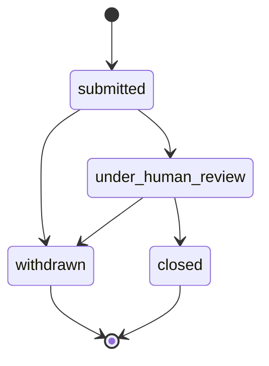
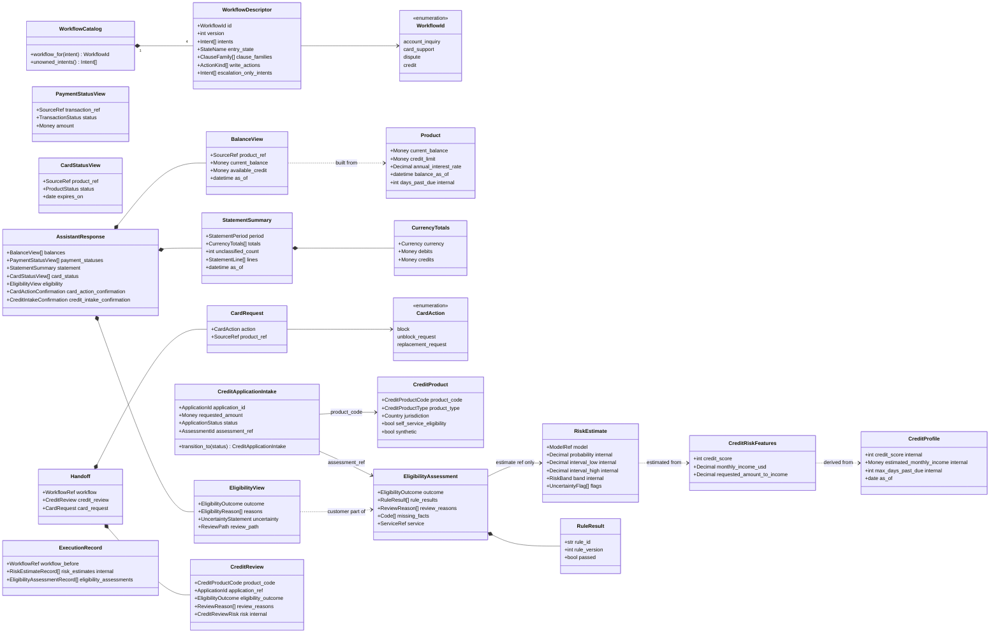
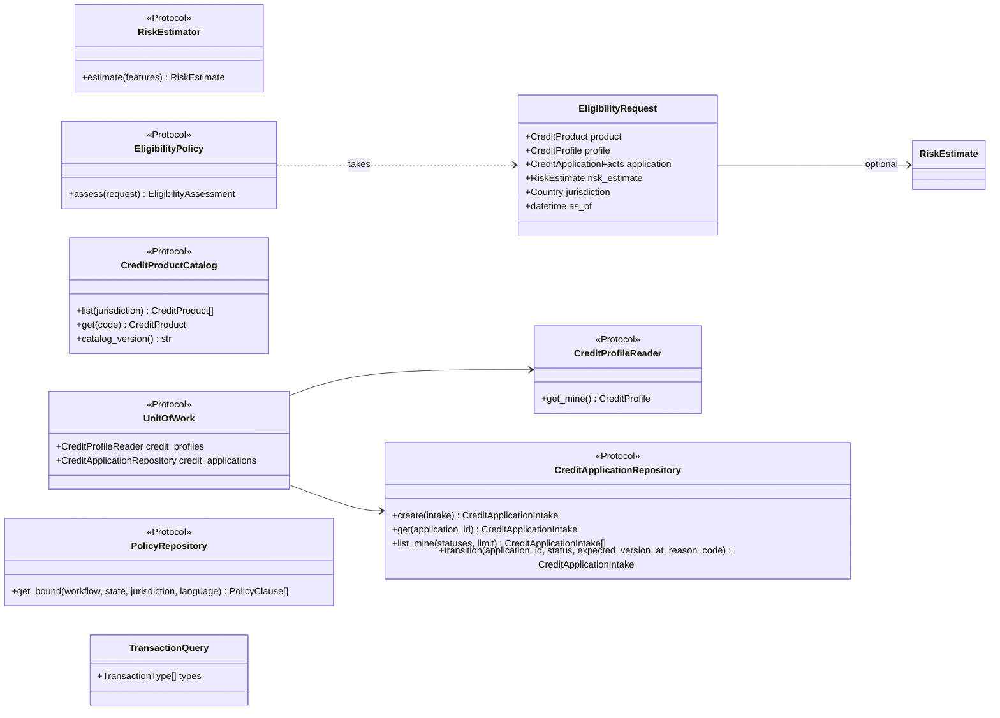

# Phase 02b plan: multi-workflow domain and contracts

Status: approved 2026-09-26 by the orchestrator under the human's standing delegation. Every recommendation for open questions 1 to 5, 8, and 9 is accepted as written; question 6 is answered yes (the `handoff()` builder pins `schema_version` `1.0.0`, a new `handoff_v1_1()` builder is added, and the pinned test body is not edited); question 7 is answered yes (`jsonschema` 4.26.x joins the dev dependencies, with its license and reason in the phase log). Written against commit `4973018`.

This phase gives `account_inquiry`, `card_support`, and `credit` the same typed foundation that `dispute` got in phase 02: the workflow registry, the new intents, the account, card, and credit vocabulary, the credit separation between conversation handling, predictive risk estimates, and the synthetic eligibility service, the new ports with memory adapters and test doubles, and a minor version (`1.1.0`) of every published contract. It adds no policy content, no database adapters, no tools, no state machines, no model training, no routes, and no UI.

Every change is additive: every phase 02 test passes without edits, every document that is valid under a `1.0.0` contract stays valid under `1.1.0` (against the models and against the generated schemas), and nothing is renamed or removed. Two points need an explicit decision because the literal task text collides with an existing test or with this rule; they are open questions 6 and 7.

## Read-only findings

| Finding | Consequence for this plan |
|---|---|
| **The serialization-schema trap is real.** A scratch experiment with Pydantic 2.13.5 and jsonschema 4.26.0 (run through `uv run --with jsonschema`, nothing installed in the project) subclassed `Handoff` with two new optional fields: the serialization schema marks both required, and the stored `1.0.0` builder document then fails with `'workflow' is a required property` and `'card_request' is a required property`, while `Handoff.model_validate` accepts the same document | Solved with an `AddedIn` field marker and a schema hook (see "Serialization-mode defaults"). In the same experiment, the fixed variant accepts the `1.0.0` document and a new `1.1.0` document, keeps every field of a new nested model required, and leaves the validation-mode schema unchanged |
| The hook is a no-op for fields without the marker: installed on a copy of the base model, it renders `Handoff` and `ExecutionRecord` byte-identically, and `Decision` differs only by a docstring artifact of the experiment | It can be added to `DomainModel` in its own commit with zero schema diff, which the staleness test proves |
| `tests/unit/domain/test_handoff.py::test_builds_a_valid_handoff` asserts that the `handoff()` builder produces `schema_version == "1.0.0"`; the builder does not set the version | Task 22 ("the `Handoff` default `schema_version` becomes `1.1.0`") would break this test. Open question 6 |
| `pii_fields(Turn) == {"customer_text": "free_text"}` and `pii_fields(HandoffRecord) == {"resolution.note": "free_text"}` are pinned by phase 02 tests, and `Turn` contains `AssistantResponse` | No new response part and no new handoff field may carry a `Pii` marker. Payee display text and the credit intake confirmation are designed without personal data (risks table) |
| The phase 02 contract suites pin exact id lists for customer A: eight transactions in a fixed order, three products, and the limit results | Task 29 is met by enriching existing fixture rows rather than adding rows for customer A: `PRD-A-CARD` gets a balance and limit, `PRD-A-SAVE` a balance, `TXN-A-0004` (pending) and `TXN-A-0005` (reversed) become payments, and `TXN-A-0006` is already a declined card purchase. No existing assertion reads a transaction type or a balance (checked with grep) |
| The `transaction()` builder hard-codes `TransactionType.PURCHASE` and `TransactionChannel.POS`, and `product()` takes no balance fields | Both builders gain keyword parameters with defaults equal to today's values, so every existing call is unchanged |
| Import cycles: `actions` imports `workflow`; `decision` imports `actions`; `policy` imports `decision`; `handoff` imports `actions` | A descriptor that references `ActionKind` and `ClauseFamily` cannot live in `workflow.py`, and `cards.py` cannot import `handoff.py` while `handoff.py` imports `cards.py`. Module layout below: `workflow_catalog.py`, `escalation.py`, `cards.py`, `credit.py`, `eligibility.py` |
| mypy strict disables implicit re-exports | Moving `EscalationReasonCode` to `domain/escalation.py` keeps `from bank_agent.domain.handoff import EscalationReasonCode` working through an explicit `import ... as EscalationReasonCode` re-export |
| The clause family list exists twice: `decision.CLAUSE_FAMILIES` (the pattern) and `policy.ClauseFamily` (the enum) | Both widen together, and a new test fails if they differ. The pattern appears in four schemas (decision, execution record, handoff, policy clause), so all four change |
| `PolicyRepository.get_bound` has no implementation, no caller, and no test | Its signature can change without breaking anything (open question 5b) |
| `ActionRequirement.allowed_states` names states without a workflow, and state names repeat across workflows | No change: the workflow scoping of a write comes from `WorkflowDescriptor.write_actions`, which phases 06 and 09 check together with `allowed_states` (risks table) |
| The customer role may read its own execution records and handoffs at the repository level (phase 02 role table) | Every risk-estimate field in the execution record and the handoff is marked `Internal()`, so phase 11 DTO tests and phase 08 redaction find it with `internal_fields` (open question 2) |
| `TransactionStatus.APPROVED` exists, and the scenario disclosure kind `credit_approval_claim` is required by task 23 | The "no approval" vocabulary test scans an explicit list of card, credit, eligibility, and application enums plus the new members of shared enums; it names both exceptions and why they are allowed |
| `IntentPrediction.candidates` is capped at 7 | No change: it is a top-k list, and 17 intents do not require more candidates |
| `jsonschema` is not in `uv.lock` | Validating a stored document against a schema needs it; open question 7 |
| 612 unit tests are collected with `-m unit` at `4973018` | The regression baseline |
| The dataset has no transaction direction column, and a payment reduces a credit card balance while it debits a checking account | Statement totals need an explicit direction rule (open question 8) |
| Argentine annual interest rates can exceed 100 percent, and `interest_rate` is `DECIMAL(5,2)` | `annual_interest_rate` is bounded to `[0, 999.99]`, not `[0, 100]` |
| The `customers` table has `segment` (including `Student`), `occupation`, and `education_level` | These are age or socio-economic proxies; the risk feature allowlist leaves them out (open question 9) |

## Module layout

| Module | New or changed | Contents |
|---|---|---|
| `domain/base.py` | changed | `AddedIn(version)` marker, the `required` hook in `DomainModel.model_config`, `check_added_fields(model)` |
| `domain/workflow.py` | changed | `WorkflowId`; ten new `Intent` members; `CROSS_WORKFLOW_INTENTS` |
| `domain/workflow_catalog.py` | new | `WorkflowDescriptor`, `WorkflowCatalog`, `WORKFLOW_CATALOG`, `CARD_ACTION_HANDLING` (placed here because it references `ActionKind`, `ClauseFamily`, and `EscalationReasonCode`) |
| `domain/escalation.py` | new | `EscalationReasonCode` moved from `handoff.py` (re-exported there) and widened |
| `domain/product.py` | changed | Optional balance, limit, rate, date, and days-past-due fields with validators |
| `domain/accounts.py` | new | `BalanceView`, `CreditBalanceConvention`, `available_credit`, `PaymentStatusView`, `StatementPeriod`, `EntryDirection`, `CurrencyTotals`, `StatementLine`, `StatementSummary` |
| `domain/cards.py` | new | `CardAction`, `CardBlockReason`, `CardStatusView`, `CardRequest` |
| `domain/credit.py` | new | `CreditProductType`, `CreditProduct`, `CreditProfile`, `ApplicationStatus`, `CreditApplicationIntake` and its lifecycle |
| `domain/eligibility.py` | new | `CreditRiskFeatures`, `RiskBand`, `UncertaintyFlag`, `RiskEstimate`, `EligibilityOutcome`, `ReviewReason`, `ServiceRef`, `EligibilityAssessment`, `EligibilityView`, `CreditReview` and the execution record entries |
| `domain/identifiers.py` | changed | `ApplicationId`, `RiskEstimateId`, `AssessmentId`, `CreditProductCode`; `IdKind` members; `SourceTable` members |
| `domain/intelligence.py` | changed | `ModelComponent.RISK_ESTIMATOR` |
| `domain/decision.py`, `domain/policy.py` | changed | Clause families `ACC`, `CRE`, `ELG` |
| `domain/actions.py` | changed | `ActionKind.SUBMIT_CREDIT_APPLICATION`, `SubmitCreditApplicationArguments`, optional `BlockCardArguments.reason`, eight `ToolName` members, docstring |
| `domain/conversation.py` | changed | New `AssistantResponse` parts and the one-confirmation validator |
| `domain/handoff.py`, `domain/execution_record.py` | changed | Version `1.1.0` fields |
| `domain/errors.py` | changed | Four errors |
| `ports/models.py` | changed | `RiskEstimator` |
| `ports/eligibility.py` | new | `EligibilityRequest`, `CreditApplicationFacts`, `EligibilityPolicy` |
| `ports/credit_catalog.py` | new | `CreditProductCatalog` |
| `ports/repositories/credit_profiles.py`, `credit_applications.py` | new | `CreditProfileReader`, `CreditApplicationRepository` |
| `ports/unit_of_work.py`, `ports/policy.py`, `ports/repositories/transactions.py` | changed | Two repositories on the unit of work; workflow-aware `get_bound`; `TransactionQuery.types` |

Deviations from the prompt text, with reasons: the registry lives in `workflow_catalog.py` instead of `workflow.py` (import cycle; `WorkflowId` and the intents stay in `workflow.py`); risk and eligibility types live in `eligibility.py` next to `credit.py` (the prompt lists both under `credit.py`; one module would pass 500 lines); `EscalationReasonCode` moves to `escalation.py` with a re-export; the purpose of an application is a `Code` checked against the catalog entry's allowed purposes rather than a domain enum, which avoids an `actions -> credit -> decision -> actions` cycle and lets phase 06 author the purposes as catalog data.

## Domain additions

### Workflow registry (tasks 1 to 4)

`WorkflowId(StrEnum)`: `account_inquiry`, `card_support`, `dispute`, `credit`. A test checks each value against the `WorkflowRef.id` pattern, which stays a string pattern in every contract.

New `Intent` members, with owners:

| Workflow | Intents it owns | Write actions | Escalation-only intents | Clause families bound |
|---|---|---|---|---|
| `account_inquiry` | `balance_inquiry`, `payment_status`, `statement_request` | none | none | SCOPE, AUTH, PRV, ACC, ESC |
| `card_support` | `card_status`, `card_block`, `card_unblock_request`, `card_replacement_request` | `block_card` | `card_unblock_request`, `card_replacement_request` | SCOPE, AUTH, PRV, CRD, ESC |
| `dispute` | `dispute_new`, `dispute_status` | `create_dispute_case`, `block_card` | none | SCOPE, AUTH, PRV, DSP, CRD, ESC |
| `credit` | `credit_product_info`, `credit_eligibility`, `credit_application`, `credit_application_status` | `submit_credit_application` | none | SCOPE, AUTH, PRV, CRE, ELG, ESC |

`CROSS_WORKFLOW_INTENTS = frozenset({informational, unsupported, human_request, greeting_or_other})`. `INF` stays a cross-workflow family.

- `WorkflowDescriptor` (pure data): `id: WorkflowId`, `version: PositiveInt`, `intents: tuple[Intent, ...]` (non-empty, sorted, unique), `entry_state: StateName`, `clause_families: tuple[ClauseFamily, ...]`, `write_actions: tuple[ActionKind, ...]`, `escalation_only_intents: tuple[Intent, ...]`. Validators: no cross-workflow intent; escalation-only intents are a subset of the owned intents.
- `WorkflowCatalog(descriptors)`: rejects a duplicate id, an intent claimed by two workflows, and an intent that is not a known owned intent (a cross-workflow intent, or a string outside `Intent` when loaded from data). `workflow_for(intent) -> WorkflowId | None` (`None` for a cross-workflow intent), `descriptor(id)`, `ids()`, `unowned_intents()`.
- `WORKFLOW_CATALOG`: the four descriptors above, version 1 each, entry state `START`. Phase 09 builds the engine registry (the state machines) keyed by it; phase 09 may change entry states, which is a code change reviewed with the state machine.

### Account and payment inquiries (tasks 5 to 8)

`Product` gains, all defaulting to `None`: `current_balance: Money`, `credit_limit: Money` (not negative), `annual_interest_rate: Decimal` (percent, `[0, 999.99]`, floats rejected), `opened_on: date`, `expires_on: date`, `balance_as_of: UtcDatetime`, and `days_past_due: NonNegativeInt` marked `Internal()`. Validators: every amount uses the product currency; `balance_as_of` is present whenever `current_balance` is. `blocked()` keeps the new fields.

`TransactionQuery.types: tuple[TransactionType, ...] = ()`; the memory adapter filters on it.

| Type | Fields | Rules |
|---|---|---|
| `BalanceView` | `product_ref: SourceRef` (a `products:` reference used as grounding evidence; the UI renders only the masked number), `product_type`, `masked_number`, `current_balance: Money`, `available_credit: Money \| None`, `credit_limit: Money \| None`, `as_of: UtcDatetime` | Same currency everywhere; `available_credit` only when `credit_limit` is known. `BalanceView.from_product(product, convention=None)` fills `available_credit` only when a convention is passed |
| `CreditBalanceConvention` | `balance_is_amount_owed`, `balance_is_negative_when_owed` | `available_credit(limit, balance, convention)` is a pure function, floored at zero with an `over_limit` result flag. No default convention exists until phase 03 profiles the data (open question 4) |
| `PaymentStatusView` | `transaction_ref: SourceRef`, `transaction_type` (`payment` or `transfer` only), `status`, `amount: Money`, `occurred_on: date`, `payee_display: DisplayText \| None`, `masked_number` | Built from a `Transaction` and its `Product`; `payee_display` is the sanitized merchant display text, with no `Pii` marker (risks table) |
| `StatementPeriod` | `product_ref: SourceRef`, `dates: DateRange` | At most 366 days |
| `EntryDirection` | `debit`, `credit`, `unclassified` | `direction_of(product_type, transaction_type)`: deposit is a credit; purchase and withdrawal are debits; a payment is a credit on a credit card or loan and a debit on a deposit account; transfer and adjustment are `unclassified` until phase 03 profiles signs (open question 8) |
| `CurrencyTotals` | `currency`, `debits: Money`, `credits: Money`, `debit_count`, `credit_count` | Both amounts in `currency`, never mixed |
| `StatementLine` | `occurred_on`, `transaction_type`, `direction`, `amount: Money`, `status`, `display_text \| None`, `source: SourceRef` | |
| `StatementSummary` | `period`, `transaction_count`, `totals: tuple[CurrencyTotals, ...]`, `unclassified_count`, `lines` (at most `MAX_STATEMENT_LINES = 20`, newest first), `truncated: bool`, `as_of`, `sources` | One totals entry per currency; `transaction_count` equals the classified counts plus `unclassified_count`; no opening or closing balance field exists. `StatementSummary.from_transactions(period, product, transactions, as_of)` is a pure builder |

`AssistantResponse` gains `balances: tuple[BalanceView, ...] = ()`, `payment_statuses: tuple[PaymentStatusView, ...] = ()`, `statement: StatementSummary | None = None`, `card_status: tuple[CardStatusView, ...] = ()`, `credit_products: tuple[CreditProduct, ...] = ()`, `eligibility: EligibilityView | None = None`, `card_action_confirmation: CardActionConfirmation | None = None`, and `credit_intake_confirmation: CreditIntakeConfirmation | None = None`. A validator allows at most one of `confirmation`, `card_action_confirmation`, and `credit_intake_confirmation`; a `1.0.0`-era response sets at most the first, so it stays valid.

### Card support (tasks 9 to 11)

- `CardAction`: `block`, `unblock_request`, `replacement_request`. `CARD_ACTION_HANDLING` (in `workflow_catalog.py`): `block` is self-service (`ActionKind.BLOCK_CARD`, confirmation, step-up, verified read-back) from `card_support` and `dispute`; `unblock_request` maps to `card_unblock_requested` and `replacement_request` to `card_replacement_requested`, both escalation-only, with no tool.
- `CardBlockReason`: `lost`, `stolen`, `unrecognized_activity`, `precaution`. `BlockCardArguments.reason: CardBlockReason | None = None`.
- `CardStatusView`: `product_ref`, `card_type` (credit or debit card), `masked_number`, `status`, `expires_on: date | None`.
- `CardActionConfirmation`: `action` (validated to be self-service, so only `block`), `masked_number`, `reason: CardBlockReason | None`, `planned_actions` (non-empty `ActionKind` tuple).
- `CardRequest` (handoff): `action: CardAction`, `product_ref: SourceRef` (validated to be a `products:` reference).
- Declined card purchases are found with `TransactionQuery(statuses=(declined,))`. `response_code` is not interpreted because the data has no code table; recorded as a limitation in the domain model page.

### Credit (tasks 12 to 15)

| Type | Fields | Rules |
|---|---|---|
| `CreditProductType` | `credit_card`, `personal_loan`, `mortgage` | |
| `CreditProduct` | `product_code: CreditProductCode`, `product_type`, `jurisdiction: Country`, `currency`, `min_amount`, `max_amount: Money`, `min_term_months`, `max_term_months`, `min_annual_rate`, `max_annual_rate` (Decimal percent), `purposes: tuple[Code, ...]`, `required_information: tuple[Code, ...]`, `eligibility_clause_ids: tuple[ClauseId, ...]` (ELG family only), `self_service_eligibility: bool` (false for mortgages, open question 3), `catalog_version`, `synthetic: Literal[True]` | Amounts in the product currency, ranges ordered. Public information: no customer data |
| `CreditProfile` | `customer_id`, `credit_score` (300 to 850, `Internal`), `estimated_monthly_income: Money` (`Internal`), `tenure_months`, `credit_product_count`, `max_days_past_due` (`Internal`), `total_credit_limit: Money` (only when every credit product shares one currency), `utilization: Decimal` (not negative, may exceed 1, `Internal`), `as_of: date` | Every fact except the id and date is optional; `None` is never imputed in the domain |
| `ApplicationStatus` | `submitted`, `under_human_review`, `withdrawn`, `closed` | No approved or declined status by design |
| `CreditApplicationIntake` | `application_id`, `customer_id`, `product_code`, `requested_amount: Money`, `requested_term_months` (1 to 480), `purpose: Code`, `declared_monthly_income: Money \| None` (customer-declared, distinct from the profile value), `assessment_ref: AssessmentId \| None`, `idempotency_key`, `status`, `created_at`, `updated_at`, `status_history`, `origin_conversation_id \| None`, `version`, `synthetic_policy: Literal[True]` | `CreditApplicationIntake.submit(...)` starts at `submitted`; `transition_to(status, at, reason_code)` enforces the lifecycle below and raises `InvalidApplicationTransitionError` |



Risk estimates and eligibility, kept apart:

| Type | Fields | Rules |
|---|---|---|
| `CreditRiskFeatures` | `jurisdiction: Country`, `product_type`, `credit_score \| None`, `monthly_income_usd: Decimal \| None`, `tenure_months \| None`, `credit_product_count \| None`, `utilization \| None`, `max_days_past_due \| None`, `requested_amount_to_income: Decimal \| None`, `requested_term_months` | An explicit allowlist. No identifier, no free text, no gender, birth date, age, marital status, accent, city, state, postal code, coordinates, segment, occupation, or education level. Floats rejected |
| `RiskBand` | `low`, `medium`, `high`, `unknown` | |
| `UncertaintyFlag` | `missing_features`, `out_of_distribution`, `wide_interval`, `model_unavailable` | `model_unavailable` is set by a fallback decorator when the primary model failed and a baseline produced the estimate |
| `RiskEstimate` (every value field `Internal`) | `estimate_id: RiskEstimateId`, `model: ModelRef` (component `risk_estimator`), `probability: Decimal` in `[0, 1]`, `interval_low`, `interval_high`, `band`, `flags`, `label_definition: Code`, `calibrated: bool`, `computed_at`, `synthetic_data: Literal[True]` | `0 <= interval_low <= probability <= interval_high <= 1`; band `unknown` requires one of `missing_features`, `out_of_distribution`, `model_unavailable` |
| `EligibilityOutcome` | `indicatively_eligible`, `not_eligible`, `review_required`, `insufficient_data` | |
| `ReviewReason` | the seven from the prompt plus `product_requires_human_assessment` (open question 3) | |
| `ServiceRef` | `eligibility:synthetic@<pack version>`, one string | A separate type from `ModelRef`, so a model and the policy service can never be confused in a record |
| `EligibilityAssessment` | `assessment_id`, `product_code`, `outcome`, `rule_results: tuple[RuleResult, ...]`, `review_reasons`, `missing_facts: tuple[Code, ...]`, `risk_estimate_ref: RiskEstimateRef \| None` (model ref plus estimate id), `policy_pack_version`, `service: ServiceRef`, `synthetic: Literal[True]`, `evaluated_at` | Every rule id is in the `ELG.` family; `missing_facts` includes every rule result's missing facts; `review_required` and `insufficient_data` carry at least one review reason or missing fact, and `insufficient_data` at least one missing fact; `indicatively_eligible` has no review reasons, no missing facts, and only passed rules; `not_eligible` names at least one failed rule with a clause ref |
| `EligibilityView` (customer-facing) | `outcome`, `reasons: tuple[EligibilityReason, ...]` (reason code plus clause ref), `uncertainty: UncertaintyStatement` (`indicative_only`, `borderline_estimate`, `missing_information`, `estimate_unavailable`), `review_path: ReviewPath` (`submit_for_human_review`, `request_human_contact`, `provide_missing_information`), `disclaimer: Literal["indicative_not_an_offer_or_decision"]`, `synthetic: Literal[True]` | Built with `EligibilityView.from_assessment`. No estimate, band, probability, score, or income field exists on it |
| `CreditIntakeConfirmation` | `product_code`, `product_type`, `requested_amount`, `requested_term_months`, `purpose`, `eligibility_outcome \| None`, `disclaimer`, `planned_actions` | No declared income (it would need a `Pii` marker inside `Turn`) |

Actions and tools (task 15):

- `ActionKind.SUBMIT_CREDIT_APPLICATION`; `SubmitCreditApplicationArguments(product_code, requested_amount, requested_term_months, purpose, declared_monthly_income | None)` joins the `ActionArguments` discriminated union. It records an intake for human review, verified by read-back; it never decides and never moves money.
- `ToolName` gains `list_my_balances`, `get_payment_status`, `get_statement_summary`, `list_credit_products`, `get_credit_product`, `get_my_credit_profile`, `submit_credit_application`, `get_credit_application_status`; `get_product_status` serves card status. The docstring changes from "the last two are writes" to naming the three writes (`create_dispute_case`, `block_card`, `submit_credit_application`) and stating that they match `ActionKind`.
- The eligibility service and the risk estimator are not tools; the engine calls them and records them (task 21).

Vocabulary widening (task 16), each a minor change: `EscalationReasonCode` gains `card_unblock_requested`, `card_replacement_requested`, `credit_review_required`, `eligibility_contested`; `SourceTable` gains `credit_applications`, `credit_products`, `eligibility_assessments`; `ModelComponent` gains `risk_estimator`; `ClauseFamily` and `CLAUSE_FAMILIES` gain `ACC`, `CRE`, `ELG`; `IdKind` gains `APPLICATION = "app"`, `RISK_ESTIMATE = "rsk"`, `ASSESSMENT = "elg"` (the last two go beyond the prompt, because the estimate and assessment ids come from the `IdGenerator` port).

Errors (task 17): `CreditApplicationNotFoundError` (`credit_application_not_found`, not found), `InvalidApplicationTransitionError` (`credit_application_transition_invalid`, state transition), `RiskEstimatorUnavailableError` (`risk_estimator_unavailable`, dependency, not retryable: the engine falls back to review), `EligibilityServiceUnavailableError` (`eligibility_service_unavailable`, dependency). `api/domain_problems.py` needs no change because it maps by family; new tests assert 404, 409, 503, and 503.

## Class diagrams of the additions

Domain types (new types, and existing types that gain fields; existing fields are omitted):



Ports and the types they exchange:



## Ports (tasks 18 to 20)

| Port | Module | Mode | Surface | Contract highlights |
|---|---|---|---|---|
| `RiskEstimator` | `ports/models.py` | sync | `estimate(features: CreditRiskFeatures) -> RiskEstimate` | Predictive only; never returns an eligibility outcome; never receives identifiers or free text (the features model has none); the probability, interval, band, and flags are deterministic for the same input and artifact (the id and time come from injected `IdGenerator` and `Clock`); raises `RiskEstimatorUnavailableError` rather than guessing. Phase 10 loads implementations through `ModelRegistry` by alias |
| `EligibilityPolicy` | `ports/eligibility.py` | sync | `assess(request: EligibilityRequest) -> EligibilityAssessment` | Deterministic, no I/O at call time; missing inputs give `insufficient_data` or `review_required`, never an exception and never `indicatively_eligible`; a missing estimate, or band `unknown`, gives `review_required` with `risk_estimate_unavailable`; a product without self-service eligibility gives `review_required`; identifies itself with a `ServiceRef` and is labeled synthetic. Phase 06 implements it in `bank_agent/policy/eligibility` over `ELG` rules |
| `CreditProductCatalog` | `ports/credit_catalog.py` | sync | `list(jurisdiction)`, `get(code) -> CreditProduct \| None`, `catalog_version()` | Public information, not customer-scoped; ordered by product code; an unknown code returns `None` |
| `CreditProfileReader` | `ports/repositories/credit_profiles.py` | async | `get_mine() -> CreditProfile \| None` | Customer role only; agent and evaluator raise `AccessContextError` |
| `CreditApplicationRepository` | `ports/repositories/credit_applications.py` | async | `create(intake)` (idempotent by key), `get(id)`, `list_mine(statuses=None, limit=50)`, `transition(id, status, *, expected_version, at, reason_code)` | Mirrors `CaseRepository`: same key and request returns the stored intake, a different request raises `IdempotencyConflictError`; another customer's application behaves like a missing one; an agent may only `get` an application that a handoff's `credit_review.application_ref` references; in this phase the customer may only move to `withdrawn` (other moves raise `AccessContextError`), and phase 13 adds the agent review methods; a stale version raises `ConcurrencyConflictError`; an unknown or foreign id raises `CreditApplicationNotFoundError` |
| `UnitOfWork` | `ports/unit_of_work.py` | async | gains `credit_profiles` and `credit_applications` | |
| `PolicyRepository` | `ports/policy.py` | sync | `get_bound(workflow: WorkflowId, state, jurisdiction, language)` | Open question 5b |

`EligibilityRequest` validators: the product jurisdiction equals the request jurisdiction; the requested amount and declared income use the product currency. Every new docstring states preconditions, postconditions, errors, and isolation, so the existing conformance test covers it.

## Contracts (tasks 21 to 26)

### Version bumps and changelog rows

| Schema | Version | Change (the changelog row) |
|---|---|---|
| handoff | 1.1.0 | Adds optional `workflow`, `credit_review`, and `card_request` (marked `x-added-in: 1.1.0`, not required); widens `request.intent`, `actions_taken.action`, `escalation_reason.code`, the source reference tables, and the clause family pattern; default `schema_version` is `1.1.0` |
| execution_record | 1.1.0 | Adds optional `workflow_before`, `risk_estimates`, and `eligibility_assessments` (kept separate, never merged); widens intents, tool names, action kinds, model components, and the clause family pattern; default `schema_version` is `1.1.0` |
| decision | 1.1.0 | Widens the clause family pattern (`ACC`, `CRE`, `ELG`) and `action` (`submit_credit_application`); default `schema_version` is `1.1.0` |
| scenario | 1.1.0 | Adds `workflow`, `expected_workflow_path`, `expected_eligibility_outcome`, three fixtures, three state assertions, and eight disclosure kinds; widens tool names and escalation codes; default `schema_version` is `1.1.0` |
| policy_clause | 1.1.0 | Widens the clause family pattern |

Execution record fields: `workflow_before: WorkflowRef | None` (set only when the router moved the conversation in this turn, and then different from `workflow`); `risk_estimates: tuple[RiskEstimateRecord, ...]` (model ref, estimate id, probability, interval, band, flags, label definition, latency; `Internal`); `eligibility_assessments: tuple[EligibilityAssessmentRecord, ...]` (assessment id, service ref, product code, outcome, rule ids with versions, review reasons, missing facts, policy pack version). Ids are unique within each list.

Handoff fields: `workflow: WorkflowRef | None`; `credit_review: CreditReview | None` (product code, application ref, eligibility outcome, rule ids, reason codes, review reasons, missing facts, and an `Internal` `risk` part with band, interval, model ref, and label definition); `card_request: CardRequest | None`. Validators constrain only the new fields and the new codes: `credit_review_required` and `eligibility_contested` need a `credit_review`; `card_unblock_requested` needs a `card_request` with `unblock_request`, and `card_replacement_requested` one with `replacement_request`; an outcome of `review_required` or `insufficient_data` carries a review reason or missing fact.

Scenario fields: `workflow: WorkflowId | None = None` (when set, `in_scope` must be true), `expected_workflow_path: tuple[WorkflowId, ...] = ()` (when set, at least two entries, starting with `workflow`), `expected_eligibility_outcome: EligibilityOutcome | None = None`; fixtures `credit_profile_override` (`fact`: `credit_score`, `estimated_monthly_income`, or `max_days_past_due`; a value to set, or `null` to clear, validated per fact), `existing_credit_application` (product code, status), and `model_unavailable` (`component: ModelComponent`); assertions `credit_application_exists` (optional product code and status), `credit_application_count`, and `eligibility_outcome`; disclosure kinds `balance`, `as_of_date`, `eligibility_reason`, `review_path`, `credit_approval_claim`, `risk_estimate`, `credit_score`, `income`. The phase 14 lint that requires `workflow` on in-scope scenarios is not part of the contract.

### Serialization-mode defaults (task 25, open question 5a)

The trap: `DomainModel` sets `json_schema_serialization_defaults_required=True`, so in a serialization schema every field is required, including a field added in `1.1.0` with a default. A stored `1.0.0` document lacks those keys and fails the `1.1.0` schema, although the model accepts it. The phase 09 backlog item (validate persisted handoffs against the schema) and any external consumer would then reject every document written before the upgrade, contradicting "consumers accept any `1.x.y`".

Recommended solution, verified in the scratch experiment described in the findings:

1. **`AddedIn(version)` marker** in `domain/base.py`, used like `Pii` and `Internal`: `workflow: Annotated[WorkflowRef | None, AddedIn("1.1.0")] = None`. It adds `"x-added-in": "1.1.0"` to the property schema, so consumers can see which fields are minor additions.
2. **A `required` hook** on `DomainModel` (`ConfigDict(json_schema_extra=...)`, inherited by every model): it removes fields that carry `AddedIn` from the model's `required` list. Every field that existed in `x.0.0` stays required in serialization mode; fields added in a minor version are optional and show their default. Validation-mode schemas are unaffected (those fields already have defaults). The same hook applies to the phase 11 OpenAPI schema, so both stay consistent. It lands in its own commit with a byte-identical schema diff, before any marked field exists.
3. **A version gate**: `check_added_fields(model)`, called by the `Handoff`, `ExecutionRecord`, and `Scenario` validators, rejects a document whose `schema_version` is older than a field's `AddedIn` version while that field holds a non-default value. A document labeled `1.0.0` cannot carry `1.1.0` data, and the rule constrains only new fields.
4. **Rule for later minors**, written into `contracts/README.md`: every field added within a major version carries `AddedIn`; new nested models are exempt inside themselves (a document that has the parent field was written by a producer that emits all of its fields); removing the marker is a major change. A re-serialized `1.0.0` document emits the new keys at their defaults; the `1.1.0` schema accepts it, and the `1.0.0` schema does not, which is the existing "consumers upgrade first" rule.

Tests for the solution:

- **Golden `1.0.0` documents**, captured from the phase 02 builders at `4973018` before any model change, committed as labeled fixtures: `services/api/tests/fixtures/contracts/v1.0.0/{handoff,execution_record,decision}.json` and `evals/tests/fixtures/contracts/v1.0.0/scenario.json`, each directory with a README that says they are frozen fixtures. The first commit of stage 2 adds them and a test that they validate against the current models, so they are provably `1.0.0` documents.
- Each golden document validates against its `1.1.0` model with `schema_version` preserved, and against the regenerated `1.1.0` schema with `jsonschema.Draft202012Validator` (open question 7).
- A negative control: a test-local subclass that adds a field without `AddedIn` makes the golden handoff fail its schema, so the test would catch the trap if the marker were forgotten.
- Every property with `x-added-in` is absent from `required`, and every contract root field without it is present (walks the five schemas).
- The version gate rejects a `1.0.0`-labeled handoff with a `credit_review`, and accepts the same document labeled `1.1.0`.
- `x-schema-version` in each file equals the model's default `schema_version`, where the model has one.
- The existing staleness and no-reasoning-field tests cover the regenerated files unchanged.

The alternative (keep every field required and document that consumers read stored documents through the models) needs no code, but makes the schemas unusable for stored documents, forces the phase 09 validator to special-case versions, and breaks any consumer outside Python.

## Test support (tasks 27 to 30)

- **Memory adapters:** `InMemoryCreditProfileReader` and `InMemoryCreditApplicationRepository` in `adapters/persistence/memory/repositories.py`, with `credit_profiles` (keyed by customer id) and `credit_applications` tables in `InMemoryStore`, `seed(...)` keyword parameters with empty defaults, and table views in the unit of work; `InMemoryCreditProductCatalog(products, catalog_version)` in `adapters/persistence/memory/credit_catalog.py`.
- **Test doubles** in `bank_agent/testing/credit.py`: `FakeRiskEstimator` (scripted by a SHA-256 of the canonical feature JSON, with a default estimate, and an `unavailable=True` mode that raises `RiskEstimatorUnavailableError`); `FakeEligibilityPolicy` (scripted assessments by product code and request hash, with the port's guard behavior built in: a missing estimate or band `unknown` gives `review_required`, missing profile facts give `insufficient_data`, so it passes the contract suite). Both use an injected clock and id generator.
- **Fixture data** (`bank_agent_contracts.contract_dataset`, still labeled a fixture): enrich `PRD-A-CARD` (credit card, balance 8,450.00 MXN, limit 20,000.00 MXN, rate 45.00, as-of date, days past due 0) and `PRD-A-SAVE` (balance 15,200.00 MXN); retype `TXN-A-0004` (pending) and `TXN-A-0005` (reversed) to payments; `TXN-A-0006` stays the declined card purchase. New tables only: customer A's complete credit profile and one `submitted` application; customer B's profile with no income; six catalog products (a credit card and a personal loan for MX and AR, a credit card and a mortgage for CO). `ContractDataset` gains `credit_profiles`, `credit_applications`, and `credit_products` with empty defaults; the `Readers` protocol gains `credit_profiles`, which phase 03's DuckDB backend must provide.
- **Contract suites** (new modules, so no existing test body changes): `test_credit_profile_contract.py`, `test_credit_application_contract.py` (idempotency, isolation, the agent rule through a referencing handoff, the lifecycle, optimistic versions, rollback), `test_credit_catalog_contract.py`, `test_multi_workflow_reader_contract.py` (product optional fields round-trip; the transaction `types` filter), and `test_credit_model_ports_contract.py` with `RISK_ESTIMATORS` and `ELIGIBILITY_POLICIES` parameter lists that phases 06, 09, and 10 extend.

## Files to create or change

```text
services/api/src/bank_agent/
├── domain/        base.py, workflow.py, product.py, identifiers.py, intelligence.py, decision.py, policy.py,
│                  actions.py, conversation.py, handoff.py, execution_record.py, errors.py, README.md (changed);
│                  workflow_catalog.py, escalation.py, accounts.py, cards.py, credit.py, eligibility.py (new)
├── ports/         models.py, policy.py, unit_of_work.py, repositories/transactions.py, README.md (changed);
│                  eligibility.py, credit_catalog.py, repositories/credit_profiles.py,
│                  repositories/credit_applications.py (new)
├── adapters/persistence/memory/   store.py, unit_of_work.py, repositories.py (changed); credit_catalog.py (new)
└── testing/       credit.py (new), README.md (changed)
services/api/tests/
├── bank_agent_builders.py, bank_agent_contracts.py      additive parameters and fixture rows
├── fixtures/contracts/v1.0.0/                           golden documents and README (new)
├── unit/domain/   test_workflow_catalog.py, test_accounts.py, test_cards.py, test_credit.py,
│                  test_eligibility.py, test_vocabulary.py, test_contracts_v1_1.py, test_added_in.py (new)
├── unit/api/test_domain_problems_credit.py (new)
├── unit/testing/test_credit_fakes.py (new)
├── unit/test_port_contracts_credit.py (new: mypy conformance of the new implementations)
└── contracts/     five new suite modules (see above)
evals/src/bank_evals/scenarios/model.py, evals/tests/unit/test_scenario_model_v1_1.py (new),
evals/tests/fixtures/contracts/v1.0.0/ (new)
scripts/generate_contracts.py (versions), scripts/tests/unit/test_contract_versions.py (new)
contracts/schemas/*.json (regenerated), contracts/README.md
pyproject.toml, uv.lock          jsonschema in the dev group (open question 7)
docs/architecture/domain-model.md, ports-and-adapters.md (changed); workflow-registry.md, credit-separation.md (new)
docs/adr/0020-four-workflows-and-the-workflow-registry.md, 0021-credit-risk-and-eligibility-separation.md, README.md
docs/README.md, docs/architecture/overview.md    links
docs/PROGRESS.md, docs/BACKLOG.md
```

## Tests to add

Unit:

- `WorkflowCatalog`: duplicate ids, an intent claimed twice, a cross-workflow intent claimed, escalation-only intents outside the owned set, `workflow_for`; and a test that fails when an `Intent` member is neither in `CROSS_WORKFLOW_INTENTS` nor owned by exactly one workflow in `WORKFLOW_CATALOG`. Each `WorkflowId` value matches the `WorkflowRef.id` pattern. `ClauseFamily` equals `CLAUSE_FAMILIES`.
- `Product`: optional fields default to `None`, currency validators, the as-of pairing, rate bounds, float rejection, `blocked()` keeping the fields.
- `BalanceView` and `available_credit` under both conventions, with no limit, and over the limit; `PaymentStatusView` rejects other transaction types.
- `StatementSummary`: totals per currency, a mixed-currency set producing two totals entries and never one mixed total, the direction table, the line cap and `truncated`, count consistency.
- The `CardAction` handling table: `block` is self-service with `block_card`; the other two are escalation-only with their codes and no action; `CardActionConfirmation` refuses escalation-only actions.
- `CreditApplicationIntake`: every allowed transition, every illegal one over the full status product, terminal states, history, time ordering.
- `EligibilityAssessment` validators (each outcome rule, the `ELG.` family rule, the missing-facts union); `RiskEstimate` interval and band rules; `EligibilityView.from_assessment` carries no estimate or profile value.
- `Internal` markers: `internal_fields(CreditProfile)`, `internal_fields(RiskEstimate)`, `Product.days_past_due`, the execution record's `risk_estimates`, and the handoff's `credit_review.risk`.
- `CreditRiskFeatures` has no field whose name matches the protected and proxy denylist (gender, sex, birth, age, marital, accent, city, state, postal, address, latitude, longitude, segment, occupation, education, name, document, email, phone, customer), and no `str` field.
- Vocabulary: no member of `CardAction`, `CardBlockReason`, `CreditProductType`, `ApplicationStatus`, `EligibilityOutcome`, `ReviewReason`, `RiskBand`, `UncertaintyFlag`, `UncertaintyStatement`, `ReviewPath`, and no new member of `ActionKind`, `ToolName`, `EscalationReasonCode`, or `Intent`, and no field name in `credit.py`, `eligibility.py`, or `cards.py`, contains `approv`, `grant`, or `pre_approv`. The test names the two allowed exceptions outside that scope (`TransactionStatus.APPROVED`, a card transaction status, and `DisclosureKind.CREDIT_APPROVAL_CLAIM`, the unsafe claim graders detect).
- `AssistantResponse`: every new part round-trips; two confirmation variants are rejected; the phase 02 variants still validate.
- Handoff, execution record, and scenario: the new fields, their validators, the version gate, and JSON round trips; `workflow_before` differing from `workflow`.
- Errors: the four codes are unique and map to 404, 409, 503, and 503.
- Test doubles: scripted hits, defaults, the unavailable mode, and the fake eligibility guards.

Property (Hypothesis):

- An `EligibilityAssessment` with any missing fact is never `indicatively_eligible` (construction either fails or yields another outcome).
- Statement totals are additive within a currency: for disjoint transaction sets A and B, the totals of A plus B equal the per-currency sums of the totals of A and of B.
- Application lifecycle: random transition sequences never leave a terminal state.

Backward compatibility: the golden `1.0.0` documents and the builder documents validate against the models with `schema_version` preserved, and against the `1.1.0` schemas.

Contract: the new suites pass on the memory backend and the fakes.

Schema: staleness, no reasoning field, the `x-added-in` and `required` walk, and the version consistency test.

Regression: every phase 02 test passes unchanged; the unit test count is recorded before (612) and after.

## Implementation increments and commits

Schemas are regenerated in every increment that changes a contract model, so the staleness test passes at every commit. The five versions move to `1.1.0` in increment 4 (the first schema-changing increment), and the changelog rows land in increment 11.

1. `docs: add the phase 02b plan` (the approved plan).
2. `test(domain): freeze golden 1.0.0 contract documents` and `build(infra): add jsonschema to the dev dependencies`.
3. `feat(domain): keep minor-version fields optional in output schemas` (`AddedIn`, the hook, the gate, the negative control; zero schema diff).
4. `feat(domain): add the workflow registry and multi-workflow intents` (`WorkflowId`, intents, catalog, `escalation.py`, clause families, version bumps, the handoff builder pin from open question 6).
5. `feat(domain): add account views, product balances, and a transaction type filter`.
6. `feat(domain): add card support actions and views`.
7. `feat(domain): add the credit catalog, profile, and application intake`.
8. `feat(domain): add risk estimates and synthetic eligibility assessments`.
9. `feat(domain): add credit actions, tools, response parts, and errors`.
10. `feat(domain): extend the handoff and execution record contracts to 1.1.0`.
11. `feat(evals): extend the scenario contract to 1.1.0` with the changelog rows and the serialization decision in `contracts/README.md`.
12. `feat(domain): add credit ports and a workflow-aware bound policy lookup`.
13. `feat(domain): add credit memory adapters, fakes, fixtures, and contract suites`.
14. `docs: add the workflow registry and credit separation pages and ADRs 0020 and 0021`.
15. `docs: record phase 02b progress and request contract review`.

`make check` runs before the last commit; each increment runs its own tests first.

## Documentation

- `docs/architecture/domain-model.md`: a second class diagram for the multi-workflow additions, the credit application lifecycle, new rows in the personal and internal data table, the new error codes, and the `response_code` limitation.
- `docs/architecture/credit-separation.md` (new): a flowchart of conversation handling, the `RiskEstimator` port, the `EligibilityPolicy` port, and the response. The language model has no edge to the estimate or the `ELG` rules; the estimate reaches the eligibility service and the internal records only.
- `docs/architecture/workflow-registry.md` (new): the four workflows, owned and cross-workflow intents, and for each workflow what it answers, confirms, abstains on, and escalates.
- `docs/architecture/ports-and-adapters.md`: rows for the new ports with present and planned adapters (`CreditProfileReader`: DuckDB in 03, PostgreSQL in 05; `CreditApplicationRepository`: PostgreSQL in 05; `CreditProductCatalog` and `EligibilityPolicy`: filesystem catalog and synthetic service in 06; `RiskEstimator`: score-band baseline in 09 part B, learned models in 10) and role-table rows for credit profiles and applications.
- `contracts/README.md`: the changelog rows, the `AddedIn` rule, and the serialization decision.
- ADR 0020 (four workflows and the workflow registry: the deviation from "depth over breadth", the scoring risk, the per-workflow depth bar, the cut rule) and ADR 0021 (separating conversation handling, risk estimates, and the synthetic eligibility service; why the estimate is internal and why no approved outcome exists), with the index.
- `docs/PROGRESS.md`: the phase entry with the review summary the prompt lists, and a request for team review before phases 05, 06, and 09.

## Risks

| Risk | Mitigation |
|---|---|
| Four workflows spread effort thin and each is shallow (the brief's warning) | This phase only types the vocabulary; the per-workflow depth bar and cut rule are recorded in ADR 0020, and phase 14 reports per-workflow numbers |
| A future minor adds a field without `AddedIn` and silently breaks stored documents | The golden-document test and the `required` walk fail; the README rule and the negative control document it |
| `json_schema_extra` interacts with a later Pydantic upgrade | The staleness test and the golden validation catch any rendering change in the upgrade commit |
| Enriching existing fixture rows could change a phase 02 assertion | Checked with grep that no assertion reads transaction types, channels, or balances; the full phase 02 suite runs after increment 5 |
| Payee or merchant text on transfers may hold a person's name, but a `Pii` marker inside `Turn` would break a pinned phase 02 test | `payee_display` is sanitized display text like `ClarificationOption.merchant_display`; phase 03 profiles `merchant_name` on transfers and the mapper masks personal names if found (backlog row for 03) |
| The customer role can read its own execution records and handoffs, which now hold risk estimates | Every risk field is `Internal`; phase 11 customer DTOs exclude `internal_fields`, recorded as a backlog row for 11 |
| `ActionRequirement.allowed_states` repeats state names across workflows | A write is allowed only when it is in the workflow's `write_actions` and the state is allowed; phases 06 and 09 own the check, recorded in the workflow registry page |
| The fake eligibility policy embeds guard logic that the real service must match | The guards are the port's contract; the same suite runs against the phase 06 service |
| A statement with transfers shows `unclassified` entries | Stated in the view and the workflow page; phase 03 decides the sign rule and can reclassify |
| The phase is large (six new domain modules, five ports, five suites, five contracts) | Fifteen small commits with tests each; reviewers can cut items, and each cut shrinks the scope proportionally |

## Open questions

None blocks correctness, so nothing goes under "Blocked" in `docs/PROGRESS.md`. Questions 6 and 7 need an explicit yes because they touch an existing test's support code or add a dependency. Stage 2 follows each recommendation unless the team decides otherwise.

1. **Credit intake and the agent inbox.** Recommendation: a submitted intake is a review item in its own right (the application record, listed for agents in phase 13), not a handoff, so the normal credit path ends `resolved` once the intake is verified by read-back. Handoffs (`credit_review_required`, `eligibility_contested`) are for borderline, missing-data, and contested cases. Alternative: every intake also opens a handoff, which reuses the inbox but counts every application as an escalation.
2. **Risk estimate visibility.** Recommendation, matching the glossary: agent and evaluator roles see the estimate (glass box, handoff); the customer role sees only the eligibility outcome, reasons, uncertainty statement, and review path. Enforced now by `Internal` markers on every estimate field in the handoff and the execution record, and by `EligibilityView` having no estimate field; phase 11 strips `internal_fields` from customer DTOs.
3. **Mortgages.** Recommendation: information only. `CreditProduct.self_service_eligibility` is false for mortgages; an eligibility request gives `review_required` with a new review reason `product_requires_human_assessment` (collateral facts are not in the data), and no self-service intake is offered; the review path is a handoff.
4. **Credit balance sign convention.** Recommendation: the domain defines `available_credit` over an explicit `CreditBalanceConvention` with no default, so nothing computes it until phase 03 profiles `current_balance` against `credit_limit` and records the convention in `docs/data/data-card.md` (a backlog row for 03).
5. **Serialization-mode defaults and bound lookup.**
   - (a) Recommendation: the `AddedIn` marker with the `required` hook and the version gate, as tested above, recorded in `contracts/README.md`. Alternative: keep every field required and document that consumers read stored documents through the models.
   - (b) Recommendation: change the signature to `get_bound(workflow: WorkflowId, state, jurisdiction, language)`. The Protocol has no implementation, caller, or test, and keeping an unqualified variant next to a qualified one would invite binding a `START` clause from the wrong workflow. Alternative: add `get_bound_for_workflow` and keep `get_bound`, which then needs a rule for ambiguous state names.
6. **The handoff builder and the pinned `1.0.0` test.** Task 22 makes `1.1.0` the `Handoff` default, which breaks `test_builds_a_valid_handoff` (it asserts that the builder output is `1.0.0`). Recommendation: the `handoff()` builder in `bank_agent_builders.py` sets `schema_version="1.0.0"` explicitly, so it keeps producing exactly the phase 02 document (which is what the backward-compatibility test needs), the test body stays unchanged, and new tests use a new `handoff_v1_1()` builder; the version gate makes misuse loud. Alternatives: keep the default at `1.0.0` and have producers set `1.1.0` (error-prone), or edit the test (breaks the "no edits" rule).
7. **`jsonschema` as a dev dependency now.** Recommendation: add `jsonschema` (MIT; 4.26.0 resolved in the experiment; with `referencing`, `rpds-py`, `attrs`, and `jsonschema-specifications`, all MIT, a few MB) to the root dev group, so the golden documents are validated against the real schemas; phase 09 still decides the runtime dependency from the backlog. Alternative: a dependency-free test that walks `required` and `properties` through `$ref`, which checks key presence only.
8. **Transaction direction for statement totals.** Recommendation: the direction table above, with transfers and adjustments `unclassified` (counted and listed, not totaled) until phase 03 profiles amount signs and records the rule. Alternative: treat every non-deposit as a debit, which misstates card payments.
9. **Risk feature exclusions beyond the prompt's denylist.** Recommendation: also exclude `segment` (the `Student` segment is an age proxy), `occupation`, and `education_level`, and keep `jurisdiction` as the only location. Alternative: include them and let phase 10's disparity analysis judge, which is weaker than exclusion by construction.

## What the reviewers should scrutinize

1. The serialization solution (`AddedIn`, the hook, the gate) and open questions 6 and 7.
2. The intent ownership table and the escalation-only card actions.
3. The credit application statuses, the eligibility outcomes and review reasons, the absence of any approval vocabulary, and the `EligibilityAssessment` validators.
4. The risk estimate visibility rule and the `Internal` markers.
5. The statement direction rule and the available-credit convention, both deferred to phase 03 data.
6. Enriching existing fixture rows instead of adding rows.
