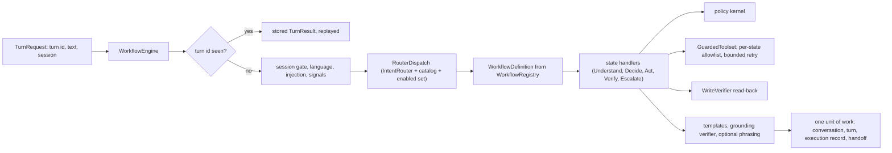
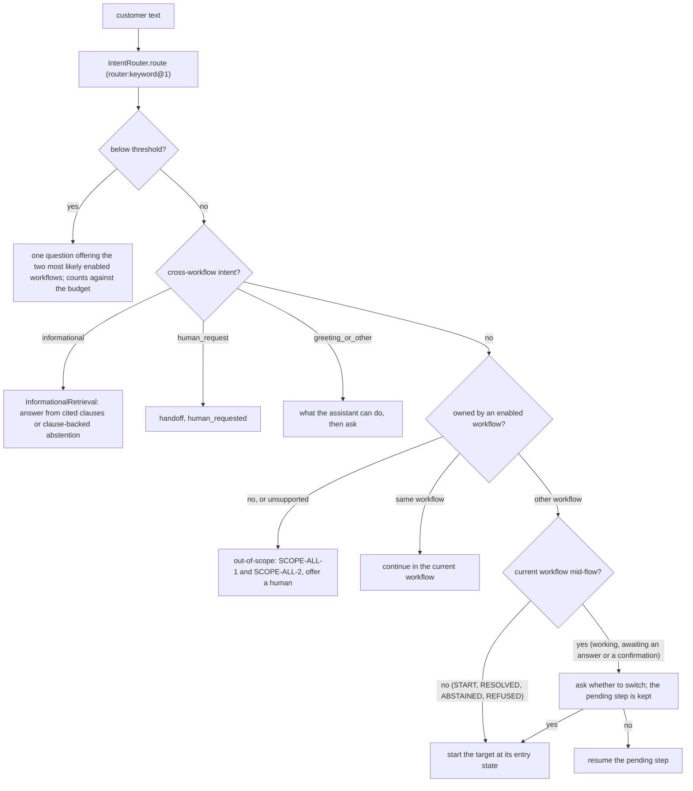
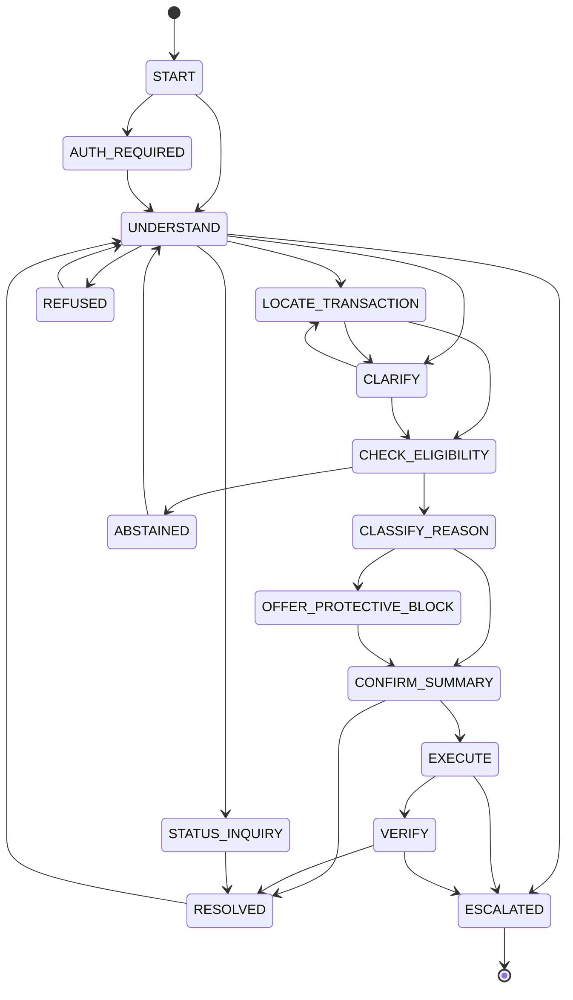
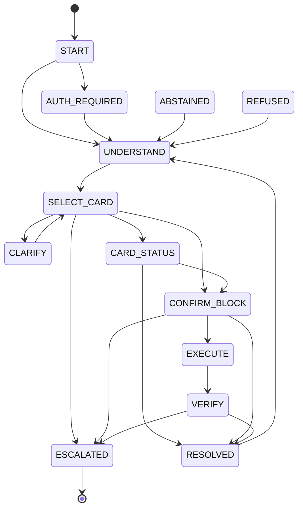

# Phase 09a plan: workflow engine, registry, router, dispute, card support, baseline B0

Status: the prompt asks for plan mode and a team walkthrough. The human delegated plan approval to the orchestrator, which pre-approved a plan that follows the prompt, CLAUDE.md, and the existing contracts and bindings. Every open question below is decided by the session under the orchestrator's pre-approval. The team walkthrough of the state tables and scenario tests 1 to 18 is recorded in `docs/PROGRESS.md` as a pending human action, not a blocker. Written against commit `ef33d02`, after phase 07. Session 09b (`account_inquiry`, `credit`) is out of scope; the engine is built so 09b adds only workflow definitions, bindings already exist, and tests.

## What already exists

| Piece | State |
|---|---|
| Catalog | `WORKFLOW_CATALOG`: intents per workflow, the canonical binding states, write actions, escalation-only intents |
| Policy | `PolicyServices.evaluate` (pure kernel), `explain`/`explain_decision`, `bindings.yaml` (binding states), `matrix.yaml` (every write needs confirmation and step-up) |
| Grounding | `BoundPolicyLookup.for_state`, `InformationalRetrieval.search` (informational intent only), `GroundingVerifier.verify` |
| Gateway | `LLMClient` fully decorated in the container; eight prompts; `FakeLLM`, `CassetteLLM`, `UnconfiguredLLMClient` (refuses every call when `LLM_PROVIDER=fake`) |
| Tools | `SessionToolset` (session-scoped reads and three idempotent writes), `WriteVerifier`, `ToolFailureInjector` |
| Contracts | `Conversation`/`WorkflowPosition` (opaque `data`), `Turn`, `TurnResult`, `AssistantResponse`, `ExecutionRecord` 1.1.0, `Handoff` 1.1.0 |
| Ports without adapters | `IntentRouter`, `TransactionResolver`, `LanguageDetector` (scripted fakes only) |

## Architecture

- `application/engine/`: `definition.py` (states, transitions, handlers, allowlists, policy states), `registry.py`, `router.py`, `engine.py`, `context.py`, `results.py`, `recorder.py` (execution record assembly), `tools.py` (the guarded toolset), `language.py`, `security.py` (injection and cross-customer detection), `signals.py`, `handoff.py`, `idempotency.py`, `render.py` and `templates/` (es, pt, en), `shared.py` (out-of-scope, informational, human request, greeting, pause and resume).
- `application/understanding/`: `amounts.py` (slang and amount normalization), `dates.py` (relative dates), `answers.py` (yes and no, option choice), `extraction.py` (gateway calls with deterministic fallbacks).
- `application/workflows/dispute/`, `application/workflows/card_support/`, `application/workflows/baseline/` (B0).
- `adapters/models/`: `keyword_router.py` (`router:keyword@1`), `rules_resolver.py` (`resolver:rules@1`), `lexical_language.py` (`language_detector:lexical@1`).
- `bootstrap/workflows.py`: `WorkflowSettings` (`WORKFLOW_*`), the registries (`proposed`, `baseline_b0`), and the engine in the container.

## Definition as data

`WorkflowDefinition(workflow, version, entry_state, states, transitions)`; each `StateSpec` carries `name`, `policy_state` (the canonical binding state it is evaluated and grounded in), `action_policy_states` (for EXECUTE and VERIFY, the binding state of each write), `handler`, `allowed_tools`, `kind` (`accepts_request`, `awaits_answer`, `working`, `terminal`), and `pausable` (a privileged step that pauses on session expiry). Bound clause ids per state come from `bindings.yaml` through `policy_state`, so there is one source of clause truth. `check_transition(a, b)` raises `WorkflowTransitionError` for anything not in the table; shared exits (ESCALATED, ABSTAINED, REFUSED, AUTH_REQUIRED) are added to every non-terminal state by the builder, so they are explicit in the table too.

The prompt's state names (UNDERSTAND, CLARIFY, EXECUTE, and so on) are engine states; `bindings.yaml`, `matrix.yaml`, and `WorkflowDescriptor.states` keep their canonical names unchanged. The mapping is in the tables below and is checked by the registry.

## Turn processing

1. `get_turn(turn_id)`: a completed turn returns its stored `TurnResult` with `replayed=True` (response from the turn, state and outcome from its execution record). A concurrent duplicate fails `append_turn` at commit with `DuplicateEntityError` and is replayed the same way.
2. Session gate: an expired or revoked session runs no handler. A `pausable` state (or any working state) moves to AUTH_REQUIRED with `resume_state` set to the last safe state (the confirmation state for a pending write); the response carries `session_expired` and `reauthentication_required`. On the next turn with a valid session in the same conversation, AUTH_REQUIRED resumes to `resume_state` and asks again; the confirmation is not carried across an expiry. Executed actions are in `data.executed` keyed by idempotency key, so a resumed EXECUTE never calls a write twice.
3. Language: detection per turn through `LanguageDetector`; the session keeps a preference (`Conversation.language`); the dialect comes from the verified country (`Locale.for_customer`). Mixed input is answered in the dominant language. Uncertain detection with no preference asks, in es and pt, which language to use, and keeps the original text to process after the answer.
4. Injection heuristics (es, pt, en) on the customer text add an `injection_detected` trust event; record text (merchant names) is checked too and recorded as a safety intervention only (decision 7).
5. Escalation signals: deterministic keyword detector (es, pt) merged with `detect_escalation_signals` through the gateway (OR); any LLM error leaves the deterministic result. Third-party admissions add a trust event and set `PrivacySignals.third_party_request`.
6. Router dispatch where the state accepts a request (or an awaited answer did not parse); then the handler chain, each transition validated, at most 12 steps per turn.
7. Response: deterministic template, grounding verifier (violations recorded), optional phrasing (setting, off by default) that must pass the verifier or the template is used.
8. One unit of work: conversation (position, language, status, version), the turn with its response, the execution record, and the handoff (validated against the handoff JSON Schema before it is stored).

Guarantees: idempotent by turn id; maximum 40 turns per conversation (then a handoff with `other`, detail `turn_limit_reached`); clarification budget from `ESC-ALL-1` (`clarification_budget: 2`), enforced by the kernel rule `ESC.clarification_exhausted` over `WorkflowPosition.clarifications_used`.

## Registry

`WorkflowRegistry(definitions, catalog, bound_lookup, policy, enabled)` validates at construction and raises `WorkflowRegistryError` (a `ConfigurationError`, so a startup error) when: an enabled workflow has no definition; a definition names a workflow outside the catalog; a definition's handled intents differ from the catalog's; a state's `policy_state` is not a canonical state of the workflow or is unbound for some country and language; a state allows `get_my_credit_profile` (engine only); a write tool is allowed in a state whose policy state the matrix does not allow for that action, or that the workflow may not perform. `WORKFLOW_ENABLED` (default `dispute,card_support` in 09a) lists the enabled workflows; intents of a disabled workflow go to the out-of-scope handler, which also implements the cut rule of CLAUDE.md section 1. Two registries are built: `proposed` and `baseline_b0`.

## Router design

- Before any workflow is chosen the conversation sits at a pseudo position `router@1` state `START` (not a workflow; never recorded as `workflow_before`). Router-level decisions are evaluated at the `START` binding of the first enabled workflow (all four `START` bindings are identical: common clauses plus `SCOPE-ALL-2`).
- A switch starts the target at its entry state with only verified facts carried over (for a card-to-dispute switch: the card the customer chose, as a candidate filter). The execution record of the switching turn sets `workflow_before`. An executed action is verified in the same turn it runs, so a new request never interrupts a verification.
- Out-of-scope requests are presented to the kernel with intent `unsupported`, so the decision names `SCOPE.supported_intent` and cites `SCOPE-ALL-2`.

## Dispute state table

Every non-terminal state also exits to ESCALATED, ABSTAINED, REFUSED, and AUTH_REQUIRED (shared exits, omitted from the diagram). Common clauses on every state: `SCOPE-ALL-1`, `AUTH-ALL-1`, `AUTH-ALL-2`, `PRV-ALL-1`, `PRV-ALL-2`, `ESC-ALL-1`, `ESC-ALL-3` (rules AUTH, PRV, SCOPE, and the common ESC triggers).

| State | Policy state | Ports | Extra rules | Extra clauses | Tools allowed | Exits |
|---|---|---|---|---|---|---|
| START | START | none | `SCOPE.supported_intent` | SCOPE-ALL-2 | none | UNDERSTAND, AUTH_REQUIRED |
| AUTH_REQUIRED | START | none | AUTH rules at the resume state | SCOPE-ALL-2 | none | resume state, UNDERSTAND |
| UNDERSTAND | START | IntentRouter, LLM (`extract_dispute_slots`, `detect_escalation_signals`) | common | SCOPE-ALL-2 | none | STATUS_INQUIRY, LOCATE_TRANSACTION, CLARIFY |
| STATUS_INQUIRY | ANSWER_CASE_STATUS | none | `DSP.case_within_sla` (new) | DSP-{c}-2, INF-ALL-1 | list_my_cases, get_case_status | RESOLVED, ESCALATED |
| LOCATE_TRANSACTION | LOCATE_TRANSACTION | TransactionResolver | `DSP.transaction_owned_by_session_customer` | DSP-ALL-5 | list_recent_transactions, get_transaction, get_product_status | CHECK_ELIGIBILITY, CLARIFY |
| CLARIFY | LOCATE_TRANSACTION | TransactionResolver | as above | DSP-ALL-5 | list_recent_transactions, get_transaction, get_product_status | CHECK_ELIGIBILITY, LOCATE_TRANSACTION, CLARIFY |
| CHECK_ELIGIBILITY | COLLECT_DETAILS | none | DSP ownership, window, status, not disputed, reason, required fields | DSP-ALL-5, DSP-{c}-1, DSP-ALL-1..4 | list_my_cases, get_transaction | CLASSIFY_REASON, ABSTAINED (deny, pending) |
| CLASSIFY_REASON | COLLECT_DETAILS | LLM slots (reason candidates) | as above | as above | none | OFFER_PROTECTIVE_BLOCK, CONFIRM_SUMMARY, CLASSIFY_REASON |
| OFFER_PROTECTIVE_BLOCK | OFFER_CARD_BLOCK | none | `CRD.card_owned`, `CRD.card_active`, `CRD.block_requires_step_up` | CRD-ALL-1, CRD-ALL-2 | get_product_status | CONFIRM_SUMMARY |
| CONFIRM_SUMMARY | CONFIRM_DISPUTE | none | all DSP rules, `DSP.amount_within_auto_limit` | + DSP-{c}-3, DSP-{c}-2 | none | EXECUTE, RESOLVED (declined), CONFIRM_SUMMARY |
| EXECUTE | CREATE_CASE; EXECUTE_BLOCK for the block | none | action rules with `confirmed_at`, step-up | + INF-ALL-1; CRD-ALL-1, CRD-ALL-2, INF-ALL-2 | create_dispute_case, block_card | VERIFY, EXECUTE (awaiting step-up) |
| VERIFY | CREATE_CASE; EXECUTE_BLOCK | none (WriteVerifier) | `ESC.verification_mismatch` | as EXECUTE | none (read-backs are verifications, recorded on the tool call) | RESOLVED, ESCALATED |
| RESOLVED | START | IntentRouter | common | SCOPE-ALL-2 | none | UNDERSTAND, switch |
| ESCALATED | ESCALATE | none | common | ESC-{c}-2 | none | terminal |
| ABSTAINED | START | IntentRouter | common | SCOPE-ALL-2 | none | UNDERSTAND, switch |
| REFUSED | START | IntentRouter | common | SCOPE-ALL-2 | none | UNDERSTAND, switch |

Confirmation and abstention matrix (dispute): opening a case needs the customer's yes at CONFIRM_SUMMARY and step-up at EXECUTE; the protective block needs consent at OFFER_PROTECTIVE_BLOCK, the same summary confirmation, and step-up; a declined block leaves the dispute unchanged. Deny (window closed, status not eligible, already disputed) abstains with the rendered clause; a pending transaction abstains (`DSP-ALL-1`); refund decisions, chargeback promises, and limit increases abstain with `SCOPE-ALL-2`; another customer's record is refused without disclosure (`PRV-ALL-1`); amount above the automatic limit, an unsupported reason, a legal mention, distress, repeat complaints, a high risk tier, tool failure after retries, a verification mismatch, an SLA breach, and an exhausted clarification budget escalate.

## Card support state table

| State | Policy state | Ports | Extra rules | Extra clauses | Tools allowed | Exits |
|---|---|---|---|---|---|---|
| START | START | none | `SCOPE.supported_intent` | SCOPE-ALL-2 | none | UNDERSTAND, AUTH_REQUIRED |
| AUTH_REQUIRED | START | none | AUTH rules at the resume state | SCOPE-ALL-2 | none | resume state |
| UNDERSTAND | START | IntentRouter, LLM (`extract_card_support_slots`, `detect_escalation_signals`) | common | SCOPE-ALL-2 | none | SELECT_CARD |
| SELECT_CARD | IDENTIFY_CARD | none | `CRD.card_owned`, `CRD.unblock_requires_human`, `CRD.replacement_requires_human` | CRD-ALL-1, CRD-ALL-3 | list_my_cards (new), get_product_status | CARD_STATUS, CONFIRM_BLOCK, CLARIFY, ESCALATED (card request) |
| CLARIFY | IDENTIFY_CARD | none | as above | as above | list_my_cards, get_product_status | SELECT_CARD |
| CARD_STATUS | ANSWER_CARD_STATUS | none | `CRD.card_owned` | CRD-ALL-1, CRD-ALL-3 | get_product_status, list_recent_transactions (declined only) | RESOLVED, CONFIRM_BLOCK, switch (asks) |
| CONFIRM_BLOCK | CONFIRM_BLOCK | none | `CRD.card_active`, `CRD.block_requires_step_up`, action rules | CRD-ALL-1, CRD-ALL-2 | get_product_status | EXECUTE, RESOLVED (declined), ESCALATED (replacement after the offer) |
| EXECUTE | EXECUTE_BLOCK | none | action rules with `confirmed_at`, step-up | CRD-ALL-1, CRD-ALL-2, INF-ALL-2 | block_card | VERIFY, EXECUTE (awaiting step-up) |
| VERIFY | EXECUTE_BLOCK | none (WriteVerifier) | `ESC.verification_mismatch` | as EXECUTE | none | RESOLVED, ESCALATED (then the replacement handoff when one was requested) |
| RESOLVED, ABSTAINED, REFUSED | START | IntentRouter | common | SCOPE-ALL-2 | none | UNDERSTAND, switch |
| ESCALATED | ESCALATE (card requests: CARD_REQUEST_HANDOFF for the policy basis) | none | common | ESC-{c}-2 (and CRD-ALL-3) | none | terminal |

Confirmation and abstention matrix (card support): a block needs the yes at CONFIRM_BLOCK and step-up at EXECUTE, with the block reason recorded in the tool arguments and the audit event; unblock and replacement requests are escalation-only (`card_unblock_requested`, `card_replacement_requested`, a `card_request` section, `CRD-ALL-3`); a lost or stolen card with a replacement request gets the protective block offer first, then the handoff whether the block is accepted or declined; an already blocked card abstains on a block request (`CRD.card_active`); "I did not make this purchase" moves to `dispute` through the router rules; status answers never interpret `response_code`.

## Understanding and normalization

- `extract_dispute_slots` and `extract_card_support_slots` through the gateway with `LlmCallContext(sensitive_terms=(first name,))`; any `LlmError` falls back to the deterministic extractor, and the call is recorded as `fallback`.
- Amounts: `lucas`/`luca` times 1,000, `palos`/`palo` and `millón`/`millones`/`milhão`/`milhões` times 1,000,000, `mil` and `k` times 1,000, `varos` and `pesos` are the unit; es and pt separators; a bare `$` resolves to the account currency (the currency of the customer's products, or none when they hold several). The deterministic amount wins over the model's plain number when the text contains a multiplier.
- Relative dates against the `Clock` in the customer's time zone: `hoy`/`hoje`, `ayer`/`ontem`, `anteayer`/`antier`/`anteontem`, `hace N días`/`há N dias`, weekday names with `pasado`/`passado(a)`, `la semana pasada`/`semana passada`, `el mes pasado`/`mês passado`, `el 7 de junio`, full dates, and `dd/mm`. A value like `03/04` gives two interpretations; the engine drops an interpretation in the future or outside the dispute window and asks when two remain.
- Yes and no for es and pt (including `dale`, `de una`, `claro`, `pode`, `beleza`, `nel`, `nada`); anything else is ambiguous and asked again against the budget.

## Execution records

One record per turn from `TurnRecorder`: workflow (and `workflow_before` after a switch), state before and after, the router's `IntentPrediction`, every `Decision` (rule ids, versions, clause refs, pack version), the union of clause refs, tool calls with redacted arguments (the tools' audit allowlist), attempts, latency, idempotency key, result summary and `Verification`, LLM calls (prompt ref, model id, tokens, cost, latency, status), models (router, resolver, language detector, retriever, LLM), prompts, the policy pack version, a latency breakdown by stage, tokens, cost, trace id, risk tier, trust events added, the grounding report, safety interventions (codes such as `injection_detected`, `record_text_injection_flagged`, `session_expired`, `llm_fallback`), the handoff ref, and case refs. Contract change: `execution_record` 1.2.0 adds `retrieval` (retriever, decision, threshold, top score, citations) and the `list_my_cards` tool name; `scenario` 1.2.0 for the tool name. No record stores text generated as reasoning.

## Injection handling

Customer text, record text, and retrieved text are data: prompts wrap untrusted variables (phase 08), templates quote record text through a neutral placeholder during grounding verification so it is never read as a claim, model output never names a tool or a customer id (tools come from the per-state allowlist in the definition, enforced by `GuardedToolset`, which records `rejected_by_allowlist` and raises), and tool arguments are typed models with identifiers taken from records the session already read. The heuristic detector (`injection:heuristic@1`) covers instructions to ignore rules, role changes, prompt disclosure, delimiter forgery, tool or function names, and requests to act for another customer, in es, pt, and en; an optional classifier port is left for phase 10 and 14.

## Baseline B0

`application/workflows/baseline/`: separate definitions for `dispute` and `card_support` behind a fixed Spanish keyword menu (`1` reclamar un cargo, `2` estado de una reclamación, `3` estado de tarjeta, `4` bloquear tarjeta, `5` hablar con una persona), keyword intent (`router:keyword@1`), the rule resolver's top candidate or a fixed numbered list, the same tools, kernel, verifier, and handoff builder, no language model, no protective block offer, and Portuguese only through a handful of fixed strings. Registered as the `baseline_b0` registry so phase 14 can run it; B1 stays in `evals/`.

## Tests

Unit (in-memory adapters, `FakeLLM`, `FixedClock`, sequential ids): every state handler with fakes; the transition tables (every pair not in a table raises); registry validation (missing definition, unbound policy state, engine-only tool, write tool outside the matrix, intents mismatch); router dispatch, the switch confirmation, the uncertain-router question, and the out-of-scope handler; slang and amount tables; the relative date table for es and pt; yes and no for es and pt; idempotency key derivation; handoff building from sample facts (validated against the committed schema); template golden tests in es and pt; the keyword router, rule resolver, and lexical detector tables; the injection detector table; the guarded toolset (allowlist, bounded retry only for transient errors); pause and resume; the language question; a Hypothesis property: for any sequence of fake tool outcomes, a success message or a verified status exists only when a positive verification record exists for that action.

Scenario-style integration tests (in process, PostgreSQL through testcontainers, the container with `FakeLLM` injected, scenario data seeded through `PostgresSeeder`). Language variants are added so each workflow's normal, ambiguous or unsupported, and escalation paths appear in es and in pt:

| # | Scenario | Path | Language |
|---|---|---|---|
| 1 | Normal dispute: case created, verified, case id and SLA reported (LLM extraction scripted) | normal | es-MX |
| 1b | Normal dispute through the deterministic fallback | normal | pt-BR |
| 2 | Voseo and `lucas`: resolves 15,000 ARS | normal | es-AR |
| 3 | Two similar transactions: options, choice, case resolved | ambiguous | pt-BR |
| 3b | Ambiguous `03/04` date: asked, then resolved | ambiguous | es-CO |
| 4 | Status inquiry for the seeded open case | normal | es-CO |
| 5 | Limit increase: abstained with `SCOPE-ALL-2` | unsupported | es-MX and pt-BR |
| 6 | Regulator mention: escalated, schema-valid handoff | escalation | es-MX |
| 6b | Human request mid-dispute: escalated | escalation | pt-BR |
| 7 | Session expires between confirmation and execution: re-authentication, resume, no duplicate case | normal | es-MX |
| 8 | Another customer's transaction id: refused, not found, trust event | refusal | es-MX |
| 9 | Tool timeout after bounded retries: escalated, no false success | escalation | es-MX |
| 10 | Partial write: escalated with `verification_mismatch` | escalation | pt-BR |
| 11 | Injection text in `merchant_name`: data only, no tool or state change | normal | es-MX |
| 12 | Protective block declined: dispute continues without the block | normal | es-CO |
| 13 | Card status with two cards: options, then status with expiry | ambiguous | pt-BR |
| 13b | Card status with one card | normal | es-AR |
| 14 | Lost card: block with step-up, verified, reason recorded | normal | es-CO |
| 14b | Stolen card block | normal | pt-BR |
| 15 | Unblock request: escalated with `card_unblock_requested` | escalation | es-MX |
| 16 | Replacement for a stolen card: block offered first, then `card_replacement_requested` | escalation | pt-BR |
| 17 | Card status, then an unrecognized charge: asks, moves to `dispute`, `workflow_before` recorded | switch | es-MX |
| 18 | Investment recommendation: `SCOPE` abstention with a human offered | unsupported | es and pt |
| 19 | Replayed turn id: same result, no second write | idempotency | es-MX |
| 20 | Baseline B0 runs a dispute and a card block through the menu | baseline | es-MX |

## Files to create or change

| Area | Files |
|---|---|
| Domain | `errors.py` (`WorkflowTransitionError`, `WorkflowRegistryError`, `ToolNotAllowedError`); `actions.py` (`ToolName.LIST_MY_CARDS`); `execution_record.py` (1.2.0: `RetrievalRecord`, `retrieval`) |
| Policy | `facts.py` (`DisputeFacts.case_sla_breached`), `rules/dispute.py` (`DSP.case_within_sla`), `policies/clauses/dsp/DSP-{MX,CO,AR}-2.*` (version 2, bound rule and one sentence), `versions.lock.yaml`, catalog page, golden texts |
| Application | `engine/`, `understanding/`, `workflows/{dispute,card_support,baseline}/`, `tools/reads.py` (`list_my_cards`), `tools/banking.py`, `tools/failure_injection.py`, `grounding/bound.py` (`covers`) |
| Adapters | `adapters/models/` (keyword router, rules resolver, lexical language detector) |
| Bootstrap | `settings.py` (`WorkflowSettings`), `bootstrap/workflows.py`, `container.py`, `.env.example` |
| Contracts | `scripts/generate_contracts.py` (1.2.0 for execution_record and scenario), `contracts/schemas/*`, `contracts/README.md`, `evals` scenario model version |
| Packaging | `jsonschema` moves to the `bank-agent` runtime dependencies |
| Docs | `docs/workflows/dispute-intake.md`, `card-support.md`, `workflow-router.md`, `handoff.md`, `execution-records.md`; application README; ADR 0014, ADR 0024; `docs/security/prompt-injection.md`; indexes; BACKLOG; PROGRESS |

## Risks

- Size: four large pieces in one session. Mitigation: small files, commit per increment, the engine first with fakes, scenario tests last.
- The verifier is lexical; templates with record text could trip it. Mitigation: record text is masked for verification and every template has a golden test that also runs the verifier.
- `LLM_PROVIDER=fake` refuses every call, so the default runtime uses the deterministic fallbacks; LLM paths are tested with `FakeLLM` scripts only (no live calls).
- The data has no Brazilian customers; Portuguese paths use MX, CO, and AR personas with their own currencies.
- Contract bump (execution record and scenario 1.2.0) touches evaluation code; the golden 1.0.0 documents must still validate.

## Decisions on open questions (decided by the session under the orchestrator's pre-approval)

1. **Engine states versus binding states.** Engine states follow the prompt; each maps to one canonical binding state (`policy_state`), plus a per-action binding state for EXECUTE and VERIFY. `bindings.yaml` and `matrix.yaml` stay unchanged, so clause text and rules are not duplicated. The registry checks the mapping at startup.
2. **Language detector.** `lingua-language-detector` 2.2.0 wheels are about 170 MB, far above the 50 MB rule, and would enter the API image; it needs the human's approval. The engine ships an in-house deterministic lexical detector (`language_detector:lexical@1`: function words and orthography for es, pt, en, with an uncertainty margin) behind the port; the lingua adapter is a pending human decision and a BACKLOG row.
3. **Listing cards.** No tool lists a customer's cards (`list_my_balances` skips products without a balance), so a read tool `list_my_cards` is added. `ToolName` gains a value, so `execution_record` and `scenario` move to 1.2.0 (a new enum value is a minor change).
4. **Retrieval in the record.** `ExecutionRecord.retrieval` (added in 1.2.0) stores the retriever, the decision, the threshold, the top score, and the citations, as the BACKLOG row asks.
5. **SLA breach.** A new rule `DSP.case_within_sla` bound to `DSP-{MX,CO,AR}-2` (version 2 with one added sentence) escalates when the case asked about is open past its SLA. The engine computes `case_sla_breached` from the `Clock`, because cases are live records (not organizer data), so the data as-of date does not apply.
6. **Handoff schema validation.** `jsonschema` (MIT, a few MB, already locked) becomes a runtime dependency; the engine validates every handoff against the schema generated from the model by the same call the contracts script uses, and a test checks that it equals `contracts/schemas/handoff.v1.json`.
7. **Record-text injection.** A merchant name with instructions is recorded as a safety intervention, not a customer trust event: the customer did not write it, and a trust event would raise the risk tier and change the flow, which scenario 11 forbids.
8. **Router position.** Before a workflow is chosen the conversation is at `router@1`/`START`; moving from there is dispatch, not a switch.
9. **Confirmation and expiry.** A confirmation is not carried across a session expiry; after re-authentication the summary is shown again. The idempotency key is derived from the conversation, the target, and the action, so a repeated confirmation reuses it and a write is never duplicated.
10. **Protective block order.** In a dispute EXECUTE runs the block before the case (the block limits further loss); each write is verified on its own and a failure of one escalates with the other's verified state.
11. **Declined confirmation.** Nothing is written; the state is RESOLVED with a `nothing_recorded` template and the router accepts a new request.
12. **Phrasing and summaries.** `WORKFLOW_LLM_PHRASING` and `WORKFLOW_LLM_HANDOFF_SUMMARY` default to off; when on, output must pass the grounding verifier (and, for summaries, cite only supplied fact ids) or the template is used.
13. **Turn limit.** 40 turns per conversation, then a handoff with `other` and detail `turn_limit_reached`.
14. **English input.** Customer conversations are es or pt; English or uncertain text with no preference gets the language question in both languages.
15. **Handoff priority.** `high` for distress, legal mention, or a high risk tier, `medium` otherwise; the SLA uses `priority_handoff_sla_hours` for distress and `handoff_sla_hours` otherwise (`ESC-<country>-2`), and card requests use `CRD-ALL-3`.
16. **Router threshold.** The keyword router's threshold is 0.6; the two offered workflows are the two highest-scoring enabled workflows among the candidates.
