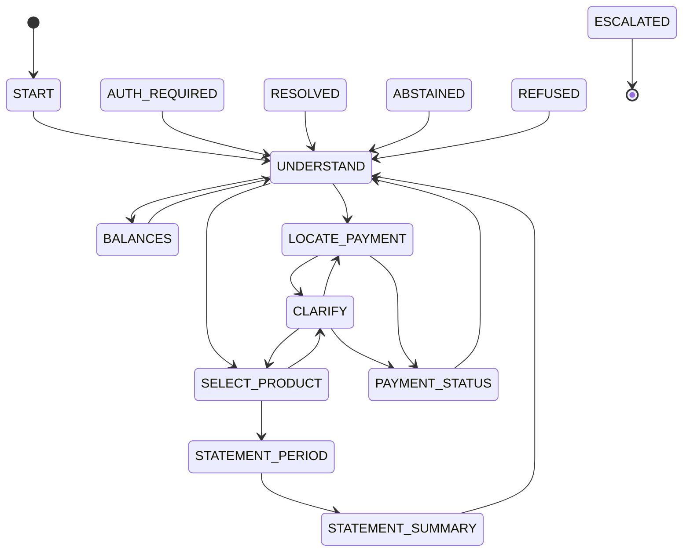
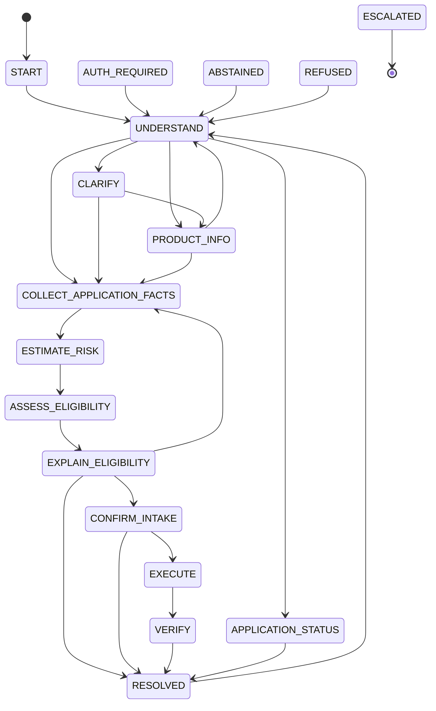
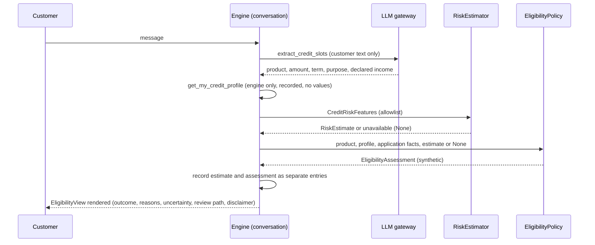

# Phase 09b plan: account inquiry, credit, the score-band risk baseline, and their B0 variants

Status: the prompt asks for plan mode and a team walkthrough. The human delegated plan approval to the orchestrator, which pre-approved a plan that follows the prompt, CLAUDE.md, the 09a engine design, and the existing contracts. Every open question below is decided by the session under the orchestrator's pre-approval. The 09a walkthrough (pending human action 21) is not a blocker; the 09b walkthrough (state tables below and scenarios 19 to 29) becomes a pending human action. Written against commit `57774d6`, after session 09a.

## Scope

Tasks 20 to 26 of `kit/prompts/09-workflow-engine.md`, and tasks 27 to 30 applied to the two new workflows: `account_inquiry` and `credit` as `WorkflowDefinition`s on the 09a engine, the `risk_estimator:score_band@1` baseline behind the `RiskEstimator` port, B0 definitions for both, scenario tests 19 to 29 (plus language variants) on the in-memory adapters and PostgreSQL, and all four workflows enabled by default (`WORKFLOW_ENABLED`).

## Engine changes (only where a new capability is needed)

| Change | Why it is needed |
|---|---|
| `EngineServices.credit` (`CreditPorts`: `CreditProductCatalog`, `EligibilityPolicy`, `RiskEstimator`) | The engine had no credit ports; the credit states call them directly, never through a tool allowlist |
| `ToolProvider.engine_only(context)` and `GuardedToolset.engine_credit_profile` | `get_my_credit_profile` is engine only (the registry refuses it on any allowlist); the engine reads it inside `engine_check` so the call is still recorded, with no values |
| Typed guarded calls for the account and credit tools (`engine/tool_calls.py`) | 09a wrapped only the dispute and card tools |
| `TurnRecorder.risk_estimates` and `eligibility_assessments`, passed by `build_record` | Task 29: separate record entries (fields exist since contract 1.1.0) |
| `evaluate(..., account=, credit=)`, `PlannedWrite.credit`, a denial template per write | The kernel needs `AccountFacts` and `CreditFacts` (BACKLOG row) |
| `HandoffPlan.credit_review`, `escalate(..., credit_review=)`, escalation codes for `ESC.credit_review_required` and `ESC.eligibility_contested` | Credit handoffs carry a `credit_review` section (handoff contract 1.1.0) |
| `Reply.credit` (grounding evidence and phrasing fields) and `Reply.cite` (citations whose text is already in the reply) | The verifier needs the assessment, catalog entry, profile, estimate, and declared income as evidence (profile and estimate only as forbidden figures); `phrase_response` gets only the outcome code, rendered reasons, and disclaimer (BACKLOG rows) |
| `WorkflowDefinition.unsupported` hook and an in-domain abstention before the generic out-of-scope answer | A transfer or a limit increase is unsupported *inside* a workflow and must be abstained with that workflow's clause (`ACC-ALL-3`, `CRE-ALL-3`), not only with `SCOPE` |
| Application ids (`app-...`) in `referenced_ids` and the reference check | A named application of another customer must be refused like any other record |
| Over-indebtedness keywords in the signal detector | Task 26: distress and over-indebtedness feed `ESC.distress_signal` |

## Account inquiry state table

Read only: no EXECUTE state and no write tool on any allowlist (a registry test asserts it). Shared exits apply to every non-terminal state.

| State | Binding | Ports | Rules beyond the common ones | Clauses beyond the common ones | Tools | Exits |
|---|---|---|---|---|---|---|
| START | START | none | `SCOPE.supported_intent` | SCOPE-ALL-2 | none | UNDERSTAND |
| AUTH_REQUIRED | START | none | AUTH at the resume state | SCOPE-ALL-2 | none | resume state |
| UNDERSTAND | START | IntentRouter, LLM (`extract_account_inquiry_slots`) | none | SCOPE-ALL-2 | none | BALANCES, LOCATE_PAYMENT, SELECT_PRODUCT, ABSTAINED |
| SELECT_PRODUCT | IDENTIFY_PRODUCT | none | `ACC.product_owned_by_session_customer` (via ANSWER_STATEMENT) | ACC-ALL-3 | list_my_balances, list_my_cards | CLARIFY, STATEMENT_PERIOD |
| CLARIFY | IDENTIFY_PRODUCT | TransactionResolver (payment answers) | clarification budget | ACC-ALL-3 | list_my_balances, list_my_cards, get_transaction | SELECT_PRODUCT, LOCATE_PAYMENT, PAYMENT_STATUS |
| BALANCES | ANSWER_BALANCE | none | `ACC.product_owned_by_session_customer`, `ACC.as_of_disclosed` | ACC-ALL-1, ACC-ALL-3 | list_my_balances | UNDERSTAND, ESCALATED (balance contested) |
| LOCATE_PAYMENT | ANSWER_PAYMENT_STATUS | TransactionResolver | clarification budget | ACC-ALL-1, ACC-ALL-3 | list_recent_transactions (payments and transfers), list_my_cards | PAYMENT_STATUS, CLARIFY |
| PAYMENT_STATUS | ANSWER_PAYMENT_STATUS | none | `ACC.product_owned_by_session_customer`, `ACC.as_of_disclosed` | ACC-ALL-1, ACC-ALL-3 | get_payment_status, get_transaction | UNDERSTAND, switch to `dispute` |
| STATEMENT_PERIOD | ANSWER_STATEMENT | none | `ACC.statement_period_within_limit` | ACC-ALL-1, ACC-ALL-2, ACC-ALL-3 | none | STATEMENT_SUMMARY, STATEMENT_PERIOD (asks) |
| STATEMENT_SUMMARY | ANSWER_STATEMENT | none | all ACC rules | as above | get_statement_summary | UNDERSTAND |
| RESOLVED, ABSTAINED, REFUSED | START | IntentRouter | common | SCOPE-ALL-2 | none | UNDERSTAND, switch |
| ESCALATED | ESCALATE | HandoffBuilder | common | ESC-{c}-2 | none | terminal |

- Every balance answer states the as-of date of the balance record (`BalanceView.as_of`); payment and statement answers state the data as-of date from policy settings (`POLICY_DATA_AS_OF`, 2026-06-17). `AccountFacts.answer_as_of` carries the stated instant, so `ACC.as_of_disclosed` passes only when it is shown. Balance facts go to the verifier as `balance`, `available_credit`, and `as_of` facts.
- LOCATE_PAYMENT ranks the customer's own payments and transfers (`list_recent_transactions` with the type filter) through `TransactionResolver`; clear winner, two or three masked options, or a request for detail, with the same budget as LOCATE_TRANSACTION. PAYMENT_STATUS answers from `get_payment_status`.
- STATEMENT_PERIOD resolves `el mes pasado`, `mês passado`, a month name, `esta semana`, and the task 8 table; an unresolved period is asked; a period longer than `ACC-ALL-2` (92 days) gets the kernel's clarify reason. The summary shows totals per currency, counts of unclassified and unsettled operations, and never an opening or closing balance.
- Unsupported (transfer, bill payment, due date change, due dates the data does not hold, certificates): ABSTAINED with `ACC-ALL-3` and `SCOPE-ALL-2` and an offer of a human. A payment that looks unauthorized is a `dispute_new` intent: the router asks before switching.
- A customer who insists a balance is wrong is escalated (`unsupported_needs_human`, detail `balance_contested`) with the balance and its as-of date as verified facts.

## Credit state table

| State | Binding | Ports | Rules beyond the common ones | Clauses beyond the common ones | Tools | Exits |
|---|---|---|---|---|---|---|
| START, AUTH_REQUIRED | START | none | `SCOPE.supported_intent` | SCOPE-ALL-2 | none | UNDERSTAND, resume |
| UNDERSTAND | START | IntentRouter, LLM (`extract_credit_slots`) | none | SCOPE-ALL-2 | none | PRODUCT_INFO, COLLECT_APPLICATION_FACTS, APPLICATION_STATUS, CLARIFY, ABSTAINED |
| PRODUCT_INFO | PRODUCT_DETAIL (LIST_PRODUCTS for the list) | CreditProductCatalog (through tools) | `CRE.product_in_catalog`, `CRE.offered_in_jurisdiction`, `CRE.disclaimer_present` | CRE-ALL-1, CRE-ALL-2, CRE-{c}-1, CRE-ALL-3 | list_credit_products, get_credit_product | UNDERSTAND, COLLECT_APPLICATION_FACTS, ABSTAINED (mortgage eligibility) |
| CLARIFY | COLLECT_APPLICATION | none | clarification budget | CRE-ALL-1, CRE-ALL-2, ELG-ALL-1 | list_credit_products | PRODUCT_INFO, COLLECT_APPLICATION_FACTS |
| COLLECT_APPLICATION_FACTS | COLLECT_APPLICATION | none | CRE catalog rules | as CLARIFY | get_credit_product | ESTIMATE_RISK, asks (amount, term) |
| ESTIMATE_RISK | COLLECT_APPLICATION | RiskEstimator (engine only), profile read (engine only) | none | as CLARIFY | none on the allowlist | ASSESS_ELIGIBILITY |
| ASSESS_ELIGIBILITY | PRESENT_ELIGIBILITY | EligibilityPolicy (engine only) | ELG rules inside the service; CRE rules and `ESC.credit_review_required` in the kernel | CRE-ALL-1, CRE-ALL-2, ELG-ALL-1..3, ELG-{c}-1.x, ESC-ALL-4 | get_credit_product | EXPLAIN_ELIGIBILITY |
| EXPLAIN_ELIGIBILITY | PRESENT_ELIGIBILITY | phase 06 renderer | `ESC.eligibility_contested`, `ESC.credit_review_required` | as above | none | CONFIRM_INTAKE, COLLECT_APPLICATION_FACTS, RESOLVED, ESCALATED |
| CONFIRM_INTAKE | CONFIRM_APPLICATION | none | action rules, step-up | CRE-ALL-1, CRE-ALL-2, INF-ALL-3 | get_credit_product | EXECUTE, RESOLVED |
| EXECUTE | SUBMIT_APPLICATION | none | action rules with `confirmed_at`, `AUTH.step_up_valid` | as CONFIRM_INTAKE | submit_credit_application | VERIFY, EXECUTE (step-up) |
| VERIFY | SUBMIT_APPLICATION | WriteVerifier | `ESC.verification_mismatch` | as above | get_credit_application_status | RESOLVED, ESCALATED |
| APPLICATION_STATUS | ANSWER_APPLICATION_STATUS | none | common | CRE-ALL-1, INF-ALL-3 | get_credit_application_status | RESOLVED |
| RESOLVED, ABSTAINED, REFUSED | START | IntentRouter | common | SCOPE-ALL-2 | none | UNDERSTAND, switch |
| ESCALATED | ESCALATE | HandoffBuilder | common, `ESC.credit_review_required`, `ESC.eligibility_contested` | ESC-{c}-2, ESC-ALL-4 | none | terminal |

### Credit separation, enforced by the engine

- The model sees customer text only (and, with phrasing on, the rendered template text plus the outcome code, rendered reasons, and disclaimer). The profile and the estimate are never prompt variables; a unit test drives every credit path with a recording `FakeLLM` and asserts that no call carries a profile or estimate value.
- ESTIMATE_RISK builds `CreditRiskFeatures` from the profile and the application facts and calls the port; `RiskEstimatorUnavailableError` yields `None` (never a default), recorded as the safety intervention `risk_estimate_unavailable`, and the service then returns `review_required` with `risk_estimate_unavailable`.
- The estimate and the assessment go into `ExecutionRecord.risk_estimates` (internal) and `eligibility_assessments` as separate entries. The flow keeps the assessment (no profile or estimate values); a later handoff re-derives the estimate deterministically for `CreditReview.risk` (agents only).
- Every eligibility answer is the phase 06 rendering of `EligibilityView` (outcome, reasons with citations, uncertainty, review path, `CRE-ALL-1`); the verifier receives the assessment (outcome claims must match) and the profile, estimate, and declared income as forbidden figures. The customer view never contains the estimate.
- Mortgages are information only: an eligibility question about a mortgage is answered from the catalog with `CRE-ALL-2` and `ELG-ALL-3` and an offer of a person; the service is not called for it.
- Intake only after an explanation and only for `indicatively_eligible` (yes at EXPLAIN) or `review_required` (explicit request to record it); CONFIRM_INTAKE shows product, amount, term, and that a person reviews and nothing is decided here; EXECUTE (step-up, idempotency key from the conversation, the assessment, the product, and the action) and VERIFY read back. `review_required` and `insufficient_data` offer a handoff (`credit_review_required`, `credit_review` section); contesting the result hands off with `eligibility_contested`.
- Unsupported inside credit: limit increase, restructuring or refinancing, disbursement, and a request for a decision now abstain with `CRE-ALL-3` (a decision request also cites `CRE-ALL-1` and offers the review path). Distress and over-indebtedness escalate through `ESC.distress_signal`.

## Risk estimator baseline `risk_estimator:score_band@1`

Deterministic bands from the credit score only, with wide intervals, `calibrated: false`, labeled a baseline (`label_definition: score_band_baseline_prior`). Transition bands straddle the synthetic cut points (`ELG-ALL-2`: 0.20 and 0.35, margin 0.01), so the service returns `review_required` near a cut.

| Score | Band | Probability | Interval |
|---|---|---|---|
| 740 to 850 | low | 0.06 | 0.02 to 0.15 |
| 680 to 739 | low | 0.15 | 0.08 to 0.26 (straddles 0.20) |
| 640 to 679 | medium | 0.27 | 0.22 to 0.33 |
| 600 to 639 | medium | 0.33 | 0.25 to 0.42 (straddles 0.35) |
| 300 to 599 | high | 0.50 | 0.38 to 0.70 |
| missing | unknown (`missing_features`) | 0.50 | 0.00 to 1.00 |

The eligibility service treats `unknown` as no estimate. Phase 10 replaces the baseline with the learned estimator behind the same port.

## Baseline B0

- `account_inquiry` B0: the proposed table with UNDERSTAND replaced by keyword slots only (no model) and LOCATE_PAYMENT by the rule resolver's winner or a numbered list, as the dispute B0.
- `credit` B0: START, UNDERSTAND, PRODUCT_INFO, and the end states only; UNDERSTAND shows the catalog for product questions and hands every eligibility, application, or status question to a person (`unsupported_needs_human`, detail `baseline_b0_credit`). No estimator and no eligibility service.
- The fixed Spanish menu gains `saldo`, `estado de un pago`, `estado de cuenta`, and `productos de crédito`; `MenuRouter` maps them.

## Tests

Unit: the account and credit transition tables (every illegal pair raises), no write tool in account_inquiry, the registry with all four workflows, the score-band table and its unavailable path, the risk features builder, the period parser (es, pt, `FixedClock`), the credit slot fallback (amount, term, income, purpose, product), yes/no answers in the new states, idempotency key derivation for intakes, handoff building with a `credit_review` section, template goldens in es and pt (every new template renders and passes the verifier), the in-domain unsupported hook, "no prompt ever receives profile or estimate values", "estimator unavailable gives `review_required`, never `indicatively_eligible`", and a Hypothesis property over profile gaps and estimator outcomes (no approval wording in any credit reply; no `indicatively_eligible` without a complete profile and an available estimate).

Scenario-style integration tests (in process, the in-memory adapters and PostgreSQL through testcontainers, `FakeLLM` or the deterministic fallbacks), numbered as in the prompt with language variants:

| # | Scenario | Path | Language |
|---|---|---|---|
| 19 | Balance inquiry: balances with the as-of date, in the account currency | normal | es-AR |
| 19b | Balance inquiry with the model extraction scripted | normal | pt-BR |
| 20 | Payment status with two similar transfers: options, choice, status | ambiguous | pt-BR |
| 21 | Statement summary for "el mes pasado": totals per currency, no balances | normal | es-MX |
| 21b | Statement period over the ACC limit: asked for a shorter period, then answered | ambiguous | es-MX |
| 22 | Request to make a transfer: abstained with `ACC-ALL-3` and a human offered | unsupported | pt-BR |
| 22b | Request to pay a card bill: abstained with `ACC-ALL-3` | unsupported | es-CO |
| 23 | The customer insists a balance is wrong: escalated with the balance and as-of date as facts | escalation | es-CO |
| 23b | Balance contested in Portuguese | escalation | pt-BR |
| 24 | Credit product information: catalog answer with the disclaimer, no eligibility | normal | es-CO |
| 24b | Credit product list | normal | pt-BR |
| 25 | Complete profile: `indicatively_eligible` with reasons, uncertainty, disclaimer; intake confirmed, submitted, verified | normal | pt-BR |
| 26 | No income on file: `insufficient_data`, review path, handoff with `credit_review` on acceptance | escalation | es-MX |
| 26b | Income declared after `insufficient_data`: assessed again | normal | es-MX |
| 27 | Borderline interval: `review_required`, estimate and assessment as separate record entries, handoff on acceptance | escalation | pt-BR |
| 28 | "Just approve it": no approval wording, the disclaimer, the review path | unsupported | es-AR |
| 28b | Limit increase inside credit: `CRE-ALL-3` | unsupported | pt-BR |
| 28c | Mortgage eligibility: information only, `ELG-ALL-3`, a person offered | unsupported | es-MX |
| 29 | The risk estimator failing: `review_required`, no estimate recorded, no false eligibility | escalation | es-CO |
| 30b | B0 runs a balance inquiry and hands a credit eligibility question to a person | baseline | es-MX |

Every 09a scenario keeps passing with all four workflows enabled (the harness default becomes all four).

## Files to create or change

| Area | Files |
|---|---|
| Adapters | `adapters/models/score_band_risk.py` |
| Application, engine | `context.py`, `definition.py`, `decide.py`, `recorder.py`, `records.py`, `reply.py`, `render.py`, `phrase.py`, `shared.py`, `handoff.py`, `flow.py`, `security.py`, `signals.py`, `gate.py`, `tools.py`, new `tool_calls.py`, `templates/{labels,account,credit}.py` |
| Application, workflows | `workflows/account_inquiry/` (data, understand, select, balances, payments, statement, definition), `workflows/credit/` (data, understand, info, collect, assessment, explain, intake, status, definition), `workflows/shared/writes.py`, `workflows/baseline/` (account and credit B0, menu) |
| Understanding | `understanding/extraction.py` (account and credit slots), `understanding/periods.py` |
| Bootstrap | `bootstrap/settings.py` (`WORKFLOW_ENABLED` all four, `WORKFLOW_RISK_ESTIMATOR`), `bootstrap/workflows.py`, `.env.example` |
| Tests | fixture data (balances, transfers, May statement lines, credit profiles, a second Portuguese persona), harness, unit and integration tests |
| Docs | `docs/workflows/account-inquiry.md`, `docs/workflows/credit-information.md`, `workflow-router.md`, `handoff.md`, `execution-records.md`, `docs/architecture/credit-separation.md`, application README, BACKLOG, PROGRESS |

## Risks

- The lexical verifier may reject templates with figures (totals, rates, balances). Mitigation: goldens run the verifier for every template; balance and total facts are passed with their kinds.
- Approval stems are refused even negated (`aprob`, `otorg`, `conced`, `autorizad`, `aprov`, `outorg`, `approv`, `grant`): credit templates are written without them and a test scans every credit and common template.
- Enabling four workflows changes routing around the 09a scenarios (catalog order, the uncertain-router question). Mitigation: run every 09a test with all four enabled and fix causes, not tests.
- The keyword router is a baseline; routing phrases for balances, payments, statements, and credit are extended and tested, and phase 10 replaces it.

## Decisions on open questions (decided by the session under the orchestrator's pre-approval)

1. **As-of date.** Balances state the as-of instant of the balance record; payments and statements state the data as-of date from policy settings (2026-06-17). Fixture balances are dated 2026-06-17, so both agree in the scenarios.
2. **In-domain unsupported requests.** A definition may declare an `unsupported` recognizer; the engine checks it before the generic out-of-scope answer (current workflow first, then the enabled ones). Outside a pending step the conversation moves to that workflow's ABSTAINED state; mid-flow it answers without leaving the pending step. The decision still names `SCOPE.supported_intent` and the reply cites the workflow clause and `SCOPE-ALL-2`.
3. **Payment ranking.** The resolver ranks `Transaction`s, so LOCATE_PAYMENT reads payments and transfers with `list_recent_transactions` (type filter) within the `ACC-ALL-2` window before the data as-of date; PAYMENT_STATUS answers from `get_payment_status`.
4. **Card term.** A credit card has no term; the application records one month (the billing cycle, the catalog minimum for every card) and the confirmation shows no term for cards.
5. **Purpose.** Mapped deterministically from the customer's words to catalog codes (`debt_consolidation`, `home_improvement`, `education`), otherwise `general_purpose`; shown in the confirmation before anything is recorded.
6. **Risk features.** `monthly_income_usd` stays unset (no exchange rates in the data); `requested_amount_to_income` is computed in the product currency. Normalization to USD is a BACKLOG row for phase 10.
7. **Estimate persistence.** The estimate is not kept in the conversation data; a later handoff re-runs the deterministic estimator for `CreditReview.risk` and records it in that turn.
8. **Review offers.** `review_required` offers a handoff (yes) and records an intake only on an explicit request; `insufficient_data` offers the handoff or new information (declared income); `not_eligible` offers a person (`human_requested` with a `credit_review` section); contesting any result hands off with `eligibility_contested`.
9. **Application status.** No tool lists a customer's applications; status comes from an application verified in this conversation or an `app-` id named in the text (checked for ownership); otherwise the reply says how to ask and offers a person. A list tool would need a contract bump (BACKLOG).
10. **Harness default.** Scenario tests build the harness with all four workflows, the production default.
11. **Mortgage eligibility.** Information only: no call to the eligibility service, an abstention citing `CRE-ALL-2` and `ELG-ALL-3` with a person offered.
