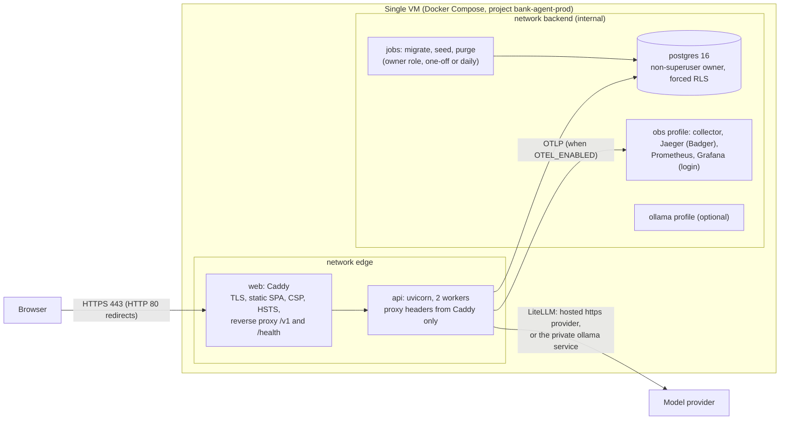

# Phase 16 plan: security hardening and deployment

The phase prompt asks for plan mode (present the deployment topology and the hardening checklist, then wait for approval). The human delegated that approval to the orchestrator, who pre-approved this plan. Every open question below is therefore decided by the session under the orchestrator's pre-approval, with its reasoning. The session runs in a git worktree based on the latest `main`, so the pull is skipped; the orchestrator merges the branch.

Human decisions given to the session:

- **Hosting target: undecided.** The production stack is built and fully tested locally; the deployment guide is host-neutral, with concrete sections for AWS Lightsail (recommended), EC2, and an Azure VM. The session never provisions cloud resources, pushes images, or writes cloud credentials anywhere.
- **Model.** The production stack is tested end to end with the local Ollama model (`qwen2.5:7b-instruct`) through LiteLLM; switching to a hosted provider (OpenAI or Anthropic through LiteLLM, an API key, an https base) is a settings-only change. The budget guard stays on. An optional `ollama` compose profile is documented with its memory needs; it is not the default.

## Deployment topology

One VM, one Docker Compose project. Only Caddy publishes ports (80 and 443); PostgreSQL, the API, and the observability services are on internal networks.

## Hardening checklist

| Area | Control |
|---|---|
| Settings guards | Production refuses default or empty secrets, `DEMO_MODE=true` unless `ALLOW_PUBLIC_DEMO_MODE=true`, CORS `*` or plain http origins, plain http model bases (except the documented private-network case), trace content, cassette recording, a built retrieval index, a per-process rate limiter, and the owner password in the API process; the failure injector refuses production in its constructor |
| Cookies | `__Host-session` and `__Host-csrf`, `Secure`, `HttpOnly` (session), `SameSite=Strict` (existing, verified over real TLS) |
| Headers | Caddy: strict CSP for the SPA (no inline script or style element, `connect-src 'self'`, `frame-ancestors 'none'`), HSTS, `nosniff`, `Referrer-Policy`, `Permissions-Policy`, COOP and CORP, compression; the API keeps its own strict API CSP |
| Proxy trust | uvicorn `--proxy-headers --forwarded-allow-ips` set to Caddy's fixed address only; Caddy ignores client-sent `X-Forwarded-For` by default |
| Rate limits | Counters shared by every worker in PostgreSQL (sliding-window counter), keyed by an HMAC digest of the address or session, never the raw value |
| Containers | Multi-stage builds, base images pinned by digest, non-root users, read-only root filesystems with explicit tmpfs, `cap_drop: [ALL]`, `no-new-privileges`, health checks, CPU and memory limits, log rotation, no build tools in runtime images, the `ml` extra never in the API image |
| Database | A non-superuser owner (`NOSUPERUSER NOCREATEROLE NOBYPASSRLS`), the application role owning nothing, PostgreSQL never published, backups and restores through the bootstrap superuser inside the container only |
| Retention | A purge job for conversation text, sessions, challenges, trust events, closed credit intakes, and rate-limit windows; execution records and audit events kept |
| Supply chain | `make security`: pip-audit, `pnpm audit --prod --audit-level high`, bandit, gitleaks over the history, hadolint, trivy image scan and syft SBOM when available (through their pinned containers otherwise), compose validation |

## Files to create or change

| Area | Files |
|---|---|
| Settings | `bootstrap/settings.py`: `ALLOW_PUBLIC_DEMO_MODE`, `RATE_LIMIT_BACKEND`, `LLM_ALLOW_PRIVATE_HTTP_BASE`, `RETENTION_*`; `load_settings(owner=...)` so owner jobs and the API each get their own rules; `.env.example`; `deploy/.env.production.example` |
| Shared rate limits | `ports/rate_limits.py`, `adapters/ratelimit/memory.py`, `adapters/persistence/postgres/rate_limits.py`, `api/ratelimit.py` (async limiter over a store), migration `0012` (table, forced RLS, grants) |
| Retention | Migration `0012` (retention policies for the owner, the delete exception on append-only `messages` and `trust_events`), `domain/retention.py`, `adapters/persistence/postgres/retention.py`, `bank-agent retention purge` in `cli.py` |
| Active sessions | `SessionStore.count_active` (memory and PostgreSQL, contract suite), a periodic gauge update in the API lifespan replacing the per-process count |
| Credit review moves | Agent transitions of credit applications (`under_human_review`, `closed`) with an audit event each: port, both adapters, migration `0013` (agent update policy and column grant), API routes, web buttons in es, pt, en |
| Production database | `deploy/postgres/init-production/10-roles.sh` (non-superuser owner, application and evaluator roles) |
| Images | `services/api/Dockerfile` (api and job targets), `apps/web/Dockerfile` (Caddy with the static build), `.dockerignore`, `deploy/caddy/Caddyfile` |
| Compose | `deploy/compose.prod.yml` (web, api, postgres, migrate, seed, purge, `obs` and `ollama` profiles), `deploy/observability/jaeger.yaml` (Badger storage with a TTL) |
| Operations | `deploy/prod.sh` (build, up, migrate, seed, update, backup, restore, rollback, down, logs, status), `deploy/smoke_test.sh` and `deploy/smoke_test.py`, `apps/web/tooling/csp-check.mjs`, Makefile targets (`security`, `images`, `prod-*`, `smoke`) |
| CI | Image builds, a container smoke test, hadolint, `docker compose -f deploy/compose.prod.yml config`, the SBOM artifact |
| Docs | `docs/security/threat-model.md` (complete), `demo-mode.md`, `data-retention.md`, `data-use.md`, `deploy/README.md`, `docs/operations/runbook.md`, `observability.md`, `capacity.md`, ADR 0019, the API catalog, AGENTS.md, READMEs, BACKLOG, PROGRESS |

## Tests to add

- Unit: every production refusal (secrets, demo mode with and without the allow flag, CORS, the http model base and its private-network exception, the per-process limiter, the owner password in the API, owner jobs without their secrets); the rate limiter over both stores; the retention policy cutoffs; the deployment configuration (every service hardened, PostgreSQL unpublished, the proxy trust matching Caddy's address, resource limits, pinned images).
- Contract: the rate-limit store (memory and PostgreSQL), `SessionStore.count_active`, the agent credit review moves.
- Integration: the PostgreSQL limiter shared by two engines; the purge job and its boundaries (a row just inside the window kept, just outside deleted, open intakes kept, records and audit events untouched, the application role unable to delete); the whole schema, the seed policies, forced RLS on the owner, and `app.audit_event_digest` under a non-superuser owner; the agent review routes over HTTP.
- CI: images build; the API image answers `/health/live`; hadolint; compose validation.

## Decisions on open questions (decided by the session under the orchestrator's pre-approval)

1. **Single-host Compose for the event, not managed services** (ADR 0019). One small VM holds the whole stack until the award ceremony on 2026-10-16; managed PostgreSQL, a container service, and a secrets manager are the documented migration path.
2. **The web image is the edge.** Caddy serves the static SPA and reverse-proxies `/v1` and `/health` to the API, so one container terminates TLS, sets the SPA headers, and is the only published service. The browser talks to one origin, so CORS stays an allowlist of that origin only.
3. **Caddy runs as a non-root user** with a read-only root filesystem; it binds 80 and 443 inside its network namespace through the namespaced sysctl `net.ipv4.ip_unprivileged_port_start`, because file capabilities do not survive `no-new-privileges` and remapped ports would leak into Caddy's HTTP-to-HTTPS redirects.
4. **Local TLS mode:** `CADDY_TLS=internal` makes Caddy sign the site with its own local CA (`SITE_ADDRESS=localhost`, host port 8443), so `__Host-` cookies, HSTS, and the CSP are exercised over real HTTPS locally; production uses automatic ACME certificates (`CADDY_TLS=acme`, `ACME_EMAIL`).
5. **Demo mode on the public demo.** Production accepts `DEMO_MODE=true` only with `ALLOW_PUBLIC_DEMO_MODE=true`, and logs a warning at startup. The trade-off is written in `docs/security/demo-mode.md`.
6. **The API process never holds the owner password.** `load_settings()` (the API) refuses `POSTGRES_ADMIN_PASSWORD` in production; `load_settings(owner=True)` (migrations, the seed, the purge) requires it and `SESSION_SECRET`, and does not require the API-only settings. Compose passes each service only the variables it needs.
7. **A private-network model is the one plain-http exception.** Hosted providers need an https base and a key in production. `LLM_ALLOW_PRIVATE_HTTP_BASE=true` accepts an `http://` base only when its host is a private address, `host.docker.internal`, or a single-label compose service name (the `ollama` profile), because that traffic never leaves the host; the key requirement is waived only there. The human's "https base only in production" rule stays intact for every hosted provider.
8. **Rate limits are shared through PostgreSQL**, with a sliding-window counter (the current and previous minute, weighted), one small upsert per request. No Redis: PostgreSQL is already there, the budget ledger made the same choice, and the demo traffic is small. Keys are HMAC digests (key derived from `SESSION_SECRET` with its own label), so no address is stored. Production requires `RATE_LIMIT_BACKEND=postgres`; development and tests keep the exact in-memory sliding log. The limiter fails closed (503) when the database is unavailable, like every other request.
9. **Trusted proxy headers:** Caddy gets a fixed address on the `edge` network and uvicorn trusts exactly that address (`FORWARDED_ALLOW_IPS`). Caddy's default ignores client-sent `X-Forwarded-For` from untrusted peers, so a client cannot choose the address the limits key on.
10. **Degradation level stays per worker; active sessions become shared.** Each worker's circuit breakers reflect its own calls, the budget ledger and the database are already shared, and a provider outage trips every worker's breaker within a few calls; publishing the level through the database would add a query to every turn for no safety gain. The dashboards take the maximum level over workers. The active-session gauge counts live sessions in the database every 30 seconds, so every worker reports the same deployment-wide number and the dashboard takes the maximum, not the sum.
11. **Retention defaults (demo):** conversation text (messages, turns, and their conversations) 7 days after the last activity; sessions, one-time-code challenges, and trust events 7 days after they end; withdrawn or closed credit intakes 30 days after their last status change (open intakes are kept until a person closes them); rate-limit windows after an hour. Execution records (no free text, redacted tool arguments) and audit events are kept for the life of the deployment and deleted with the volume at take-down. The purge runs as the owner in a `retention` database context that has delete policies on those tables only; the append-only triggers on `messages` and `trust_events` allow a delete only in that context, and the application role still has no DELETE grant anywhere.
12. **Scheduling the purge:** the compose `purge` service runs `bank-agent retention purge --every-hours 24` (a loop inside the container, no host cron needed); a host cron line with `prod.sh purge` is the documented alternative.
13. **Images are built on the server from the checkout**, tagged with the git commit, and never pushed to a registry. Rollback re-runs the previous tag; a rollback across a migration restores the backup taken by `prod.sh update` first (migrations only move forward).
14. **The job image** is the API image plus `bank-data` and gold tables built from the committed sample during the image build (offline, deterministic). It is larger (dbt and pandas) but never serves traffic.
15. **The API image includes the `litellm` extra** (pending action 8), because every model path in production goes through it; it is pip-audited with everything else.
16. **Persisted traces:** in the production `obs` profile Jaeger stores traces in Badger on a named volume with a 7-day TTL; Prometheus keeps 15 days; Grafana requires its admin login (password from the server env), has anonymous access off, and is published on 127.0.0.1 only (reach it through an SSH tunnel). Container logs rotate at 5 files of 10 MB.
17. **Freshness alerts are re-owned.** The event deployment serves a fixed snapshot with a stated as-of date and has no scheduled data load, so a freshness SLA has nothing to measure; the row moves to the post-event production data load.
18. **Load test on the target:** the target is undecided, so the session measures the local production stack (two workers, TLS through Caddy, the shared limiter) and documents the command to repeat on the chosen VM; the numbers are labeled local.
19. **SQLAlchemy instrumentation:** rechecked against the locked versions (SQLAlchemy 2.1.1, instrumentation 0.66b0); `skip_dep_check` stays, the row stays for the next upgrade.
20. **Backlog rows owned by phase 16 that this phase does not do** (full-delivery loader, forward risk label, income normalization, MLflow adapter, dense retrieval and embeddings router in production, B1 on PostgreSQL, `--revalidate`, branch ids, DuckDB defaults) are re-owned to phase 17 or "post-event" with the reason, never dropped.

## Local production verification (the session runs it)

1. Build the three images; hadolint and, when available, trivy and syft.
2. Bring up `deploy/compose.prod.yml` as project `bank-agent-p16` with `CADDY_TLS=internal`, `SITE_ADDRESS=localhost`, host ports 8080 and 8443 (the main checkout's PostgreSQL keeps 5432; this stack publishes no database port), secrets generated into a scratch env file outside the repository, `LLM_PROVIDER=litellm` with `ollama/qwen2.5:7b-instruct` through `http://host.docker.internal:11434` (`LLM_ALLOW_PRIVATE_HTTP_BASE=true`), and `DEMO_MODE=true` with `ALLOW_PUBLIC_DEMO_MODE=true`.
3. Run the migrate and seed jobs; run the smoke test against `https://localhost:8443` with Caddy's root certificate.
4. Check the headers and cookies (`Secure`, `__Host-`), and load the SPA in Chromium (Playwright) through a demo sign-in and a conversation, failing on any CSP violation or console error.
5. Backup and restore round trip; the purge job once; the `obs` profile with a trace in Jaeger after a restart.
6. Remove the project, its volumes, and the scratch env file.

## Risks

- Caddy's CSP must match what the SPA does at runtime (Radix and React set styles through the CSSOM, which `style-src 'self'` allows; a library that injects a `<style>` element would not be). Mitigation: the Playwright check fails on any violation, and the CSP is changed only with evidence.
- Migrations or the seed may assume a superuser owner. Mitigation: the non-superuser integration test runs the whole chain before the stack does.
- Plain `docker compose` differences between Docker Desktop (development) and Docker Engine on Linux (the VM), for example `host.docker.internal`. Mitigation: `extra_hosts: host-gateway`, and the guide names the differences.
- The public demo is a real internet service over synthetic data with demo codes on screen. Mitigation: the rate limits, the budget caps, the demo-mode document, and a take-down date.

## Out of scope

Multi-region, Kubernetes, managed secrets services, and a real one-time-code channel: documented as remaining deployment work for phase 17.
