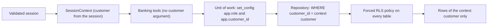

# Data isolation

Customer isolation has two independent layers ([ADR 0009](../adr/0009-row-level-security-as-defense-in-depth.md)):

1. **Tool and repository scoping (primary).** Tools never accept a customer identifier; `SessionContext` supplies it from a validated session. Every repository is bound to an `AccessContext` and filters by its customer in its own SQL. Another customer's id behaves exactly like an unknown one (`None`, or the entity's not-found error, which the API maps to 404).
2. **PostgreSQL row-level security (defense in depth).** Every table has RLS enabled and forced; policies filter on settings the unit of work writes at the start of each transaction.

Either layer alone stops a cross-customer read. The application role sets its own context, so RLS cannot stop a compromised process; it stops a buggy query.

## Roles

| Role | Login | Owns | Bypasses RLS | Used for |
|---|---|---|---|---|
| `bank_owner` | yes | the database, schemas `app` and `eval`, every table | no in production (`NOSUPERUSER NOCREATEROLE NOCREATEDB NOBYPASSRLS`, `deploy/postgres/init-production`); the image superuser in development and tests | migrations (`bank-agent db upgrade`), the seed, and the retention purge |
| `bank_app` | yes | nothing | no (`NOBYPASSRLS`) | the API: every unit of work, the session store, the identity service |
| `bank_evaluator` | no (NOLOGIN group role) | nothing | no | evaluation runs: schema `eval`, read access to records, audit events, and handoffs |
| `bank_datagrip` (dedicated Azure data VM only) | after interactive password setup | nothing | no | operator-authorized TLS inspection of five customer reference tables and the Alembic revision; no writes |
| `postgres` (production only) | local socket only (peer authentication) | nothing after the bootstrap | yes (the image superuser) | creating the roles on an empty volume, backups, and restores; no service connects with it |

`bank_app` privileges after migration 0007: SELECT only on `customers`, `staff_members`, `identity_directory`, `transactions`, `historical_complaints`, `credit_profiles`; SELECT and `UPDATE (status, status_changed_at)` on `products`; SELECT and INSERT only on `execution_records`, `audit_events`, `trust_events`; no DELETE or TRUNCATE anywhere; no access to schema `eval`. Migrations 0011 and 0012 add SELECT, INSERT, and UPDATE on `llm_budget` and `rate_limit_windows`, two tables of opaque counters (session and conversation ids, dates, HMAC digests of addresses and sessions) without row-level security.

The optional Azure inspection role has explicit SELECT-only policies on `customers`, `products`,
`transactions`, `historical_complaints`, and `credit_profiles`, scoped to `bank_datagrip` alone. These
policies permit inspection of all loaded reference rows without changing the application's customer or
staff policies. It has no access to identity, session, dispute, credit-intake, or audit records. TLS,
SCRAM authentication, a single authorized client IPv4, and an NSG source restriction are required;
see [the DataGrip setup](../../deploy/data-engineering/README.md#datagrip-inspection).

## Database contexts

The unit of work runs `select set_config('app.role', $1, true), set_config('app.customer_id', $2, true), set_config('lock_timeout', '2s', true)` as its first statement. Before exposing repositories it also sets `app.staff_id` from the trusted staff session, or an empty string for a customer. The `true` makes these settings local to the transaction, so a pooled connection never carries a previous request's context. Commit and rollback begin a new transaction with the same role, customer, and staff context.

| `app.role` | Set by | Customer |
|---|---|---|
| `customer` | a unit of work for a customer session | the session's customer |
| `agent` | a unit of work for an agent session | none |
| `evaluator` | a unit of work for an evaluator session | none |
| `identity` | the session store, the challenge store, the standalone audit log | none |
| `seed` | the seed, as the owner role only | none |
| `retention` | the retention purge, as the owner role only (migration 0012) | none |
| `rate_limit` | not used: `rate_limit_windows` has no row-level security | none |

## Policies

`OWN` below is `app.ctx_role() = 'customer' AND customer_id = app.ctx_customer()`, where the two helper functions read the settings with `current_setting(name, true)` and turn an empty value into null.

| Table | Customer | Agent | Evaluator | Identity | Seed (owner only) |
|---|---|---|---|---|---|
| `customers`, `products`, `transactions`, `historical_complaints` | `OWN` | none | none | none | all |
| `credit_profiles` | `OWN` | none (agents never read credit profiles) | none | none | all |
| `dispute_cases` | `OWN` | read, only when a handoff's `case_ref` names the case | none | none | all |
| `credit_applications` | `OWN` | read when the status is `submitted` or `under_human_review` (a review item of its own, ADR 0021; migration `0010`), or when a handoff's `credit_review.application_ref` names it; update a reviewable intake to `under_human_review` or `closed` only, and read an intake it closed after a review (migration `0013`, because PostgreSQL checks the new row of an update against the read policies) | none | none | all |
| `action_idempotency`, `conversations`, `turns` | `OWN` | none | none | none | none |
| `execution_records` | `OWN` | none | read all | none | none |
| `handoffs` | read and insert `OWN` | read all, update the lifecycle | read all | none | none |
| `human_messages` (migration `0014`) | read `OWN`; insert own user messages for an open or claimed matching handoff | read messages of handoffs claimed by this staff member; insert agent messages while that claim is active | none | none | none |
| `audit_events` | insert `OWN` | insert (no customer) | read all, insert (no customer) | insert (no customer) | none |
| `identity_directory`, `staff_members`, `sessions`, `otp_challenges`, `trust_events` | none | none | none | all | directory and staff only |

`bank_evaluator` has its own policies (`TO bank_evaluator USING (true)`) on `execution_records`, `audit_events`, and `handoffs`, and no grant on any other `app` table.

## Other database guards

- **Composite foreign keys**: a transaction references `(product_id, customer_id)`, a dispute case `(transaction_id, customer_id)` and `(product_id, customer_id)`, a turn `(conversation_id, customer_id)`, so a record can never point at another customer's record.
- **Append-only**: `execution_records`, `audit_events`, and `trust_events` have no UPDATE, DELETE, or TRUNCATE grant and a trigger that raises on update, delete, or truncate for every role, the owner included.
- **Immutable handoff documents**: a trigger refuses any change to a handoff's document, customer, or digest; only the lifecycle columns change.
- **Human service schema compatibility**: migration `0014` is copied unchanged from merged `main` (`8ac625afa4d8`). It grants the application only SELECT and INSERT on `human_messages`, forces RLS, and guards mutations with append-only triggers. Resolving a claimed handoff closes its linked conversation only in the assigned agent's context. The data deployment includes these existing schema rules without adding a human service API or changing the deployed application.
- **Documents agree with their columns**: check constraints tie each JSONB document to its scalar columns (id, customer, status, version).
- **Credit lifecycle**: `credit_applications.status` admits only `submitted`, `under_human_review`, `withdrawn`, and `closed`; there is no approved or declined status.
- **Audit replay check**: `app.audit_event_digest(event_id)` (SECURITY DEFINER, EXECUTE granted to `bank_app` only) returns the stored digest of one event, never its document, so a context that may not read audit events can still tell an identical replay from a conflicting one. It reads through the owner's `owner_replay_check` policy, verified under the non-superuser production owner.
- **Retention context**: migration 0012 gives the owner read and delete policies in the `retention` context on `messages`, `turns`, `conversations`, `sessions`, `otp_challenges`, `trust_events`, and `credit_applications` only, and lets the append-only triggers of `messages` and `trust_events` accept a delete in that context. Execution records, audit events, handoffs, and cases have no retention policy, so the purge cannot see them ([data retention](data-retention.md)).

## Tests that prove it

| Property | Test |
|---|---|
| Customer A cannot read customer B through any repository, on memory, DuckDB, and PostgreSQL | `services/api/tests/contracts/` (every suite, `postgres` parameter) |
| Raw SQL as `bank_app` without a context returns zero rows; a customer context sees only its rows | `services/api/tests/integration/test_row_level_security.py` |
| Agents, evaluators, and the identity service read no customer data; agents see a case only once a handoff references it | `test_row_level_security.py` |
| Agents read every reviewable credit intake, a withdrawn or closed one only when a handoff references it, and update none | `test_row_level_security.py`, `services/api/tests/contracts/test_credit_application_contract.py` |
| `bank_app` cannot write reference data | `test_row_level_security.py` |
| UPDATE, DELETE, and TRUNCATE fail on append-only tables, even for the owner | `services/api/tests/integration/test_schema_guards.py` |
| The credit status constraint rejects anything outside the review lifecycle | `test_schema_guards.py` |
| `eval` is reachable only by `bank_evaluator`, which cannot read customers | `test_schema_guards.py` |
| Every read tool is scoped by the session; another customer's product, payment, case, or application is not found | `services/api/tests/contracts/test_read_tools_contract.py` |
| The application role owns nothing and has no privileges beyond data access | `services/api/tests/integration/test_database_roles.py` |
| Staff context is cleared outside transactions and reapplied after commit and rollback; claimed resolution closes the matching conversation; human messages enforce RLS and restricted grants | `services/api/tests/integration/test_data_schema_compatibility.py` |
| Under the production roles (a non-superuser owner): no service role has superuser powers, the owner owns every table, forced RLS binds the owner outside its seed context, the seed runs and repeats, the audit replay check reads digests, the API and the shared rate limits work, and the purge deletes only what it should | `services/api/tests/integration/test_production_roles.py` |
| The purge's boundaries, and that the application role and the owner outside the retention context cannot delete append-only rows | `services/api/tests/integration/api/test_retention_purge.py` |
| Agents move reviewable credit intakes to review or closed only | `services/api/tests/integration/test_row_level_security.py`, `services/api/tests/contracts/test_credit_application_contract.py`, `services/api/tests/integration/api/test_agent_credit_review.py` |

## Limitations

- The development and test owner is still the image's superuser, which bypasses RLS; production uses the non-superuser owner, and `test_production_roles.py` runs the schema, the seed, the audit replay check, the API, and the purge under it.
- RLS protects rows, not columns: a customer context can read every column of its own rows (for example `days_past_due`). Keeping internal fields away from customers and models is the job of the tool results and the API response models, which are allowlists; `tests/unit/api/test_credit_data_exposure.py` fails if a credit profile, risk estimate, or internal field appears in any customer-facing schema.
- The identity role can read every session and challenge; it holds no customer data beyond identifiers and keyed digests.
