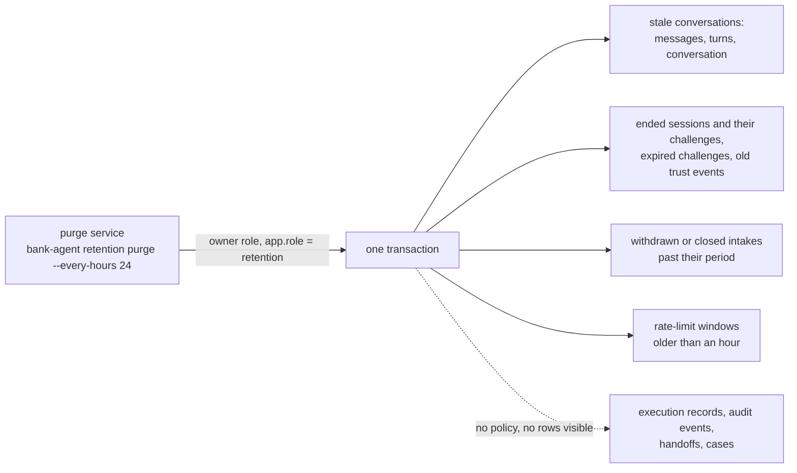

# Data retention

What the deployed system keeps, for how long, what deletes it, and what a regulated deployment would change. The periods below are the demo defaults (`RETENTION_*` settings, `.env.example`, `deploy/.env.production.example`); the data is synthetic organizer data and team-made fixtures (`docs/security/data-use.md`).

## Periods

| Data | Where | Kept | Deleted by |
|---|---|---|---|
| Conversation text: messages, turns (customer text and replies), and the conversation row | `app.messages`, `app.turns`, `app.conversations` | 7 days after the conversation's last activity (`RETENTION_CONVERSATION_DAYS`) | The retention purge |
| Sessions (token digests, never tokens) | `app.sessions` | 7 days after the session ended: revoked, past its absolute expiry, or idle (`RETENTION_SESSION_DAYS`) | The retention purge |
| One-time-code challenges (code hashes, never codes) | `app.otp_challenges` | 7 days after expiry, or with their session | The retention purge |
| Trust events (risk evidence per session lineage) | `app.trust_events` | 7 days after they occurred | The retention purge |
| Credit application intakes | `app.credit_applications` | While open (`submitted`, `under_human_review`); 30 days after a withdrawal or a close (`RETENTION_CREDIT_APPLICATION_DAYS`) | The retention purge |
| Rate-limit windows (HMAC digests of addresses and sessions) | `app.rate_limit_windows` | 1 hour | The retention purge |
| Execution records (per-turn audit: states, rule and clause ids, tool calls with redacted arguments, model and prompt versions, latency, cost; no conversation text) | `app.execution_records` | The life of the deployment | Take-down (`deploy/prod.sh destroy --yes`) |
| Audit events (who did what, redacted arguments, content digests) | `app.audit_events` | The life of the deployment | Take-down |
| Handoffs (structured facts, actions, policy basis, open questions; never a transcript) | `app.handoffs` | The life of the deployment | Take-down |
| Dispute cases, card status changes, model budget counters | `app.dispute_cases`, `app.products`, `app.llm_budget` | The life of the deployment | Take-down |
| Container logs (JSON, redacted, no access log, no client addresses) | Docker `json-file` | 5 files of 10 MB per service | Log rotation |
| Traces (ids and codes only) | Jaeger Badger volume (`obs` profile) | 7 days | Badger TTL |
| Metrics | Prometheus volume (`obs` profile) | 15 days or 2 GB | Prometheus retention |
| Database backups | `deploy/backups/` on the VM (mode 600) | Until the operator deletes them; delete them at take-down | The operator |

Execution records outlive the conversation text on purpose: they explain every decision (rule ids, clause versions, verified tool results) without holding what the customer wrote, so the audit trail stays after the text is gone.

## The purge job

`bank-agent retention purge` (`adapters/persistence/postgres/retention.py`) runs as the owner role, in one transaction, in the `retention` database context:

- Migration `0012` gives the `retention` context read and delete policies bound to the owner (`TO CURRENT_USER` at migration time) on exactly the purged tables; the append-only triggers of `messages` and `trust_events` accept a delete only in that context. The application role still has no DELETE grant on any table, so the API cannot purge anything.
- The compose `purge` service repeats the purge every `PURGE_EVERY_HOURS` (24); a failed run is logged (`retention_purge_failed`) and retried at the next interval. `deploy/prod.sh purge` runs it once; `--dry-run` counts and rolls back.
- The output is counts per table, never content.
- Tests: `services/api/tests/integration/api/test_retention_purge.py` (what is deleted and kept, the boundary to the second, closed and open intakes, the dry run, triggers and grants, the CLI) and `services/api/tests/integration/test_production_roles.py` (the purge under the non-superuser production owner).

## What a regulated deployment would change

This is a synthetic demo; a real bank serving customers in Colombia, Mexico, and Argentina would settle the following with its data protection officer and counsel. The team's strategy notes point to the Colombian regulator's (Superintendencia de Industria y Comercio, SIC) guidance on artificial intelligence and personal data under the habeas data regime (Ley 1581 de 2012); Mexico (LFPDPPP) and Argentina (Ley 25.326) have their own statutes. None of this page is legal advice.

- **Retention by purpose, in writing.** Conversation text only as long as the service purpose and any legal hold require; execution records and audit events for the period banking regulation mandates (often years), archived to write-once storage rather than kept in the operational database.
- **Data subject rights.** Access, rectification, and deletion requests need a way to find every row of one customer (conversations, intakes, handoffs, records) and to delete or anonymize what the law allows while keeping mandated records.
- **Privacy impact assessment** before putting a model in the loop, including the automated elements of the credit workflow (the system gives no lending decision, and every eligibility answer offers a human review path, which regulators expect).
- **Cross-border transfers.** A hosted model provider processes prompts abroad: a data processing agreement, the provider's retention and training settings (`docs/security/data-use.md`), and transfer conditions the regulator accepts.
- **Minimization at collection.** The prompts already carry no identifiers; a real deployment would also keep free-text conversations out of long-lived stores entirely, or pseudonymize them before storage.
- **Backups follow the same periods**: encrypted, access-logged, and expired on schedule, so a restore does not bring deleted data back.
