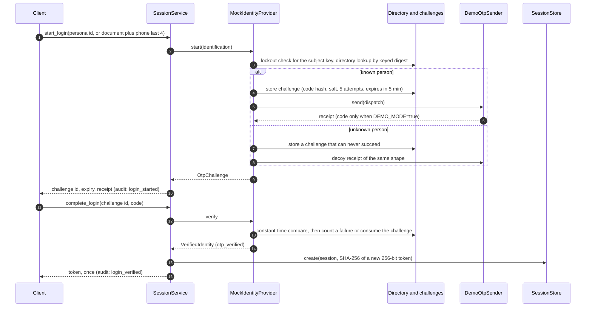
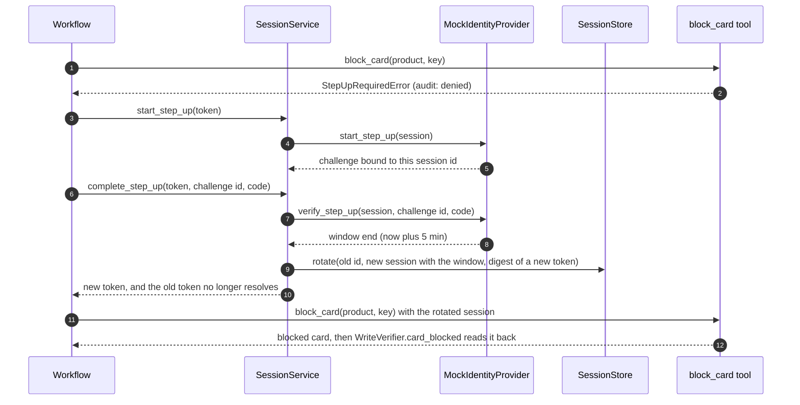
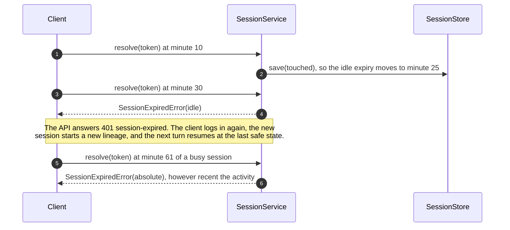

# Identity and sessions

The prototype authenticates people with a trusted test identity service (`adapters/identity`) and keeps server-side, opaque sessions (`application/identity/sessions.py`). A national ID or customer number alone never proves identity: identification only opens a one-time-code challenge. This page describes the services; the HTTP routes, cookies, and CSRF that expose them are in the [API documentation](../api/README.md) and [ADR 0031](../adr/0031-cookie-sessions-with-signed-double-submit-csrf.md). The choice of opaque sessions over JWT is [ADR 0008](../adr/0008-server-side-opaque-sessions.md).

## Lifetimes and limits

| Item | Value | Where |
|---|---|---|
| One-time code | 6 digits from `secrets.randbelow` | `adapters/identity/codes.py` |
| Code storage | `HMAC-SHA256(k_otp, salt, challenge id, code)`, 16-byte random salt per challenge; `k_otp` derived from `SESSION_SECRET` with a fixed label | `IdentityKeys` |
| Code comparison | `hmac.compare_digest` (constant time) | `IdentityKeys.code_matches` |
| Code lifetime | 5 minutes | `OtpPolicy.code_lifetime` |
| Attempts per challenge | 5; the fifth failure locks the subject | `OtpPolicy.max_attempts` |
| Lockout cooldown | 15 minutes, for every challenge of the same subject key | `OtpPolicy.lockout_cooldown` |
| Session token | 256 bits (`secrets.token_urlsafe(32)`), returned once, stored as its SHA-256 digest | `SessionService` |
| Idle expiry | 15 minutes after the last activity | `SessionPolicy.idle_timeout` |
| Absolute expiry | 60 minutes after login; activity never extends it | `SessionPolicy.absolute_lifetime` |
| Step-up window | 5 minutes, capped at the absolute expiry | `SessionPolicy.step_up_window` |
| Rotation | On step-up (a privilege change): new session id and token, same lineage; the old token stops resolving | `SessionStore.rotate` |
| Identity lookups | Keyed digests of the document number and of the customer plus the phone's last four digits; raw values never stored | `identity_directory` |

Lifetimes are constants in code, matching CLAUDE.md section 7, not environment variables, so a deployment cannot weaken them by configuration.

## Login

An unknown identification and a wrong code raise the same `IdentityChallengeFailedError` with the same message, and both count toward the same lockout, so responses never reveal whether a customer exists.

## Step-up before a write

A step-up challenge is bound to the session that opened it: verifying it from another session fails like a wrong code.

## Session expiry during a conversation

`SessionContext.of(session, clock)` refuses an expired or revoked session before any tool runs, so a tool never executes on a dead session.

## Logout and revocation

`logout(token)` and `revoke(session_id)` set `revoked_at`; the session then resolves to `SessionRevokedError`. Every login, step-up, logout, and revocation appends an audit event without codes, tokens, or identifiers (only the internal session id in the arguments).

## Over HTTP (phase 11)

| Route | Service call | Cookie and CSRF effect |
|---|---|---|
| `GET /v1/auth/csrf` | none | sets the CSRF cookie with a token bound to the current session, or `anonymous` |
| `POST /v1/auth/start` | `start_login` | none; identification never sets a session |
| `POST /v1/auth/verify` | `complete_login` (and `logout` of the browser's previous session) | sets the session cookie (`Max-Age` to the absolute expiry) and a new CSRF token |
| `POST /v1/auth/step-up/start`, `/verify` | `start_step_up`, `complete_step_up` | the rotated session token replaces the cookie; a new CSRF token |
| `POST /v1/auth/logout` | `logout` | clears the session cookie; an anonymous CSRF token |
| `GET /v1/auth/me` | `resolve` | none |

Every other route resolves the cookie with `resolve`: an unknown token, a revoked session, or an expired one is a `401`, and the engine never receives an expired session. The engine's re-sign-in rule keeps its pause semantics: the first turn from a new lineage at a mid-flow state goes back to the last safe state and asks again, while a step-up (same lineage) continues directly. Cookie names are `__Host-session` and `__Host-csrf` in production and `session` and `csrf` in development ([ADR 0031](../adr/0031-cookie-sessions-with-signed-double-submit-csrf.md)). Wrong codes and unknown identifications share the `verification-failed` problem; an exhausted challenge is `429 identity-locked` with `Retry-After`.

## Where it is tested

| Behavior | Test |
|---|---|
| Code hashing, salts, constant-time comparison, demo delivery | `services/api/tests/unit/adapters/identity/test_identity_codes.py` |
| Generic errors, expiry, lockout, cooldown, step-up binding | `services/api/tests/unit/adapters/identity/test_mock_identity_provider.py` |
| Session expiry math with `FixedClock`, rotation, revocation, audit | `services/api/tests/unit/application/identity/test_session_service.py` |
| The same lifecycle against PostgreSQL | `services/api/tests/integration/test_identity_postgres.py` |
| Session store contract (memory and PostgreSQL) | `services/api/tests/contracts/test_session_store_contract.py` |
| The routes, cookie flags per environment, lockout, expiry, step-up rotation, logout (memory and PostgreSQL) | `services/api/tests/integration/api/test_auth_flow.py` |
| Resuming after a new sign-in, and not after a step-up | `services/api/tests/integration/workflows/test_engine_behaviors.py::test_a_new_sign_in_mid_write_asks_the_confirmation_again_and_a_step_up_does_not` |

## Limitations

- There is no real delivery channel: `DemoOtpSender` either shows the code (demo mode, labeled in the UI) or emits an event without it. A production deployment needs a real sender adapter; the public demo shows codes on purpose ([demo mode](demo-mode.md)).
- Ended sessions, their challenges, and trust events are deleted 7 days after they end by the retention purge ([data retention](data-retention.md)).
- The lockout is per subject key, not per network address; the HTTP layer adds sliding-window limits per IP and per session (auth: 10 per minute each by default), shared by every worker through PostgreSQL in production.
- Step-up rotation keeps the absolute expiry of the original login, so a step-up never extends a session.
- The identity keys derive from `SESSION_SECRET`; rotating that secret invalidates every identity lookup until `make seed` runs again.
