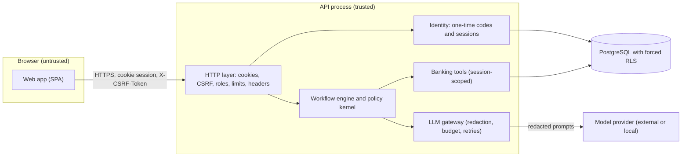

# Threat model (first version)

STRIDE per component, with the mitigation in place and the test that proves it. It covers the prototype as built through phase 11; deployment threats (TLS termination, container hardening, secrets delivery) are phase 16 and are listed as open where they matter. Last reviewed: phase 11 (2026-09-27).

Trust boundaries: the browser to the API (everything from the browser is untrusted input), the API to the model provider (prompts leave the process, replies come back as untrusted text), and the application role to the database (row-level security holds even if a query is wrong).

## Web app (SPA)

| Threat | Mitigation | Evidence |
|---|---|---|
| S: a malicious page acts as the signed-in user (CSRF) | `SameSite=Strict` cookies plus a signed double-submit token on every POST ([ADR 0031](../adr/0031-cookie-sessions-with-signed-double-submit-csrf.md)) | `tests/integration/api/test_http_security.py::test_every_state_changing_route_refuses_a_missing_or_mismatched_csrf_token` |
| T: injected script changes what the user sees | Model output rendered as plain text, no `dangerouslySetInnerHTML`, no inline scripts (the pre-paint theme script is the external `public/theme-init.js`), self-hosted fonts, strict CSP from the server | ESLint rules in `apps/web/eslint.config.js`; `apps/web/src/shared/ui/display.test.tsx` (JSON view shows markup as text); CSP header tests below |
| I: the session token is stolen by script | The token lives only in an `HttpOnly` cookie; the CSRF token lives in memory; web storage holds only the theme and locale (one module, allowed by lint) | `test_auth_flow.py::test_development_cookie_flags`, `test_production_cookies_use_the_host_prefix_and_are_secure`; ESLint `no-restricted-globals` |
| S: a crafted sign-in link sends the user elsewhere after login (open redirect) | `next` accepts same-app paths only (`safeNextPath`) | `apps/web/src/shared/lib/lib.test.ts` |
| I: a stale session cookie lingers after expiry or revocation | A lost-session `401` deletes the cookie; the SPA drops every cached record when the identity changes | `test_auth_flow.py::test_a_lost_session_answer_also_deletes_the_stale_cookie`; `apps/web/src/features/auth/session.test.tsx` |
| E: clickjacking of a confirmation button | `frame-ancestors 'none'` and `X-Frame-Options: DENY` on every response | `tests/unit/api/test_security_middleware.py::test_every_response_class_carries_the_security_headers` |

## HTTP API

| Threat | Mitigation | Evidence |
|---|---|---|
| S: a guessed or replayed session token | 256-bit opaque tokens stored as digests; idle and absolute expiry; revocation on logout and on a new sign-in; rotation on step-up | `test_auth_flow.py::test_step_up_rotates_the_session_and_the_csrf_token_and_opens_a_window`, `test_logout_revokes_clears_the_cookie_and_returns_an_anonymous_token`, `test_sessions_expire_when_idle_and_the_problem_says_so` |
| S: a planted CSRF cookie from a sibling subdomain | Tokens are signed for the current session; a token from before login stops working after it | `test_http_security.py::test_a_token_from_before_login_stops_working_after_login`; `tests/unit/api/test_csrf_tokens.py` |
| T: oversized or malformed input | Pydantic request models with explicit limits and no unknown keys; 16 KiB body limit, also for chunked bodies | `test_http_security.py::test_request_limits_reject_oversized_and_unexpected_input`; `test_security_middleware.py::test_a_chunked_body_over_the_limit_is_refused_like_a_declared_one` |
| R: a user denies a login, a write, or an agent move | Audit events for login, step-up, logout, conversation creation, every tool call (redacted), and handoff claim and resolve, append-only in the database | `test_agent_and_evaluation.py::test_agents_filter_read_claim_and_resolve_handoffs_and_the_moves_are_audited`; `tests/integration/test_schema_guards.py` |
| I: another customer's conversation or trace | Every read is scoped by the session; a foreign id answers exactly like a missing one (one scoped query, same body) | `test_http_security.py::test_another_customers_conversation_is_indistinguishable_from_a_missing_one` |
| I: credit profile or risk estimate values reach a customer | Customer response schemas are allowlists; a test walks every customer-facing schema in the OpenAPI document | `tests/unit/api/test_credit_data_exposure.py`; `test_agent_and_evaluation.py::test_customer_traces_hide_risk_values_and_evaluator_traces_show_them` |
| I: internals in errors | RFC 9457 problems without messages, stack traces, or rejected values; unexpected errors are a generic 500 | `tests/unit/api/test_problem_details.py`; `test_agent_and_evaluation.py::test_evaluation_summaries_are_for_evaluators_unless_published_publicly` |
| D: brute force and floods | Sliding-window limits per IP and per session, stricter for authentication; 5-attempt lockout on one-time codes | `test_http_security.py::test_auth_rate_limits_per_ip_answer_429_with_retry_after`, `test_session_rate_limits_follow_the_session_across_addresses`; `test_auth_flow.py::test_five_wrong_codes_lock_the_subject_with_retry_after` |
| E: a customer calls agent or evaluator operations | Role dependencies per route; the documented roles are checked against the enforced ones | `test_http_security.py::test_roles_are_enforced_per_route`; `tests/unit/api/test_openapi_contract.py::test_the_roles_each_route_enforces_are_the_roles_it_documents` |
| E: credentialed CORS from any origin | An allowlist; production refuses `*` and plain http origins | `test_security_middleware.py::test_cors_allows_credentials_only_for_allowlisted_origins`; `tests/unit/bootstrap/test_settings.py::test_production_refuses_wildcard_and_plain_http_origins` |

## Workflow engine and policy kernel

| Threat | Mitigation | Evidence |
|---|---|---|
| S: identity claimed in the message ("I am customer X") | Tools never take customer identifiers; the session injects them; ids named in the text are checked against the session's own records | `docs/security/data-isolation.md`; `tests/contracts/test_read_tools_contract.py`; scenario 8 |
| T: prompt injection selects a tool or changes a decision | Per-state tool allowlists, validated arguments, deterministic decisions, the grounding verifier ([prompt injection](prompt-injection.md)) | `test_guarded_tools.py`, `test_security_signals.py`, scenario 11 |
| T: a write reported without happening | Success wording only after a positive read-back; a rendered reply that claims an unverified action, uses approval wording, or shows a credit value is replaced before it is sent; a database outage mid-write answers 503 and commits nothing | `tests/integration/workflows/test_success_needs_verification.py`, `tests/integration/chaos/` |
| D: a dependency outage becomes an unsafe or confusing answer | The degradation ladder (L0 to L4) with a notice in es and pt, handoffs for complex cases, and fail-closed writes | `tests/integration/chaos/`, `tests/unit/application/test_degradation_ladder.py` |
| E: a write without fresh authentication | Step-up before every write, a 5-minute window; a new sign-in mid-write asks the confirmation again | `test_conversation_paths.py::test_card_block_asks_for_step_up_and_resumes_after_the_step_up_route`; `test_engine_behaviors.py::test_a_new_sign_in_mid_write_asks_the_confirmation_again_and_a_step_up_does_not` |

## LLM gateway

| Threat | Mitigation | Evidence |
|---|---|---|
| I: personal data sent to a provider | Only declared prompt inputs; redaction of identifiers, contacts, and names; no prompt may declare a credit profile or risk input | `test_redaction.py`, `test_prompt_registry.py`, `test_credit_separation.py` |
| T: a model reply is executed or trusted | Structured outputs validated against models with enums and bounds; output never executed; phrasing kept only when the verifier passes | `test_prompted_client.py`, `test_render.py` |
| D: runaway cost or a slow provider | Budget guard (session, conversation, daily) on a ledger shared by every worker in PostgreSQL, failing closed when the ledger cannot be read; timeouts, bounded retries, circuit breaker; template-only mode (L2) when no provider can serve or the budget is spent ([degradation](../operations/degradation.md)) | `test_cost_and_budget.py`, `test_reliability_decorators.py`, `tests/integration/test_budget_ledger.py`, `tests/integration/chaos/test_llm_outage.py` |
| I: telemetry leaks personal data (spans, metrics, logs) | Attributes are ids and codes from a catalog with per-metric attribute allowlists; the risk span names the model only; SQL spans carry placeholders, never bound values; logs pass the redaction processor; content capture is refused in production | `tests/unit/application/engine/test_turn_metrics.py::test_every_metric_and_attribute_is_in_the_catalog`, `tests/integration/api/test_trace_ids.py::test_the_state_and_tool_spans_carry_ids_and_codes_only`, `tests/unit/bootstrap/test_observability.py` |
| I: a local development model used in production | Local Ollama models are opt-in only; production requires an API key for `litellm` and an https `LLM_API_BASE` | `test_settings.py::test_production_refuses_a_plain_http_llm_base_url`; `test_llm_composition.py::test_a_local_ollama_model_needs_no_key_and_gets_the_base_url` |

## Database

| Threat | Mitigation | Evidence |
|---|---|---|
| I: a buggy query reads another customer's rows | Forced RLS on every table from a per-transaction context; the application role owns nothing and has no BYPASSRLS | `tests/integration/test_row_level_security.py`, `test_database_roles.py` |
| T and R: audit or execution records altered | Append-only triggers and grants, even for the owner | `tests/integration/test_schema_guards.py` |
| S: default or leaked database passwords in production | Production refuses empty, short, known-default, and `dev-only-` secrets | `tests/unit/bootstrap/test_env_example.py`, `test_settings.py` |

## Identity

| Threat | Mitigation | Evidence |
|---|---|---|
| S: identification by a document number alone | Identification only opens a challenge; the code decides; unknown people get an indistinguishable challenge | `test_auth_flow.py::test_document_identification_needs_the_code_too`, `test_an_unknown_person_gets_the_same_challenge_shape_and_the_same_failure` |
| I: codes or tokens at rest | Codes are HMAC-hashed with a per-challenge salt, compared in constant time; tokens stored as SHA-256 digests | `test_identity_codes.py`, `test_identity_postgres.py` |
| D: code guessing | 5 attempts, then a 15-minute lockout of the subject, plus the auth rate limit | `test_auth_flow.py::test_five_wrong_codes_lock_the_subject_with_retry_after` |
| I: demo codes shown outside demo mode | The code is in the response only with `DEMO_MODE=true`, which production refuses | `test_auth_flow.py::test_the_demo_code_is_shown_only_in_demo_mode`; `test_settings.py::test_production_refuses_demo_mode` |

## Open items

- Rate limits are per process; several workers or instances multiply them (BACKLOG, phase 16).
- TLS, HSTS preload, container hardening, and secret delivery are deployment work (phase 16); HSTS is sent in production but TLS terminates at Caddy.
- The development and test database owner is a superuser (BACKLOG, phase 16).
- There is no real one-time-code delivery channel; demo mode shows the code (BACKLOG, phase 16).
- Prompt injection has heuristics and structural defenses but no measured red-team slice yet (phase 14).
