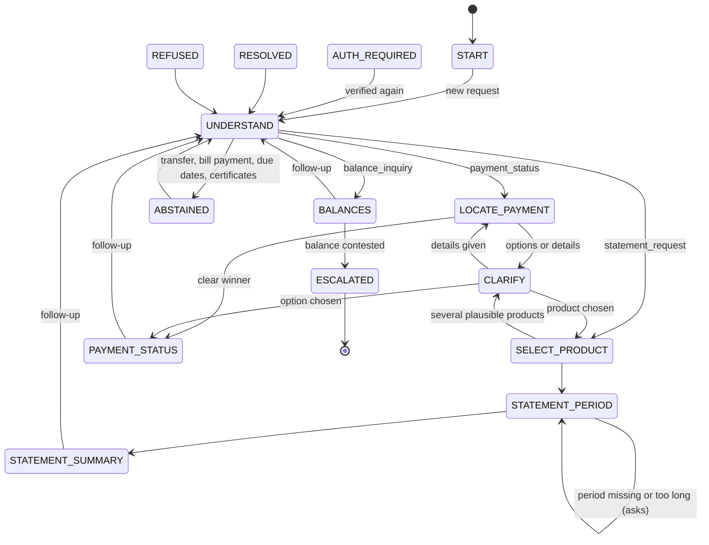
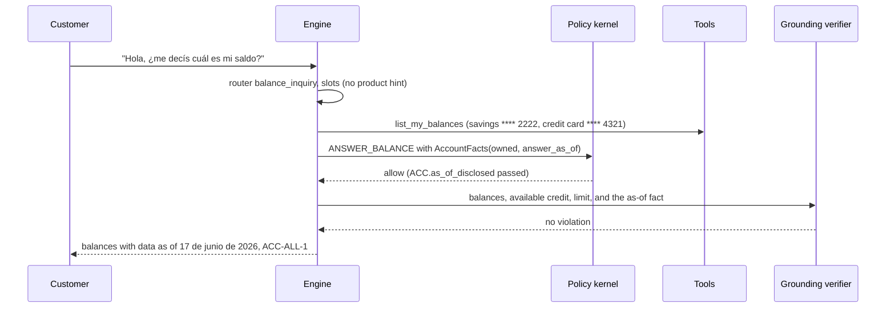
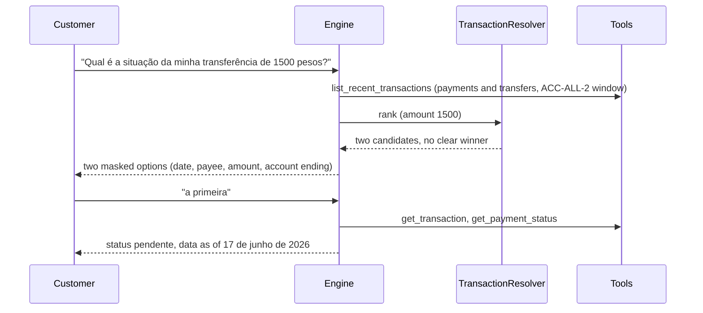
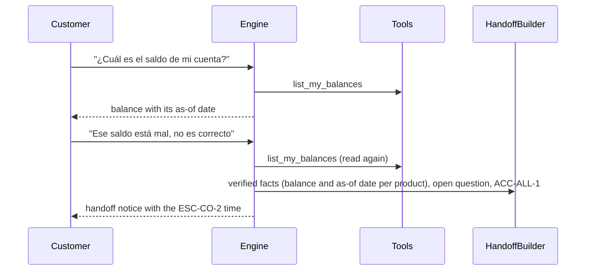

# Account inquiry

The `account_inquiry` workflow answers balances, the status of payments and transfers, and activity summaries over a period, always with the as-of date of the data. It is read only: there is no EXECUTE state and no write tool on any allowlist (a registry test asserts it). Code: `services/api/src/bank_agent/application/workflows/account_inquiry/`. It runs on the same engine, kernel, tools, and verifier as [dispute intake](dispute-intake.md) and [card support](card-support.md).

## State machine

Shared exits (ESCALATED, ABSTAINED, REFUSED, AUTH_REQUIRED) apply to every non-terminal state. BALANCES, PAYMENT_STATUS, and STATEMENT_SUMMARY accept new requests but hold the answer just given, so a request for another workflow there (for example "no reconozco esa transferencia") is confirmed before switching.

## States, rules, clauses, tools, and exits

Common clauses on every state: `SCOPE-ALL-1`, `AUTH-ALL-1`, `AUTH-ALL-2`, `PRV-ALL-1`, `PRV-ALL-2`, `ESC-ALL-1`, `ESC-ALL-3`.

| State | Binding | Ports | Rules beyond the common ones | Clauses beyond the common ones | Tools | Exits |
|---|---|---|---|---|---|---|
| START | START | none | `SCOPE.supported_intent` | SCOPE-ALL-2 | none | UNDERSTAND |
| AUTH_REQUIRED | START | none | AUTH rules at the resume state | SCOPE-ALL-2 | none | the resume state |
| UNDERSTAND | START | IntentRouter, LLM (`extract_account_inquiry_slots`) | `SCOPE.supported_intent` (unsupported requests) | SCOPE-ALL-2, ACC-ALL-3 when abstaining | none | BALANCES, LOCATE_PAYMENT, SELECT_PRODUCT, ABSTAINED |
| SELECT_PRODUCT | IDENTIFY_PRODUCT | none | clarification budget | ACC-ALL-3 | list_my_balances, list_my_cards | CLARIFY, STATEMENT_PERIOD, RESOLVED |
| CLARIFY | IDENTIFY_PRODUCT | TransactionResolver (answers) | clarification budget | ACC-ALL-3 | list_my_balances, list_my_cards, list_recent_transactions, get_transaction | SELECT_PRODUCT, STATEMENT_PERIOD, LOCATE_PAYMENT, PAYMENT_STATUS |
| BALANCES | ANSWER_BALANCE | none | `ACC.product_owned_by_session_customer`, `ACC.as_of_disclosed` | ACC-ALL-1, ACC-ALL-3 | list_my_balances | UNDERSTAND, ESCALATED, RESOLVED |
| LOCATE_PAYMENT | ANSWER_PAYMENT_STATUS | TransactionResolver | clarification budget | ACC-ALL-1, ACC-ALL-3 | list_recent_transactions (payments and transfers), list_my_balances, list_my_cards | PAYMENT_STATUS, CLARIFY |
| PAYMENT_STATUS | ANSWER_PAYMENT_STATUS | none | `ACC.product_owned_by_session_customer`, `ACC.as_of_disclosed` | ACC-ALL-1, ACC-ALL-3 | get_payment_status, get_transaction | UNDERSTAND, LOCATE_PAYMENT, switch |
| STATEMENT_PERIOD | ANSWER_STATEMENT | none | `ACC.statement_period_within_limit` | ACC-ALL-1, ACC-ALL-2, ACC-ALL-3 | none | STATEMENT_SUMMARY, STATEMENT_PERIOD |
| STATEMENT_SUMMARY | ANSWER_STATEMENT | none | all ACC rules | as above | get_statement_summary, list_my_balances, list_my_cards | UNDERSTAND, SELECT_PRODUCT |
| RESOLVED, ABSTAINED, REFUSED | START | IntentRouter | common | SCOPE-ALL-2 | none | UNDERSTAND, switch |
| ESCALATED | ESCALATE | HandoffBuilder | common | ESC-{c}-2 | none | terminal |

- **As-of dates.** Balances state the as-of instant of the balance records (`BalanceView.as_of`); payment and statement answers state the data as-of date from policy settings (`POLICY_DATA_AS_OF`, 2026-06-17). `AccountFacts.answer_as_of` carries the stated instant, so `ACC.as_of_disclosed` passes only when the date is shown, and the verifier receives each balance, available credit, and limit as a fact of its kind next to an `as_of` fact (`balance_without_as_of` otherwise).
- **Balances.** Credit cards show the available credit under their limit (`DATASET_CREDIT_BALANCE_CONVENTION`, `balance_is_amount_owed`); amounts are in each product's own currency.
- **Payments.** LOCATE_PAYMENT ranks the customer's own payments and transfers within the `ACC-ALL-2` window before the data as-of date (`list_recent_transactions` with the type filter, because the resolver ranks transactions) and PAYMENT_STATUS answers from `get_payment_status`. With nothing described and several candidates, the most recent ones are offered; with details that match nothing, the customer is asked for more.
- **Statements.** STATEMENT_PERIOD resolves `el mes pasado`, `mês passado`, a month name, `esta semana`, `los últimos N días` or `meses`, and the relative dates of the dispute table (`understanding/periods.py`). Totals are per currency for settled, classified operations; unclassified (transfers, adjustments) and unsettled operations are counted separately; no opening or closing balance is stated.
- **Unsupported.** Transfers, bill payments, due date changes, due dates the records do not hold, and certificates abstain with `ACC-ALL-3` and `SCOPE-ALL-2` and an offer of a human, whether the router sends them here or to the out-of-scope handler (the workflow's `unsupported` recognizer, [router](workflow-router.md#in-domain-unsupported-requests)).

## Sequence: normal path (scenario 19, es-AR balances)

## Sequence: ambiguous path (scenario 20, pt-BR two similar transfers)

## Sequence: escalation path (scenario 23, es-CO contested balance)

## Confirmation and abstention matrix

| Situation | Outcome | Basis |
|---|---|---|
| Balance, payment status, statement | Answered read only with the as-of date; no confirmation needed (no write exists) | `ACC-ALL-1`, `ACC-ALL-2` |
| Several plausible products or payments | Masked options, against the clarification budget | `ESC-ALL-1` |
| Statement period missing or longer than 92 days | Asked again with `ACC-ALL-2` | `ACC.statement_period_within_limit` |
| Transfer, bill payment, due date change, certificate | Abstain with an offer of a human | `ACC-ALL-3`, `SCOPE-ALL-2` |
| A payment that looks unauthorized | The router offers the `dispute` workflow (confirmed mid-flow) | router rules |
| The customer insists a balance is wrong | Escalate (`unsupported_needs_human`, `balance_contested`) with the balances as facts | `ACC-ALL-1`, `ESC-{c}-2` |
| Another customer's product or transaction id | Refuse with a trust event | `PRV-ALL-1` |

## Tests

Scenarios 19 to 23 with language variants run on both backends (`services/api/tests/integration/workflows/test_account_inquiry.py`); the period table and slots are unit tests (`tests/unit/application/understanding/`).

## Limitations

- The data is a monthly snapshot: nothing after the as-of date appears, and statements have no opening or closing balances.
- Transfers and adjustments have no direction in the data, so they are counted, never totaled.
- The payment search window is the `ACC-ALL-2` period before the as-of date; older payments are not found.
- Routing phrases come from the keyword baseline (`router:keyword@1`) until phase 10.
